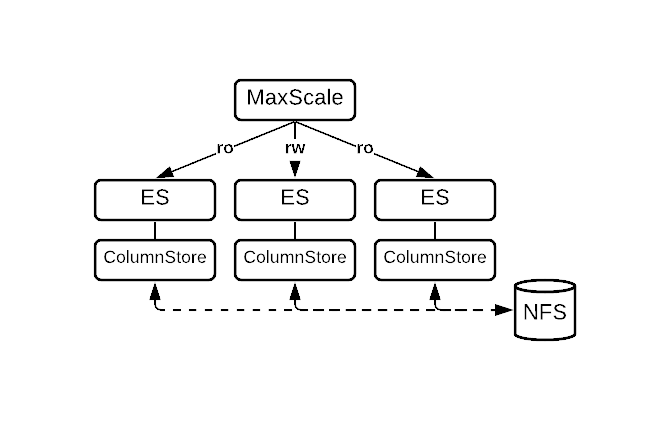

# Multi-Node Localstorage

## Overview

| Software Version                                                                                       | Diagram                                                                      | Features                                                                                                                                                                                                                                                                                                                                     |
| ------------------------------------------------------------------------------------------------------ | ---------------------------------------------------------------------------- | -------------------------------------------------------------------------------------------------------------------------------------------------------------------------------------------------------------------------------------------------------------------------------------------------------------------------------------------- |
| <ul><li>Enterprise Server 10.5</li><li>Enterprise Server 10.6</li><li>Enterprise Server 11.4</li></ul> |  | <p>Columnar storage engine with S3-compatible object storage</p><ul><li>Highly available</li><li>Automatic failover via MaxScale and CMAPI</li><li>Scales read via MaxScale</li><li>Bulk data import</li><li>Enterprise Server 10.5, ColumnStore 5, MaxScale 2.5</li><li>Enterprise Server 10.6, ColumnStore 23.02, MaxScale 22.08</li></ul> |

This procedure describes the deployment of the ColumnStore Shared Local Storage topology with MariaDB Enterprise Server 10.5, MariaDB ColumnStore 5, and MariaDB MaxScale 2.5.

MariaDB ColumnStore 5 is a columnar storage engine for MariaDB Enterprise Server 10.5. ColumnStore is suitable for Online Analytical Processing (OLAP) workloads.

This procedure has 9 steps, which are executed in sequence.

This procedure represents basic product capability and deploys 3 ColumnStore nodes and 1 MaxScale node.

This page provides an overview of the topology, requirements, and deployment procedures.

Please read and understand this procedure before executing.


Customers can obtain support by submitting a support case.


## Components

The following components are deployed during this procedure:

<table><thead><tr><th width="243">Component</th><th>Function</th></tr></thead><tbody><tr><td><a href="https://app.gitbook.com/o/diTpXxF5WsbHqTReoBsS/s/SsmexDFPv2xG2OTyO5yV/">MariaDB Enterprise Server</a></td><td>Modern SQL RDBMS with high availability, pluggable storage engines, hot online backups, and audit logging.</td></tr><tr><td><a href="https://app.gitbook.com/o/diTpXxF5WsbHqTReoBsS/s/0pSbu5DcMSW4KwAkUcmX/">MariaDB MaxScale</a></td><td>Database proxy that extends the availability, scalability, and security of MariaDB Enterprise Servers</td></tr></tbody></table>

### MariaDB Enterprise Server Components

<table><thead><tr><th width="281">Component</th><th>Description</th></tr></thead><tbody><tr><td><a href="https://app.gitbook.com/o/diTpXxF5WsbHqTReoBsS/s/rBEU9juWLfTDcdwF3Q14/">MariaDB ColumnStore</a></td><td>• Columnar storage engine • Highly available • Optimized for Online Analytical Processing (OLAP) workloads • Scalable query execution • Cluster Management API (CMAPI) provides a REST API for multi-node administration.</td></tr></tbody></table>

### MariaDB MaxScale Components

<table><thead><tr><th width="218">Component</th><th>Description</th></tr></thead><tbody><tr><td>Listener</td><td>Listens for client connections to MaxScale then passes them to the router service</td></tr><tr><td>MariaDB Monitor</td><td>Tracks changes in the state of MariaDB Enterprise Servers.</td></tr><tr><td>Read Connection Router</td><td>Routes connections from the listener to any available ColumnStore node</td></tr><tr><td>Read/Write Split Router</td><td>Routes read operations from the listener to any available ColumnStore node, and routes write operations from the listener to a specific server that MaxScale uses as the primary server</td></tr><tr><td>Server Module</td><td>Connection configuration in MaxScale to an ColumnStore node</td></tr></tbody></table>

### Topology

The MariaDB ColumnStore topology with Object Storage delivers production analytics with high availability, fault tolerance, and limitless data storage by leveraging S3-compatible storage.

The topology consists of:

* One or more MaxScale nodes
* An odd number of ColumnStore nodes (minimum of 3) running ES, ColumnStore, and CMAPI

The MaxScale nodes:

* Monitor the health and availability of each ColumnStore node using the MariaDB Monitor (mariadbmon)
* Accept client and application connections
* Route queries to ColumnStore nodes using the Read/Write Split Router (readwritesplit)

The ColumnStore nodes:

* Receive queries from MaxScale
* Execute queries
  * Use [shared local storage](../../../../architecture/columnstore-storage-architecture.md#shared-local-storage) for the [Storage Manager directory](../../../../architecture/columnstore-storage-architecture.md#storage-manager-directory)

## Requirements

These requirements are for the ColumnStore Object Storage topology when deployed with MariaDB Enterprise Server 10.5, MariaDB ColumnStore 5, and MariaDB MaxScale 2.5.

* Node Count
* Operating System
* Minimum Hardware Requirements
* Recommended Hardware Requirements
* Storage Requirements
* S3-Compatible Object Storage Requirements
* Preferred Object Storage Providers: Cloud
* Preferred Object Storage Providers: Hardware
* Shared Local Storage Directories
* Shared Local Storage Options
* Recommended Storage Options

### Node Count

* MaxScale nodes, 1 or more are required.
* ColumnStore nodes, 3 or more are required for high availability. You should always have an odd number of nodes in a multi-node ColumnStore deployment to avoid split brain scenarios.

### Operating System

In alignment to the [enterprise lifecycle](https://app.gitbook.com/s/aEnK0ZXmUbJzqQrTjFyb/enterprise-server/about/enterprise-server-lifecycle), the ColumnStore Object Storage topology with MariaDB Enterprise Server 10.5, MariaDB ColumnStore 5, and MariaDB MaxScale 2.5 is provided for:

* CentOS Linux 7 (x86\_64)
* Debian 10 (x86\_64)
* Red Hat Enterprise Linux 7 (x86\_64)
* Red Hat Enterprise Linux 8 (x86\_64)
* Ubuntu 18.04 LTS (x86\_64)
* Ubuntu 20.04 LTS (x86\_64)

### Minimum Hardware Requirements

MariaDB ColumnStore's minimum hardware requirements are not intended for production environments, but the minimum hardware requirements can be appropriate for development and test environments. For production environments, see the recommended hardware requirements instead.

The minimum hardware requirements are:

| Component        | CPU      | Memory |
| ---------------- | -------- | ------ |
| MaxScale node    | 4+ cores | 4+ GB  |
| ColumnStore node | 4+ cores | 4+ GB  |

MariaDB ColumnStore will refuse to start if the system has less than 3 GB of memory.

If ColumnStore is started on a system with less memory, the following error message will be written to the ColumnStore system log called crit.log:

```
Apr 30 21:54:35 a1ebc96a2519 PrimProc[1004]: 35.668435 |0|0|0| C 28 CAL0000: Error total memory available is less than 3GB.
```

And the following error message will be raised to the client:

```sql
ERROR 1815 (HY000): Internal error: System is not ready yet. Please try again.
```

### Recommended Hardware Requirements

MariaDB Enterprise ColumnStore's recommended hardware requirements are intended for production analytics.

The recommended hardware requirements are:

| Component                   | CPU       | Memory  |
| --------------------------- | --------- | ------- |
| MaxScale node               | 8+ cores  | 16+ GB  |
| Enterprise ColumnStore node | 64+ cores | 128+ GB |

### Storage Requirements

The ColumnStore Object Storage topology requires the following storage types:

| Storage Type                                                                                              | Description                                                                                                                                                                                                      |
| --------------------------------------------------------------------------------------------------------- | ---------------------------------------------------------------------------------------------------------------------------------------------------------------------------------------------------------------- |
| [Shared Local Storage](../../../../architecture/columnstore-storage-architecture.md#shared-local-storage) | The ColumnStore Object Storage topology uses shared local storage for the [Storage Manager directory](../../../../architecture/columnstore-storage-architecture.md#storage-manager-directory) to store metadata. |

### Shared Local Storage Directories

The ColumnStore Object Storage topology uses shared local storage for the Storage Manager directory to store metadata.

The Storage Manager directory is located at the following path by default:

* `/var/lib/columnstore/storagemanager`

### Shared Local Storage Options

The most common shared local storage options for the ColumnStore Object Storage topology are:

<table><thead><tr><th width="238">Shared Local Storage</th><th width="152">Common Usage</th><th>Description</th></tr></thead><tbody><tr><td>EBS (Elastic Block Store) Multi-Attach</td><td>AWS</td><td>• EBS is a high-performance block-storage service for AWS (Amazon Web Services). • EBS Multi-Attach allows an EBS volume to be attached to multiple instances in AWS. Only clustered file systems, such as GFS2, are supported. • For deployments in AWS, EBS Multi-Attach is a recommended option for the Storage Manager directory, and Amazon S3 storage is the recommended option for data.</td></tr><tr><td>EFS (Elastic File System)</td><td>AWS</td><td>• EFS is a scalable, elastic, cloud-native NFS file system for AWS (Amazon Web Services). • For deployments in AWS, EFS is a recommended option for the Storage Manager directory, and Amazon S3 storage is the recommended option for data. EFS is a scalable, elastic, cloud-native NFS file system for AWS (Amazon Web Services).</td></tr><tr><td>Filestore</td><td>GCP</td><td>• Filestore is high-performance, fully managed storage for GCP (Google Cloud Platform). • For deployments in GCP, Filestore is the recommended option for the Storage Manager directory, and Google Object Storage (S3-compatible) is the recommended option for data.</td></tr><tr><td>GlusterFS</td><td>On-premises</td><td>• GlusterFS is a distributed file system. • GlusterFS supports replication and failover.</td></tr><tr><td>NFS (Network File System)</td><td>On-premises</td><td>• NFS is a distributed file system. • If NFS is used, the storage should be mounted with the sync option to ensure that each node flushes its changes immediately. • For on-premises deployments, NFS is the recommended option for the Storage Manager directory, and any S3-compatible storage is the recommended option for data.</td></tr></tbody></table>

## Enterprise ColumnStore Management with CMAPI

Enterprise ColumnStore's CMAPI (Cluster Management API) is a REST API that can be used to manage a multi-node Enterprise ColumnStore cluster.

Many tools are capable of interacting with REST APIs. For example, the curl utility could be used to make REST API calls from the command-line.

Many programming languages also have libraries for interacting with REST APIs.

The examples below show how to use the CMAPI with curl.

### URL Endpoint Format for REST API

```
https://{server}:{port}/cmapi/{version}/{route}/{command}
```

For example:

* [shutdown](https://mcs1:8640/cmapi/0.4.0/cluster/shutdown)
* [start](https://mcs1:8640/cmapi/0.4.0/cluster/start)
* [status](https://mcs1:8640/cmapi/0.4.0/cluster/status)

### Required Request Headers

* `'x-api-key'`: '93816fa66cc2d8c224e62275bd4f248234dd4947b68d4af2b29671dd7d5532dd'
* `'Content-Type'`: 'application/json'

x-api-key can be set to any value of your choice during the first call to the server. Subsequent connections will require this same key.

### Get Status

```bash
$ curl -k -s https://mcs1:8640/cmapi/0.4.0/cluster/status \
      --header 'Content-Type:application/json' \
      --header 'x-api-key:93816fa66cc2d8c224e62275bd4f248234dd4947b68d4af2b29671dd7d5532dd' \
      | jq .
```

### Start Cluster

```bash
$ curl -k -s -X PUT https://mcs1:8640/cmapi/0.4.0/cluster/start \
      --header 'Content-Type:application/json' \
      --header 'x-api-key:93816fa66cc2d8c224e62275bd4f248234dd4947b68d4af2b29671dd7d5532dd' \
      --data '{"timeout":20}' \
      | jq .
```

### Stop Cluster

```bash
$ curl -k -s -X PUT https://mcs1:8640/cmapi/0.4.0/cluster/shutdown \
      --header 'Content-Type:application/json' \
      --header 'x-api-key:93816fa66cc2d8c224e62275bd4f248234dd4947b68d4af2b29671dd7d5532dd' \
      --data '{"timeout":20}' \
      | jq .
```

### Add Node

```bash
$ curl -k -s -X PUT https://mcs1:8640/cmapi/0.4.0/cluster/node \
      --header 'Content-Type:application/json' \
      --header 'x-api-key:93816fa66cc2d8c224e62275bd4f248234dd4947b68d4af2b29671dd7d5532dd' \
      --data '{"timeout":20, "node": "192.0.2.2"}' \
      | jq .
```

### Remove Node

```bash
$ curl -k -s -X DELETE https://mcs1:8640/cmapi/0.4.0/cluster/node \
      --header 'Content-Type:application/json' \
      --header 'x-api-key:93816fa66cc2d8c224e62275bd4f248234dd4947b68d4af2b29671dd7d5532dd' \
      --data '{"timeout":20, "node": "192.0.2.2"}' \
      | jq .
```

## Quick Reference

### MariaDB Enterprise Server Configuration Management

<table><thead><tr><th width="192">Method</th><th>Description</th></tr></thead><tbody><tr><td>Configuration File</td><td>Configuration files (such as /etc/my.cnf) can be used to set system-variables and options. The server must be restarted to apply changes made to configuration files.</td></tr><tr><td>Command-line</td><td>The server can be started with command-line options that set system-variables and options.</td></tr><tr><td>SQL</td><td>Users can set system-variables that support dynamic changes on-the-fly using the SET statement.</td></tr></tbody></table>

MariaDB Enterprise Server packages are configured to read configuration files from different paths, depending on the operating system. Making custom changes to Enterprise Server default configuration files is not recommended because custom changes may be overwritten by other default configuration files that are loaded later.

To ensure that your custom changes will be read last, create a custom configuration file with the z- prefix in one of the include directories.

<table><thead><tr><th width="314" valign="top">Distribution</th><th valign="top">Example Configuration File Path</th></tr></thead><tbody><tr><td valign="top"><ul><li>CentOS</li><li>Red Hat Enterprise Linux (RHEL)</li></ul></td><td valign="top">/etc/my.cnf.d/z-custom-mariadb.cnf</td></tr><tr><td valign="top"><ul><li>Debian</li><li>Ubuntu</li></ul></td><td valign="top">/etc/mysql/mariadb.conf.d/z-custom-mariadb.cnf</td></tr></tbody></table>

### MariaDB Enterprise Server Service Management

The systemctl command is used to start and stop the MariaDB Enterprise Server service.

<table><thead><tr><th width="225">Operation</th><th>Command</th></tr></thead><tbody><tr><td>Start</td><td><code>sudo systemctl start mariadb</code></td></tr><tr><td>Stop</td><td><code>sudo systemctl stop mariadb</code></td></tr><tr><td>Restart</td><td><code>sudo systemctl restart mariadb</code></td></tr><tr><td>Enable during startup</td><td><code>sudo systemctl enable mariadb</code></td></tr><tr><td>Disable during startup</td><td><code>sudo systemctl disable mariadb</code></td></tr><tr><td>Status</td><td><code>sudo systemctl status mariadb</code></td></tr></tbody></table>

For additional information, see "[Starting and Stopping MariaDB](https://app.gitbook.com/s/SsmexDFPv2xG2OTyO5yV/server-management/starting-and-stopping-mariadb)".

### MariaDB Enterprise Server Logs

MariaDB Enterprise Server produces log data that can be helpful in problem diagnosis.

Log filenames and locations may be overridden in the server configuration. The default location of logs is the data directory. The data directory is specified by the datadir system variable.

| Log                                                                                                                            | System Variable/Option                                                                                                                                                                      | Default Filename      |
| ------------------------------------------------------------------------------------------------------------------------------ | ------------------------------------------------------------------------------------------------------------------------------------------------------------------------------------------- | --------------------- |
| [MariaDB Error Log](https://app.gitbook.com/s/SsmexDFPv2xG2OTyO5yV/server-management/server-monitoring-logs/error-log)         | [log\_error](https://app.gitbook.com/s/SsmexDFPv2xG2OTyO5yV/server-management/variables-and-modes/server-system-variables#log_error)                                                        | `<hostname>.err`      |
| [MariaDB Enterprise Audit Log](https://app.gitbook.com/s/SsmexDFPv2xG2OTyO5yV/reference/plugins/mariadb-enterprise-audit)      | [server\_audit\_file\_path](https://app.gitbook.com/s/SsmexDFPv2xG2OTyO5yV/reference/plugins/mariadb-audit-plugin/mariadb-audit-plugin-options-and-system-variables#server_audit_file_path) | `server_audit.log`    |
| [Slow Query Log](https://app.gitbook.com/s/SsmexDFPv2xG2OTyO5yV/server-management/server-monitoring-logs/slow-query-log)       | [slow\_query\_log\_file](https://app.gitbook.com/s/SsmexDFPv2xG2OTyO5yV/server-management/variables-and-modes/server-system-variables#slow_query_log_file)                                  | `<hostname>-slow.log` |
| [General Query Log](https://app.gitbook.com/s/SsmexDFPv2xG2OTyO5yV/server-management/server-monitoring-logs/general-query-log) | [general\_log\_file](https://app.gitbook.com/s/SsmexDFPv2xG2OTyO5yV/server-management/variables-and-modes/server-system-variables#general_log_file)                                         | `<hostname>.log`      |
| [Binary Log](https://app.gitbook.com/s/SsmexDFPv2xG2OTyO5yV/server-management/server-monitoring-logs/binary-log)               | [log\_bin](https://app.gitbook.com/s/SsmexDFPv2xG2OTyO5yV/ha-and-performance/standard-replication/replication-and-binary-log-system-variables#log_bin)                                      | `<hostname>-bin`      |

### ColumnStore Service Management

The systemctl command is used to start and stop the ColumnStore service.

<table><thead><tr><th width="232.962890625">Operation</th><th>Command</th></tr></thead><tbody><tr><td>Start</td><td><code>sudo systemctl start mariadb-columnstore</code></td></tr><tr><td>Stop</td><td><code>sudo systemctl stop mariadb-columnstore</code></td></tr><tr><td>Restart</td><td><code>sudo systemctl restart mariadb-columnstore</code></td></tr><tr><td>Enable during startup</td><td><code>sudo systemctl enable mariadb-columnstore</code></td></tr><tr><td>Disable during startup</td><td><code>sudo systemctl disable mariadb-columnstore</code></td></tr><tr><td>Status</td><td><code>sudo systemctl status mariadb-columnstore</code></td></tr></tbody></table>

In the ColumnStore Object Storage topology, the mariadb-columnstore service should not be enabled. The CMAPI service restarts ColumnStore as needed, so it does not need to start automatically upon reboot.

### ColumnStore CMAPI Service Management

The systemctl command is used to start and stop the CMAPI service.

<table><thead><tr><th width="248.370361328125">Operation</th><th>Command</th></tr></thead><tbody><tr><td>Start</td><td><code>sudo systemctl start mariadb-columnstore-cmapi</code></td></tr><tr><td>Stop</td><td><code>sudo systemctl stop mariadb-columnstore-cmapi</code></td></tr><tr><td>Restart</td><td><code>sudo systemctl restart mariadb-columnstore-cmapi</code></td></tr><tr><td>Enable during startup</td><td><code>sudo systemctl enable mariadb-columnstore-cmapi</code></td></tr><tr><td>Disable during startup</td><td><code>sudo systemctl disable mariadb-columnstore-cmapi</code></td></tr><tr><td>Status</td><td><code>sudo systemctl status mariadb-columnstore-cmapi</code></td></tr></tbody></table>

For additional information on endpoints, see "CMAPI".

### MaxScale Configuration Management

MaxScale can be configured using several methods. These methods make use of MaxScale's [REST API](https://app.gitbook.com/s/0pSbu5DcMSW4KwAkUcmX/administrative-tools-for-mariadb-maxscale/administrative-tools-for-mariadb-maxscale-rest-api/).

<table><thead><tr><th width="104.962890625">Method</th><th>Benefits</th></tr></thead><tbody><tr><td><a href="https://app.gitbook.com/s/0pSbu5DcMSW4KwAkUcmX/maxscale-management/administrative-tools-for-mariadb-maxscale-maxctrl">MaxCtrl</a></td><td>Command-line utility to perform administrative tasks through the REST API. See MaxCtrl Commands.</td></tr><tr><td><a href="https://app.gitbook.com/s/0pSbu5DcMSW4KwAkUcmX/maxscale-management/maxgui">MaxGUI</a></td><td>MaxGUI is a graphical utility that can perform administrative tasks through the REST API.</td></tr><tr><td><a href="https://app.gitbook.com/s/0pSbu5DcMSW4KwAkUcmX/administrative-tools-for-mariadb-maxscale/administrative-tools-for-mariadb-maxscale-rest-api/">REST API</a></td><td>The REST API can be used directly. For example, the curl utility could be used to make REST API calls from the command-line. Many programming languages also have libraries to interact with REST APIs.</td></tr></tbody></table>

The procedure on these pages configures MaxScale using MaxCtrl.

### MaxScale Service Management

The systemctl command is used to start and stop the MaxScale service.>

<table><thead><tr><th width="274.4443359375">Operation</th><th>Command</th></tr></thead><tbody><tr><td>Start</td><td><code>sudo systemctl start maxscale</code></td></tr><tr><td>Stop</td><td><code>sudo systemctl stop maxscale</code></td></tr><tr><td>Restart</td><td><code>sudo systemctl restart maxscale</code></td></tr><tr><td>Enable during startup</td><td><code>sudo systemctl enable maxscale</code></td></tr><tr><td>Disable during startup</td><td><code>sudo systemctl disable maxscale</code></td></tr><tr><td>Status</td><td><code>sudo systemctl status maxscale</code></td></tr></tbody></table>

For additional information, see "Start and Stop Services".

## Deployment Procedure



### Prepare ColumnStore Nodes

This step prepares systems to host MariaDB Enterprise Server and MariaDB ColumnStore.



Interactive commands are detailed. Alternatively, the described operations can be performed using automation.

#### Optimize Linux Kernel Parameters

MariaDB ColumnStore performs best with Linux kernel optimizations.

On each server to host an ColumnStore node, optimize the kernel:

1. Set the relevant kernel parameters in a sysctl configuration file. To ensure proper change management, use an ColumnStore-specific configuration file.\
   \
   Create `a /etc/sysctl.d/90-mariadb-enterprise-columnstore.conf file`:

```systemd
# minimize swapping
vm.swappiness = 1

# Increase the TCP max buffer size
net.core.rmem_max = 16777216
net.core.wmem_max = 16777216

# Increase the TCP buffer limits
# min, default, and max number of bytes to use
net.ipv4.tcp_rmem = 4096 87380 16777216
net.ipv4.tcp_wmem = 4096 65536 16777216

# don't cache ssthresh from previous connection
net.ipv4.tcp_no_metrics_save = 1

# for 1 GigE, increase this to 2500
# for 10 GigE, increase this to 30000
net.core.netdev_max_backlog = 2500
```

2. Use the sysctl command to set the kernel parameters at runtime

```bash
$ sudo sysctl --load=/etc/sysctl.d/90-mariadb-enterprise-columnstore.conf
```

#### Temporarily Configure Linux Security Modules (LSM)

The Linux Security Modules (LSM) should be temporarily disabled on each Enterprise ColumnStore node during installation.

The LSM will be configured and re-enabled later in this deployment procedure.

The steps to disable the LSM depend on the specific LSM used by the operating system.



SELinux must be set to permissive mode before installing MariaDB Enterprise ColumnStore.

To set SELinux to permissive mode:

1. Set SELinux to permissive mode:

```bash
$ sudo setenforce permissive
```

2. Set SELinux to permissive mode by setting SELINUX=permissive in /etc/selinux/config.

For example, the file will usually look like this after the change:

```systemd
# This file controls the state of SELinux on the system.
# SELINUX= can take one of these three values:
#     enforcing - SELinux security policy is enforced.
#     permissive - SELinux prints warnings instead of enforcing.
#     disabled - No SELinux policy is loaded.
SELINUX=permissive
# SELINUXTYPE= can take one of three values:
#     targeted - Targeted processes are protected,
#     minimum - Modification of targeted policy. Only selected processes are protected.
#     mls - Multi Level Security protection.
SELINUXTYPE=targeted
```

3. Confirm that SELinux is in permissive mode:

```bash
$ sudo getenforce
Permissive
```

SELinux will be configured and re-enabled later in this deployment procedure. This configuration is not persistent. If you restart the server before configuring and re-enabling SELinux later in the deployment procedure, you must reset the enforcement to permissive mode.



AppArmor must be disabled before installing MariaDB Enterprise ColumnStore.

1. Disable AppArmor:

```bash
$ sudo systemctl disable apparmor
```

2. Reboot the system.
3. Confirm that no AppArmor profiles are loaded using aa-status:

```bash
$ sudo aa-status
```

```sql
apparmor module is loaded.
0 profiles are loaded.
0 profiles are in enforce mode.
0 profiles are in complain mode.
0 processes have profiles defined.
0 processes are in enforce mode.
0 processes are in complain mode.
0 processes are unconfined but have a profile defined.
```

AppArmor will be configured and re-enabled later in this deployment procedure.



#### Temporarily Configure Firewall for Installation

MariaDB Enterprise ColumnStore requires the following TCP ports:

<table><thead><tr><th width="160">TCP Ports</th><th>Description</th></tr></thead><tbody><tr><td>3306</td><td>Port used for MariaDB Client traffic</td></tr><tr><td>8600-8630</td><td>Port range used for inter-node communication</td></tr><tr><td>8640</td><td>Port used by CMAPI</td></tr><tr><td>8700</td><td>Port used for inter-node communication</td></tr><tr><td>8800</td><td>Port used for inter-node communication</td></tr></tbody></table>

The firewall should be temporarily disabled on each Enterprise ColumnStore node during installation.

The firewall will be configured and re-enabled later in this deployment procedure.

The steps to disable the firewall depend on the specific firewall used by the operating system.



1. Check if the firewalld service is running:

```bash
$ sudo systemctl status firewalld
```

2. If the firewalld service is running, stop it:

```bash
$ sudo systemctl stop firewalld
```

Firewalld will be configured and re-enabled later in this deployment procedure.



1. Check if the UFW service is running:

```bash
$ sudo ufw status verbose
```

2. If the UFW service is running, stop it:

```bash
$ sudo ufw disable
```

UFW will be configured and re-enabled later in this deployment procedure.



#### Configure the AWS Security Group

To install Enterprise ColumnStore on Amazon Web Services (AWS), the security group must be modified prior to installation.

Enterprise ColumnStore requires all internal communications to be open between Enterprise ColumnStore nodes. Therefore, the security group should allow all protocols and all ports to be open between the Enterprise ColumnStore nodes and the MaxScale proxy.

#### Configure Character Encoding

When using MariaDB Enterprise ColumnStore, it is recommended to set the system's locale to UTF-8.

1. On RHEL 8, install additional dependencies:

```bash
$ sudo yum install glibc-locale-source glibc-langpack-en
```

2. Set the system's locale to en\_US.UTF-8 by executing localedef:

```bash
$ sudo localedef -i en_US -f UTF-8 en_US.UTF-8
```

#### Configure DNS

MariaDB Enterprise ColumnStore requires all nodes to have host names that are resolvable on all other nodes. If your infrastructure does not configure DNS centrally, you may need to configure static DNS entries in the /etc/hosts file of each server.

On each Enterprise ColumnStore node, edit the /etc/hosts file to map host names to the IP address of each Enterprise ColumnStore node:

```sql
192.0.2.1     mcs1
192.0.2.2     mcs2
192.0.2.3     mcs3
192.0.2.100   mxs1
```

Replace the IP addresses with the addresses in your own environment.



### Configure Shared Local Storage

This step configures shared local storage on systems hosting ColumnStore.

Interactive commands are detailed. Alternatively, the described operations can be performed using automation.

#### Directories for Shared Local Storage

In a ColumnStore Object Storage topology, MariaDB ColumnStore requires the Storage Manager directory to be located on shared local storage.

The Storage Manager directory is at the following path:

* `/var/lib/columnstore/storagemanager`

The N in dataN represents a range of integers that starts at 1 and stops at the number of nodes in the deployment. For example, with a 3-node ColumnStore deployment, this would refer to the following directories:

* `/var/lib/columnstore/data1`
* `/var/lib/columnstore/data2`
* `/var/lib/columnstore/data3`

The DB Root directories must be mounted on every ColumnStore node.

#### Choose a Shared Local Storage Solution

Select a Shared Local Storage solution for the Storage Manager directory:

* EBS (Elastic Block Store) Multi-Attach
* EFS (Elastic File System)
* Filestore
* GlusterFS
* NFS (Network File System)

For additional information, see "Shared Local Storage Options".

#### Configure EBS Multi-Attach

EBS is a high-performance block-storage service for AWS (Amazon Web Services). EBS Multi-Attach allows an EBS volume to be attached to multiple instances in AWS. Only clustered file systems, such as GFS2, are supported.

For ColumnStore deployments in AWS:

* EBS Multi-Attach is a recommended option for the Storage Manager directory.
* Amazon S3 storage is the recommended option for data.
* Consult the vendor documentation for details on how to configure EBS Multi-Attach.

#### Configure Elastic File System (EFS)

EFS is a scalable, elastic, cloud-native NFS file system for AWS (Amazon Web Services)

For deployments in AWS:

* EFS is a recommended option for the Storage Manager directory.
* Amazon S3 storage is the recommended option for data.
* Consult the vendor documentation for details on how to configure EFS.

#### Configure Filestore

Filestore is high-performance, fully managed storage for GCP (Google Cloud Platform).

for ColumnStore deployments in GCP:

* Filestore is the recommended option for the Storage Manager directory.
* Google Object Storage (S3-compatible) is the recommended option for data.
* Consult the vendor documentation for details on how to configure Filestore.

#### Configure GlusterFS

GlusterFS is a distributed file system.

GlusterFS is a shared local storage option, but it is not one of the recommended options.

For more information, see "[Recommended Storage Options](../../../../architecture/columnstore-storage-architecture.md#recommended-storage-options)".

**Install GlusterFS**

**On each ColumnStore node**, install GlusterFS.



```bash
$ sudo yum install --enablerepo=PowerTools glusterfs-server
```



```bash
$ sudo yum install centos-release-gluster
$ sudo yum install glusterfs-server
```




```bash
$ wget -O - https://download.gluster.org/pub/gluster/glusterfs/LATEST/rsa.pub | apt-key add -

$ DEBID=$(grep 'VERSION_ID=' /etc/os-release | cut -d '=' -f 2 | tr -d '"')
$ DEBVER=$(grep 'VERSION=' /etc/os-release | grep -Eo '[a-z]+')
$ DEBARCH=$(dpkg --print-architecture)
$ echo deb https://download.gluster.org/pub/gluster/glusterfs/LATEST/Debian/${DEBID}/${DEBARCH}/apt ${DEBVER} main > /etc/apt/sources.list.d/gluster.list
```


```bash
$ sudo apt update
```

<pre class="language-bash"><code class="lang-bash"><strong>$ sudo apt install glusterfs-server
</strong></code></pre>



```bash
$ sudo apt updateb
```

<pre class="language-bash"><code class="lang-bash"><strong>$ sudo apt install glusterfs-server
</strong></code></pre>



**Start the GlusterFS Daemon**

Start the GlusterFS daemon:

```bash
$ sudo systemctl start glusterd
```

```bash
$ sudo systemctl enable glusterd
```

**Probe the GlusterFS Peers**

Before you can create a volume with GlusterFS, you must probe each node from a peer node.

1. On the primary node, probe all of the other cluster nodes:

```bash
$ sudo gluster peer probe mcs2
```

```bash
$ sudo gluster peer probe mcs3
```

2. On one of the replica nodes, probe the primary node to confirm that it is connected:

```bash
$ sudo gluster peer probe mcs1


peer probe: Host mcs1 port 24007 already in peer list
```

3. On the primary node, check the peer status:

```bash
$ sudo gluster peer status
```

Number of Peers: 2

```ini
Hostname: mcs2
Uuid: 3c8a5c79-22de-45df-9034-8ae624b7b23e
State: Peer in Cluster (Connected)

Hostname: mcs3
Uuid: 862af7b2-bb5e-4b1c-8311-630fa32ed451
State: Peer in Cluster (Connected)
```

**Configure and Mount GlusterFS Volumes**

Create the GlusterFS volumes for MariaDB Enterprise ColumnStore. Each volume must have the same number of replicas as the number of Enterprise ColumnStore nodes.

1. On each Enterprise ColumnStore node, create the directory for each brick in the /brick directory:

```bash
$ sudo mkdir -p /brick/storagemanager
```

2. On the primary node, create the GlusterFS volumes:

```bash
$ sudo gluster volume create storagemanager \
      replica 3 \
      mcs1:/brick/storagemanager \
      mcs2:/brick/storagemanager \
      mcs3:/brick/storagemanager \
      force
```

3. On the primary node, start the volume:

```bash
$ sudo gluster volume start storagemanager
```

4. On each Enterprise ColumnStore node, create mount points for the volumes:

```bash
$ sudo mkdir -p /var/lib/columnstore/storagemanager
```

5. On each Enterprise ColumnStore node, add the mount points to /etc/fstab:

```bash
127.0.0.1:storagemanager /var/lib/columnstore/storagemanager glusterfs defaults,_netdev 0 0
```

6. On each Enterprise ColumnStore node, mount the volumes:

```bash
$ sudo mount -a
```

#### Configure Network File System (NFS)

NFS is a distributed file system. NFS is available in most Linux distributions. If NFS is used for an ColumnStore deployment, the storage must be mounted with the sync option to ensure that each node flushes its changes immediately.

For on-premises deployments:

* NFS is the recommended option for the Storage Manager directory.
* Any S3-compatible storage is the recommended option for data.

Consult the documentation for your NFS implementation for details on how to configure NFS.



### Install MariaDB Enterprise Server

This step installs MariaDB Enterprise Server, MariaDB ColumnStore, CMAPI, and dependencies.

#### Retrieve Download Token

MariaDB Corporation provides package repositories for CentOS / RHEL (YUM) and Debian / Ubuntu (APT). A download token is required to access the MariaDB Enterprise Repository.

Customer Download Tokens are customer-specific and are available through the MariaDB Customer Portal.

To retrieve the token for your account:

1. Navigate to [https://customers.mariadb.com/downloads/token/](https://customers.mariadb.com/downloads/token/)
2. Log in.
3. Copy the Customer Download Token.

Substitute your token for `CUSTOMER_DOWNLOAD_TOKEN` when configuring the package repositories.

#### Set Up Repository

1. On each ColumnStore node, install the prerequisites for downloading the software from the Web.\
   Install on CentOS / RHEL (YUM):

```bash
$ sudo yum install curl
```

Install on Debian / Ubuntu (APT):

```bash
$ sudo apt install curl apt-transport-https
```

2. On each Enterprise ColumnStore node, configure package repositories and specify Enterprise Server:

```bash
$ curl -LsSO https://dlm.mariadb.com/enterprise-release-helpers/mariadb_es_repo_setup
```

```bash
$ echo "${checksum}  mariadb_es_repo_setup" \
       | sha256sum -c -
```

```bash
$ chmod +x mariadb_es_repo_setup
```

```bash
$ sudo ./mariadb_es_repo_setup --token="CUSTOMER_DOWNLOAD_TOKEN" --apply \
      --skip-maxscale \
      --skip-tools \
      --mariadb-server-version="11.4"
```

_Checksums of the various releases of the `mariadb_es_repo_setup` script can be found in the_ [_Versions_](https://app.gitbook.com/s/SsmexDFPv2xG2OTyO5yV/reference/sql-functions/secondary-functions/information-functions/version) _section at the bottom of the_ [_MariaDB Package Repository Setup and Usage_](https://app.gitbook.com/s/SsmexDFPv2xG2OTyO5yV/server-management/install-and-upgrade-mariadb/mariadb-package-repository-setup-and-usage) _page. Substitute `${checksum}` in the example above with the latest checksum._

#### Install Enterprise Server and Enterprise ColumnStore

1. On each Enterprise ColumnStore node, install additional dependencies:



```bash
$ sudo yum install jemalloc jq curl
```



<pre class="language-bash"><code class="lang-bash"><strong>$ sudo apt install libjemalloc1 jq curl
</strong></code></pre>



```bash
$ sudo apt install libjemalloc2 jq curl
```



2. On each Enterprise ColumnStore node, install MariaDB Enterprise Server and MariaDB Enterprise ColumnStore:



```bash
$ sudo yum install MariaDB-server \
   MariaDB-backup \
   MariaDB-shared \
   MariaDB-client \
   MariaDB-columnstore-engine \
   MariaDB-columnstore-cmapi
```



```bash
$ sudo apt install mariadb-server \
   mariadb-backup \
   libmariadb3 \
   mariadb-client \
   mariadb-plugin-columnstore \
   mariadb-columnstore-cmapi
```





### Start and Configure MariaDB Enterprise Server

This step starts and configures MariaDB Enterprise Server, and MariaDB ColumnStore.

#### Stop the ColumnStore Services

The installation process might have started some of the ColumnStore services. The services should be stopped prior to making configuration changes.

1. On each ColumnStore node, stop the MariaDB Enterprise Server service:

```bash
$ sudo systemctl stop mariadb
```

2. On each Enterprise ColumnStore node, stop the MariaDB Enterprise ColumnStore service:

```bash
$ sudo systemctl stop mariadb-columnstore
```

3. On each Enterprise ColumnStore node, stop the CMAPI service:

```bash
$ sudo systemctl stop mariadb-columnstore-cmapi
```

#### Configure Enterprise ColumnStore

**On each Enterprise ColumnStore node**, configure Enterprise Server.

<table><thead><tr><th width="212">Connector</th><th>MariaDB Connector/R2DBC</th></tr></thead><tbody><tr><td><a href="https://app.gitbook.com/o/diTpXxF5WsbHqTReoBsS/s/SsmexDFPv2xG2OTyO5yV/ha-and-performance/optimization-and-tuning/system-variables/server-system-variables.md#character_set_server">character_set_server</a></td><td>Set this system variable to utf8</td></tr><tr><td><a href="https://app.gitbook.com/o/diTpXxF5WsbHqTReoBsS/s/SsmexDFPv2xG2OTyO5yV/ha-and-performance/optimization-and-tuning/system-variables/server-system-variables.md#collation_server">collation_server</a></td><td>Set this system variable to utf8_general_ci</td></tr><tr><td><a href="https://app.gitbook.com/o/diTpXxF5WsbHqTReoBsS/s/rBEU9juWLfTDcdwF3Q14/mariadb-columnstore/clients-and-tools/data-import/mariadb-enterprise-columnstore-data-loading-with-insert-select.md#batch-insert-mode">loose-columnstore_use_import_for_batchinsert</a></td><td>Set this system variable to ALWAYS to always use cpimport for LOAD DATA INFILE and INSERT...SELECT statements.</td></tr><tr><td><a href="https://app.gitbook.com/o/diTpXxF5WsbHqTReoBsS/s/SsmexDFPv2xG2OTyO5yV/ha-and-performance/standard-replication/gtid.md#gtid_strict_mode">gtid_strict_mode</a></td><td>Set this system variable to ON.</td></tr><tr><td><a href="https://app.gitbook.com/o/diTpXxF5WsbHqTReoBsS/s/SsmexDFPv2xG2OTyO5yV/ha-and-performance/standard-replication/replication-and-binary-log-system-variables.md#log_bin">log_bin</a></td><td>Set this option to the file you want to use for the Binary Log. Setting this option enables binary logging.</td></tr><tr><td><a href="https://app.gitbook.com/o/diTpXxF5WsbHqTReoBsS/s/SsmexDFPv2xG2OTyO5yV/ha-and-performance/standard-replication/replication-and-binary-log-system-variables.md#log_bin_index">log_bin_index</a></td><td>Set this option to the file you want to use to track binlog filenames.</td></tr><tr><td><a href="https://app.gitbook.com/o/diTpXxF5WsbHqTReoBsS/s/SsmexDFPv2xG2OTyO5yV/ha-and-performance/standard-replication/replication-and-binary-log-system-variables.md#log_slave_updates">log_slave_updates</a></td><td>Set this system variable to ON.</td></tr><tr><td><a href="https://app.gitbook.com/o/diTpXxF5WsbHqTReoBsS/s/SsmexDFPv2xG2OTyO5yV/ha-and-performance/standard-replication/replication-and-binary-log-system-variables.md#relay_log">relay_log</a></td><td>Set this option to the file you want to use for the Relay Logs. Setting this option enables relay logging.</td></tr><tr><td><a href="https://app.gitbook.com/o/diTpXxF5WsbHqTReoBsS/s/SsmexDFPv2xG2OTyO5yV/ha-and-performance/standard-replication/replication-and-binary-log-system-variables.md#relay_log_index">relay_log_index</a></td><td>Set this option to the file you want to use to index Relay Log filenames.</td></tr><tr><td><a href="https://app.gitbook.com/o/diTpXxF5WsbHqTReoBsS/s/SsmexDFPv2xG2OTyO5yV/ha-and-performance/standard-replication/replication-and-binary-log-system-variables.md#server_id">server_id</a></td><td>Sets the numeric Server ID for this MariaDB Enterprise Server. The value set on this option must be unique to each node.</td></tr></tbody></table>


The `loose-` prefix is required for ColumnStore system variables in the configuration file. Without it, MariaDB Server will fail to start if the ColumnStore plugin is not installed or has been removed.


Mandatory system variables and options for ColumnStore Object Storage include:

Example Configuration

```ini
[mariadb]
bind_address                           = 0.0.0.0
log_error                              = mariadbd.err
character_set_server                   = utf8
collation_server                       = utf8_general_ci
log_bin                                = mariadb-bin
log_bin_index                          = mariadb-bin.index
relay_log                              = mariadb-relay
relay_log_index                        = mariadb-relay.index
log_slave_updates                      = ON
gtid_strict_mode                       = ON

# This must be unique on each Enterprise ColumnStore node
server_id                              = 1
```

#### Start the Enterprise ColumnStore Services

1. On each Enterprise ColumnStore node, start and enable the MariaDB Enterprise Server service, so that it starts automatically upon reboot:

```bash
$ sudo systemctl start mariadb
```

```bash
$ sudo systemctl enable mariadb
```

2. On each Enterprise ColumnStore node, stop the MariaDB Enterprise ColumnStore service:

```bash
$ sudo systemctl stop mariadb-columnstore
```

After the CMAPI service is installed in the next step, CMAPI will start the Enterprise ColumnStore service as needed on each node. CMAPI disables the Enterprise ColumnStore service to prevent systemd from automatically starting Enterprise ColumnStore upon reboot.

3. On each Enterprise ColumnStore node, start and enable the CMAPI service, so that it starts automatically upon reboot:

```bash
$ sudo systemctl start mariadb-columnstore-cmapi
```

```bash
$ sudo systemctl enable mariadb-columnstore-cmapi
```

For additional information, see "Start and Stop Services".

#### Create User Accounts

The ColumnStore Object Storage topology requires several user accounts. Each user account should be created on the primary server, so that it is replicated to the replica servers.

**Create the Utility User**

Enterprise ColumnStore requires a mandatory utility user account to perform cross-engine joins and similar operations.

1. On the primary server, create the user account with the CREATE USER statement:

```sql
CREATE USER 'util_user'@'127.0.0.1'
IDENTIFIED BY 'util_user_passwd';
```

2. On the primary server, grant the user account SELECT privileges on all databases with the GRANT statement:

```sql
GRANT SELECT, PROCESS ON *.*
TO 'util_user'@'127.0.0.1';
```

3. On each Enterprise ColumnStore node, configure the ColumnStore utility user:

```bash
$ sudo mcsSetConfig CrossEngineSupport Host 127.0.0.1
```

```bash
$ sudo mcsSetConfig CrossEngineSupport Port 3306
```

```bash
$ sudo mcsSetConfig CrossEngineSupport User util_user
```

4. On each Enterprise ColumnStore node, set the password:

```bash
$ sudo mcsSetConfig CrossEngineSupport Password util_user_passwd
```

For details about how to encrypt the password, see "[Credentials Management for MariaDB Enterprise ColumnStore](../../../../security/enterprise-columnstore-credentials-management.md)".

Passwords should meet your organization's password policies. If your MariaDB Enterprise Server instance has a password validation plugin installed, then the password should also meet the configured requirements.

**Create the Replication User**

ColumnStore Object Storage uses MariaDB Replication to replicate writes between the primary and replica servers. As MaxScale can promote a replica server to become a new primary in the event of node failure, all nodes must have a replication user.

The action is performed **on the primary server**.

Create the replication user and grant it the required privileges:

1. Use the CREATE USER statement to create replication user.

```sql
CREATE USER 'repl'@'192.0.2.%' IDENTIFIED BY 'repl_passwd';
```

Replace the referenced IP address with the relevant address for your environment.

Ensure that the user account can connect to the primary server from each replica.

2. Grant the user account the required privileges with the GRANT statement.

```sql
GRANT REPLICA MONITOR,
   REPLICATION REPLICA,
   REPLICATION REPLICA ADMIN,
   REPLICATION MASTER ADMIN
ON *.* TO 'repl'@'192.0.2.%';
```

**Create MaxScale User**

ColumnStore Object Storage 23.10 uses MariaDB MaxScale 22.08 to load balance between the nodes.

This action is performed on the primary server.

1. Use the [CREATE USER](https://app.gitbook.com/s/SsmexDFPv2xG2OTyO5yV/reference/sql-statements/account-management-sql-statements/create-user) statement to create the MaxScale user:

```sql
CREATE USER 'mxs'@'192.0.2.%'
IDENTIFIED BY 'mxs_passwd';
```

Replace the referenced IP address with the relevant address for your environment.

Ensure that the user account can connect from the IP address of the MaxScale instance.

2. Use the [GRANT](https://app.gitbook.com/s/SsmexDFPv2xG2OTyO5yV/reference/sql-statements/account-management-sql-statements/grant) statement to grant the privileges required by the router:

```sql
GRANT SHOW DATABASES ON *.* TO 'mxs'@'192.0.2.%';
GRANT SELECT ON mysql.columns_priv TO 'mxs'@'192.0.2.%'
GRANT SELECT ON mysql.db TO 'mxs'@'192.0.2.%';
GRANT SELECT ON mysql.procs_priv TO 'mxs'@'192.0.2.%';
GRANT SELECT ON mysql.proxies_priv TO 'mxs'@'192.0.2.%';
GRANT SELECT ON mysql.roles_mapping TO 'mxs'@'192.0.2.%';
GRANT SELECT ON mysql.tables_priv TO 'mxs'@'192.0.2.%';
GRANT SELECT ON mysql.user TO 'mxs'@'192.0.2.%';
```

3. Use the [GRANT](https://app.gitbook.com/s/SsmexDFPv2xG2OTyO5yV/reference/sql-statements/account-management-sql-statements/grant) statement to grant privileges required by the MariaDB Monitor.

```sql
GRANT BINLOG ADMIN,
   READ_ONLY ADMIN,
   RELOAD,
   REPLICA MONITOR,
   REPLICATION MASTER ADMIN,
   REPLICATION REPLICA ADMIN,
   REPLICATION REPLICA,
   SHOW DATABASES,
   SELECT
ON *.* TO 'mxs'@'192.0.2.%';
```

#### Configure MariaDB Replication

On each replica server, configure MariaDB Replication:

1. Use the CHANGE MASTER TO statement to configure the connection to the primary server:

```sql
CHANGE MASTER TO
   MASTER_HOST='192.0.2.1',
   MASTER_USER='repl',
   MASTER_PASSWORD='repl_passwd',
   MASTER_USE_GTID=slave_pos;
```

2. Start replication using the START REPLICA statement:

```sql
START REPLICA;
```

3. Confirm that replication is working using the SHOW REPLICA STATUS statement:

```sql
SHOW REPLICA STATUS;
```

Ensure that the replica server cannot accept local writes by setting the read\_only system variable to ON using the SET GLOBAL statement:

```sql
SET GLOBAL read_only=ON;
```

#### Initiate the Primary Server with CMAPI

Initiate the primary server using CMAPI.

1. Create an API key for the cluster. This API key should be stored securely and kept confidential, because it can be used to add cluster nodes to the multi-node Enterprise ColumnStore deployment.

For example, to create a random 256-bit API key using openssl rand:

```bash
$ openssl rand -hex 32

93816fa66cc2d8c224e62275bd4f248234dd4947b68d4af2b29671dd7d5532dd
```

This document will use the following API key in further examples, but users should create their own:

2. Use CMAPI to add the primary server to the cluster and set the API key.\
   The new API key needs to be provided as part of the X-API-key HTML header.

For example, if the primary server's host name is mcs1 and its IP address is 192.0.2.1, use the following node command:

```bash
$ curl -k -s -X PUT https://mcs1:8640/cmapi/0.4.0/cluster/node \
   --header 'Content-Type:application/json' \
   --header 'x-api-key:93816fa66cc2d8c224e62275bd4f248234dd4947b68d4af2b29671dd7d5532dd' \
   --data '{"timeout":120, "node": "192.0.2.1"}' \
   | jq .
```

```json
{
  "timestamp": "2020-10-28 00:39:14.672142",
  "node_id": "192.0.2.1"
}
```

3. Use CMAPI to check the status of the cluster node:

```bash
$ curl -k -s https://mcs1:8640/cmapi/0.4.0/cluster/status \
   --header 'Content-Type:application/json' \
   --header 'x-api-key:93816fa66cc2d8c224e62275bd4f248234dd4947b68d4af2b29671dd7d5532dd' \
   | jq .
```


```json
{
  "timestamp": "2020-12-15 00:40:34.353574",
  "192.0.2.1": {
    "timestamp": "2020-12-15 00:40:34.362374",
    "uptime": 11467,
    "dbrm_mode": "master",
    "cluster_mode": "readwrite",
    "dbroots": [
      "1"
    ],
    "module_id": 1,
    "services": [
      {
        "name": "workernode",
        "pid": 19202
      },
      {
        "name": "controllernode",
        "pid": 19232
      },
      {
        "name": "PrimProc",
        "pid": 19254
      },
      {
        "name": "ExeMgr",
        "pid": 19292
      },
      {
        "name": "WriteEngine",
        "pid": 19316
      },
      {
        "name": "DMLProc",
        "pid": 19332
      },
      {
        "name": "DDLProc",
        "pid": 19366
      }
    ]
  }
```


#### Add Replica Servers with CMAPI

Add the replica servers with CMAPI:

1. For each replica server, use [CMAPI](../../../../architecture/columnstore-architectural-overview.md#cluster-management-api-cmapi-server) to add the replica server to the cluster.\
   The previously set API key needs to be provided as part of the X-API-key HTML header.

For example, if the primary server's host name is mcs1 and the replica server's IP address is 192.0.2.2, use the following node command:

```bash
$ curl -k -s -X PUT https://mcs1:8640/cmapi/0.4.0/cluster/node \
   --header 'Content-Type:application/json' \
   --header 'x-api-key:93816fa66cc2d8c224e62275bd4f248234dd4947b68d4af2b29671dd7d5532dd' \
   --data '{"timeout":120, "node": "192.0.2.2"}' \
   | jq .
```

```json
{
  "timestamp": "2020-10-28 00:42:42.796050",
  "node_id": "192.0.2.2"
}
```

2. After all replica servers have been added, use CMAPI to confirm that all cluster nodes have been successfully added:

```bash
$ curl -k -s https://mcs1:8640/cmapi/0.4.0/cluster/status \
   --header 'Content-Type:application/json' \
   --header 'x-api-key:93816fa66cc2d8c224e62275bd4f248234dd4947b68d4af2b29671dd7d5532dd' \
   | jq .
```


```json
{
  "timestamp": "2020-12-15 00:40:34.353574",
  "192.0.2.1": {
    "timestamp": "2020-12-15 00:40:34.362374",
    "uptime": 11467,
    "dbrm_mode": "master",
    "cluster_mode": "readwrite",
    "dbroots": [
      "1"
    ],
    "module_id": 1,
    "services": [
      {
        "name": "workernode",
        "pid": 19202
      },
      {
        "name": "controllernode",
        "pid": 19232
      },
      {
        "name": "PrimProc",
        "pid": 19254
      },
      {
        "name": "ExeMgr",
        "pid": 19292
      },
      {
        "name": "WriteEngine",
        "pid": 19316
      },
      {
        "name": "DMLProc",
        "pid": 19332
      },
      {
        "name": "DDLProc",
        "pid": 19366
      }
    ]
  },
  "192.0.2.2": {
    "timestamp": "2020-12-15 00:40:34.428554",
    "uptime": 11437,
    "dbrm_mode": "slave",
    "cluster_mode": "readonly",
    "dbroots": [
      "2"
    ],
    "module_id": 2,
    "services": [
      {
        "name": "workernode",
        "pid": 17789
      },
      {
        "name": "PrimProc",
        "pid": 17813
      },
      {
        "name": "ExeMgr",
        "pid": 17854
      },
      {
        "name": "WriteEngine",
        "pid": 17877
      }
    ]
  },
  "192.0.2.3": {
    "timestamp": "2020-12-15 00:40:34.428554",
    "uptime": 11437,
    "dbrm_mode": "slave",
    "cluster_mode": "readonly",
    "dbroots": [
      "2"
    ],
    "module_id": 2,
    "services": [
      {
        "name": "workernode",
        "pid": 17789
      },
      {
        "name": "PrimProc",
        "pid": 17813
      },
      {
        "name": "ExeMgr",
        "pid": 17854
      },
      {
        "name": "WriteEngine",
        "pid": 17877
      }
    ]
  },
  "num_nodes": 3
}
```


#### Configure Linux Security Modules (LSM)

The specific steps to configure the security module depend on the operating system.

**Configure SELinux (CentOS, RHEL)**

Configure SELinux for Enterprise ColumnStore:

1. To configure SELinux, you have to install the packages required for audit2allow.\
   On CentOS 7 and RHEL 7, install the following:

```bash
$ sudo yum install policycoreutils policycoreutils-python
```

On RHEL 8, install the following:

```bash
$ sudo yum install policycoreutils python3-policycoreutils policycoreutils-python-utils
```

2. Allow the system to run under load for a while to generate SELinux audit events.
3. After the system has taken some load, generate an SELinux policy from the audit events using audit2allow:

```bash
$ sudo grep mysqld /var/log/audit/audit.log | audit2allow -M mariadb_local
```

If no audit events were found, this will print the following:

```bash
$ sudo grep mysqld /var/log/audit/audit.log | audit2allow -M mariadb_local

Nothing to do
```

4. If audit events were found, the new SELinux policy can be loaded using semodule:

```bash
$ sudo semodule -i mariadb_local.pp
```

5. Set SELinux to enforcing mode:

```bash
$ sudo setenforce enforcing
```

6. Set SELinux to enforcing mode by setting SELINUX=enforcing in /etc/selinux/config.

For example, the file will usually look like this after the change:


```systemd
# This file controls the state of SELinux on the system.
# SELINUX= can take one of these three values:
#     enforcing - SELinux security policy is enforced.
#     permissive - SELinux prints warnings instead of enforcing.
#     disabled - No SELinux policy is loaded.
SELINUX=enforcing
# SELINUXTYPE= can take one of three values:
#     targeted - Targeted processes are protected,
#     minimum - Modification of targeted policy. Only selected processes are protected.
#     mls - Multi Level Security protection.
SELINUXTYPE=targeted
```


7. Confirm that SELinux is in enforcing mode:

```bash
$ sudo getenforce
```

```
Enforcing
```

**Configure AppArmor (Ubuntu)**

For information on how to create a profile, see [How to create an AppArmor Profile](https://ubuntu.com/tutorials/beginning-apparmor-profile-development#1-overview) on Ubuntu.com.

#### Configure Firewalls

The specific steps to configure the firewall service depend on the platform.

**Configure firewalld (CentOS, RHEL)**

Configure firewalld for Enterprise Cluster on CentOS and RHEL:

1. Check if the firewalld service is running:

```bash
$ sudo systemctl status firewalld
```

2. If the firewalld service was stopped to perform the installation, start it now:

For example, if your cluster nodes are in the 192.0.2.0/24 subnet:

```bash
$ sudo systemctl start firewalld
```

3. Open up the relevant ports using firewall-cmd:

```bash
$ sudo firewall-cmd --permanent --add-rich-rule='
   rule family="ipv4"
   source address="192.0.2.0/24"
   destination address="192.0.2.0/24"
   port port="3306" protocol="tcp"
   accept'
```

```bash
$ sudo firewall-cmd --permanent --add-rich-rule='
   rule family="ipv4"
   source address="192.0.2.0/24"
   destination address="192.0.2.0/24"
   port port="8600-8630" protocol="tcp"
   accept'
```

```bash
$ sudo firewall-cmd --permanent --add-rich-rule='
   rule family="ipv4"
   source address="192.0.2.0/24"
   destination address="192.0.2.0/24"
   port port="8640" protocol="tcp"
   accept'
```

```bash
$ sudo firewall-cmd --permanent --add-rich-rule='
   rule family="ipv4"
   source address="192.0.2.0/24"
   destination address="192.0.2.0/24"
   port port="8700" protocol="tcp"
   accept'
```

```bash
$ sudo firewall-cmd --permanent --add-rich-rule='
   rule family="ipv4"
   source address="192.0.2.0/24"
   destination address="192.0.2.0/24"
   port port="8800" protocol="tcp"
   accept'
```

4. Reload the runtime configuration:

```
$ sudo firewall-cmd --reload
```

**Configure UFW (Ubuntu)**

Configure UFW for Enterprise ColumnStore on Ubuntu:

1. Check if the UFW service is running:

```bash
$ sudo ufw status verbose
```

2. If the UFW service was stopped to perform the installation, start it now:

```bash
$ sudo ufw enable
```

3. Open up the relevant ports using ufw.

For example, if your cluster nodes are in the 192.0.2.0/24 subnet in the range 192.0.2.1 - 192.0.2.3:

```bash
$ sudo ufw allow from 192.0.2.0/24 to 192.0.2.3 port 3306 proto tcp

$ sudo ufw allow from 192.0.2.0/24 to 192.0.2.3 port 8600:8630 proto tcp

$ sudo ufw allow from 192.0.2.0/24 to 192.0.2.3 port 8640 proto tcp

$ sudo ufw allow from 192.0.2.0/24 to 192.0.2.3 port 8700 proto tcp

$ sudo ufw allow from 192.0.2.0/24 to 192.0.2.3 port 8800 proto tcp
```

4. Reload the runtime configuration:

```bash
$ sudo ufw reload
```



### Test MariaDB Enterprise Server

This step tests MariaDB Enterprise Server and MariaDB ColumnStore.

#### Test Enterprise Server Service

Use Systemd to test whether the MariaDB Enterprise Server service is running. This action is performed **on each ColumnStore node**.

Check if the MariaDB Enterprise Server service is running by executing the following:

```bash
$ systemctl status mariadb
```

If the service is not running on any node, start the service by executing the following on that node:

```bash
$ sudo systemctl start mariadb
```

#### Test Local Client Connections

Use [MariaDB Client](broken-reference/) to test the local connection to the Enterprise Server node.

This action is performed **on each Enterprise ColumnStore node**:

```bash
$ sudo mariadb
Welcome to the MariaDB monitor.  Commands end with ; or \g.
Your MariaDB connection id is 38
Server version: 11.4.5-3-MariaDB-Enterprise MariaDB Enterprise Server

Copyright (c) 2000, 2018, Oracle, MariaDB Corporation Ab and others.

Type 'help;' or '\h' for help. Type '\c' to clear the current input statement.

MariaDB [(none)]>
```

The `sudo` command is used here to connect to the Enterprise Server node using the root@localhost user account, which authenticates using the unix\_socket authentication plugin. Other user accounts can be used by specifying the `--user` and `--password` command-line options.

#### Test ColumnStore Storage Engine Plugin

Query the [information\_schema.PLUGINS](https://app.gitbook.com/s/SsmexDFPv2xG2OTyO5yV/reference/system-tables/information-schema/information-schema-tables/plugins-table-information-schema) table to confirm that the ColumnStore storage engine is loaded.

This action is performed on each Enterprise ColumnStore node.

Execute the following query:


```sql
SELECT PLUGIN_NAME, PLUGIN_STATUS
FROM information_schema.PLUGINS
WHERE PLUGIN_LIBRARY LIKE 'ha_columnstore%';

+---------------------+---------------+
| PLUGIN_NAME         | PLUGIN_STATUS |
+---------------------+---------------+
| Columnstore         | ACTIVE        |
| COLUMNSTORE_COLUMNS | ACTIVE        |
| COLUMNSTORE_TABLES  | ACTIVE        |
| COLUMNSTORE_FILES   | ACTIVE        |
| COLUMNSTORE_EXTENTS | ACTIVE        |
+---------------------+---------------+
```


The `PLUGIN_STATUS` column for each ColumnStore-related plugin should contain ACTIVE.

**Test CMAPI Service**

Use Systemd to test whether the CMAPI service is running. This action is performed on each Enterprise ColumnStore node.

Check if the CMAPI service is running by executing the following:

```bash
$ systemctl status mariadb-columnstore-cmapi
```

If the service is not running on any node, start the service by executing the following on that node:

```bash
$ sudo systemctl start mariadb-columnstore-cmapi
```

#### Test ColumnStore Status

Use CMAPI to request the ColumnStore status. The API key needs to be provided as part of the `X-API-key` HTML header.

This action is performed with the CMAPI service on the primary server.

Check the ColumnStore status using curl by executing the following:

```bash
$ curl -k -s https://mcs1:8640/cmapi/0.4.0/cluster/status \
   --header 'Content-Type:application/json' \
   --header 'x-api-key:93816fa66cc2d8c224e62275bd4f248234dd4947b68d4af2b29671dd7d5532dd' \
   | jq .
```


```json
{
  "timestamp": "2020-12-15 00:40:34.353574",
  "192.0.2.1": {
    "timestamp": "2020-12-15 00:40:34.362374",
    "uptime": 11467,
    "dbrm_mode": "master",
    "cluster_mode": "readwrite",
    "dbroots": [
      "1"
    ],
    "module_id": 1,
    "services": [
      {
        "name": "workernode",
        "pid": 19202
      },
      {
        "name": "controllernode",
        "pid": 19232
      },
      {
        "name": "PrimProc",
        "pid": 19254
      },
      {
        "name": "ExeMgr",
        "pid": 19292
      },
      {
        "name": "WriteEngine",
        "pid": 19316
      },
      {
        "name": "DMLProc",
        "pid": 19332
      },
      {
        "name": "DDLProc",
        "pid": 19366
      }
    ]
  },
  "192.0.2.2": {
    "timestamp": "2020-12-15 00:40:34.428554",
    "uptime": 11437,
    "dbrm_mode": "slave",
    "cluster_mode": "readonly",
    "dbroots": [
      "2"
    ],
    "module_id": 2,
    "services": [
      {
        "name": "workernode",
        "pid": 17789
      },
      {
        "name": "PrimProc",
        "pid": 17813
      },
      {
        "name": "ExeMgr",
        "pid": 17854
      },
      {
        "name": "WriteEngine",
        "pid": 17877
      }
    ]
  },
  "192.0.2.3": {
    "timestamp": "2020-12-15 00:40:34.428554",
    "uptime": 11437,
    "dbrm_mode": "slave",
    "cluster_mode": "readonly",
    "dbroots": [
      "2"
    ],
    "module_id": 2,
    "services": [
      {
        "name": "workernode",
        "pid": 17789
      },
      {
        "name": "PrimProc",
        "pid": 17813
      },
      {
        "name": "ExeMgr",
        "pid": 17854
      },
      {
        "name": "WriteEngine",
        "pid": 17877
      }
    ]
  },
  "num_nodes": 3
}
```


#### Test DDL

Use MariaDB Client to test DDL.

1. On the primary server, use the MariaDB Client to connect to the node:

```bash
$ sudo mariadb
```

2. Create a test database and ColumnStore table:

```sql
CREATE DATABASE IF NOT EXISTS test;

CREATE TABLE IF NOT EXISTS test.contacts (
   first_name VARCHAR(50),
   last_name VARCHAR(50),
   email VARCHAR(100)
) ENGINE = ColumnStore;
```

3. On each replica server, use the MariaDB Client to connect to the node:

```bash
$ sudo mariadb
```

4. Confirm that the database and table exist:

```sql
SHOW CREATE TABLE test.contacts\G;
```

If the database or table do not exist on any node, then check the replication configuration.

#### Test DML

Use MariaDB Client to test DML.

1. On the primary server, use the MariaDB Client to connect to the node:

```bash
$ sudo mariadb
```

2. Insert sample data into the table created in the DDL test:

```sql
INSERT INTO test.contacts (first_name, last_name, email)
   VALUES
   ("Kai", "Devi", "kai.devi@example.com"),
   ("Lee", "Wang", "lee.wang@example.com");
```

3. On each replica server, use the MariaDB Client to connect to the node:

```bash
$ sudo mariadb
```

4. Execute a [SELECT](https://app.gitbook.com/s/SsmexDFPv2xG2OTyO5yV/reference/sql-statements/data-manipulation/selecting-data/select) query to retrieve the data:

```sql
SELECT * FROM test.contacts;

+------------+-----------+----------------------+
| first_name | last_name | email                |
+------------+-----------+----------------------+
| Kai        | Devi      | kai.devi@example.com |
| Lee        | Wang      | lee.wang@example.com |
+------------+-----------+----------------------+
```

If the data is not returned on any node, check the ColumnStore status and the storage configuration.



### Install MariaDB MaxScale

This step installs MariaDB MaxScale 22.08. ColumnStore Object Storage requires 1 or more MaxScale nodes.

#### Retrieve Customer Download Token

MariaDB Corporation provides package repositories for `CentOS / RHEL (YUM) and Debian / Ubuntu (APT)`. A download token is required to access the MariaDB Enterprise Repository.

Customer Download Tokens are customer-specific and are available through the MariaDB Customer Portal.

To retrieve the token for your account:

1. Navigate to
2. Log in.
3. Copy the Customer Download Token.

Substitute your token for `CUSTOMER_DOWNLOAD_TOKEN` when configuring the package repositories.

#### Set Up Repository

1. On the MaxScale node, install the prerequisites for downloading the software from the Web.\
   Install on CentOS / RHEL (YUM):

```bash
$ sudo yum install curl
```

Install on Debian / Ubuntu (APT):

```bash
$ sudo apt install curl apt-transport-https
```

2. On the MaxScale node, configure package repositories and specify MariaDB MaxScale 22.08:


```bash
$ curl -LsSO https://dlm.mariadb.com/enterprise-release-helpers/mariadb_es_repo_setup

$ echo "${checksum}  mariadb_es_repo_setup" \
       | sha256sum -c -

$ chmod +x mariadb_es_repo_setup

$ sudo ./mariadb_es_repo_setup --token="CUSTOMER_DOWNLOAD_TOKEN" --apply \
      --skip-server \
      --skip-tools \
      --mariadb-maxscale-version="22.08"
```


_Checksums of the various releases of the `mariadb_es_repo_setup` script can be found in the_ [_Versions_](https://app.gitbook.com/s/SsmexDFPv2xG2OTyO5yV/reference/sql-functions/secondary-functions/information-functions/version) _section at the bottom of the_ [_MariaDB Package Repository Setup and Usage_](https://app.gitbook.com/s/SsmexDFPv2xG2OTyO5yV/server-management/install-and-upgrade-mariadb/mariadb-package-repository-setup-and-usage) _page. Substitute `${checksum}` in the example above with the latest checksum._

#### Install MaxScale

**On the MaxScale node**, install MariaDB MaxScale.

Install on CentOS / RHEL (YUM):

```bash
$ sudo yum install maxscale
```

Install on Debian / Ubuntu (APT):

```bash
$ sudo apt install maxscale
```



### Start and Configure MariaDB MaxScale

This step starts and configures MariaDB MaxScale 22.08.

#### Replace the Default Configuration File

MariaDB MaxScale installations include a configuration file with some example objects. This configuration file should be replaced.

**On the MaxScale node**, replace the default `/etc/maxscale.cnf` with the following configuration:

```
[maxscale]
threads          = auto
admin_host       = 0.0.0.0
admin_secure_gui = false
```

For additional information, see "Global Parameters".

#### Restart MaxScale

**On the MaxScale node**, restart the MaxScale service to ensure that MaxScale picks up the new configuration:

```bash
$ sudo systemctl restart maxscale
```

For additional information, see "Start and Stop Services".

#### Configure Server Objects

**On the MaxScale node**, use [maxctrl create](https://app.gitbook.com/s/0pSbu5DcMSW4KwAkUcmX/maxscale-archive/archive/mariadb-maxscale-23-02/mariadb-maxscale-23-02-reference/mariadb-maxscale-2302-maxctrl#create-server) to create a server object for each Enterprise ColumnStore node:

```bash
$ maxctrl create server mcs1 192.0.2.101
```

```bash
$ maxctrl create server mcs2 192.0.2.102
```

```bash
$ maxctrl create server mcs3 192.0.2.103
```

#### Configure MariaDB Monitor

MaxScale uses monitors to retrieve additional information from the servers. This information is used by other services in filtering and routing connections based on the current state of the node. For MariaDB Enterprise ColumnStore, use the MariaDB Monitor (mariadbmon).

**On the MaxScale node**, use [maxctrl create monitor](https://app.gitbook.com/s/0pSbu5DcMSW4KwAkUcmX/maxscale-archive/archive/mariadb-maxscale-23-02/mariadb-maxscale-23-02-reference/mariadb-maxscale-2302-maxctrl#create-monitor) to create a MariaDB Monitor:

```bash
$ maxctrl create monitor columnstore_monitor mariadbmon \
     user=mxs \
     password='MAXSCALE_USER_PASSWORD' \
     replication_user=repl \
     replication_password='REPLICATION_USER_PASSWORD' \
     --servers mcs1 mcs2 mcs3
```

In this example:

* `columnstore_monitor` is an arbitrary name that is used to identify the new monitor.
* `mariadbmon` is the name of the module that implements the MariaDB Monitor.
* `user=MAXSCALE_USER` sets the user parameter to the database user account that MaxScale uses to monitor the ColumnStore nodes.
* `password='MAXSCALE_USER_PASSWORD`' sets the password parameter to the password used by the database user account that MaxScale uses to monitor the ColumnStore nodes.
* `replication_user=REPLICATION_USER` sets the replication\_user parameter to the database user account that MaxScale uses to setup replication.
* `replication_password='REPLICATION_USER_PASSWORD`' sets the replication\_password parameter to the password used by the database user account that MaxScale uses to setup replication.
* `--servers` sets the servers parameter to the set of nodes that MaxScale should monitor. All non-option arguments after `--servers` are interpreted as server names.
* Other Module Parameters supported by mariadbmon in MaxScale 22.08 can also be specified.

#### Choose a MaxScale Router

Routers control how MaxScale balances the load between Enterprise ColumnStore nodes. Each router uses a different approach to routing queries. Consider the specific use case of your application and database load and select the router that best suits your needs.

| Router                                                                                                                                                                                                  | Configuration Procedure                                                        | Description                                                                                                                                                                                                                                                                                                                                                                                                       |
| ------------------------------------------------------------------------------------------------------------------------------------------------------------------------------------------------------- | ------------------------------------------------------------------------------ | ----------------------------------------------------------------------------------------------------------------------------------------------------------------------------------------------------------------------------------------------------------------------------------------------------------------------------------------------------------------------------------------------------------------- |
| [Read Connection (readconnroute)](https://app.gitbook.com/s/0pSbu5DcMSW4KwAkUcmX/maxscale-archive/archive/mariadb-maxscale-23-02/mariadb-maxscale-23-02-routers/mariadb-maxscale-2302-readconnroute)    | [Configure Read Connection Router](./#configure-read-connection-router)        | <p><strong>Connection-based load balancing</strong></p><ul><li>Routes connections to Enterprise ColumnStore nodes designated as replica servers for a read-only pool</li><li>Routes connections to an Enterprise ColumnStore node designated as the primary server for a read-write pool.</li></ul>                                                                                                               |
| [Read/Write Split (readwritesplit)](https://app.gitbook.com/s/0pSbu5DcMSW4KwAkUcmX/maxscale-archive/archive/mariadb-maxscale-23-02/mariadb-maxscale-23-02-routers/mariadb-maxscale-2302-readwritesplit) | [Configure Read/Write Split](./#configure-read-write-split-router-for-queries) | <p><strong>Query-based load balancing</strong></p><ul><li>Routes write queries to an Enterprise ColumnStore node designated as the primary server</li><li>Routes read queries to Enterprise ColumnStore node designated as replica servers</li><li>Automatically reconnects after node failures</li><li>Automatically replays transactions after node failures</li><li>Optionally enforces causal reads</li></ul> |

#### Configure Read Connection Router

Use [MaxScale Read Connection Router (readconnroute)](https://app.gitbook.com/s/0pSbu5DcMSW4KwAkUcmX/maxscale-archive/archive/mariadb-maxscale-23-02/mariadb-maxscale-23-02-routers/mariadb-maxscale-2302-readconnroute) to route connections to replica servers for a read-only pool.

**On the MaxScale node**, use [maxctrl create service](https://app.gitbook.com/s/0pSbu5DcMSW4KwAkUcmX/maxscale-archive/archive/mariadb-maxscale-23-02/mariadb-maxscale-23-02-reference/mariadb-maxscale-2302-maxctrl#create-service) to create a router:

```bash
$ maxctrl create service connection_router_service readconnroute \
     user=mxs \
     password='MAXSCALE_USER_PASSWORD' \
     router_options=slave \
     --servers mcs1 mcs2 mcs3
```

In this example:

* `connection_router_service` is an arbitrary name that is used to identify the new service.
* readconnroute is the name of the module that implements the Read Connection Router.
* `user=MAXSCALE_USER` sets the user parameter to the database user account that MaxScale uses to connect to the ColumnStore nodes.
* `password=MAXSCALE_USER_PASSWORD` sets the password parameter to the password used by the database user account that MaxScale uses to connect to the ColumnStore nodes.
* `router_options=slave` sets the `router_options` parameter to slave, so that MaxScale only routes connections to the replica nodes.
* `--servers` sets the servers parameter to the set of nodes to which MaxScale should route connections. All non-option arguments after `--servers` are interpreted as server names.
* Other Module Parameters supported by `readconnroute` in MaxScale 22.08 can also be specified.

**Configure Listener for the Read Connection Router**

These instructions reference TCP port 3308. You can use a different TCP port. The TCP port used must not be bound by any other listener.

**On the MaxScale node**, use the [maxctrl create listener](https://app.gitbook.com/s/0pSbu5DcMSW4KwAkUcmX/maxscale-archive/archive/mariadb-maxscale-23-02/mariadb-maxscale-23-02-reference/mariadb-maxscale-2302-maxctrl#create-listener) command to configure MaxScale to use a listener for the [Read Connection Router (readconnroute)](https://app.gitbook.com/s/0pSbu5DcMSW4KwAkUcmX/maxscale-archive/archive/mariadb-maxscale-23-02/mariadb-maxscale-23-02-routers/mariadb-maxscale-2302-readconnroute):

```
$ maxctrl create listener connection_router_service connection_router_listener 3308 \
     protocol=MariaDBClient
```

In this example:

* `connection_router_service` is the name of the `readconnroute` service that was previously created.
* `connection_router_listener` is an arbitrary name that is used to identify the new listener.
* 3308 is the TCP port.
* `protocol=MariaDBClient` sets the protocol parameter.
* Other Module Parameters supported by listeners in MaxScale 22.08 can also be specified.

#### Configure Read/Write Split Router for Queries

MaxScale [Read/Write Split Router (readwritesplit)](https://app.gitbook.com/s/0pSbu5DcMSW4KwAkUcmX/maxscale-archive/archive/mariadb-maxscale-23-02/mariadb-maxscale-23-02-routers/mariadb-maxscale-2302-readwritesplit) performs query-based load balancing. The router routes write queries to the primary and read queries to the replicas.

**On the MaxScale node**, use the maxctrl create service command to configure MaxScale to use the [Read/Write Split Router (readwritesplit)](https://app.gitbook.com/s/0pSbu5DcMSW4KwAkUcmX/maxscale-archive/archive/mariadb-maxscale-23-02/mariadb-maxscale-23-02-routers/mariadb-maxscale-2302-readwritesplit):

```bash
$ maxctrl create service query_router_service readwritesplit  \
     user=mxs \
     password='MAXSCALE_USER_PASSWORD' \
     --servers mcs1 mcs2 mcs3
```

In this example:

* `query_router_service` is an arbitrary name that is used to identify the new service.
* `readwritesplit` is the name of the module that implements the Read/Write Split Router.
* `user=MAXSCALE_USER` sets the user parameter to the database user account that MaxScale uses to connect to the ColumnStore nodes.
* `password=MAXSCALE_USER_PASSWORD` sets the password parameter to the password used by the database user account that MaxScale uses to connect to the ColumnStore nodes.
* `--servers` sets the servers parameter to the set of nodes to which MaxScale should route queries. All non-option arguments after `--servers` are interpreted as server names.
* Other Module Parameters supported by `readwritesplit` in MaxScale 22.08 can also be specified.

**Configure a Listener for the Read/Write Split Router**

These instructions reference TCP port 3307. You can use a different TCP port. The TCP port used must not be bound by any other listener.

**On the MaxScale node**, use the [maxctrl create listener](https://app.gitbook.com/s/0pSbu5DcMSW4KwAkUcmX/maxscale-archive/archive/mariadb-maxscale-23-02/mariadb-maxscale-23-02-reference/mariadb-maxscale-2302-maxctrl#create-listener) command to configure MaxScale to use a listener for the [Read/Write Split Router (readwritesplit)](https://app.gitbook.com/s/0pSbu5DcMSW4KwAkUcmX/maxscale-archive/archive/mariadb-maxscale-23-02/mariadb-maxscale-23-02-routers/mariadb-maxscale-2302-readwritesplit):

```bash
$ maxctrl create listener query_router_service query_router_listener 3307 \
     protocol=MariaDBClient
```

In this example:

* `query_router_service` is the name of the readwritesplit service that was previously created.
* `query_router_listener` is an arbitrary name that is used to identify the new listener.
* 3307 is the TCP port.
* `protocol=MariaDBClient` sets the protocol parameter.
* Other Module Parameters supported by listeners in MaxScale 22.08 can also be specified.

#### Start Services

To start the services and monitors, on the MaxScale node use [maxctrl start services](https://app.gitbook.com/s/0pSbu5DcMSW4KwAkUcmX/maxscale-archive/archive/mariadb-maxscale-23-02/mariadb-maxscale-23-02-reference/mariadb-maxscale-2302-maxctrl#start-services):

```bash
$ maxctrl start services
```



### Test MariaDB MaxScale

This step tests MariaDB MaxScale 22.08.

#### Check Global Configuration

Use [maxctrl show maxscale](https://app.gitbook.com/s/0pSbu5DcMSW4KwAkUcmX/maxscale-archive/archive/mariadb-maxscale-23-02/mariadb-maxscale-23-02-reference/mariadb-maxscale-2302-maxctrl#show-maxscale) command to view the global MaxScale configuration.

This action is performed **on the MaxScale node**:

```bash
$ maxctrl show maxscale
```


```sql
┌──────────────┬───────────────────────────────────────────────────────┐
│ Version      │ 22.08.15                                              │
├──────────────┼───────────────────────────────────────────────────────┤
│ Commit       │ 3761fa7a52046bc58faad8b5a139116f9e33364c              │
├──────────────┼───────────────────────────────────────────────────────┤
│ Started At   │ Thu, 05 Aug 2021 20:21:20 GMT                         │
├──────────────┼───────────────────────────────────────────────────────┤
│ Activated At │ Thu, 05 Aug 2021 20:21:20 GMT                         │
├──────────────┼───────────────────────────────────────────────────────┤
│ Uptime       │ 868                                                   │
├──────────────┼───────────────────────────────────────────────────────┤
│ Config Sync  │ null                                                  │
├──────────────┼───────────────────────────────────────────────────────┤
│ Parameters   │ {                                                     │
│              │     "admin_auth": true,                               │
│              │     "admin_enabled": true,                            │
│              │     "admin_gui": true,                                │
│              │     "admin_host": "0.0.0.0",                          │
│              │     "admin_log_auth_failures": true,                  │
│              │     "admin_pam_readonly_service": null,               │
│              │     "admin_pam_readwrite_service": null,              │
│              │     "admin_port": 8989,                               │
│              │     "admin_secure_gui": false,                        │
│              │     "admin_ssl_ca_cert": null,                        │
│              │     "admin_ssl_cert": null,                           │
│              │     "admin_ssl_key": null,                            │
│              │     "admin_ssl_version": "MAX",                       │
│              │     "auth_connect_timeout": "10000ms",                │
│              │     "auth_read_timeout": "10000ms",                   │
│              │     "auth_write_timeout": "10000ms",                  │
│              │     "cachedir": "/var/cache/maxscale",                │
│              │     "config_sync_cluster": null,                      │
│              │     "config_sync_interval": "5000ms",                 │
│              │     "config_sync_password": "*****",                  │
│              │     "config_sync_timeout": "10000ms",                 │
│              │     "config_sync_user": null,                         │
│              │     "connector_plugindir": "/usr/lib64/mysql/plugin", │
│              │     "datadir": "/var/lib/maxscale",                   │
│              │     "debug": null,                                    │
│              │     "dump_last_statements": "never",                  │
│              │     "execdir": "/usr/bin",                            │
│              │     "language": "/var/lib/maxscale",                  │
│              │     "libdir": "/usr/lib64/maxscale",                  │
│              │     "load_persisted_configs": true,                   │
│              │     "local_address": null,                            │
│              │     "log_debug": false,                               │
│              │     "log_info": false,                                │
│              │     "log_notice": true,                               │
│              │     "log_throttling": {                               │
│              │         "count": 10,                                  │
│              │         "suppress": 10000,                            │
│              │         "window": 1000                                │
│              │     },                                                │
│              │     "log_warn_super_user": false,                     │
│              │     "log_warning": true,                              │
│              │     "logdir": "/var/log/maxscale",                    │
│              │     "max_auth_errors_until_block": 10,                │
│              │     "maxlog": true,                                   │
│              │     "module_configdir": "/etc/maxscale.modules.d",    │
│              │     "ms_timestamp": false,                            │
│              │     "passive": false,                                 │
│              │     "persistdir": "/var/lib/maxscale/maxscale.cnf.d", │
│              │     "piddir": "/var/run/maxscale",                    │
│              │     "query_classifier": "qc_sqlite",                  │
│              │     "query_classifier_args": null,                    │
│              │     "query_classifier_cache_size": 289073971,         │
│              │     "query_retries": 1,                               │
│              │     "query_retry_timeout": "5000ms",                  │
│              │     "rebalance_period": "0ms",                        │
│              │     "rebalance_threshold": 20,                        │
│              │     "rebalance_window": 10,                           │
│              │     "retain_last_statements": 0,                      │
│              │     "session_trace": 0,                               │
│              │     "skip_permission_checks": false,                  │
│              │     "sql_mode": "default",                            │
│              │     "syslog": true,                                   │
│              │     "threads": 1,                                     │
│              │     "users_refresh_interval": "0ms",                  │
│              │     "users_refresh_time": "30000ms",                  │
│              │     "writeq_high_water": 16777216,                    │
│              │     "writeq_low_water": 8192                          │
│              │ }                                                     │
└──────────────┴───────────────────────────────────────────────────────┘
```


Output should align to the global MaxScale configuration in the new configuration file you created.

#### Check Server Configuration

Use the [maxctrl list servers](https://app.gitbook.com/s/0pSbu5DcMSW4KwAkUcmX/maxscale-archive/archive/mariadb-maxscale-23-02/mariadb-maxscale-23-02-reference/mariadb-maxscale-2302-maxctrl#list-servers) and [maxctrl show server](https://app.gitbook.com/s/0pSbu5DcMSW4KwAkUcmX/maxscale-archive/archive/mariadb-maxscale-23-02/mariadb-maxscale-23-02-reference/mariadb-maxscale-2302-maxctrl#show-server) commands to view the configured server objects.

This action is performed **on the MaxScale node**:

1. Obtain the full list of servers objects:

```bash
$ maxctrl list servers
```

```sql
┌────────┬────────────────┬──────┬─────────────┬─────────────────┬────────┐
│ Server │ Address        │ Port │ Connections │ State           │ GTID   │
├────────┼────────────────┼──────┼─────────────┼─────────────────┼────────┤
│ mcs1   │ 192.0.2.1      │ 3306 │ 1           │ Master, Running │ 0-1-25 │
├────────┼────────────────┼──────┼─────────────┼─────────────────┼────────┤
│ mcs2   │ 192.0.2.2      │ 3306 │ 1           │ Slave, Running  │ 0-1-25 │
├────────┼────────────────┼──────┼─────────────┼─────────────────┼────────┤
│ mcs3   │ 192.0.2.3      │ 3306 │ 1           │ Slave, Running  │ 0-1-25 │
└────────┴────────────────┴──────┴─────────────┴─────────────────┴────────┘
```

For each server object, view the configuration:

```bash
$ maxctrl show server mcs1
```


```sql
┌─────────────────────┬───────────────────────────────────────────┐
│ Server              │ mcs1                                      │
├─────────────────────┼───────────────────────────────────────────┤
│ Address             │ 192.0.2.1                                 │
├─────────────────────┼───────────────────────────────────────────┤
│ Port                │ 3306                                      │
├─────────────────────┼───────────────────────────────────────────┤
│ State               │ Master, Running                           │
├─────────────────────┼───────────────────────────────────────────┤
│ Version             │ 11.4.5-3-MariaDB-enterprise-log           │
├─────────────────────┼───────────────────────────────────────────┤
│ Last Event          │ master_up                                 │
├─────────────────────┼───────────────────────────────────────────┤
│ Triggered At        │ Thu, 05 Aug 2021 20:22:26 GMT             │
├─────────────────────┼───────────────────────────────────────────┤
│ Services            │ connection_router_service                 │
│                     │ query_router_service                      │
├─────────────────────┼───────────────────────────────────────────┤
│ Monitors            │ columnstore_monitor                       │
├─────────────────────┼───────────────────────────────────────────┤
│ Master ID           │ -1                                        │
├─────────────────────┼───────────────────────────────────────────┤
│ Node ID             │ 1                                         │
├─────────────────────┼───────────────────────────────────────────┤
│ Slave Server IDs    │                                           │
├─────────────────────┼───────────────────────────────────────────┤
│ Current Connections │ 1                                         │
├─────────────────────┼───────────────────────────────────────────┤
│ Total Connections   │ 1                                         │
├─────────────────────┼───────────────────────────────────────────┤
│ Max Connections     │ 1                                         │
├─────────────────────┼───────────────────────────────────────────┤
│ Statistics          │ {                                         │
│                     │     "active_operations": 0,               │
│                     │     "adaptive_avg_select_time": "0ns",    │
│                     │     "connection_pool_empty": 0,           │
│                     │     "connections": 1,                     │
│                     │     "max_connections": 1,                 │
│                     │     "max_pool_size": 0,                   │
│                     │     "persistent_connections": 0,          │
│                     │     "reused_connections": 0,              │
│                     │     "routed_packets": 0,                  │
│                     │     "total_connections": 1                │
│                     │ }                                         │
├─────────────────────┼───────────────────────────────────────────┤
│ Parameters          │ {                                         │
│                     │     "address": "192.0.2.1",               │
│                     │     "disk_space_threshold": null,         │
│                     │     "extra_port": 0,                      │
│                     │     "monitorpw": null,                    │
│                     │     "monitoruser": null,                  │
│                     │     "persistmaxtime": "0ms",              │
│                     │     "persistpoolmax": 0,                  │
│                     │     "port": 3306,                         │
│                     │     "priority": 0,                        │
│                     │     "proxy_protocol": false,              │
│                     │     "rank": "primary",                    │
│                     │     "socket": null,                       │
│                     │     "ssl": false,                         │
│                     │     "ssl_ca_cert": null,                  │
│                     │     "ssl_cert": null,                     │
│                     │     "ssl_cert_verify_depth": 9,           │
│                     │     "ssl_cipher": null,                   │
│                     │     "ssl_key": null,                      │
│                     │     "ssl_verify_peer_certificate": false, │
│                     │     "ssl_verify_peer_host": false,        │
│                     │     "ssl_version": "MAX"                  │
│                     │ }                                         │
└─────────────────────┴───────────────────────────────────────────┘
```


Output should align to the Server Object configuration you performed.

#### Check Monitor Configuration

Use the [maxctrl list monitors](https://app.gitbook.com/s/0pSbu5DcMSW4KwAkUcmX/maxscale-archive/archive/mariadb-maxscale-23-02/mariadb-maxscale-23-02-reference/mariadb-maxscale-2302-maxctrl#list-monitors) and [maxctrl show monitor](https://app.gitbook.com/s/0pSbu5DcMSW4KwAkUcmX/maxscale-archive/archive/mariadb-maxscale-23-02/mariadb-maxscale-23-02-reference/mariadb-maxscale-2302-maxctrl#show-monitor) commands to view the configured monitors.

This action is performed on the MaxScale node:

1. Obtain the full list of monitors:

```bash
$ maxctrl list monitors
```

```sql
┌─────────────────────┬─────────┬──────────────────┐
│ Monitor             │ State   │ Servers          │
├─────────────────────┼─────────┼──────────────────┤
│ columnstore_monitor │ Running │ mcs1, mcs2, mcs3 │
└─────────────────────┴─────────┴──────────────────┘
```

2. For each monitor, view the monitor configuration:

```bash
$ maxctrl show monitor columnstore_monitor
```


```sql
┌─────────────────────┬─────────────────────────────────────┐
│ Monitor             │ columnstore_monitor                 │
├─────────────────────┼─────────────────────────────────────┤
│ Module              │ mariadbmon                          │
├─────────────────────┼─────────────────────────────────────┤
│ State               │ Running                             │
├─────────────────────┼─────────────────────────────────────┤
│ Servers             │ mcs1                                │
│                     │ mcs2                                │
│                     │ mcs3                                │
├─────────────────────┼─────────────────────────────────────┤
│ Parameters          │ {                                   │
│                     │     "backend_connect_attempts": 1,  │
│                     │     "backend_connect_timeout": 3,   │
│                     │     "backend_read_timeout": 3,      │
│                     │     "backend_write_timeout": 3,     │
│                     │     "disk_space_check_interval": 0, │
│                     │     "disk_space_threshold": null,   │
│                     │     "events": "all",                │
│                     │     "journal_max_age": 28800,       │
│                     │     "module": "mariadbmon",         │
│                     │     "monitor_interval": 2000,       │
│                     │     "password": "*****",            │
│                     │     "script": null,                 │
│                     │     "script_timeout": 90,           │
│                     │     "user": "mxs"                   │
│                     │ }                                   │
├─────────────────────┼─────────────────────────────────────┤
│ Monitor Diagnostics │ {}                                  │
└─────────────────────┴─────────────────────────────────────┘
```


Output should align to the MariaDB Monitor (mariadbmon) configuration you performed.

#### Check Service Configuration

Use the [maxctrl list services](https://app.gitbook.com/s/0pSbu5DcMSW4KwAkUcmX/maxscale-archive/archive/mariadb-maxscale-23-02/mariadb-maxscale-23-02-reference/mariadb-maxscale-2302-maxctrl#list-services) and [maxctrl show service](https://app.gitbook.com/s/0pSbu5DcMSW4KwAkUcmX/maxscale-archive/archive/mariadb-maxscale-23-02/mariadb-maxscale-23-02-reference/mariadb-maxscale-2302-maxctrl#show-service) commands to view the configured routing services.

This action is performed on the MaxScale node:

1. Obtain the full list of routing services:

```bash
$ maxctrl list services
```

```sql
┌───────────────────────────┬────────────────┬─────────────┬───────────────────┬──────────────────┐
│ Service                   │ Router         │ Connections │ Total Connections │ Servers          │
├───────────────────────────┼────────────────┼─────────────┼───────────────────┼──────────────────┤
│ connection_router_Service │ readconnroute  │ 0           │ 0                 │ mcs1, mcs2, mcs3 │
├───────────────────────────┼────────────────┼─────────────┼───────────────────┼──────────────────┤
│ query_router_service      │ readwritesplit │ 0           │ 0                 │ mcs1, mcs2, mcs3 │
└───────────────────────────┴────────────────┴─────────────┴───────────────────┴──────────────────┘
```

2. For each service, view the service configuration:

```bash
$ maxctrl show service query_router_service
```


```sql
┌─────────────────────┬─────────────────────────────────────────────────────────────┐
│ Service             │ query_router_service                                        │
├─────────────────────┼─────────────────────────────────────────────────────────────┤
│ Router              │ readwritesplit                                              │
├─────────────────────┼─────────────────────────────────────────────────────────────┤
│ State               │ Started                                                     │
├─────────────────────┼─────────────────────────────────────────────────────────────┤
│ Started At          │ Sat Aug 28 21:41:16 2021                                    │
├─────────────────────┼─────────────────────────────────────────────────────────────┤
│ Current Connections │ 0                                                           │
├─────────────────────┼─────────────────────────────────────────────────────────────┤
│ Total Connections   │ 0                                                           │
├─────────────────────┼─────────────────────────────────────────────────────────────┤
│ Max Connections     │ 0                                                           │
├─────────────────────┼─────────────────────────────────────────────────────────────┤
│ Cluster             │                                                             │
├─────────────────────┼─────────────────────────────────────────────────────────────┤
│ Servers             │ mcs1                                                        │
│                     │ mcs2                                                        │
│                     │ mcs3                                                        │
├─────────────────────┼─────────────────────────────────────────────────────────────┤
│ Services            │                                                             │
├─────────────────────┼─────────────────────────────────────────────────────────────┤
│ Filters             │                                                             │
├─────────────────────┼─────────────────────────────────────────────────────────────┤
│ Parameters          │ {                                                           │
│                     │     "auth_all_servers": false,                              │
│                     │     "causal_reads": "false",                                │
│                     │     "causal_reads_timeout": "10000ms",                      │
│                     │     "connection_keepalive": "300000ms",                     │
│                     │     "connection_timeout": "0ms",                            │
│                     │     "delayed_retry": false,                                 │
│                     │     "delayed_retry_timeout": "10000ms",                     │
│                     │     "disable_sescmd_history": false,                        │
│                     │     "enable_root_user": false,                              │
│                     │     "idle_session_pool_time": "-1000ms",                    │
│                     │     "lazy_connect": false,                                  │
│                     │     "localhost_match_wildcard_host": true,                  │
│                     │     "log_auth_warnings": true,                              │
│                     │     "master_accept_reads": false,                           │
│                     │     "master_failure_mode": "fail_instantly",                │
│                     │     "master_reconnection": false,                           │
│                     │     "max_connections": 0,                                   │
│                     │     "max_sescmd_history": 50,                               │
│                     │     "max_slave_connections": 255,                           │
│                     │     "max_slave_replication_lag": "0ms",                     │
│                     │     "net_write_timeout": "0ms",                             │
│                     │     "optimistic_trx": false,                                │
│                     │     "password": "*****",                                    │
│                     │     "prune_sescmd_history": true,                           │
│                     │     "rank": "primary",                                      │
│                     │     "retain_last_statements": -1,                           │
│                     │     "retry_failed_reads": true,                             │
│                     │     "reuse_prepared_statements": false,                     │
│                     │     "router": "readwritesplit",                             │
│                     │     "session_trace": false,                                 │
│                     │     "session_track_trx_state": false,                       │
│                     │     "slave_connections": 255,                               │
│                     │     "slave_selection_criteria": "LEAST_CURRENT_OPERATIONS", │
│                     │     "strict_multi_stmt": false,                             │
│                     │     "strict_sp_calls": false,                               │
│                     │     "strip_db_esc": true,                                   │
│                     │     "transaction_replay": false,                            │
│                     │     "transaction_replay_attempts": 5,                       │
│                     │     "transaction_replay_max_size": 1073741824,              │
│                     │     "transaction_replay_retry_on_deadlock": false,          │
│                     │     "type": "service",                                      │
│                     │     "use_sql_variables_in": "all",                          │
│                     │     "user": "mxs",                                          │
│                     │     "version_string": null                                  │
│                     │ }                                                           │
├─────────────────────┼─────────────────────────────────────────────────────────────┤
│ Router Diagnostics  │ {                                                           │
│                     │     "avg_sescmd_history_length": 0,                         │
│                     │     "max_sescmd_history_length": 0,                         │
│                     │     "queries": 0,                                           │
│                     │     "replayed_transactions": 0,                             │
│                     │     "ro_transactions": 0,                                   │
│                     │     "route_all": 0,                                         │
│                     │     "route_master": 0,                                      │
│                     │     "route_slave": 0,                                       │
│                     │     "rw_transactions": 0,                                   │
│                     │     "server_query_statistics": []                           │
│                     │ }                                                           │
└─────────────────────┴─────────────────────────────────────────────────────────────┘
```


Output should align to the [Read Connection Router (readconnroute)](https://app.gitbook.com/s/0pSbu5DcMSW4KwAkUcmX/maxscale-archive/archive/mariadb-maxscale-23-02/mariadb-maxscale-23-02-routers/mariadb-maxscale-2302-readconnroute) or [Read/Write Split Router (readwritesplit)](https://app.gitbook.com/s/0pSbu5DcMSW4KwAkUcmX/maxscale-archive/archive/mariadb-maxscale-23-02/mariadb-maxscale-23-02-routers/mariadb-maxscale-2302-readwritesplit) configuration you performed.

#### Test Application User

Applications should use a dedicated user account. The user account must be created on the primary server.

When users connect to MaxScale, MaxScale authenticates the user connection before routing it to an Enterprise Server node. Enterprise Server authenticates the connection as originating from the IP address of the MaxScale node.

The application users must have one user account with the host IP address of the application server and a second user account with the host IP address of the MaxScale node.

The requirement of a duplicate user account can be avoided by enabling the `proxy_protocol` parameter for MaxScale and the proxy\_protocol\_networks for Enterprise Server.

**Create a User to Connect from MaxScale**

This action is performed on the primary Enterprise ColumnStore node:

1. Connect to the primary Enterprise ColumnStore node:

```bash
$ sudo mariadb
```

2. Create the database user account for your MaxScale node:

```sql
CREATE USER 'app_user'@'192.0.2.10' IDENTIFIED BY 'app_user_passwd';
```

Replace 192.0.2.10 with the relevant IP address specification for your MaxScale node.

Passwords should meet your organization's password policies.

3. Grant the privileges required by your application to the database user account for your MaxScale node:

```sql
GRANT ALL ON test.* TO 'app_user'@'192.0.2.10';
```

The privileges shown are designed to allow the tests in the subsequent sections to work. The user account for your production application may require different privileges.

**Create a User to Connect from the Application Server**

This action is performed on the primary Enterprise ColumnStore node:

1. Create the database user account for your application server:

```sql
CREATE USER 'app_user'@'192.0.2.11' IDENTIFIED BY 'app_user_passwd';
```

Replace 192.0.2.11 with the relevant IP address specification for your application server.

Passwords should meet your organization's password policies.

2. Grant the privileges required by your application to the d database user account for your application server:

```sql
GRANT ALL ON test.* TO 'app_user'@'192.0.2.11';
```

The privileges shown are designed to allow the tests in the subsequent sections to work. The user account for your production application may require different privileges.

**Test Connection with Application User**

To test the connection, use the MariaDB Client from your application server to connect to an Enterprise ColumnStore node through MaxScale.

This action is performed **on a client connected to the MaxScale node**:

```bash
$ mariadb --host 192.0.2.10 --port 3307
      --user app_user --password
```

#### Test Connection with Read Connection Router

If you configured the Read Connection Router, confirm that MaxScale routes connections to the replica servers.

On the MaxScale node, use the [maxctrl list listeners](https://app.gitbook.com/s/0pSbu5DcMSW4KwAkUcmX/maxscale-archive/archive/mariadb-maxscale-23-02/mariadb-maxscale-23-02-reference/mariadb-maxscale-2302-maxctrl#list-listeners) command to view the available listeners and ports:

```bash
$ maxctrl list listeners
```

```
┌────────────────────────────┬──────┬──────┬─────────┬───────────────────────────┐
│ Name                       │ Port │ Host │ State   │ Service                   │
├────────────────────────────┼──────┼──────┼─────────┼───────────────────────────┤
│ connection_router_listener │ 3308 │ ::   │ Running │ connection_router_service │
├────────────────────────────┼──────┼──────┼─────────┼───────────────────────────┤
│ query_router_listener      │ 3307 │ ::   │ Running │ query_router_service      │
└────────────────────────────┴──────┴──────┴─────────┴───────────────────────────┘
```

2. Open multiple terminals connected to your application server, in each, use MariaDB Client to connect to the listener port for the Read Connection Router (in the example, 3308):

```bash
$ mariadb --host 192.0.2.10 --port 3308 \
      --user app_user --password
```

Use the application user credentials you created for the `--user and --password` options.

3. In each terminal, query the hostname and server\_id system variable and option to identify to which you're connected:

```sql
SELECT @@global.hostname, @@global.server_id;

+-------------------+--------------------+
| @@global.hostname | @@global.server_id |
+-------------------+--------------------+
|              mcs2 |                  2 |
+-------------------+--------------------+
```

Different terminals should return different values since MaxScale routes the connections to different nodes.

Since the router was configured with the slave router option, the Read Connection Router only routes connections to replica servers.

#### Test Write Queries with Read/Write Split Router

If you configured the Read/Write Split Router, confirm that MaxScale routes write queries on this router to the primary Enterprise ColumnStore node.

**on the MaxScale node**, use the [maxctrl list listeners](https://app.gitbook.com/s/0pSbu5DcMSW4KwAkUcmX/maxscale-archive/archive/mariadb-maxscale-23-02/mariadb-maxscale-23-02-reference/mariadb-maxscale-2302-maxctrl#list-listeners) command to view the available listeners and ports:

```bash
$ maxctrl list listeners
```

```
┌────────────────────────────┬──────┬──────┬─────────┬───────────────────────────┐
│ Name                       │ Port │ Host │ State   │ Service                   │
├────────────────────────────┼──────┼──────┼─────────┼───────────────────────────┤
│ connection_router_listener │ 3308 │ ::   │ Running │ connection_router_service │
├────────────────────────────┼──────┼──────┼─────────┼───────────────────────────┤
│ query_router_listener      │ 3307 │ ::   │ Running │ query_router_service      │
└────────────────────────────┴──────┴──────┴─────────┴───────────────────────────┘
```

2. Open multiple terminals connected to your application server, in each, use MariaDB Client to connect to the listener port for the Read/Write Split Router (in the example, 3307):

```bash
$ mariadb --host 192.0.2.10 --port 3307 \
      --user app_user --password
```

Use the application user credentials you created for the `--user and --password` options.

3. In one terminal, create the test table:

```sql
CREATE TABLE test.load_balancing_test (
   id INT PRIMARY KEY AUTO_INCREMENT,
   hostname VARCHAR(256),
   server_id INT
);
```

4. In each terminal, issue an insert.md statement to add a row to the example table with the values of the hostname and server\_id system variable and option:

```sql
INSERT INTO test.load_balancing_test (hostname, server_id)
VALUES (@@global.hostname, @@global.server_id);
```

5. In one terminal, issue a SELECT statement to query the results:

```sql
SELECT * FROM test.load_balancing_test;
```

```sql
+----+----------+-----------+
| id | hostname | server_id |
+----+----------+-----------+
|  1 | mcs1     |         1 |
|  2 | mcs1     |         1 |
|  3 | mcs1     |         1 |
+----+----------+-----------+
```

While MaxScale is handling multiple connections from different terminals, it routed all connections to the current primary Enterprise ColumnStore node, which in the example is `mcs1#.`

#### Test Read Queries with Read/Write Split Router

If you configured the [Read/Write Split Router (readwritesplit)](https://app.gitbook.com/s/0pSbu5DcMSW4KwAkUcmX/maxscale-archive/archive/mariadb-maxscale-23-02/mariadb-maxscale-23-02-routers/mariadb-maxscale-2302-readwritesplit), confirm that MaxScale routes read queries on this router to replica servers.

1. On the MaxScale node, use the [maxctrl list listeners](https://app.gitbook.com/s/0pSbu5DcMSW4KwAkUcmX/maxscale-archive/archive/mariadb-maxscale-23-02/mariadb-maxscale-23-02-reference/mariadb-maxscale-2302-maxctrl#list-listeners) command to view the available listeners and ports:

```bash
$ maxctrl list listeners
```

```
┌────────────────────────────┬──────┬──────┬─────────┬───────────────────────────┐
│ Name                       │ Port │ Host │ State   │ Service                   │
├────────────────────────────┼──────┼──────┼─────────┼───────────────────────────┤
│ connection_router_listener │ 3308 │ ::   │ Running │ connection_router_service │
├────────────────────────────┼──────┼──────┼─────────┼───────────────────────────┤
│ query_router_listener      │ 3307 │ ::   │ Running │ query_router_service      │
└────────────────────────────┴──────┴──────┴─────────┴───────────────────────────┘
```

2. In a terminal connected to your application server, use MariaDB Client to connect to the listener port for the [Read/Write Split Router (readwritesplit)](https://app.gitbook.com/s/0pSbu5DcMSW4KwAkUcmX/maxscale-archive/archive/mariadb-maxscale-23-02/mariadb-maxscale-23-02-routers/mariadb-maxscale-2302-readwritesplit) (in the example, 3307):

```bash
$ mariadb --host 192.0.2.10 --port 3307 \
      --user app_user --password
```

Use the application user credentials you created for the --user and --password options.

3. Query the hostname and server\_id to identify which server MaxScale routed you to.

```sql
SELECT @@global.hostname, @@global.server_id;
```

```sql
+-------------------+--------------------+
| @@global.hostname | @@global.server_id |
+-------------------+--------------------+
|              mcs2 |                  2 |
+-------------------+--------------------+
```

4. Resend the query:

```sql
SELECT @@global.hostname, @@global.server_id;
```

```sql
+-------------------+--------------------+
| @@global.hostname | @@global.server_id |
+-------------------+--------------------+
|              mcs3 |                  3 |
+-------------------+--------------------+
```

Confirm that MaxScale routes the SELECT statements to different replica servers.

For more information on different routing criteria, see `slave_selection_criteria`



### Import Data

This step bulk imports data to ColumnStore.

#### Import the Schema

Before data can be imported into the tables, create a matching schema.

**On the primary server**, create the schema:

1. For each database that you are importing, create the database with the CREATE DATABASE statement:

```sql
CREATE DATABASE inventory;
```

2. For each table that you are importing, create the table with the CREATE TABLE statement:

```sql
CREATE TABLE inventory.products (
   product_name VARCHAR(11) NOT NULL DEFAULT '',
   supplier VARCHAR(128) NOT NULL DEFAULT '',
   quantity VARCHAR(128) NOT NULL DEFAULT '',
   unit_cost VARCHAR(128) NOT NULL DEFAULT ''
) ENGINE=Columnstore DEFAULT CHARSET=utf8;
```

#### Import the Data

Enterprise ColumnStore supports multiple methods to import data into ColumnStore tables.

<table><thead><tr><th width="160">Interface</th><th width="236">Method</th><th>Benefits</th></tr></thead><tbody><tr><td>Shell</td><td><a href="./#cpimport">cpimport</a></td><td><ul><li>SQL access is not required</li></ul></td></tr><tr><td>SQL</td><td><a href="./#load-data-infile">LOAD DATA INFILE</a></td><td><ul><li>Shell access is not required</li></ul></td></tr><tr><td>Remote Database</td><td><a href="./#import-from-remote-database">Remote Database Import</a></td><td><ul><li>Use normal database client</li><li>Avoid dumping data to intermediate filed</li></ul></td></tr></tbody></table>

**cpimport**

MariaDB Enterprise ColumnStore includes [cpimport](../../../../clients-and-tools/data-import/mariadb-enterprise-columnstore-data-loading-with-cpimport.md), which is a command-line utility designed to efficiently load data in bulk. Alternative methods are available.

To import your data from a TSV (tab-separated values) file, on the primary server run [cpimport](../../../../clients-and-tools/data-import/mariadb-enterprise-columnstore-data-loading-with-cpimport.md):

```bash
$ sudo cpimport -s '\t' inventory products /tmp/inventory-products.tsv
```

**LOAD DATA INFILE**

When data is loaded with the LOAD DATA INFILE statement, MariaDB Enterprise ColumnStore loads the data using [cpimport](../../../../clients-and-tools/data-import/mariadb-enterprise-columnstore-data-loading-with-cpimport.md), which is a command-line utility designed to efficiently load data in bulk. Alternative methods are available.

To import your data from a TSV (tab-separated values) file, on the primary server use LOAD DATA INFILE statement:

```sql
LOAD DATA INFILE '/tmp/inventory-products.tsv'
INTO TABLE inventory.products;
```

**Import from Remote Database**

MariaDB Enterprise ColumnStore can also import data directly from a remote database. A simple method is to query the table using the SELECT statement, and then pipe the results into [cpimport](../../../../clients-and-tools/data-import/mariadb-enterprise-columnstore-data-loading-with-cpimport.md), which is a command-line utility that is designed to efficiently load data in bulk. Alternative methods are available.

To import your data from a remote MariaDB database:

```bash
$ mariadb --quick \
   --skip-column-names \
   --execute="SELECT * FROM inventory.products" \
   | cpimport -s '\t' inventory products
```






