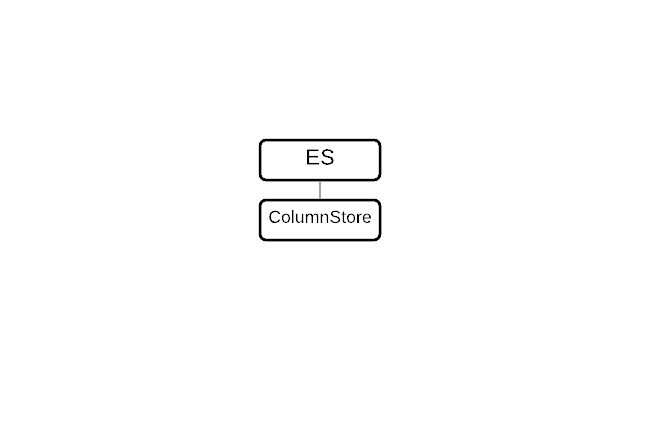

# Single-Node Localstorage

MariaDB ColumnStore is a columnar storage engine for MariaDB Enterprise Server 10.6. ColumnStore is best suited for Online Analytical Processing (OLAP) workloads.



This page provides an overview of the topology, requirements, and deployment procedures.

Please read and understand this procedure before executing.


Customers can obtain support by [submitting a support case](https://mariadb.com/support/).


## Components

The following components are deployed during this procedure:

<table><thead><tr><th width="266.1480712890625" valign="top">Component</th><th valign="top">Function</th></tr></thead><tbody><tr><td valign="top">MariaDB Enterprise Server</td><td valign="top">Modern SQL RDBMS with high availability, pluggable storage engines, hot online backups, and audit logging.</td></tr></tbody></table>

### MariaDB Enterprise Server Components

<table><thead><tr><th width="283" valign="top">Component</th><th valign="top">Description</th></tr></thead><tbody><tr><td valign="top"><a href="https://app.gitbook.com/o/diTpXxF5WsbHqTReoBsS/s/rBEU9juWLfTDcdwF3Q14/">MariaDB ColumnStore</a></td><td valign="top"><ul><li>Columnar Storage Engine</li><li>Optimized for Online Analytical Processing (OLAP) workloads</li></ul></td></tr></tbody></table>

### Topology

<figure><figcaption></figcaption></figure>

The Single-Node ColumnStore topology provides support for Online Analytical Processing (OLAP) workloads to MariaDB Enterprise Server.

The ColumnStore node:

* Receives queries from the application
* Executes queries
* Uses the local disk for storage.

### High Availability

Single-Node ColumnStore does not provide high availability (HA) for Online Analytical Processing (OLAP). If you would like to deploy ColumnStore with high availability, see [ColumnStore with Shared Local storage](./).

## Requirements

These requirements are for the Single-Node ColumnStore, when deployed with MariaDB Enterprise Server 10.6 and MariaDB ColumnStore 23.10.

### Operating System

* Debian 11 (x86\_64, ARM64)
* Debian 12 (x86\_64, ARM64)
* Red Hat Enterprise Linux 8 (x86\_64, ARM64)
* Red Hat Enterprise Linux 9 (x86\_64, ARM64)
* Rocky Linux 8 (x86\_64, ARM64)
* Rocky Linux 9 (x86\_64, ARM64)
* Ubuntu 20.04 LTS (x86\_64, ARM64)
* Ubuntu 22.04 LTS (x86\_64, ARM64)
* Ubuntu 24.04 LTS (x86\_64, ARM64)

### Minimum Hardware Requirements

MariaDB ColumnStore's minimum hardware requirements are not intended for production environments, but the minimum hardware requirements can be appropriate for development and test environments. For production environments, see the [recommended hardware requirements](./#recommended-hardware-requirements) instead.

The minimum hardware requirements are:

| Component        | CPU      | Memory |
| ---------------- | -------- | ------ |
| ColumnStore node | 4+ cores | 16+ GB |

MariaDB ColumnStore will refuse to start if the system has less than 3 GB of memory.

If ColumnStore is started on a system with less memory, the following error message will be written to the ColumnStore system log called `crit.log`:

```
Apr 30 21:54:35 a1ebc96a2519 PrimProc[1004]: 35.668435 |0|0|0| C 28 CAL0000: Error total memory available is less than 3GB.
```

And the following error message will be raised to the client:

```
ERROR 1815 (HY000): Internal error: System is not ready yet. Please try again.
```

### Recommended Hardware Requirements

MariaDB Enterprise ColumnStore's recommended hardware requirements are intended for production analytics.

The recommended hardware requirements are:

| Component                   | CPU       | Memory  |
| --------------------------- | --------- | ------- |
| Enterprise ColumnStore node | 64+ cores | 128+ GB |

## Quick Reference

### MariaDB Enterprise Server Configuration Management

<table><thead><tr><th width="171">Method</th><th>Description</th></tr></thead><tbody><tr><td>Configuration File</td><td>Configuration files (such as <code>/etc/my.cnf</code>) can be used to set <a href="https://app.gitbook.com/s/SsmexDFPv2xG2OTyO5yV/server-usage/storage-engines/s3-storage-engine/s3-storage-engine-system-variables">system variables</a> and <a href="https://app.gitbook.com/s/SsmexDFPv2xG2OTyO5yV/server-management/starting-and-stopping-mariadb/mariadbd-options">options</a>. The server must be restarted to apply changes made to configuration files.</td></tr><tr><td>Command-line</td><td>The server can be started with command-line options that set <a href="https://app.gitbook.com/s/SsmexDFPv2xG2OTyO5yV/server-usage/storage-engines/s3-storage-engine/s3-storage-engine-system-variables">system variables</a> and <a href="https://app.gitbook.com/s/SsmexDFPv2xG2OTyO5yV/server-management/starting-and-stopping-mariadb/mariadbd-options">options</a>.</td></tr><tr><td>SQL</td><td>Users can set <a href="https://app.gitbook.com/s/SsmexDFPv2xG2OTyO5yV/server-usage/storage-engines/s3-storage-engine/s3-storage-engine-system-variables">system variables</a> that support dynamic changes on-the-fly using the <a href="https://app.gitbook.com/s/SsmexDFPv2xG2OTyO5yV/reference/sql-statements/administrative-sql-statements/set-commands/set">SET</a> statement.</td></tr></tbody></table>

MariaDB Enterprise Server packages are configured to read configuration files from different paths, depending on the operating system. Making custom changes to Enterprise Server default configuration files is not recommended because custom changes may be overwritten by other default configuration files that are loaded later.

To ensure that your custom changes will be read last, create a custom configuration file with the `z-` prefix in one of the include directories.

<table><thead><tr><th valign="top">Distribution</th><th valign="top">Example Configuration File Path</th></tr></thead><tbody><tr><td valign="top"><ul><li>CentOS</li><li>Red Hat Enterprise Linux (RHEL)</li></ul></td><td valign="top"><code>/etc/my.cnf.d/z-custom-mariadb.cnf</code></td></tr><tr><td valign="top"><ul><li>Debian</li><li>Ubuntu</li></ul></td><td valign="top"><code>/etc/mysql/mariadb.conf.d/z-custom-mariadb.cnf</code></td></tr></tbody></table>

### MariaDB Enterprise Server Service Management

The `systemctl` command is used to start and stop the MariaDB Enterprise Server service.

<table><thead><tr><th width="262.5926513671875">Operation</th><th>Command</th></tr></thead><tbody><tr><td>Start</td><td><code>sudo systemctl start mariadb</code></td></tr><tr><td>Stop</td><td><code>sudo systemctl stop mariadb</code></td></tr><tr><td>Restart</td><td><code>sudo systemctl restart mariadb</code></td></tr><tr><td>Enable during startup</td><td><code>sudo systemctl enable mariadb</code></td></tr><tr><td>Disable during startup</td><td><code>sudo systemctl disable mariadb</code></td></tr><tr><td>Status</td><td><code>sudo systemctl status mariadb</code></td></tr></tbody></table>

## Deployment Procedure


The instructions were tested against ColumnStore 23.10.




### Prepare Systems for ColumnStore Nodes

This step prepares the system to host MariaDB Enterprise Server and MariaDB ColumnStore.

Interactive commands are detailed. Alternatively, the described operations can be performed using automation.

#### Optimize Linux Kernel Parameters <a href="#optimize-linux-kernel-parameters" id="optimize-linux-kernel-parameters"></a>

MariaDB ColumnStore performs best with Linux kernel optimizations.

On each server to host an ColumnStore node, optimize the kernel:

1. Set the relevant kernel parameters in a sysctl configuration file. To ensure proper change management, use an ColumnStore-specific configuration file.\
   Create a `/etc/sysctl.d/90-mariadb-enterprise-columnstore.conf` file:

```apache
# minimize swapping
vm.swappiness = 1

# Increase the TCP max buffer size
net.core.rmem_max = 16777216
net.core.wmem_max = 16777216

# Increase the TCP buffer limits
# min, default, and max number of bytes to use
net.ipv4.tcp_rmem = 4096 87380 16777216
net.ipv4.tcp_wmem = 4096 65536 16777216

# don't cache ssthresh from previous connection
net.ipv4.tcp_no_metrics_save = 1

# for 1 GigE, increase this to 2500
# for 10 GigE, increase this to 30000
net.core.netdev_max_backlog = 2500
```

2. Use the `sysctl` command to set the kernel parameters at runtime

```
$ sudo sysctl --load=/etc/sysctl.d/90-mariadb-enterprise-columnstore.conf
```

#### Temporarily Configure Linux Security Modules (LSM) <a href="#temporarily-configure-linux-security-modules-lsm" id="temporarily-configure-linux-security-modules-lsm"></a>

The Linux Security Modules (LSM) should be temporarily disabled on each Enterprise ColumnStore node during installation.

The LSM will be configured and re-enabled later in this deployment procedure.

The steps to disable the LSM depend on the specific LSM used by the operating system.

**CentOS / RHEL Stop SELinux**

SELinux must be set to permissive mode before installing MariaDB Enterprise ColumnStore.

To set SELinux to permissive mode:

1. Set SELinux to permissive mode:

```bash
$ sudo setenforce permissive
```

2. Set SELinux to permissive mode by setting SELINUX=permissive in /etc/selinux/config.

For example, the file will usually look like this after the change:

```apache
# This file controls the state of SELinux on the system.
# SELINUX= can take one of these three values:
#     enforcing - SELinux security policy is enforced.
#     permissive - SELinux prints warnings instead of enforcing.
#     disabled - No SELinux policy is loaded.
SELINUX=permissive
# SELINUXTYPE= can take one of three values:
#     targeted - Targeted processes are protected,
#     minimum - Modification of targeted policy. Only selected processes are protected.
#     mls - Multi Level Security protection.
SELINUXTYPE=targeted
```

3. Confirm that SELinux is in permissive mode:

```bash
sudo getenforce
Permissive
```

SELinux will be configured and re-enabled later in this deployment procedure. This configuration is not persistent. If you restart the server before configuring and re-enabling SELinux later in the deployment procedure, you must reset the enforcement to permissive mode.

**Debian / Ubuntu AppArmor**

AppArmor must be disabled before installing MariaDB Enterprise ColumnStore.

1. Disable AppArmor:

```bash
$ sudo systemctl disable apparmor
```

2. Reboot the system.
3. Confirm that no AppArmor profiles are loaded using aa-status:

```bash
$ sudo aa-status
```

```
apparmor module is loaded.
0 profiles are loaded.
0 profiles are in enforce mode.
0 profiles are in complain mode.
0 processes have profiles defined.
0 processes are in enforce mode.
0 processes are in complain mode.
0 processes are unconfined but have a profile defined.
```

AppArmor will be configured and re-enabled later in this deployment procedure.

#### Configure Character Encoding <a href="#configure-character-encoding" id="configure-character-encoding"></a>

When using MariaDB Enterprise ColumnStore, it is recommended to set the system's locale to UTF-8.

1. On RHEL 8, install additional dependencies:

```bash
$ sudo yum install glibc-locale-source glibc-langpack-en
```

2. Set the system's locale to en\_US.UTF-8 by executing localedef:

```bash
$ sudo localedef -i en_US -f UTF-8 en_US.UTF-8
```



### Install ColumnStore

This step installs MariaDB Enterprise Server and MariaDB ColumnStore.


The instructions were tested against ColumnStore 23.10.


Interactive commands are detailed. Alternatively, the described operations can be performed using automation.

#### Retrieve Download Token <a href="#retrieve-download-token" id="retrieve-download-token"></a>

MariaDB Corporation provides package repositories for CentOS / RHEL (YUM) and Debian / Ubuntu (APT). A download token is required to access the MariaDB Enterprise Repository.

Customer Download Tokens are customer-specific and are available through the MariaDB Customer Portal.

To retrieve the token for your account:

1. Navigate to [https://customers.mariadb.com/downloads/token/](https://customers.mariadb.com/downloads/token/)
2. Log in.
3. Copy the Customer Download Token.

Substitute your token for `CUSTOMER_DOWNLOAD_TOKEN` when configuring the package repositories.

#### Set Up Repository <a href="#set-up-repository" id="set-up-repository"></a>

1. On each ColumnStore node, install the prerequisites for downloading the software from the Web.

Install on CentOS / RHEL (YUM):

```bash
$ sudo yum install curl
```

Install on Debian / Ubuntu (APT):

```bash
$ sudo apt install curl apt-transport-https
```

2. On each Enterprise ColumnStore node, configure package repositories and specify Enterprise Server:

```bash
$ curl -LsSO https://dlm.mariadb.com/enterprise-release-helpers/mariadb_es_repo_setup
```

```bash
$ echo "${checksum}  mariadb_es_repo_setup" \
      
 | sha256sum -c -
```

```bash
$ chmod +x mariadb_es_repo_setup
```

```bash
$ sudo ./mariadb_es_repo_setup --token="CUSTOMER_DOWNLOAD_TOKEN" --apply \
      --skip-maxscale \
      --skip-tools \
      --mariadb-server-version="11.4"
```


_Checksums of the various releases of the `mariadb_es_repo_setup` script can be found in the_ [_Versions_](https://mariadb.com/docs/server/reference/sql-functions/secondary-functions/information-functions/version) _section at the bottom of the_ [_MariaDB Package Repository Setup and Usage_](https://mariadb.com/docs/server/server-management/install-and-upgrade-mariadb/installing-mariadb/binary-packages) _page. Substitute `${checksum}` in the example above with the latest checksum._


#### Install Enterprise ColumnStore <a href="#install-enterprise-columnstore" id="install-enterprise-columnstore"></a>

**Install additional dependencies:**



```bash
$ sudo yum install epel-release
$ sudo yum install jemalloc
```



```bash
$ sudo apt install libjemalloc2
```



```bash
$ sudo apt install libjemalloc1
```



**Install MariaDB Enterprise Server and MariaDB Enterprise ColumnStore**



```bash
$ sudo yum install MariaDB-server \
   MariaDB-backup \
   MariaDB-shared \
   MariaDB-client \
   MariaDB-columnstore-engine
```



```bash
$ sudo apt install mariadb-server \
   mariadb-backup \
   libmariadb3 \
   mariadb-client \
   mariadb-plugin-columnstore
```





### Start and Configure ColumnStore

This step starts and configures MariaDB Enterprise Server and MariaDB ColumnStore.

Interactive commands are detailed. Alternatively, the described operations can be performed using automation.

#### Configure ColumnStore <a href="#configure-columnstore" id="configure-columnstore"></a>

Mandatory system variables and options for Single-Node ColumnStore include:

| Connector                                                                                                                                                                                                                 | MariaDB Connector/R2DBC                                                                                                                                                                                                                                                                                                                                                                    |
| ------------------------------------------------------------------------------------------------------------------------------------------------------------------------------------------------------------------------- | ------------------------------------------------------------------------------------------------------------------------------------------------------------------------------------------------------------------------------------------------------------------------------------------------------------------------------------------------------------------------------------------ |
| [character\_set\_server](https://mariadb.com/docs/server/server-management/variables-and-modes/server-system-variables#character_set_server)                                                                              | Set this system variable to `utf8`                                                                                                                                                                                                                                                                                                                                                         |
| [collation\_server](https://mariadb.com/docs/server/server-management/variables-and-modes/server-system-variables#collation_server)                                                                                       | Set this system variable to `utf8_general_ci`                                                                                                                                                                                                                                                                                                                                              |
| [loose-columnstore\_use\_import\_for\_batchinsert](https://mariadb.com/docs/analytics/mariadb-columnstore/clients-and-tools/data-import/mariadb-enterprise-columnstore-data-loading-with-insert-select#batch-insert-mode) | Set this system variable to `ALWAYS` to always use `cpimport` for [LOAD DATA INFILE](https://mariadb.com/docs/server/reference/sql-statements/data-manipulation/inserting-loading-data/load-data-into-tables-or-index/load-data-infile) and [INSERT...SELECT](https://mariadb.com/docs/server/reference/sql-statements/data-manipulation/inserting-loading-data/insert-select) statements. |


The `loose-` prefix is required for ColumnStore system variables in the configuration file. Without it, MariaDB Server will fail to start if the ColumnStore plugin is not installed or has been removed.


**Example Configuration**

```ini
[mariadb]
log_error                              = mariadbd.err
character_set_server                   = utf8
collation_server                       = utf8_general_ci
```

#### Start the Enterprise ColumnStore Services <a href="#start-the-enterprise-columnstore-services" id="start-the-enterprise-columnstore-services"></a>

Start and enable the MariaDB Enterprise Server service, so that it starts automatically upon reboot:

```bash
$ sudo systemctl start mariadb
$ sudo systemctl enable mariadb
```

Start and enable the MariaDB Enterprise ColumnStore service, so that it starts automatically upon reboot:

```bash
$ sudo systemctl start mariadb-columnstore
$ sudo systemctl enable mariadb-columnstore
```

#### Create the Utility User <a href="#create-the-utility-user" id="create-the-utility-user"></a>

Enterprise ColumnStore requires a mandatory utility user account. By default, it connects to the server using the root user with no password. MariaDB Enterprise Server 10.6 will reject this login attempt by default, so you will need to configure Enterprise ColumnStore to use a different user account and password and create this user account on Enterprise Server.

1. On the Enterprise ColumnStore node, create the user account with the [CREATE USER](https://mariadb.com/docs/server/reference/sql-statements/account-management-sql-statements/create-user) statement:

```sql
CREATE USER 'util_user'@'127.0.0.1'
IDENTIFIED BY 'util_user_passwd';
```

2. On the Enterprise ColumnStore node, grant the user account SELECT privileges on all databases with the GRANT statement:

```sql
GRANT SELECT, PROCESS ON *.*
TO 'util_user'@'127.0.0.1';
```

3. Configure Enterprise ColumnStore to use the utility user:

```bash
$ sudo mcsSetConfig CrossEngineSupport Host 127.0.0.1
$ sudo mcsSetConfig CrossEngineSupport Port 330
$ sudo mcsSetConfig CrossEngineSupport User util_user
```

4. Set the password:

```bash
$ sudo mcsSetConfig CrossEngineSupport Password util_user_passwd
```


For details about how to encrypt the password, see "[Credentials Management for MariaDB Enterprise ColumnStore](https://mariadb.com/docs/analytics/mariadb-columnstore/security/enterprise-columnstore-credentials-management)".



Passwords should meet your organization's password policies. If your MariaDB Enterprise Server instance has a password validation plugin installed, then the password should also meet the configured requirements.


#### Configure Linux Security Modules (LSM) <a href="#configure-linux-security-modules-lsm" id="configure-linux-security-modules-lsm"></a>

The specific steps to configure the security module depend on the operating system.

**Configure SELinux (CentOS, RHEL)**

Configure SELinux for Enterprise ColumnStore:

1. To configure SELinux, you have to install the packages required for audit2allow. On CentOS 7 and RHEL 7, install the following:

```bash
$ sudo yum install policycoreutils policycoreutils-python
```

On RHEL 8, install the following:

```bash
$ sudo yum install policycoreutils python3-policycoreutils policycoreutils-python-utils
```

2. Allow the system to run under load for a while to generate SELinux audit events.
3. After the system has taken some load, generate an SELinux policy from the audit events using audit2allow:

```bash
$ sudo grep mysqld /var/log/audit/audit.log | audit2allow -M mariadb_local
```

If no audit events were found, this will print the following:

```bash
$ sudo grep mysqld /var/log/audit/audit.log | audit2allow -M mariadb_local
Nothing to do
```

4. If audit events were found, the new SELinux policy can be loaded using semodule:

```bash
$ sudo semodule -i mariadb_local.pp
```

5. Set SELinux to enforcing mode by setting SELINUX=enforcing in /etc/selinux/config.

For example, the file will usually look like this after the change:

```apache
# This file controls the state of SELinux on the system.
# SELINUX= can take one of these three values:
#     enforcing - SELinux security policy is enforced.
#     permissive - SELinux prints warnings instead of enforcing.
#     disabled - No SELinux policy is loaded.
SELINUX=enforcing
# SELINUXTYPE= can take one of three values:
#     targeted - Targeted processes are protected,
#     minimum - Modification of targeted policy. Only selected processes are protected.
#     mls - Multi Level Security protection.
SELINUXTYPE=targeted
```

6. Set SELinux to enforcing mode:

```bash
$ sudo setenforce enforcing
```

**Configure AppArmor (Ubuntu)**

For information on how to create a profile, see [How to create an AppArmor Profile](https://ubuntu.com/tutorials/beginning-apparmor-profile-development#1-overview) on ubuntu.com.



### Test ColumnStore

This step tests MariaDB Enterprise Server and MariaDB ColumnStore.

#### Test Local Connection <a href="#test-local-connection" id="test-local-connection"></a>

Connect to the server using MariaDB Client using the root@localhost user account:

```bash
$ sudo mariadb
```

```
Welcome to the MariaDB monitor.  Commands end with ; or \g.
Your MariaDB connection id is 38
Server version: 11.4.5-3-MariaDB-Enterprise MariaDB Enterprise Server

Copyright (c) 2000, 2018, Oracle, MariaDB Corporation Ab and others.

Type 'help;' or '\h' for help. Type '\c' to clear the current input statement.

MariaDB [(none)]>
```

#### Test ColumnStore Plugin Status <a href="#test-columnstore-plugin-status" id="test-columnstore-plugin-status"></a>

Query [information\_schema.PLUGINS](https://mariadb.com/docs/server/reference/system-tables/information-schema/information-schema-tables/plugins-table-information-schema) and confirm that the ColumnStore storage engine plugin is `ACTIVE`:

```sql
SELECT PLUGIN_NAME, PLUGIN_STATUS
FROM information_schema.PLUGINS
WHERE PLUGIN_LIBRARY LIKE 'ha_columnstore%';
```

```
+---------------------+---------------+
| PLUGIN_NAME         | PLUGIN_STATUS |
+---------------------+---------------+
| Columnstore         | ACTIVE        |
| COLUMNSTORE_COLUMNS | ACTIVE        |
| COLUMNSTORE_TABLES  | ACTIVE        |
| COLUMNSTORE_FILES   | ACTIVE        |
| COLUMNSTORE_EXTENTS | ACTIVE        |
+---------------------+---------------+
```

#### Test ColumnStore Table Creation <a href="#test-columnstore-table-creation" id="test-columnstore-table-creation"></a>

1. Create a test database, if it does not exist:

```sql
CREATE DATABASE IF NOT EXISTS test;
```

2. Create a ColumnStore table:

```sql
CREATE TABLE IF NOT EXISTS test.contacts (
   first_name VARCHAR(50),
   last_name VARCHAR(50),
   email VARCHAR(100)
) ENGINE=ColumnStore;
```

3. Add sample data into the table:

```sql
INSERT INTO test.contacts (first_name, last_name, email)
   VALUES
   ("Kai", "Devi", "kai.devi@example.com"),
   ("Lee", "Wang", "lee.wang@example.com");
```

4. Read data from table:

```bash
SELECT * FROM test.contacts;
```

```
+------------+-----------+----------------------+
| first_name | last_name | email                |
+------------+-----------+----------------------+
| Kai        | Devi      | kai.devi@example.com |
| Lee        | Wang      | lee.wang@example.com |
+------------+-----------+----------------------+
```

#### Test Cross Engine Join <a href="#test-cross-engine-join" id="test-cross-engine-join"></a>

1. Create an InnoDB table:

```sql
CREATE TABLE test.addresses (
   email VARCHAR(100),
   street_address VARCHAR(255),
   city VARCHAR(100),
   state_code VARCHAR(2)
) ENGINE = InnoDB;
```

2. Add data to the table:

```sql
INSERT INTO test.addresses (email, street_address, city, state_code)
   VALUES
   ("kai.devi@example.com", "1660 Amphibious Blvd.", "Redwood City", "CA"),
   ("lee.wang@example.com", "32620 Little Blvd", "Redwood City", "CA");
```

3. Perform a cross-engine join:

```sql
SELECT name AS "Name", addr AS "Address"
FROM (SELECT CONCAT(first_name, " ", last_name) AS name,
   email FROM test.contacts) AS contacts
INNER JOIN (SELECT CONCAT(street_address, ", ", city, ", ", state_code) AS addr,
   email FROM test.addresses) AS addr
WHERE  contacts.email = addr.email;
```

```
+----------+-----------------------------------------+
| Name     | Address                                 |
+----------+-----------------------------------------+
| Kai Devi | 1660 Amphibious Blvd., Redwood City, CA |
| Lee Wang | 32620 Little Blvd, Redwood City, CA     |
+----------+-----------------------------------------+

+-------------------+-------------------------------------+
| Name              | Address                             |
+-------------------+-------------------------------------+
| Walker Percy      | 500 Thomas More Dr., Covington, LA  |
| Flannery O'Connor | 300 Tarwater Rd., Milledgeville, GA |
+-------------------+-------------------------------------+
```



### Bulk Import of Data

This step bulk imports data to ColumnStore.

#### Import the Schema <a href="#import-the-schema" id="import-the-schema"></a>

Before data can be imported into the tables, create a matching schema.

**On the primary server**, create the schema:

1. For each database that you are importing, create the database with the [CREATE DATABASE](https://mariadb.com/docs/server/reference/sql-statements/data-definition/create/create-database) statement:

```sql
CREATE DATABASE inventory;
```

2. For each table that you are importing, create the table with the [CREATE TABLE](https://mariadb.com/docs/server/server-usage/tables/create-table) statement:

```sql
CREATE TABLE inventory.products (
   product_name VARCHAR(11) NOT NULL DEFAULT '',
   supplier VARCHAR(128) NOT NULL DEFAULT '',
   quantity VARCHAR(128) NOT NULL DEFAULT '',
   unit_cost VARCHAR(128) NOT NULL DEFAULT ''
) ENGINE=Columnstore DEFAULT CHARSET=utf8;
```

#### Import the Data <a href="#import-the-data" id="import-the-data"></a>

Enterprise ColumnStore supports multiple methods to import data into ColumnStore tables.

**cpimport**

MariaDB Enterprise ColumnStore includes [cpimport](https://mariadb.com/docs/analytics/mariadb-columnstore/clients-and-tools/data-import/mariadb-enterprise-columnstore-data-loading-with-cpimport), which is a command-line utility designed to efficiently load data in bulk. Alternative methods are available.

To import your data from a TSV (tab-separated values) file, on the primary server run `cpimport`:

```bash
$ sudo cpimport -s '\t' inventory products /tmp/inventory-products.tsv
```

#### LOAD DATA INFILE <a href="#load-data-infile" id="load-data-infile"></a>

When data is loaded with the [LOAD DATA INFILE](https://mariadb.com/docs/server/reference/sql-statements/data-manipulation/inserting-loading-data/load-data-into-tables-or-index/load-data-infile) statement, MariaDB Enterprise ColumnStore loads the data using `cpimport`, which is a command-line utility designed to efficiently load data in bulk. Alternative methods are available.

To import your data from a TSV (tab-separated values) file, on the primary server use [LOAD DATA INFILE](https://mariadb.com/docs/server/reference/sql-statements/data-manipulation/inserting-loading-data/load-data-into-tables-or-index/load-data-infile) statement:

```sql
LOAD DATA INFILE '/tmp/inventory-products.tsv'
INTO TABLE inventory.products;
```

#### Import from Remote Database <a href="#import-from-remote-database" id="import-from-remote-database"></a>

MariaDB Enterprise ColumnStore can also import data directly from a remote database. A simple method is to query the table using the [SELECT](https://mariadb.com/docs/server/reference/sql-statements/data-manipulation/selecting-data/select) statement, and then pipe the results into `cpimport`, which is a command-line utility that is designed to efficiently load data in bulk. Alternative methods are available.

To import your data from a remote MariaDB database:

```bash
$ mariadb --quick \
   --skip-column-names \
   --execute="SELECT * FROM inventory.products" \
   | cpimport -s '\t' inventory products
```






