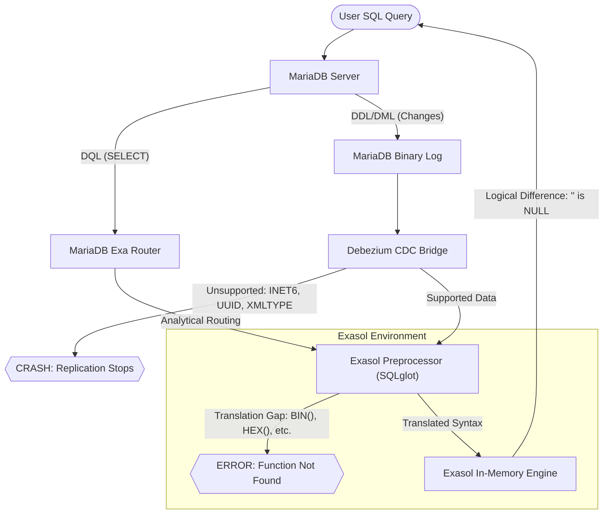

# Compatibility and Reference


This is an early draft pending review and should not be relied upon


MariaDB Exa integrates MariaDB Enterprise Server with the Exasol analytical engine through a multi-stage pipeline designed for near real-time analytics, enabling high-performance, large-scale SQL analytics on operational data. The system processes operations through two distinct paths based on whether the task modifies data or requests analytical results.

#### Core Components

* MariaDB Server (Source Layer): The primary environment for transactional workloads (OLTP). It records every data modification (DML) and schema change (DDL) in the Binary Log, which serves as the authoritative record of the system state.
* Debezium CDC & Replication (Integration Layer): A service that monitors the Binary Log and replicates changes to Exasol. It processes specific data types; encountering unrecognized MariaDB-native types can result in service failure or system crashes.
* Exa Router (Routing Layer): A component that intercepts incoming SQL and identifies Analytical Queries (DQL/SELECT). It routes these queries directly to Exasol to utilize its in-memory performance, bypassing the background replication pipeline.
* SQLglot Preprocessor (Translation Layer): An Exasol-side script that translates MariaDB SQL syntax into native Exasol SQL. It manages identifier normalization (such as uppercasing table names) and maps MariaDB functions to Exasol equivalents.

#### SQL Compatibility Framework

Compatibility is determined by three primary factors:

* Replication Compatibility: The ability of Debezium to interpret and transport data changes through the integration layer.
* Translation Compatibility: The ability of the Preprocessor to identify and map MariaDB functions to Exasol equivalents.
* Engine Logic: The degree to which MariaDB and Exasol engines interpret data (such as `NULL`, empty strings, or identity functions) identically.

#### The Ideal Flow: An Example

1. DDL Execution: A user executes `CREATE TABLE sales (id INT PRIMARY KEY, amount DECIMAL(10,2));` in MariaDB. Debezium replicates the schema structure to Exasol.
2. DML Execution: A user executes `INSERT INTO sales VALUES (1, 500.00);`. Debezium mirrors the data modification to Exasol.
3. DQL Routing: A user executes `SELECT TRUNCATE(amount, 0) FROM sales;`. The Exa Router identifies this as an analytical query.
4. Translation: The Preprocessor maps the MariaDB `TRUNCATE()` function to the native Exasol equivalent, `TRUNC()`.
5. Result: Exasol executes the translated query and returns the results through the MariaDB interface.

### 2. Replication Compatibility: Debezium & Data Type Mapping

Incompatibility at the replication level affects background synchronization. If a data type is incompatible with Debezium or the replication pipeline, the integration layer may fail, leading to desynchronization between MariaDB and Exasol.

#### Data Type Compatibility (Reference: MSQA-39)

| **MariaDB Data Type**         | **Replication Status** | **Exasol Target Behavior**                                                   |
| ----------------------------- | ---------------------- | ---------------------------------------------------------------------------- |
| `INT`, `BIGINT`               | ✅ Supported            | `DECIMAL(18,0)` (Upcast)                                                     |
| `SMALLINT`, `TINYINT`         | ✅ Supported            | `DECIMAL(9,0)` (Upcast)                                                      |
| `FLOAT`, `REAL`               | ✅ Supported            | `DOUBLE` (Potential for minor precision distortion)                          |
| `CHAR(N)`, `VARCHAR(N)`       | ✅ Supported            | `CHAR(N)` (Exasol right-pads `CHAR` with spaces)                             |
| `INET6`, `UUID`, `XMLTYPE`    | 🛑 CRASH               | Fatal Error: Debezium crashes and halts replication.                         |
| `TIME`, `TIME(6)`             | ❌ Failed               | Casting Error: Misinterpreted as `DECIMAL(36,0)`, causing ingestion failure. |
| `ENUM`, `SET`                 | ❌ Failed               | Java Error: Casting exception (`Character` to `String`) in worker.           |
| `BLOB`, `BINARY`, `VARBINARY` | ❌ Failed               | Syntax Error: Not recognized by current replication syntax.                  |
| `SERIAL`, `BIT`               | ❌ Failed               | Syntax Error: Incompatible with current replication bridge.                  |

Example of a System Crash: Executing `CREATE TABLE logs (session_id UUID);` succeeds in MariaDB but results in an immediate crash of the Debezium connector, halting all data synchronization until the offending table is removed from the source.

### 3. Query Translation: SQLglot Function Matrix

For queries routed directly to Exasol, the SQLglot Preprocessor maps MariaDB functions to Exasol equivalents. Gaps in translation result in "Function not found" or syntax errors.

#### Function Translation Matrix (Reference: MSQA-41 & MSQA-48)

| **Category** | **MariaDB Function**             | **Translation Status** | **Exasol Equivalent / Error**                   |
| ------------ | -------------------------------- | ---------------------- | ----------------------------------------------- |
| Math         | `TRUNCATE()`                     | ✅ Supported            | `TRUNC()`                                       |
| Math         | `ABS`, `CEIL`, `FLOOR`           | ✅ Supported            | Natively supported                              |
| Math         | `POW()`, `POWER()`               | ❌ Failed               | Alias mapping error or type mismatch            |
| Math         | `DIV`                            | 🛑 Gap                 | Passed as-is; results in Exasol syntax error    |
| String       | `LOWER()`, `UPPER()`             | ✅ Supported            | `LOWER()`, `UPPER()`                            |
| String       | `BIN()`, `HEX()`, `UNHEX()`      | 🛑 Gap                 | "Function not found"                            |
| String       | `SUBSTRING_INDEX()`              | 🛑 Gap                 | "Function not found"                            |
| String       | `STRCMP`, `FIELD`, `FIND_IN_SET` | 🛑 Gap                 | Missing from mapping dictionary                 |
| Date         | `CURDATE()`, `MONTH()`           | ✅ Supported            | `CURRENT_DATE`, `MONTH()`                       |
| Date         | `NOW()`, `SYSDATE()`             | ❌ Failed               | Syntax errors due to internal wrapper conflicts |
| Date         | `UTC_DATE`, `DAYNAME`, `QUARTER` | 🛑 Gap                 | Missing from mapping dictionary                 |
| Aggregate    | `AVG()`, `SUM()`                 | ✅ Supported            | `AVG()`, `SUM()`                                |
| Aggregate    | `MAX()`                          | ❌ Failed               | Failures observed on specific processing paths  |
| Aggregate    | `BIT_AND`, `BIT_OR`              | 🛑 Gap                 | Exasol requires scalar versions                 |

***

### 4. Behavioral and Operational Exceptions

These exceptions occur when a query executes in both engines but produces different results due to variations in internal logic or data representation.

#### Data Distortion and Precision Examples (MSQA-39 Part 1)

During replication, numeric and temporal values may undergo transformation.

| **MariaDB Type & Value**          | **Exasol Result**                    | **Behavior Description**                                                                |
| --------------------------------- | ------------------------------------ | --------------------------------------------------------------------------------------- |
| `FLOAT`: `3.14159`                | `DOUBLE`: `3.141590118408203`        | Precision Distortion: Values are upcast to `DOUBLE`, leading to minor precision shifts. |
| `DOUBLE`: `1.23456789`            | `DOUBLE`: `1.23456789`               | Exact Match: Standard `DOUBLE` values typically maintain precision.                     |
| `DECIMAL(10,2)`: `500.00`         | `DECIMAL(10,2)`: `500`               | Trailing Zero Removal: Exasol trims trailing zeros in internal storage and output.      |
| `DATETIME`: `1000-01-01 00:00:00` | `TIMESTAMP`: `1000-01-01 00:00:00.0` | Minimum Range: Standard minimum range is successfully stored.                           |

#### Authentication and Session Identity

* Identity Shift: Functions like `CURRENT_USER()` and `USER()` return the identity of the service account used by the MariaDB Exa Router to connect to Exasol, rather than the credentials of the end-user authenticated at the MariaDB Server.
* Database Context: `DATABASE()` (translated to `CURRENT_SCHEMA`) returns the Exasol schema context, which may differ from the MariaDB database name.
* Session Tracking: `CONNECTION_ID()` fails because MariaDB connection IDs do not correspond to Exasol session IDs.

#### NULL and Empty String Handling

Exasol treats an empty string (`''`) as a `NULL` value.

* The Rule: Exasol treats an empty string (`''`) as a `NULL` value.
* Example: In MariaDB, `SELECT * FROM sales WHERE code = '';` returns rows containing zero-length strings. In Exasol, this returns zero results because `NULL` requires the `IS NULL` operator.
* Remediation: Align MariaDB behavior with Exasol by configuring `sql_mode = 'EMPTY_STRING_IS_NULL'`.

#### Sorting and Formatting

* NULL Sorting: In an `ORDER BY ASC` clause, MariaDB sorts `NULL` values first; Exasol sorts them last.
* Mathematical Edge Cases: Operations such as `ATAN2(0,0)` return `0` in MariaDB but trigger a runtime exception in Exasol, causing the query to fail.
