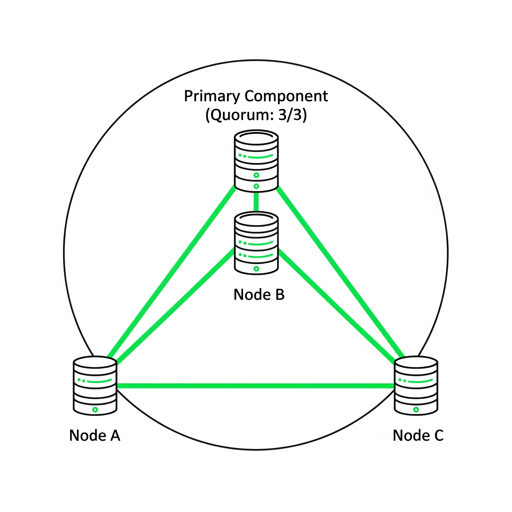

# Quorum and Cluster Membership

Quorum is essential for maintaining data consistency in a Galera Cluster by safeguarding against network partitions or node failures. It ensures that the cluster processes database queries and transactions only when a majority of nodes are operational, healthy, and in communication. This majority group is known as the Primary Component. Nodes not in this group switch to a non-primary state, halting queries and entering a read-only mode to prevent data discrepancies.

The primary function of Quorum is to avoid "split-brain" scenarios, which occur when network partitions lead to parts of the cluster operating independently and accepting writes, resulting in conflicting data. By ensuring only the partition with a majority of nodes becomes the "Primary," Quorum effectively prevents these inconsistencies.

## How Quorum is Calculated

Quorum is achieved when more than 50% of the total nodes are in communication.

* Odd Number of Nodes (Recommended): In a 3-node cluster, a majority is 2. The cluster can tolerate the failure of 1 node and remain operational. In a 5-node cluster, a majority is 3, and it can tolerate 2 node failures. This is the ideal and most resilient configuration.

<div align="left"><figure><figcaption></figcaption></figure></div>

* Even Number of Nodes: In a 2-node cluster, a majority is also 2. If one node fails, the remaining node represents only 50% of the cluster, which is not a majority. It will lose Quorum and stop functioning. This is why a 2-node cluster has no fault tolerance without an external voting member.

<div align="left"><figure><figcaption></figcaption></figure></div>

## The Role of the Galera Arbitrator (`garbd`)

The Galera Arbitrator (`garbd`) is the solution for clusters with an even number of nodes. It is a lightweight, stateless daemon that can be run on a separate, minimal server.

### Purpose

`garbd` acts as a voting member in the cluster without being a full database node. It participates in Quorum calculations, effectively turning an even-numbered cluster into an odd-numbered one.

### Example

<div align="left"><figure><figcaption></figcaption></figure></div>

In a 2-node cluster, adding `garbd` makes the total number of voting members 3. If one database node fails, the remaining database node and `garbd` still form a majority (2 out of 3), allowing the cluster to maintain Quorum and stay online.


As a more advanced alternative, nodes can also be assigned a weight using the `pc.weight` parameter, allowing certain nodes to have a more significant vote in Quorum calculations.


## Monitoring Quorum and Cluster Membership

You can check the health of the cluster and its Quorum status at any time by querying specific status variables. These should be run on all nodes to ensure you get a consistent picture.

*   `wsrep_cluster_status`: The most important variable for Quorum.

    * Healthy Value: `Primary`
    * Unhealthy Value: Any other value (e.g., `non-Primary`, `Disconnected`) means the node is not part of a functional cluster component that has Quorum.

    ```sql
    SHOW STATUS LIKE 'wsrep_cluster_status';
    ```
*   `wsrep_cluster_size`: Shows the number of nodes in the cluster component this node is currently connected to.

    * Healthy Value: Should match the number of nodes you expect in your cluster. If the number is lower, one or more nodes have left the cluster.

    ```sql
    SHOW STATUS LIKE 'wsrep_cluster_size';
    ```
*   `wsrep_cluster_conf_id` and `wsrep_cluster_state_uuid`: These are identifiers for the cluster membership group.

    * Healthy Value: The values for both variables must be identical on every single node in the cluster.
    * Unhealthy Value: If any node reports a different value, it means it has been partitioned from the Primary Component.

    ```sql
    SHOW STATUS LIKE 'wsrep_cluster_conf_id';
    SHOW STATUS LIKE 'wsrep_cluster_state_uuid';
    ```

## Recovering from Quorum Loss

If the entire cluster shuts down or fails in a way that Quorum is lost on all nodes, you must manually bootstrap the cluster to re-establish a Primary Component.

1. Stop all remaining MariaDB nodes in the cluster to ensure a clean start.
2. Identify the most advanced node. This is the node that contains the most recent data. You can find this by checking the `seqno` value in the `grastate.dat` file located in the MariaDB data directory (`/var/lib/mysql/`) on each node. The node with the highest `seqno` is the most advanced.
3. Bootstrap the Primary Component from the most advanced node. You can do this by starting the MariaDB service on that node with the `pc.bootstrap` variable set to `true`, or by using a dedicated bootstrap script if provided by your distribution (e.g., `galera_new_cluster`).
4. Start the other nodes normally. Once the first node is running and has formed a new Primary Component by itself, you can start the MariaDB service on the other nodes. They will detect the existing Primary Component and rejoin the cluster, likely initiating a State Transfer (IST or SST) to synchronize their data.
