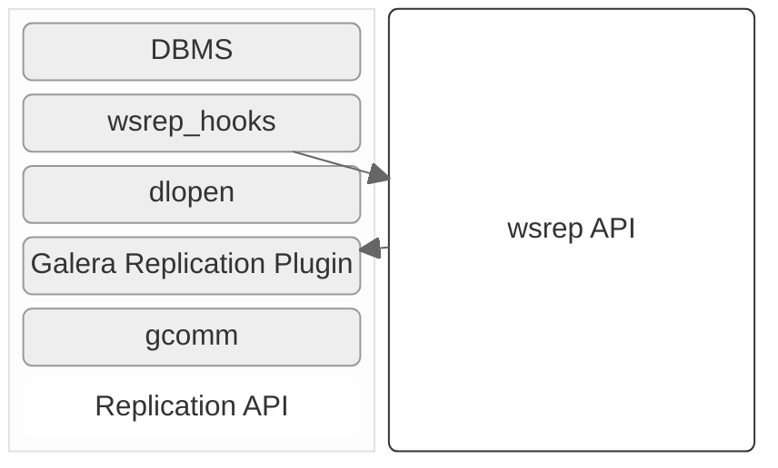

# Introduction to Galera Architecture

MariaDB Galera Cluster provides a synchronous replication system that uses an approach often called eager replication. In this model, nodes in a cluster synchronize with all other nodes by applying replicated updates as a single transaction. This means that when a transaction `COMMIT`s, all nodes in the cluster have the same value. This process is accomplished using [write-set replication](certification-based-replication.md) through a group communication framework.

## Core Architectural Components

<figure><figcaption></figcaption></figure>

The internal architecture of MariaDB Galera Cluster revolves around four primary components:

### MariaDB Server (DBMS)

The foundation of the cluster is the standard MariaDB Server, typically using the InnoDB storage engine. This component serves clients that connect to it and executes queries as a normal database server would.

### The `wsrep API`

The `wsrep API` is a generic replication plugin interface for databases. It defines a set of application callbacks and replication plugin calls that connect the MariaDB Server to the replication provider. It consists of two main elements:

* `wsrep Hooks`: These hooks integrate with the database server engine to enable write-set replication.
* `dlopen()`: This function is used to make the [wsrep\_provider](../galera-management/configuration/configuring-mariadb-galera-cluster.md) (the Galera Plugin) available to the `wsrep` hooks.

In this model, the `wsrep API` considers the database to have a "state." When clients modify the database content, its state changes. The API represents these changes as a series of atomic transactions. In a healthy cluster, all nodes always have the same [state](../high-availability/monitoring-mariadb-galera-cluster.md#understanding-galera-node-states) because they synchronize by replicating and applying these state changes in the same serial order.

From a technical perspective, the process flow is as follows:

1. A state change (transaction) occurs on one node in the cluster.
2. Within the MariaDB Server, the `wsrep` hooks translate these changes into a write-set.
3. The `dlopen()` function makes the `wsrep` provider's functions available to the hooks.
4. The Galera Replication plugin handles the [certification](certification-based-replication.md) and replication of the write-set to the rest of the cluster.
5. On each node in the cluster, the write-set is applied as a high-priority transaction.

### Galera Replication Plugin

The Galera Replication Plugin implements the `wsrep API` and acts as the `wsrep` Provider. It handles the core replication service functionality. The plugin itself consists of the following components:

* Certification Layer: Prepares write-sets and performs [certification checks](certification-based-replication.md#requirements-for-certification-based-replication) on them to ensure they can be applied without conflict.
* Replication Layer: Manages the replication protocol and provides the total ordering capability for transactions.
* Group Communication Framework: Provides the plugin architecture for the various group communication systems that connect to Galera Cluster.

### Group Communication (GComm) Framework

The Galera Replication Plugin uses a Group Communication (GComm) framework for its messaging layer. The GComm system implements a virtual synchrony Quality of Service (QoS), which unifies data delivery and cluster [membership services](../high-availability/understanding-quorum-monitoring-and-recovery.md#monitoring-quorum-and-cluster-membership) into a clear, formal model.

While virtual synchrony guarantees data consistency, it does not guarantee the temporal synchrony needed for smooth multi-primary operations. To address this, Galera Cluster implements its own runtime-configurable [Flow Control](../galera-management/performance-tuning/flow-control-in-galera-cluster.md), which keeps nodes synchronized to within a fraction of a second.

The GComm framework also provides a total ordering of messages from multiple sources, which it uses to generate Global Transaction IDs in a multi-primary cluster.

## Fundamental Concepts

### Global Transaction ID (GTID)

To keep the database state identical across all nodes, the `wsrep API` uses a Global Transaction ID (GTID). This allows the cluster to uniquely identify every state change and to know the current state of any node in relation to others. An example GTID looks like this:

`45eec521-2f34-11e0-0800-2a36050b826b:94530586304`

It consists of two components:

* State UUID: A unique identifier for the database state and its sequence of changes.
* Ordinal Sequence Number (`seqno`): A 64-bit signed integer that denotes the position of the transaction in the sequence.

### Read and Write Scaling

A direct benefit of Galera's multi-master architecture is the ability to scale both read and write operations.

* Write Scaling: Because every node in the cluster can accept write operations, you can distribute your application's write traffic across multiple nodes. This can increase write throughput, though it's important to remember that all writes must still be replicated and certified on all nodes, which can introduce [contention on high-velocity workloads](../galera-management/performance-tuning/using-streaming-replication-for-large-transactions.md#large-data-transactions).
* Read Scaling: This is the most significant performance advantage. Since all nodes are kept synchronized, they all contain the same data. This allows you to distribute read queries across all nodes in the cluster, providing excellent horizontal scaling for read-heavy applications. This architecture is ideal for use with a load balancer (like MariaDB MaxScale) that can perform read-write splitting.

This scaling is typically managed by a [load balancer,](../high-availability/load-balancing/load-balancing-in-mariadb-galera-cluster.md) which distributes traffic intelligently across the cluster.

_This page is licensed: CC BY-SA / Gnu FDL_
