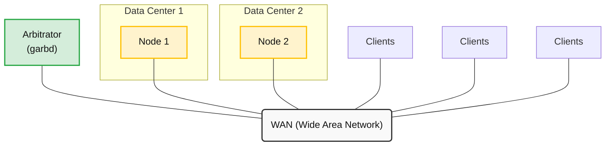

# Galera Arbitrator Daemon (garbd)


### Operational Constraints

* Data Security: While the arbitrator does not persist data to disk, it receives the exact same replication data stream as all other standard data nodes over the network. Its network connection must be secured (e.g., via SSL/TLS) just like any database node.
* Network Performance Impact: Because the arbitrator must see all replication traffic in real-time to track cluster states, placing it on a network with poor bandwidth or high latency will severely degrade the overall write performance of your entire cluster due to [Galera's flow control mechanisms](../performance-tuning/flow-control-in-galera-cluster.md).


When deploying a Galera Cluster, it is recommended to use a minimum of three instances: three nodes, three data centers and so on. If the cost of adding resources (such as a third data center) is too much, you can use Galera Arbitrator. Galera Arbitrator is a member of a cluster that participates in voting, but not in the actual replication.



Galera Arbitrator serves two purposes: When you have an even number of nodes, it functions as an odd node, to avoid split-brain situations. It can also request a consistent application state snapshot, which is useful in making backups.

If one datacenter fails or loses its WAN (Wide Area Network) connection, the node that sees the arbitrator—and by extension sees clients—continues operation.

In the event that Galera Arbitrator fails, it won't affect cluster operation. You can attach a new instance to the cluster at any time and there can be several instances running in the cluster.&#x20;

## Starting Galera Arbitrator&#x20;

Galera Arbitrator is a separate daemon from Galera Cluster, called `garbd`. This means that you must start it separately from the cluster. It also means that you cannot configure Galera Arbitrator through the standard `my.cnf` configuration file. How you configure Galera Arbitrator depends entirely on how you start it—whether it runs from the shell or as a system service.


When Galera Arbitrator starts, the script executes a `sudo` statement as the user `nobody` during its process. There is a particular issue in Red Hat Enterprise Linux and some other Linux distributions where the default `sudo` configuration blocks users operating without `tty` access.

To correct this, open the `/etc/sudoers` file with a text editor and comment out the following line:

```bash
Defaults requiretty
```

This will prevent the operating system from blocking Galera Arbitrator.


### Starting Galera Arbitrator from the Shell&#x20;

When starting Galera Arbitrator from the shell, you have two options for configuring its parameters.



You can pass parameters directly through command-line arguments as shown below:


```bash
$ garbd --group=example_cluster \
     --address="gcomm://192.168.1.1,192.168.1.2,192.168.1.3" \
     --option="socket.ssl=yes;socket.ssl_key=/etc/ssl/galera/server-key.pem;socket.ssl_cert=/etc/ssl/galera/server-cert.pem;socket.ssl_ca=/etc/ssl/galera/ca-cert.pem;socket.ssl_cipher=AES128-SHA256"
```


If you use SSL, it is necessary to specify the cipher. Otherwise, after initializing the SSL context, an error will occur with the message: `Terminate called after throwing an instance of 'gu::NotSet'`.



If you do not want to enter configuration options every time you launch the process from the shell, you can save them in an `arbitrator.config` file:

```ini
# arbitrator.config
group = example_cluster
address = gcomm://192.168.1.1,192.168.1.2,192.168.1.3
```

To initialize the daemon with this configuration file, use the `--cfg` option:

```bash
$ garbd --cfg /path/to/arbitrator.config
```



#### **Available Shell Options**

For a comprehensive list of options available through the shell, run `garbd` with the `--help` argument:

```bash
$ garbd --help

Usage: garbd [options] [group address]

Configuration:
  -d [ --daemon ]       Become daemon
  -n [ --name ] arg     Node name
  -a [ --address ] arg  Group address
  -g [ --group ] arg    Group name
  --sst arg             SST request string
  --donor arg           SST donor name
  -o [ --options ] arg  GCS/GCOMM option list
  -l [ --log ] arg      Log file
  -c [ --cfg ] arg      Configuration file

Other options:
  -v [ --version ]      Print version
  -h [ --help ]         Show help message
```

In addition to the standard setup, any parameter available to a Galera Cluster node also works with Galera Arbitrator, except for those prefixed by `repl`. When running from the shell, these can be set using the `--option` argument. For more information, refer to the `galera-parameters` documentation.

### Starting Galera Arbitrator as a Service&#x20;

When starting Galera Arbitrator as a service (via `init` or `systemd`), the configuration file uses a different format than the shell-based counterpart. Below is an example configuration file:

```ini
# Copyright (C) 2013-2015 Codership Oy
# This config file is to be sourced by garbd service script.

# A space-separated list of node addresses (address[:port]) in the cluster:
GALERA_NODES="192.168.1.1:4567 192.168.1.2:4567"

# Galera cluster name, should be the same as on the rest of the nodes.
GALERA_GROUP="example_wsrep_cluster"

# Optional Galera internal options string (such as SSL settings)
# see https://galeracluster.com/documentation/galera-parameters.html
GALERA_OPTIONS="socket.ssl=yes;socket.ssl_cert=/etc/galera/cert/cert.pem;socket.ssl_key=/$"

# Log file for garbd. Optional, by default logs to syslog
LOG_FILE="/var/log/garbd.log"
```

To make use of this configuration file, it must be placed in the directory where your specific Linux distribution looks for service configurations. There is no universal standard location for this directory; it varies by distribution, though it is typically found inside `/etc` under at least one sub-directory.

Common locations include:

* `/etc/defaults/`
* `/etc/init.d/`
* `/etc/systemd/`
* `/etc/sysconfig/`

Consult the documentation for your specific operating system distribution to verify the correct path

Once the configuration file is in place, you can start the `garb` service for these systems.



```bash
# service garb start
```



```bash
# systemctl start garb
```



This starts Galera Arbitrator as a background service using your defined parameters. Any cluster parameter can be utilized by the arbitrator as a service except for those prefixed with `repl`. These supplementary options can be appended inside the configuration file using the `GALERA_OPTIONS` parameter. For more details, consult the [`galera-parameters` documentation](../../reference/galera-cluster-system-tables.md).
