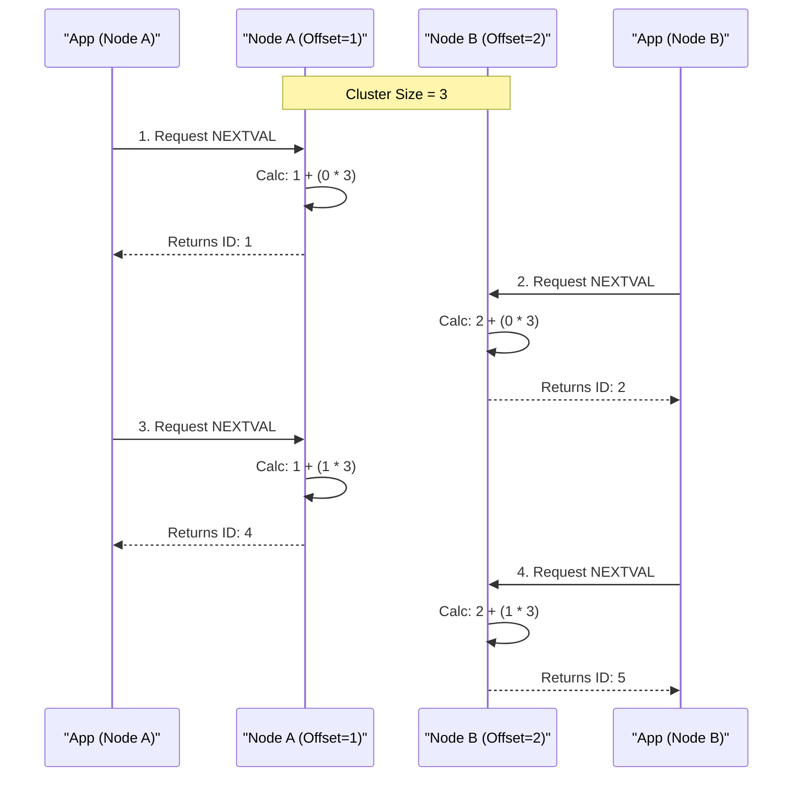

# Managing Sequences in Galera Cluster

[Sequences](https://app.gitbook.com/s/SsmexDFPv2xG2OTyO5yV/reference/sql-structure/sequences/sequence-overview) allows for the generation of unique integers independent of any specific table. While standard sequences function normally in a standalone MariaDB server, using them in a [MariaDB Galera Cluster](../../readme/mariadb-galera-cluster-usage-guide.md) requires specific configurations to ensure conflict-free operation and optimal performance.


#### Streaming Replication Support in MariaDB

Starting from MariaDB 10.11.16 (and Galera 26.4.16), sequences are fully supported in transactions utilizing streaming replication. In earlier versions, using `NEXTVAL()` within a transaction where `wsrep_trx_fragment_size > 0` would cause an `ERROR 1235`. The WSREP API now ensures proper serialization of sequence state in transaction fragments, allowing sequences to be used effectively in large-scale ETL and batch operations. See MDEV-34124


## Configuring Sequences for Galera

Because Galera is a multi-primary system, multiple nodes may attempt to generate sequence values simultaneously. To prevent duplicate values and certification failures, the cluster utilizes an offset-based generation strategy.

### Mandatory: INCREMENT BY 0

For a sequence to function correctly in a multi-node environment, it must be defined with `INCREMENT BY 0`.

```sql
CREATE SEQUENCE seq_tickets START WITH 1 INCREMENT BY 0;
```

This setting instructs the node to ignore the sequence's internal increment logic. Instead, the node applies the cluster-wide `wsrep_auto_increment_control` logic using the following formula:

$$
\text{Next\_Value} = \text{Node\_Offset} + (N \times \text{Cluster\_Size})
$$

Where:

* Node\_Offset: The unique identifier for the specific node (e.g., 1, 2, or 3).
* Cluster\_Size: The total number of nodes in the cluster.
* N: The iteration count (0, 1, 2, ...).

**Visualizing the Offset Logic**

The following diagram illustrates how two nodes in a 3-node cluster generate unique IDs simultaneously without communicating or locking.



This ensures that nodes generate interleaved, non-conflicting IDs preventing Certification Failures (Error 1213) without requiring network locks.

### Cache Configuration Strategies

The `CACHE` option is the primary lever for balancing performance against data continuity. In Galera, replication introduces a "Flush-on-Sync" behavior: when any node commits a sequence update, other nodes must sync their state, discarding any unused values in their local cache.

| Cache Setting | Usage Scenario   | Description                                                                                                                                                                                                                                                |
| ------------- | ---------------- | ---------------------------------------------------------------------------------------------------------------------------------------------------------------------------------------------------------------------------------------------------------- |
| CACHE 1       | High Concurrency | Recommended for multi-primary writes. Disables pre-allocation. Every `NEXTVAL()` triggers a commit and flush. No values are lost during sync, ensuring continuity, but at the cost of higher I/O and latency.                                              |
| CACHE 1000    | Single Writer    | Recommended for write-heavy single nodes. Allows the writer node to batch updates to disk, offering performance similar to a standalone server. However, if a secondary node writes to the sequence, the primary node's cache is discarded, creating gaps. |
| CACHE 50      | Hybrid           | A balanced approach. Reduces disk flushes significantly compared to `CACHE 1` while limiting the size of potential gaps during occasional concurrent writes.                                                                                               |


#### Avoid Using `NOCACHE`

While `NOCACHE` seems similar to `CACHE 1`, `NOCACHE` may lead to different locking paths in the storage engine, potentially reducing performance in a clustered environment. Opt for `CACHE 1` for "no cache" behavior instead.


## Use Case: Active-Active Ticket Reservation System

A common requirement for Galera is a distributed system (e.g., ticket sales) where users in different regions must be able to book items simultaneously without "race conditions" or duplicate Booking IDs.

In this example, we configure a sequence to allow high-speed concurrent bookings from multiple nodes.

```sql
-- 1. Create a sequence optimized for concurrent access
-- CACHE 1 ensures no IDs are skipped if customers bounce between nodes
CREATE SEQUENCE seq_booking_id START WITH 1000 INCREMENT BY 0 CACHE 1;

-- 2. The Application Logic (Run on Node A or Node B)
START TRANSACTION;

-- Generate a unique Booking ID instantly (No cluster lock needed)
SELECT NEXTVAL(seq_booking_id) INTO @new_id;

-- Insert the reservation
INSERT INTO bookings (id, customer, event) 
VALUES (@new_id, 'Jane Doe', 'Concert 2025');

COMMIT;
```

## Troubleshooting

### Common Errors

| Error                                                | Cause                                                                                                         | Resolution                                                                                                 |
| ---------------------------------------------------- | ------------------------------------------------------------------------------------------------------------- | ---------------------------------------------------------------------------------------------------------- |
| `ERROR 1235 ... doesn't yet support SEQUENCEs`       | The server version is older than 10.11.16 and Streaming Replication is enabled.                               | Upgrade to a supported version or disable Streaming Replication (`SET SESSION wsrep_trx_fragment_size=0`). |
| `ERROR 1213: Deadlock found when trying to get lock` | The sequence was likely defined with `INCREMENT BY 1` (default), causing nodes to contend for the same value. | Alter the sequence to use the Galera offset logic: `ALTER SEQUENCE my_seq INCREMENT BY 0;`                 |

### Sequence Gaps

It is normal behavior to see gaps in sequence numbers if using `CACHE > 1` in a multi-writer environment. When one node replicates a new high-water mark, other nodes must drop their reserved cache to synchronize. If strict continuity is required (e.g., invoice numbering), `CACHE 1` must be used.

_This page is licensed: CC BY-SA / Gnu FDL_
