# Installing MariaDB Galera on IBM Cloud

Get MariaDB Galera on IBM Cloud

You should have an IBM Cloud account; otherwise, you can [register here](https://cloud.ibm.com/registration).\
At the end of the tutorial, you will have a cluster with MariaDB up and running. IBM Cloud uses Bitnami charts to deploy MariaDB Galera with Helm

1. We will provision a new Kubernetes Cluster for you if, you already have one, skip to step **2**
2. We will deploy the IBM Cloud Block Storage plug-in; if you already have it, skip to step **3**
3. MariaDB Galera deployment

## Step 1 provision Kubernetes Cluster

* Click the Catalog button on the top
* Select Service from the catalog
* Search for Kubernetes Service and click on it

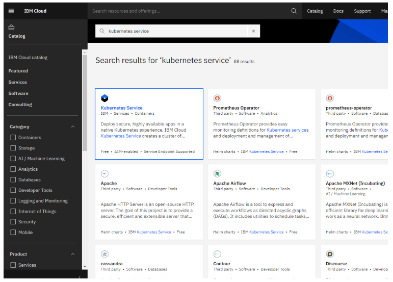

* You are now at the Kubernetes deployment page; you need to specify some details about the cluster
* Choose a standard or free plan; the free plan only has one worker node and no subnet. to provision a standard cluster, you will need to upgrade account to Pay-As-You-Go
* To upgrade to a Pay-As-You-Go account, complete the following steps:
* In the console, go to Manage > Account.
* Select Account settings, and click Add credit card.
* Enter your payment information, click Next, and submit your information
* Choose classic or VPC, read the [docs](https://cloud.ibm.com/docs/containers?topic=containers-infrastructure_providers), and choose the most suitable type for yourself

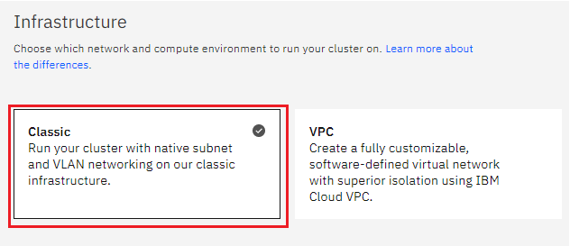

* Now choose your location settings; for more information, please visit [Locations](https://cloud.ibm.com/docs/containers?topic=containers-regions-and-zones#zones)
* Choose Geography (continent)

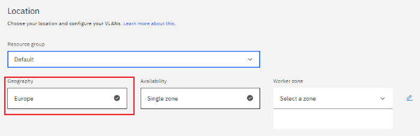

* Choose Single or Multizone. In single zone, your data is only kept in one datacenter; on the other hand, with Multizone it is distributed to multiple zones, thus safer in an unforeseen zone failure

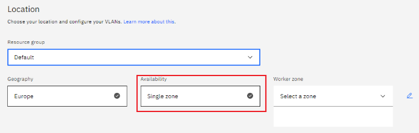

* Choose a Worker Zone if using Single zones or Metro if Multizone

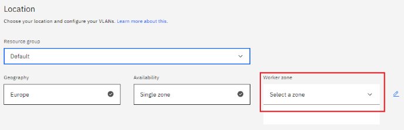

* If you wish to use Multizone please set up your account with [VRF](https://cloud.ibm.com/docs/dl?topic=dl-overview-of-virtual-routing-and-forwarding-vrf-on-ibm-cloud) or [enable Vlan spanning](https://cloud.ibm.com/docs/vlans?topic=vlans-vlan-spanning#vlan-spanning)
* If at your current location selection, there is no available Virtual LAN, a new Vlan will be created for you
* Choose a Worker node setup or use the preselected one, set Worker node amount per zone

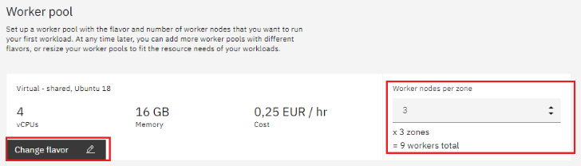

* Choose Master Service Endpoint, In VRF-enabled accounts, you can choose private-only to make your master accessible on the private network or via VPN tunnel. Choose public-only to make your master publicly accessible. When you have a VRF-enabled account, your cluster is set up by default to use both private and public endpoints. For more information visit [endpoints](https://cloud.ibm.com/docs/account?topic=account-service-endpoints-overview).

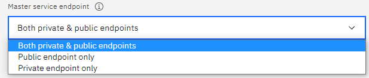

* Give cluster a name

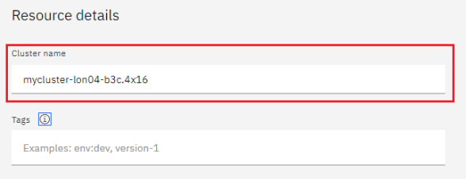

* Give desired tags to your cluster; for more information, visit [tags](https://cloud.ibm.com/docs/account?topic=account-tag)

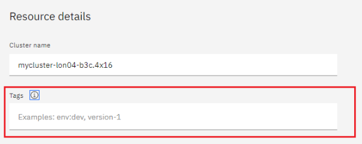

* Click create

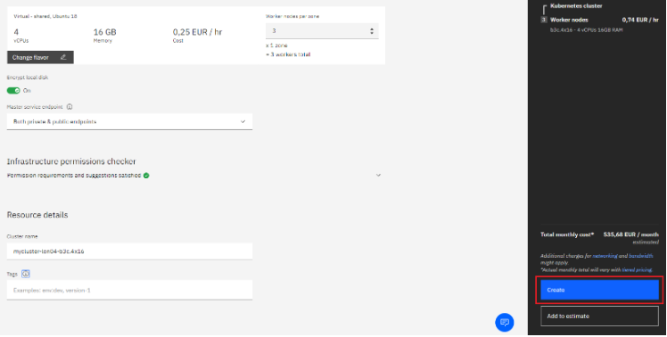

* Wait for you cluster to be provisioned

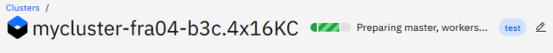

* Your cluster is ready for usage

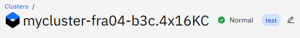

## Step 2 deploy IBM Cloud Block Storage plug-in

The Block Storage plug-in is a persistent, high-performance iSCSI storage that you can add to your apps by using Kubernetes Persistent Volumes (PVs).

* Click the Catalog button on the top
* Select Software from the catalog
* Search for IBM Cloud Block Storage plug-in and click on it

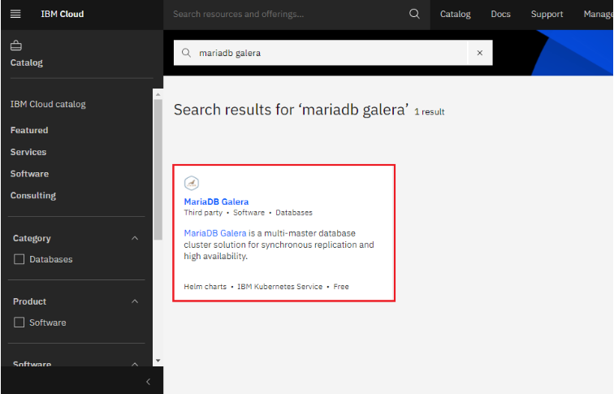

* On the application page Click in the dot next to the cluster, you wish to use
* Click on Enter or Select Namespace and choose the default Namespace or use a custom one (if you get error please wait 30 minutes for the cluster to finalize)

.PNG>)

* Give a name to this workspace
* Click install and wait for the deployment

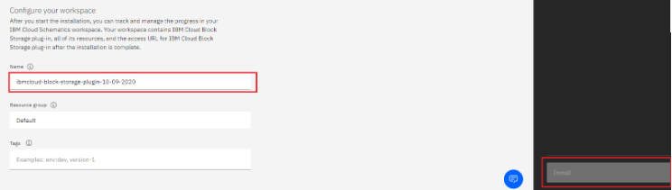

## Step 3 deploy MariaDB Galera

We will deploy MariaDB on our cluster

* Click the Catalog button on the top
* Select Software from the catalog
* Search for MariaDB and click on it


* On the application page Click in the dot next to the cluster, you wish to use

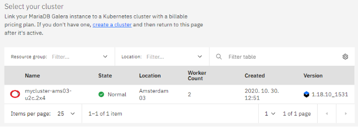

* Click on Enter or Select Namespace and choose the default Namespace or use a custom one

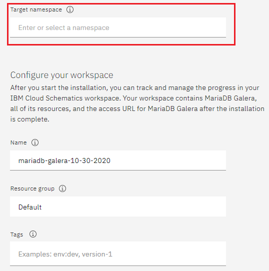

* Give a unique name to workspace, which you can easily recognize

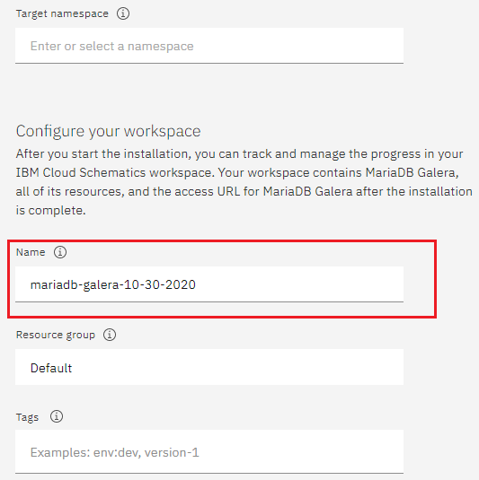

* Select which resource group you want to use, it's for access controll and billing purposes. For more information please visit [resource groups](https://cloud.ibm.com/docs/account?topic=account-account_setup#bp_resourcegroups)

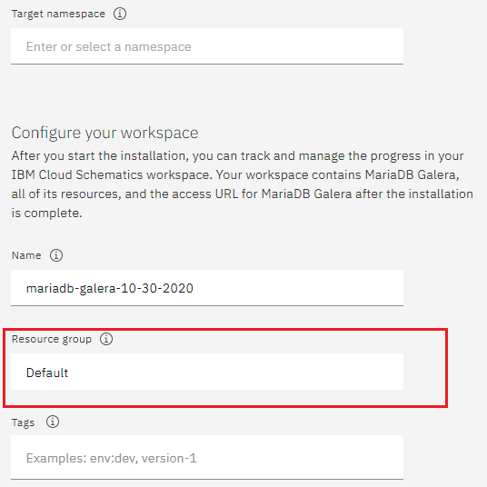

* Give tags to your MariaDB Galera, for more information visit [tags](https://cloud.ibm.com/docs/account?topic=account-tag)

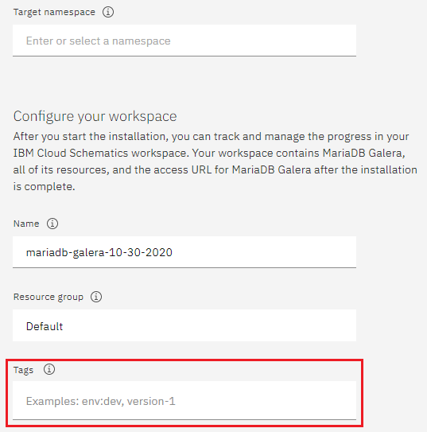

* Click on Parameters with default values, You can set deployment values or use the default ones

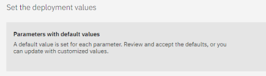

* Please set the MariaDB Galera root password in the parameters

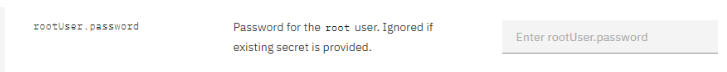

* After finishing everything, tick the box next to the agreements and click install

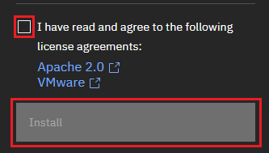

* The MariaDB Galera workspace will start installing, wait a couple of minutes

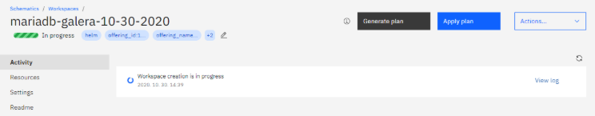

* Your MariaDB Galera workspace has been successfully deployed

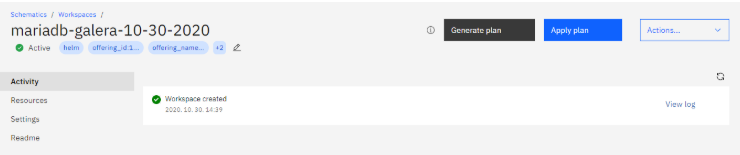

## Verify MariaDB Galera installation

* Go to [Resources](https://cloud.ibm.com/resources) in your browser
* Click on Clusters
* Click on your Cluster

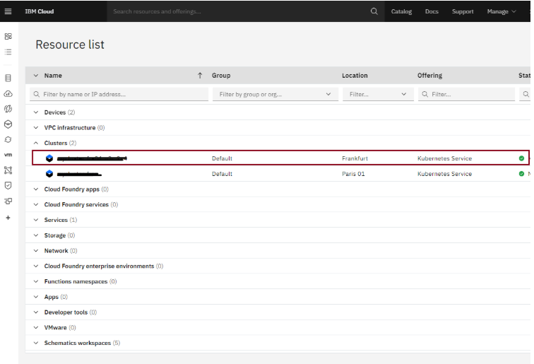

* Now you are at your clusters overview, here Click on Actions and Web terminal from the dropdown menu

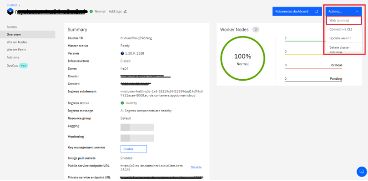

* Click install - wait couple of minutes

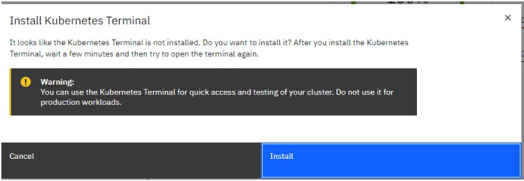

* Click on Actions
* Click Web terminal, and a terminal will open up
* Type in the terminal; please change NAMESPACE to the namespace you choose at the deployment setup:

```
$ kubectl get ns
```

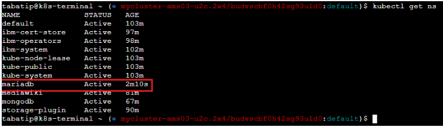

```
$ kubectl get pod -n NAMESPACE -o wide
```

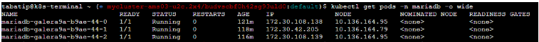

```
$ kubectl get service -n NAMESPACE
```

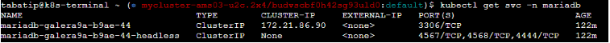

* Enter your pod with bash; please replace PODNAME with your mariadb pod's name

```
$ kubectl exec --stdin --tty PODNAME -n NAMESPACE -- /bin/bash
```

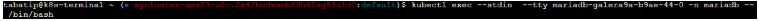

* After you are in your pod , please verify that MariaDB is running on your pod's cluster. Please enter the root password after the prompt

```
mysql -u root -p -e "SHOW STATUS LIKE 'wsrep_cluster_size'"
```


You have successfully deployed MariaDB Galera on IBM Cloud!

<sub>_This page is licensed: CC BY-SA / Gnu FDL_</sub>


