# Galera Use Cases

MariaDB Galera Cluster ensures high availability and disaster recovery through synchronous multi-master replication. It's ideal for active-active setups, providing strong consistency and automatic failover, perfect for critical applications needing continuous uptime.

To understand these use cases, it helps to see how Galera's core features are related:

```mermaid
flowchart LR
    %% 1. Define all nodes first
    A[MariaDB Galera Cluster]
    B[Synchronous Replication]
    C[Multi-Master Architecture]
    D[Automatic Node Failover]
    
    E[🚀 High Availability]
    F[🌎 Data Consistency & DR]
    G[🛠️ Zero-Downtime Maintenance]
    H[📈 Scalable Reads]

    %% 2. Draw all links
    A --- B
    A --- C
    A --- D

    B --> E
    C --> E
    
    B --> F
    C --> F
    
    C --> G
    D --> G
    
    B --> H
    C --> H
    D --> H

    %% 3. Apply styling
    style A fill:#003c5a,stroke:#fff,stroke-width:2px,color:#fff
    style E,F,G,H fill:#f5f5f5,stroke:#333
```

### High Availability (HA) for Mission-Critical Applications

Galera's core strength is its synchronous replication, ensuring that data is written to all nodes simultaneously. This makes it ideal for applications where data loss is unacceptable and downtime must be minimal.

#### Examples

1. **Financial Trading Platforms:** These systems demand immediate data consistency across all read and write operations.
2. **E-commerce and Online Retail:** Ensures immediate consistency in inventory levels, shopping carts, and order statuses.
3. **Billing and CRM Systems:** Applications where customer data must be continuously available and instantly up-to-date, 24/7.

This diagram shows how a proxy like MaxScale handles a node failure. The application is shielded from the downtime, and traffic is automatically rerouted to the healthy nodes.

#### How It _Really_ Works: The "Synchronous" Nuance

When you hear "synchronous," it doesn't mean every node writes to disk at the exact same millisecond. The process is more elegant:

1. A client sends a `COMMIT` to one node (e.g., Node A).
2. Node A packages the transaction and replicates it to Node B and Node C.
3. Node B and Node C check the transaction for conflicts (called certification) and signal "OK" back to Node A.
4. Only after Node A gets an "OK" from all other nodes does it tell the client, "Your transaction is committed."
5. All nodes then apply the write.

As a result, the data is "safe" on all nodes _before_ the application is ever told the write was successful.

#### In-Depth Use Case: E-commerce Inventory Control

You have one "Super-Widget" left in stock. Two customers, accessing different nodes, click "Buy" simultaneously.

**Without Galera (Traditional Replication):**

You risk selling the widget twice due to replication lag.

**With Galera Cluster:**

Both "buy" transactions (`UPDATE inventory SET stock=0...`) are sent for cluster certification. The cluster instantly detects the conflict:

* One transaction "wins" certification and commits.
* The other transaction fails certification and gets a "deadlock" error.

**Result:** Data integrity is fully maintained.


Always Use a Proxy. Your application shouldn't know about individual nodes. Place a cluster-aware proxy like MariaDB MaxScale in front of your cluster.

Design for 3 (or 5). A Galera Cluster needs a minimum of three nodes (or any odd number) to maintain quorum—the ability to have a "majority vote" and avoid a "split-brain" scenario.



**The Trade-Offs**

* Latency: The synchronous check adds a small amount of latency to every `COMMIT`.
* Application Deadlocks: Your application must be built to handle "deadlock" errors by retrying the transaction.


### Zero-Downtime Maintenance and Upgrades

Galera allows for a rolling restart of the cluster members. By taking one node down at a time, performing maintenance, and bringing it back up, the cluster remains operational.

#### Examples:

* Continuous Operations Environments: Organizations with strict SLAs that prohibit maintenance windows.
* Database Scaling and Infrastructure Changes: Adding or removing cluster nodes (scaling out or in) without interrupting service.

This flowchart shows the "rolling" process for a 3-node cluster.

#### How It _Really_ Works: The "Graceful" Maintenance Process

MariaDB Maintenance Process

1. **Isolate the Node**\
   Configure your proxy (e.g., MaxScale) to stop routing new connections to the targeted node for maintenance.
2. **Perform Maintenance**\
   Safely stop the MariaDB service by executing `systemctl stop mariadb`. Proceed with applying OS patches or upgrading MariaDB binaries.
3. **Restart & Resync**\
   Upon restarting MariaDB, it will automatically synchronize with the cluster. The Incremental State Transfer (IST) ensures only the missed changes are applied.
4. **Rejoin**\
   After syncing, enable the node again in the proxy.
5. **Repeat**\
   Apply these steps to other nodes individually.


**Reduced Capacity**

While one node is down for maintenance, your 3-node cluster is temporarily running as a 2-node cluster. It's wise to perform maintenance during low-traffic periods.



**IST vs. SST**

The fast, automatic sync is IST (Incremental State Transfer). If a node is down for _too long_, it may trigger a State Snapshot Transfer (SST)—a _full copy_ of the entire database. SSTs are resource-intensive.


### Disaster Recovery and Geo-Redundancy

Galera can be deployed across multiple physical locations, providing a robust solution for disaster recovery by surviving the complete loss of one site.

#### Examples:

* Multi-Data Center Deployment: Deploying a cluster across three or more geographically separated data centers.
* Disaster Recovery Setup: Deploying one cluster in a data center using asynchronous replication to a second cluster in a separate data center.

#### In-Depth Look: Two _Different_ DR Patterns

This use case covers two distinct architectures with different goals:



This is a single Galera cluster with nodes stretched across multiple data centers. A COMMIT in New York is not "OK'd" until the data is safely certified by the London node. This gives Zero Data Loss (RPO=0) but has a major performance impact.




This is the more common setup. A primary cluster in DC-1 runs at full speed. It asynchronously replicates its data to a separate node/cluster in DC-2. This is fast, but allows for minimal data loss (RPO > 0) in a disaster.




#### Choosing the right DR pattern

<table><thead><tr><th width="160.5">Feature</th><th>Synchronous WAN Cluster</th><th>Asynchronous DR Cluster</th></tr></thead><tbody><tr><td>Primary Goal</td><td>100% Data Consistency</td><td>Primary Site Performance</td></tr><tr><td>Data Loss (RPO)</td><td>Zero (RPO=0)</td><td>Seconds to Minutes (RPO > 0)</td></tr><tr><td>Performance Impact</td><td>Very High. All writes are as slow as the RTT to the farthest data center.</td><td>None. Primary cluster runs at local network speed.</td></tr><tr><td>Best For</td><td>Financials or other applications where data loss is impossible to tolerate.</td><td>Most businesses that can tolerate a few seconds of data loss in a major disaster.</td></tr></tbody></table>

### Scaling Out Write Workloads (Limited)

While synchronous replication adds some overhead, Galera fundamentally allows any node to accept write queries. This is best combined with a proxy like MaxScale to intelligently distribute traffic.

#### Examples:

* Load Balanced Read/Write Traffic: Using MaxScale's Read/Write Split Router to direct reads to any node and writes to a single "Primary" node.
* High-Volume Write Environments: Suitable for applications with a high volume of concurrent, _non-conflictin&#x67;_&#x77;rite operations.


#### Myth vs. Reality: Write Throughput in Distributed Systems

**Myth:** "With 3 nodes, I achieve 3x the write throughput."

**Reality:** False. Every write must be processed by all three nodes.

**Nuance:** Enjoy excellent read-scaling. Write scaling is only possible if writes are non-contended (not targeting the same rows).


#### In-Depth Use Case: The "Read-Write Split" Strategy (Recommended)

This is the most common and recommended architecture. MaxScale's `readwritesplit` router automatically designates one node as the "Primary" (for writes) and load-balances reads across the others. If the Primary node fails, MaxScale automatically promotes a new one.

<table><thead><tr><th width="135">Strategy</th><th>"True Multi-Master"</th><th>"Read-Write Split" (Recommended)</th></tr></thead><tbody><tr><td>How it Works</td><td>The application (or proxy) sends writes to <em>all</em>nodes in the cluster.</td><td>A proxy (MaxScale) designates <em>one</em> node as "Primary" and sends 100% of writes to it.</td></tr><tr><td>Pros</td><td>Fully utilizes all nodes for writes; no single point of failure for write ingress.</td><td>No application deadlocks. Zero certification failures. Simple for the application.</td></tr><tr><td>Cons</td><td>High risk of deadlocks. If two clients update the same row on different nodes, one fails.</td><td>Write throughput is limited to what a <em>single node</em> can handle.</td></tr><tr><td>Best For</td><td>Very specific applications that are 100% guaranteed to have no write conflicts.</td><td>99% of all applications. You get full read-scaling and automatic HA, without the application complexity.</td></tr></tbody></table>


**Read-Write Split Strategy**

For most applications, using `readwritesplit` is the safest, most reliable, and effective strategy.

* **Keep Transactions Small**: Large `UPDATE` operations on a single node can stall the entire cluster during the certification/commit phase.
* **Trade-Off**: `readwritesplit` is not sharding. Galera focuses on high availability rather than infinite write-scaling. If your application demands more writes than a single powerful server can handle, consider implementing a sharded solution.


## See Also

* [What is MariaDB Galera Cluster?](readme/mariadb-galera-cluster-guide.md)
* [About Galera Replication](readme/about-galera-replication.md)
* [Codership: Using Galera Cluster](https://codership.com/content/using-galera-cluster)
* [Getting Started with MariaDB/Galera Cluster](galera-management/installation-and-deployment/getting-started-with-mariadb-galera-cluster.md)
* [MariaDB Galera Cluster and M/S replication](https://www.youtube.com/watch?v=Nd0nvltLPdQ) (video)

_This page is licensed: CC BY-SA / Gnu FDL_


