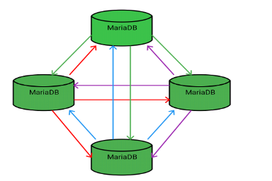

# What is MariaDB Galera Cluster?

The most recent release of [MariaDB 11.4](https://app.gitbook.com/s/aEnK0ZXmUbJzqQrTjFyb/mariadb-community-server-release-notes/mariadb-11-4-series) is: [**MariaDB 11.4.5**](https://app.gitbook.com/s/aEnK0ZXmUbJzqQrTjFyb/mariadb-community-server-release-notes/mariadb-11-4-series/mariadb-11-4-5-release-notes) Stable (GA) [Download Now](https://mariadb.com/downloads/) [_Alternate download from mariadb.org_](https://downloads.mariadb.org/mariadb/11.4.5/)

_MariaDB Galera Cluster is a Linux-exclusive, multi-primary cluster designed for MariaDB, offering features such as active-active topology, read/write capabilities on any node, automatic membership and node joining, true parallel replication at the row level, and direct client connections, with an emphasis on the native MariaDB experience._

## About

MariaDB Galera Cluster is a [virtually synchronous](about-galera-replication.md) multi-primary cluster for MariaDB. It is available on Linux only and only supports the [InnoDB storage engine](https://app.gitbook.com/s/SsmexDFPv2xG2OTyO5yV/server-usage/storage-engines/innodb/innodb-storage-engine-introduction) (although there is experimental support for [MyISAM](https://app.gitbook.com/s/SsmexDFPv2xG2OTyO5yV/server-usage/storage-engines/myisam-storage-engine) and, from [MariaDB 10.6](https://app.gitbook.com/s/aEnK0ZXmUbJzqQrTjFyb/mariadb-community-server-release-notes/mariadb-10-6-series), [Aria](https://app.gitbook.com/s/SsmexDFPv2xG2OTyO5yV/reference/storage-engines/aria). See the [wsrep\_replicate\_myisam](../reference/galera-cluster-system-variables.md#wsrep_replicate_myisam) system variable, or, from [MariaDB 10.6](https://app.gitbook.com/s/aEnK0ZXmUbJzqQrTjFyb/mariadb-community-server-release-notes/mariadb-10-6-series), the [wsrep\_mode](../reference/galera-cluster-system-variables.md#wsrep_mode) system variable.

## Features

* [Virtually synchronous replication](about-galera-replication.md)
* Active-active multi-primary topology
* Read and write to any cluster node
* Automatic membership control: failed nodes drop from the cluster
* Automatic node joining
* True parallel replication, on row level
* Direct client connections, native MariaDB look & feel

## Benefits

The above features yield several benefits for a DBMS clustering solution, including:

* No replica lag
* No lost transactions
* Read scalability
* Smaller client latencies

The [Getting Started with MariaDB\
Galera Cluster](../galera-management/getting-started-with-mariadb-galera-cluster.md) page has instructions on how to get up and running with MariaDB Galera Cluster.

A great resource for Galera users is [Codership on Google Groups](https://groups.google.com/forum/?fromgroups#!forum/codership-team) (_`codership-team`_ _`'at'`_ _`googlegroups`_ _`(dot)`_ _`com`_) - If you use Galera, it is recommended you subscribe.

## Galera Versions

MariaDB Galera Cluster is powered by:

* MariaDB Server.
* The [Galera wsrep provider library](https://github.com/codership/galera/).

The functionality of MariaDB Galera Cluster can be obtained by installing the standard MariaDB Server packages and the [Galera wsrep provider library](https://github.com/codership/galera/) package. The following [Galera](https://github.com/mariadb-corporation/docs-server/blob/test/kb/en/galera/README.md) version corresponds to each MariaDB Server version:

* In [MariaDB 10.4](https://app.gitbook.com/s/aEnK0ZXmUbJzqQrTjFyb/mariadb-community-server-release-notes/old-releases/release-notes-mariadb-10-4-series/what-is-mariadb-104) and later, MariaDB Galera Cluster uses [Galera](https://github.com/mariadb-corporation/docs-server/blob/test/kb/en/galera/README.md) 4. This means that the wsrep API version is 26 and the [Galera wsrep provider library](https://github.com/codership/galera/) is version 4.X.
* In [MariaDB 10.3](https://app.gitbook.com/s/aEnK0ZXmUbJzqQrTjFyb/mariadb-community-server-release-notes/old-releases/release-notes-mariadb-10-3-series/what-is-mariadb-103) and before, MariaDB Galera Cluster uses [Galera](https://github.com/mariadb-corporation/docs-server/blob/test/kb/en/galera/README.md) 3. This means that the wsrep API is version 25 and the [Galera wsrep provider library](https://github.com/codership/galera/) is version 3.X.

See [Deciphering Galera Version Numbers](https://galeracluster.com/library/documentation/versioning-information.html/) for more information about how to interpret these version numbers.

### Galera 4 Versions

The following table lists each version of the [Galera](https://github.com/mariadb-corporation/docs-server/blob/test/kb/en/galera/README.md) 4 wsrep provider, and it lists which version of MariaDB each one was first released in. If you would like to install [Galera](https://github.com/mariadb-corporation/docs-server/blob/test/kb/en/galera/README.md) 4 using [yum](https://app.gitbook.com/s/SsmexDFPv2xG2OTyO5yV/server-management/install-and-upgrade-mariadb/installing-mariadb/binary-packages/rpm/yum), [apt](https://app.gitbook.com/s/SsmexDFPv2xG2OTyO5yV/server-management/install-and-upgrade-mariadb/installing-mariadb/troubleshooting-installation-issues/installation-issues-on-debian-and-ubuntu/apt-upgrade-fails-but-the-database-is-running), or [zypper](https://app.gitbook.com/s/SsmexDFPv2xG2OTyO5yV/server-management/install-and-upgrade-mariadb/installing-mariadb/binary-packages/rpm/installing-mariadb-with-zypper), then the package is called `galera-4`.

| Galera Version | Released in MariaDB Version                                                                                                                                                                                                                                                                                                                                                                                                                                                                                                                                                                                                                                                                                                                                                                                                                                                                                                                                                                                                                                                                                                                                                                                                                                                                                                                                       |
| -------------- | ----------------------------------------------------------------------------------------------------------------------------------------------------------------------------------------------------------------------------------------------------------------------------------------------------------------------------------------------------------------------------------------------------------------------------------------------------------------------------------------------------------------------------------------------------------------------------------------------------------------------------------------------------------------------------------------------------------------------------------------------------------------------------------------------------------------------------------------------------------------------------------------------------------------------------------------------------------------------------------------------------------------------------------------------------------------------------------------------------------------------------------------------------------------------------------------------------------------------------------------------------------------------------------------------------------------------------------------------------------------- |
| 26.4.21        | [11.8.1](https://app.gitbook.com/s/aEnK0ZXmUbJzqQrTjFyb/mariadb-community-server-release-notes/mariadb-11-8-series/mariadb-11-8-1-release-notes), [11.7.2](https://app.gitbook.com/s/aEnK0ZXmUbJzqQrTjFyb/mariadb-community-server-release-notes/old-releases/mariadb-11-7-rolling-releases/mariadb-11-7-2-release-notes), [11.4.5](https://app.gitbook.com/s/aEnK0ZXmUbJzqQrTjFyb/mariadb-community-server-release-notes/mariadb-11-4-series/mariadb-11-4-5-release-notes), [10.11.11](https://app.gitbook.com/s/aEnK0ZXmUbJzqQrTjFyb/mariadb-community-server-release-notes/mariadb-10-11-series/mariadb-10-11-11-release-notes), [10.6.21](https://app.gitbook.com/s/aEnK0ZXmUbJzqQrTjFyb/mariadb-community-server-release-notes/mariadb-10-6-series/mariadb-10-6-21-release-notes), [10.5.28](https://app.gitbook.com/s/aEnK0ZXmUbJzqQrTjFyb/mariadb-community-server-release-notes/mariadb-10-5-series/mariadb-10-5-28-release-notes)                                                                                                                                                                                                                                                                                                                                                                                                                        |
| 26.4.20        | [11.7.1](https://app.gitbook.com/s/aEnK0ZXmUbJzqQrTjFyb/mariadb-community-server-release-notes/old-releases/mariadb-11-7-rolling-releases/mariadb-11-7-1-release-notes), [11.6.2](https://app.gitbook.com/s/aEnK0ZXmUbJzqQrTjFyb/mariadb-community-server-release-notes/old-releases/release-notes-mariadb-11-6-rolling-releases/mariadb-11-6-2-release-notes), [11.4.4](https://app.gitbook.com/s/aEnK0ZXmUbJzqQrTjFyb/mariadb-community-server-release-notes/mariadb-11-4-series/mariadb-11-4-4-release-notes), [11.2.6](https://app.gitbook.com/s/aEnK0ZXmUbJzqQrTjFyb/mariadb-community-server-release-notes/old-releases/release-notes-mariadb-11-2-series/mariadb-11-2-6-release-notes), [10.11.10](https://app.gitbook.com/s/aEnK0ZXmUbJzqQrTjFyb/mariadb-community-server-release-notes/mariadb-10-11-series/mariadb-10-11-10-release-notes), [10.6.20](https://app.gitbook.com/s/aEnK0ZXmUbJzqQrTjFyb/mariadb-community-server-release-notes/mariadb-10-6-series/mariadb-10-6-20-release-notes), [10.5.27](https://app.gitbook.com/s/aEnK0ZXmUbJzqQrTjFyb/mariadb-community-server-release-notes/mariadb-10-5-series/mariadb-10-5-27-release-notes)                                                                                                                                                                                                      |
| 26.4.19        | [11.4.3](https://app.gitbook.com/s/aEnK0ZXmUbJzqQrTjFyb/mariadb-community-server-release-notes/mariadb-11-4-series/mariadb-11-4-3-release-notes), [11.2.5](https://app.gitbook.com/s/aEnK0ZXmUbJzqQrTjFyb/mariadb-community-server-release-notes/old-releases/release-notes-mariadb-11-2-series/mariadb-11-2-5-release-notes), [11.1.6](https://app.gitbook.com/s/aEnK0ZXmUbJzqQrTjFyb/mariadb-community-server-release-notes/old-releases/release-notes-mariadb-11-1-series/mariadb-11-1-6-release-notes), [10.11.9](https://app.gitbook.com/s/aEnK0ZXmUbJzqQrTjFyb/mariadb-community-server-release-notes/mariadb-10-11-series/mariadb-10-11-9-release-notes), [10.6.19](https://app.gitbook.com/s/aEnK0ZXmUbJzqQrTjFyb/mariadb-community-server-release-notes/mariadb-10-6-series/mariadb-10-6-19-release-notes), [10.5.26](https://app.gitbook.com/s/aEnK0ZXmUbJzqQrTjFyb/mariadb-community-server-release-notes/mariadb-10-5-series/mariadb-10-5-26-release-notes)                                                                                                                                                                                                                                                                                                                                                                                           |
| 26.4.18        | [11.2.4](https://app.gitbook.com/s/aEnK0ZXmUbJzqQrTjFyb/mariadb-community-server-release-notes/old-releases/release-notes-mariadb-11-2-series/mariadb-11-2-4-release-notes), [11.1.5](https://app.gitbook.com/s/aEnK0ZXmUbJzqQrTjFyb/mariadb-community-server-release-notes/old-releases/release-notes-mariadb-11-1-series/mariadb-11-1-5-release-notes), [11.0.6](https://app.gitbook.com/s/aEnK0ZXmUbJzqQrTjFyb/mariadb-community-server-release-notes/old-releases/release-notes-mariadb-11-0-series/mariadb-11-0-6-release-notes), [10.11.8](https://app.gitbook.com/s/aEnK0ZXmUbJzqQrTjFyb/mariadb-community-server-release-notes/mariadb-10-11-series/mariadb-10-11-8-release-notes), [10.6.18](https://app.gitbook.com/s/aEnK0ZXmUbJzqQrTjFyb/mariadb-community-server-release-notes/mariadb-10-6-series/mariadb-10-6-18-release-notes), [10.5.25](https://app.gitbook.com/s/aEnK0ZXmUbJzqQrTjFyb/mariadb-community-server-release-notes/mariadb-10-5-series/mariadb-10-5-25-release-notes), [10.4.34](https://app.gitbook.com/s/aEnK0ZXmUbJzqQrTjFyb/mariadb-community-server-release-notes/old-releases/release-notes-mariadb-10-4-series/mariadb-10-4-34-release-notes)                                                                                                                                                                                 |
| 26.4.16        | [11.2.2](https://app.gitbook.com/s/aEnK0ZXmUbJzqQrTjFyb/mariadb-community-server-release-notes/old-releases/release-notes-mariadb-11-2-series/mariadb-11-2-2-release-notes), [11.1.3](https://app.gitbook.com/s/aEnK0ZXmUbJzqQrTjFyb/mariadb-community-server-release-notes/old-releases/release-notes-mariadb-11-1-series/mariadb-11-1-3-release-notes), [11.0.4](https://app.gitbook.com/s/aEnK0ZXmUbJzqQrTjFyb/mariadb-community-server-release-notes/old-releases/release-notes-mariadb-11-0-series/mariadb-11-0-4-release-notes), [10.11.6](https://app.gitbook.com/s/aEnK0ZXmUbJzqQrTjFyb/mariadb-community-server-release-notes/mariadb-10-11-series/mariadb-10-11-6-release-notes), [10.10.7](https://app.gitbook.com/s/aEnK0ZXmUbJzqQrTjFyb/mariadb-community-server-release-notes/old-releases/release-notes-mariadb-10-10-series/mariadb-10-10-7-release-notes), [10.6.16](https://app.gitbook.com/s/aEnK0ZXmUbJzqQrTjFyb/mariadb-community-server-release-notes/mariadb-10-6-series/mariadb-10-6-16-release-notes), [10.5.23](https://app.gitbook.com/s/aEnK0ZXmUbJzqQrTjFyb/mariadb-community-server-release-notes/mariadb-10-5-series/mariadb-10-5-23-release-notes), [10.4.32](https://app.gitbook.com/s/aEnK0ZXmUbJzqQrTjFyb/mariadb-community-server-release-notes/old-releases/release-notes-mariadb-10-4-series/mariadb-10-4-32-release-notes) |
| 26.4.14        | [10.10.3](https://app.gitbook.com/s/aEnK0ZXmUbJzqQrTjFyb/mariadb-community-server-release-notes/old-releases/release-notes-mariadb-10-10-series/mariadb-10-10-3-release-notes), [10.9.5](https://app.gitbook.com/s/aEnK0ZXmUbJzqQrTjFyb/mariadb-community-server-release-notes/old-releases/release-notes-mariadb-10-9-series/mariadb-10-9-5-release-notes), [10.8.7](https://app.gitbook.com/s/aEnK0ZXmUbJzqQrTjFyb/mariadb-community-server-release-notes/old-releases/release-notes-mariadb-10-8-series/mariadb-10-8-7-release-notes), [10.7.8](https://app.gitbook.com/s/aEnK0ZXmUbJzqQrTjFyb/mariadb-community-server-release-notes/old-releases/release-notes-mariadb-10-7-series/mariadb-10-7-8-release-notes), [10.6.12](https://app.gitbook.com/s/aEnK0ZXmUbJzqQrTjFyb/mariadb-community-server-release-notes/mariadb-10-6-series/mariadb-10-6-12-release-notes), [10.5.19](https://app.gitbook.com/s/aEnK0ZXmUbJzqQrTjFyb/mariadb-community-server-release-notes/mariadb-10-5-series/mariadb-10-5-19-release-notes), [10.4.28](https://app.gitbook.com/s/aEnK0ZXmUbJzqQrTjFyb/mariadb-community-server-release-notes/old-releases/release-notes-mariadb-10-4-series/mariadb-10-4-28-release-notes)                                                                                                                                                      |
| 26.4.13        | [10.10.2](https://app.gitbook.com/s/aEnK0ZXmUbJzqQrTjFyb/mariadb-community-server-release-notes/old-releases/release-notes-mariadb-10-10-series/mariadb-10-10-2-release-notes), [10.9.4](https://app.gitbook.com/s/aEnK0ZXmUbJzqQrTjFyb/mariadb-community-server-release-notes/old-releases/release-notes-mariadb-10-9-series/mariadb-10-9-4-release-notes), [10.8.6](https://app.gitbook.com/s/aEnK0ZXmUbJzqQrTjFyb/mariadb-community-server-release-notes/old-releases/release-notes-mariadb-10-8-series/mariadb-10-8-6-release-notes), [10.7.7](https://app.gitbook.com/s/aEnK0ZXmUbJzqQrTjFyb/mariadb-community-server-release-notes/old-releases/release-notes-mariadb-10-7-series/mariadb-10-7-7-release-notes), [10.6.11](https://app.gitbook.com/s/aEnK0ZXmUbJzqQrTjFyb/mariadb-community-server-release-notes/mariadb-10-6-series/mariadb-10-6-11-release-notes), [10.5.18](https://app.gitbook.com/s/aEnK0ZXmUbJzqQrTjFyb/mariadb-community-server-release-notes/mariadb-10-5-series/mariadb-10-5-18-release-notes), [10.4.27](https://app.gitbook.com/s/aEnK0ZXmUbJzqQrTjFyb/mariadb-community-server-release-notes/old-releases/release-notes-mariadb-10-4-series/mariadb-10-4-27-release-notes)                                                                                                                                                      |
| 26.4.12        | [10.10.1](https://app.gitbook.com/s/aEnK0ZXmUbJzqQrTjFyb/mariadb-community-server-release-notes/old-releases/release-notes-mariadb-10-10-series/mariadb-10101-release-notes), [10.9.2](https://app.gitbook.com/s/aEnK0ZXmUbJzqQrTjFyb/mariadb-community-server-release-notes/old-releases/release-notes-mariadb-10-9-series/mariadb-1092-release-notes), [10.8.4](https://app.gitbook.com/s/aEnK0ZXmUbJzqQrTjFyb/mariadb-community-server-release-notes/old-releases/release-notes-mariadb-10-8-series/mariadb-1084-release-notes), [10.7.5](https://app.gitbook.com/s/aEnK0ZXmUbJzqQrTjFyb/mariadb-community-server-release-notes/old-releases/release-notes-mariadb-10-7-series/mariadb-1075-release-notes), [10.6.9](https://app.gitbook.com/s/aEnK0ZXmUbJzqQrTjFyb/mariadb-community-server-release-notes/mariadb-10-6-series/mariadb-1069-release-notes), [10.5.17](https://app.gitbook.com/s/aEnK0ZXmUbJzqQrTjFyb/mariadb-community-server-release-notes/mariadb-10-5-series/mariadb-10517-release-notes), [10.4.26](https://app.gitbook.com/s/aEnK0ZXmUbJzqQrTjFyb/mariadb-community-server-release-notes/old-releases/release-notes-mariadb-10-4-series/mariadb-10426-release-notes)                                                                                                                                                                      |
| 26.4.11        | [10.8.1](https://app.gitbook.com/s/aEnK0ZXmUbJzqQrTjFyb/mariadb-community-server-release-notes/old-releases/release-notes-mariadb-10-8-series/mariadb-1081-release-notes), [10.7.2](https://app.gitbook.com/s/aEnK0ZXmUbJzqQrTjFyb/mariadb-community-server-release-notes/old-releases/release-notes-mariadb-10-7-series/mariadb-1072-release-notes), [10.6.6](https://app.gitbook.com/s/aEnK0ZXmUbJzqQrTjFyb/mariadb-community-server-release-notes/mariadb-10-6-series/mariadb-1066-release-notes), [10.5.14](https://app.gitbook.com/s/aEnK0ZXmUbJzqQrTjFyb/mariadb-community-server-release-notes/mariadb-10-5-series/mariadb-10514-release-notes), [10.4.22](https://app.gitbook.com/s/aEnK0ZXmUbJzqQrTjFyb/mariadb-community-server-release-notes/old-releases/release-notes-mariadb-10-4-series/mariadb-10422-release-notes)                                                                                                                                                                                                                                                                                                                                                                                                                                                                                                                               |
| 26.4.9         | [10.6.4](https://app.gitbook.com/s/aEnK0ZXmUbJzqQrTjFyb/mariadb-community-server-release-notes/mariadb-10-6-series/mariadb-1064-release-notes), [10.5.12](https://app.gitbook.com/s/aEnK0ZXmUbJzqQrTjFyb/mariadb-community-server-release-notes/mariadb-10-5-series/mariadb-10512-release-notes), [10.4.21](https://app.gitbook.com/s/aEnK0ZXmUbJzqQrTjFyb/mariadb-community-server-release-notes/old-releases/release-notes-mariadb-10-4-series/mariadb-10421-release-notes)                                                                                                                                                                                                                                                                                                                                                                                                                                                                                                                                                                                                                                                                                                                                                                                                                                                                                     |
| 26.4.8         | [10.6.1](https://app.gitbook.com/s/aEnK0ZXmUbJzqQrTjFyb/mariadb-community-server-release-notes/mariadb-10-6-series/mariadb-1061-release-notes), [10.5.10](https://app.gitbook.com/s/aEnK0ZXmUbJzqQrTjFyb/mariadb-community-server-release-notes/mariadb-10-5-series/mariadb-10510-release-notes), [10.4.19](https://app.gitbook.com/s/aEnK0ZXmUbJzqQrTjFyb/mariadb-community-server-release-notes/old-releases/release-notes-mariadb-10-4-series/mariadb-10419-release-notes)                                                                                                                                                                                                                                                                                                                                                                                                                                                                                                                                                                                                                                                                                                                                                                                                                                                                                     |
| 26.4.7         | [10.5.9](https://app.gitbook.com/s/aEnK0ZXmUbJzqQrTjFyb/mariadb-community-server-release-notes/mariadb-10-5-series/mariadb-1059-release-notes), [10.4.18](https://app.gitbook.com/s/aEnK0ZXmUbJzqQrTjFyb/mariadb-community-server-release-notes/old-releases/release-notes-mariadb-10-4-series/mariadb-10418-release-notes)                                                                                                                                                                                                                                                                                                                                                                                                                                                                                                                                                                                                                                                                                                                                                                                                                                                                                                                                                                                                                                       |
| 26.4.6         | [10.5.7](https://app.gitbook.com/s/aEnK0ZXmUbJzqQrTjFyb/mariadb-community-server-release-notes/mariadb-10-5-series/mariadb-1057-release-notes), [10.4.16](https://app.gitbook.com/s/aEnK0ZXmUbJzqQrTjFyb/mariadb-community-server-release-notes/old-releases/release-notes-mariadb-10-4-series/mariadb-10416-release-notes)                                                                                                                                                                                                                                                                                                                                                                                                                                                                                                                                                                                                                                                                                                                                                                                                                                                                                                                                                                                                                                       |
| 26.4.5         | [10.5.4](https://app.gitbook.com/s/aEnK0ZXmUbJzqQrTjFyb/mariadb-community-server-release-notes/mariadb-10-5-series/mariadb-1054-release-notes), [10.4.14](https://app.gitbook.com/s/aEnK0ZXmUbJzqQrTjFyb/mariadb-community-server-release-notes/old-releases/release-notes-mariadb-10-4-series/mariadb-10414-release-notes)                                                                                                                                                                                                                                                                                                                                                                                                                                                                                                                                                                                                                                                                                                                                                                                                                                                                                                                                                                                                                                       |
| 26.4.4         | [10.5.1](https://app.gitbook.com/s/aEnK0ZXmUbJzqQrTjFyb/mariadb-community-server-release-notes/mariadb-10-5-series/mariadb-1051-release-notes), [10.4.13](https://app.gitbook.com/s/aEnK0ZXmUbJzqQrTjFyb/mariadb-community-server-release-notes/old-releases/release-notes-mariadb-10-4-series/mariadb-10413-release-notes)                                                                                                                                                                                                                                                                                                                                                                                                                                                                                                                                                                                                                                                                                                                                                                                                                                                                                                                                                                                                                                       |
| 26.4.3         | [10.5.0](https://app.gitbook.com/s/aEnK0ZXmUbJzqQrTjFyb/mariadb-community-server-release-notes/mariadb-10-5-series/mariadb-1050-release-notes), [10.4.9](https://app.gitbook.com/s/aEnK0ZXmUbJzqQrTjFyb/mariadb-community-server-release-notes/old-releases/release-notes-mariadb-10-4-series/mariadb-1049-release-notes)                                                                                                                                                                                                                                                                                                                                                                                                                                                                                                                                                                                                                                                                                                                                                                                                                                                                                                                                                                                                                                         |
| 26.4.2         | [10.4.4](https://app.gitbook.com/s/aEnK0ZXmUbJzqQrTjFyb/mariadb-community-server-release-notes/old-releases/release-notes-mariadb-10-4-series/mariadb-1044-release-notes)                                                                                                                                                                                                                                                                                                                                                                                                                                                                                                                                                                                                                                                                                                                                                                                                                                                                                                                                                                                                                                                                                                                                                                                         |
| 26.4.1         | [10.4.3](https://app.gitbook.com/s/aEnK0ZXmUbJzqQrTjFyb/mariadb-community-server-release-notes/old-releases/release-notes-mariadb-10-4-series/mariadb-1043-release-notes)                                                                                                                                                                                                                                                                                                                                                                                                                                                                                                                                                                                                                                                                                                                                                                                                                                                                                                                                                                                                                                                                                                                                                                                         |
| 26.4.0         | [10.4.2](https://app.gitbook.com/s/aEnK0ZXmUbJzqQrTjFyb/mariadb-community-server-release-notes/old-releases/release-notes-mariadb-10-4-series/mariadb-1042-release-notes)                                                                                                                                                                                                                                                                                                                                                                                                                                                                                                                                                                                                                                                                                                                                                                                                                                                                                                                                                                                                                                                                                                                                                                                         |

### Galera 3 Versions

See here for [Galera 3 versions](mariadb-galera-cluster-guide.md#galera-versions).

## See Also

* [Codership on Google Groups](https://groups.google.com/forum/?fromgroups#!forum/codership-team) (`codership-team 'at' googlegroups (dot) com`) - A great mailing list for Galera users.
* [About Galera Replication](about-galera-replication.md)
* [Codership: Using Galera Cluster](https://codership.com/content/using-galera-cluster)
* [Galera Use Cases](../galera-use-cases.md)
* [Getting Started with MariaDB Galera Cluster](../galera-management/getting-started-with-mariadb-galera-cluster.md)
* [MariaDB Galera Cluster - Known Limitations](../galera-management/mariadb-galera-cluster-known-limitations.md)




