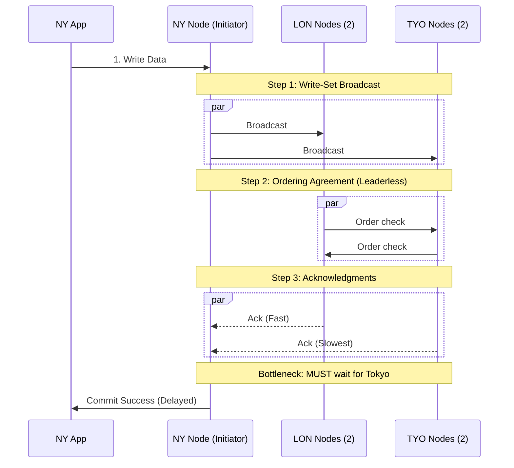
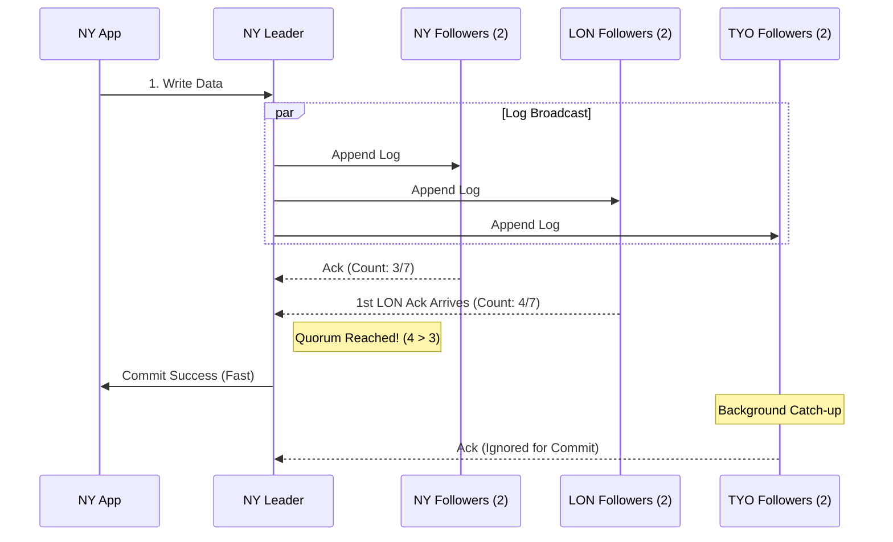

# MariaDB Advanced Cluster: Team FAQ & Architectural Guide


MariaDB Advanced Cluster is currently in Technical Preview. This FAQ is an interim guide. Once the Advanced Cluster reaches General Availability (GA), this page will be redirected to the official comprehensive documentation.


## The Basics

Q: What is the MariaDB Advanced Cluster?&#x20;

MariaDB Advanced Cluster is a new high-availability (HA) database product exclusive to the MariaDB Enterprise portfolio. It replaces traditional synchronous replication (as used in Galera and Enterprise Cluster) with the Raft consensus algorithm. Instead of waiting for every node to acknowledge a write, a transaction is considered "committed" as soon as a majority (quorum) of the nodes safely store the log entry.

Q: What does RAFT stand for?&#x20;

Technically, Raft is not an acronym. Its creators chose the name because it implies "logs" (as in a replicated log) floating safely together to survive failures. However, the engineering community often uses the backronym Reliable, Replicated, Redundant, And Fault-Tolerant to describe its core characteristics.

## The MariaDB Cluster Landscape: Community vs. Enterprise

Q: How do the different clustering products fit into the MariaDB portfolio?&#x20;

Following MariaDB's acquisition of Codership (the creators of Galera), our high-availability product offerings are clearly tiered between community-driven projects and commercial, mission-critical solutions:

* MariaDB Community Server (with Galera Cluster): The open-source community foundation for synchronous high availability. It provides a flexible growth path and standard HA for non-commercial or less rigorous deployments.
* MariaDB Enterprise Cluster: The production-hardened version of Galera, exclusive to the MariaDB Enterprise Platform. It includes [Enterprise-only features](../galera-security/mariadb-enterprise-cluster-security.md) (such as enhanced encryption, non-blocking backups, and comprehensive monitoring) and is optimized for rock-solid stability and zero data loss in mission-critical, localized commercial environments.
* [MariaDB Enterprise Cluster on MariaDB Cloud](https://app.gitbook.com/s/vPz15Lz0Iw3P3yKR3Prd/quickstart/enterprise-cluster): A fully managed DBaaS version of the Enterprise Cluster. Available on the new PowerPlus tier, it integrates Galera with MariaDB MaxScale for intelligent traffic routing, automated failover for app connections, and zero-data-loss protection without the operational overhead.
* [MariaDB Advanced Cluster](https://mariadb.com/resources/blog/redefining-high-availability-introducing-mariadb-advanced-cluster-technical-preview/) (Tech Preview): Powered by the [Raft protocol](https://app.gitbook.com/s/aEnK0ZXmUbJzqQrTjFyb/advanced-cluster/mariadb-advanced-cluster-quickstart-guide#raft-protocol-overview). An entirely new Enterprise-exclusive offering designed specifically for massive scalability, disaster recovery, and data consistency across wide geographic regions.

## The Architecture Question

Q: Is MariaDB Advanced Cluster replacing Galera or MariaDB Enterprise Cluster?&#x20;

MariaDB Advanced Cluster can be seen as the next evolution of Galera Clustering technology. It is aiming to solve the same problems while at the same time addressing some of the issues the existing Galera Cluster solution inherently has due to the nature of the technology. While Galera is the gold standard of local "High Availability", Advanced Cluster allows us to address more complex usage scenarios.

If you are running Community Server, you can continue to use standard Galera. If you are running Enterprise Server or MariaDB Cloud, you have the choice between the Galera-powered MariaDB Enterprise Cluster (for local zero-data-loss) or the Raft-powered MariaDB Advanced Cluster (for global WAN environments).

### Real-World Scenarios: Handling Network Latency

Q: Can you provide an example of how MariaDB Advanced Cluster handles network latency compared to MariaDB Enterprise Cluster?&#x20;

To understand the architectural difference, imagine running a mission-critical web application spanning three distinct geographic locations to ensure disaster recovery. You deploy a 7-node cluster:

* New York (NY): 3 Nodes (Primary App Region)
* London (LON): 2 Nodes (Secondary Region)
* Tokyo (TYO): 2 Nodes (DR Region, highest latency relative to NY)

**Scenario A: The Traditional Galera Way (MariaDB Enterprise Cluster)**

In a Galera-based cluster, data integrity is paramount. Because Galera's virtual synchrony messaging is multi-master and leaderless, all nodes must communicate to agree on the exact ordering of messages. There are three communication steps during which message exchange happens concurrently:

1. The Broadcast: The NY App writes to an NY node. That node immediately broadcasts the write-set to all 6 other nodes simultaneously (NY → LON and NY → TYO).
2. The Ordering Agreement: Because anyone could be writing at the same time, LON and TYO must also communicate with each other (LON → TYO and TYO → LON) to agree on the message order.
3. The Bottleneck: The initiating NY node must wait to receive acknowledgments from every single node in the cluster (LON → NY and TYO → NY). It is forced to wait for the slowest communication hops (Tokyo).
4. The Commit: Only after Tokyo finally responds does the transaction commit.

Result: Your application's write performance in New York is directly tied to your worst-case network latency and the complex ordering hops to Tokyo.

**Scenario B: The MariaDB Advanced Cluster Way (Using Raft)**

With the Advanced Cluster using Raft, the mechanics change to prioritize consensus over total unanimity.

1. The Quorum Calculation: In a 7-node cluster, a majority is 4 nodes.
2. The Write: The NY App sends the write to the cluster's elected Leader (in NY).
3. The Log & Broadcast: The Leader appends the data to its log and broadcasts it to the 6 Followers.
4. The Race: The Leader has the data (Count: 1). The 2 other NY nodes respond instantly (Count: 3).
5. The Commit: The moment the Leader sees the first acknowledgment from either of the London nodes, the count hits 4. Quorum is achieved, and it immediately commits the transaction.
6. The Catch-up: Tokyo (and the second London node) eventually receive the data and acknowledge it later, but the application already moved on.

Result: The Leader completely ignores the latency of the furthest outlier (Tokyo). Your application's write performance is decoupled from your worst-case network scenario.

## Specification Comparison: Galera vs. Raft

Q: When should we use Galera vs. Advanced Cluster (Raft)?

Understanding the mechanical differences makes it clear why these technologies serve different environments.

| Specification         | Galera Cluster (Community & Enterprise)                                                | MariaDB Advanced Cluster (Raft)                                                                   |
| --------------------- | -------------------------------------------------------------------------------------- | ------------------------------------------------------------------------------------------------- |
| Target Audience       | Community users (Standard) / Enterprise users (Mission-critical localized HA)          | Enterprise users (Geo-distributed / High-latency networks)                                        |
| Replication Mechanism | Certification-Based: Broadcasts "write-sets" certified globally by all nodes.          | Log-Based Consensus: Leader appends writes to a log, commits on majority agreement.               |
| Node Roles            | True Multi-Primary: Every active node is equal; read/write to any node simultaneously. | Single-Leader: Strict Leader-Follower hierarchy coordinates all writes to ensure strict ordering. |
| Commit Rule           | Synchronous: Commits only when all active nodes acknowledge (zero data loss).          | Quorum (Majority): Commits when (N/2)+1 nodes acknowledge.                                        |
| Network Penalty       | Bounded by the slowest node or network link.                                           | Bounded by the closest majority of nodes.                                                         |

### **Key Performance Advantages (Advanced Cluster Use Cases)**

Because of these architectural differences, MariaDB Advanced Cluster clearly outperforms Enterprise Cluster in several specific scenarios:

1. Geo-Distributed Replicas: When nodes are spread across vast distances, Advanced Cluster is significantly faster. Why? Because its single-leader, log-based consensus model completely eliminates the need for the complex, multi-directional transaction certification and ordering agreements required by Galera.
2. Slower or Degrading Hardware: Advanced Cluster is highly resilient to localized performance degradation. Why? Because it only requires a majority to commit. If a single machine experiences a CPU spike, disk latency, or a degrading network link, the Leader simply commits using the faster majority, never waiting for the slowest machine to catch up.

## Operations, Fault Tolerance, and Leader Election

Q: How does fault tolerance and recovery work in the Advanced Cluster?

Raft achieves fault tolerance through an automated leader election process. Because it relies on a quorum, a Raft cluster can safely tolerate the loss of up to $\frac{N-1}{2}$ nodes. For example, a 7-node cluster can lose 3 nodes and remain fully operational, with no risk of split-brain scenarios.

Q: Exactly how is a new Leader elected if the current one fails?

The Raft consensus algorithm handles leader elections automatically and rapidly using "heartbeats" and randomized timers:

1. The Trigger (Election Timeout): All Follower nodes expect constant, periodic "heartbeat" messages from the Leader. If a Follower stops receiving these heartbeats, it assumes the Leader has crashed.
2. The Campaign: That Follower immediately promotes itself to a "Candidate" state, votes for itself, and broadcasts a message to all other nodes asking for their votes.
3. The Vote: The other Follower nodes will evaluate the request. They will vote for the Candidate as long as that Candidate's data log is at least as up-to-date as their own, and they haven't already voted in this cycle.
4. The Result: If the Candidate receives "yes" votes from a majority of the cluster, it officially becomes the new Leader.
5. Preventing Ties: To prevent multiple nodes from campaigning at the exact same millisecond, Raft assigns a randomized election timeout to every node.

\
 
