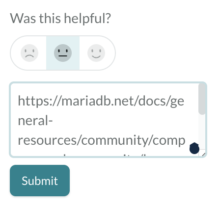

# Reporting Documentation Issues

## Bug Reports

If you find issues in the documentation, please report them:

1. Report only **one issue per request**. If you find multiple issues, report them one by one. \
   Only report documentation issues, not software issues or software help requests.
2. Provide the **URL of the page** that has an issue, for example [https://mariadb.net/docs/general-resources/community/company-and-community/bug-tracking/reporting-documentation-bugs](https://mariadb.net/docs/general-resources/community/company-and-community/bug-tracking/reporting-documentation-bugs).\
   :information\_source: When **reporting via the rating system**, the URL of the page you're on will be automatically be included in your response, so there's **no need to include the URL**.
3. Indicate the **nature of the issue**:
   1. **Typo**, for example "known bucks should be known bugs".
   2. **Wrong** information. Provide details of what's wrong. Ideally, point out what the right information should be.
   3. **Missing** information. Provide details of what's missing.
   4. **Unclear** information. Provide details of what's unclear. Ideally, provide a clarification.

## Reporting Channels

Use one of the following channels to report documentation issues. Please don't report software issues via those channels — instructions for doing that are [on this page](../../community/community/bug-tracking/reporting-bugs.md).

<figure><figcaption></figcaption></figure>

### Rating system in the right sidebar

This is a super quick way to provide feedback or report issues in the documentation. However, it's one-way communication — we can't provide feedback to you, since we don't know who you are. :innocent:\
:information\_source: Don't paste the URL of the page you're reporting from, since it will automatically be included.

### MariaDB Community Slack

Join the `#documentation` channel in [MariaDB Community Slack](https://r.mariadb.com/join-community-slack). This allows for more detailed feedback or reports, and naturally provides two-way communication.

_This page is licensed: CC BY-SA / Gnu FDL_


