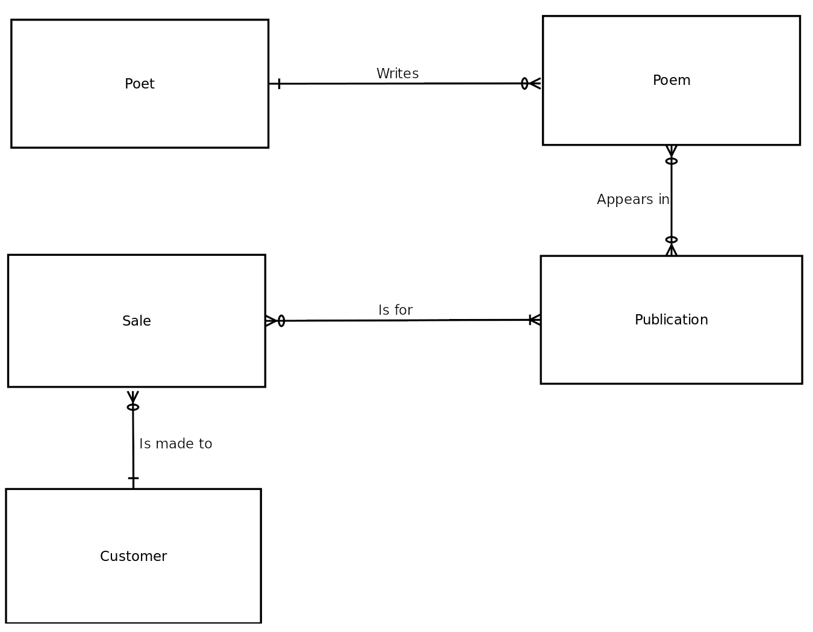
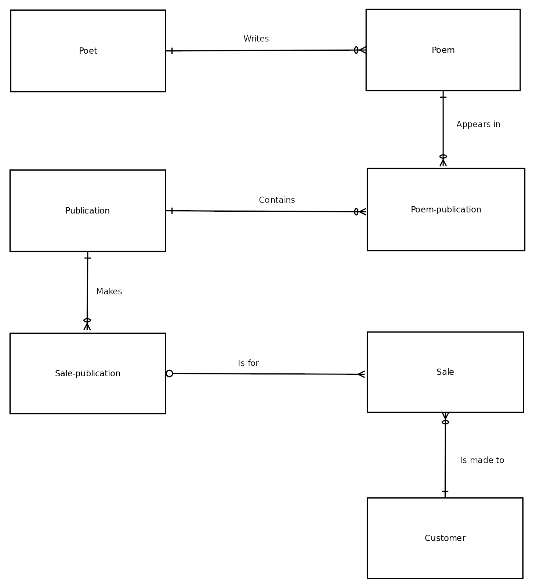

# Database Design Example Phase 2: Design

This article follows on from [Database Design Example Phase 1: Analysis](database-design-example-phase-1-analysis.md).

Based on the provided information, you can begin your logical design and should be able to identify the initial entities:

* Poet
* Poem
* Publication
* Sale
* Customer

The Poet's Circle is not an entity, or even of instance an a _publisher_ entity. Only if the system were developed for many publishers would _publisher_ be a valid entity.

Neither _website_ nor _poetry community_ are entities. There is only one website, and anyway, a website is merely a means of producing data to populate the database. There is also only one poetry community as far as this system is concerned, and there is not much you'd want to store about it.

Next, you need to determine the relationship between these entities. You can identify the following:

* A poet can write many poems. The analysis identified the fact that a poet can be stored in the system even if there are no associated poems. Poems may be captured at a later point in time, or the poet may still be a potential poet. Conversely, many poets could conceivably write a poem, though the poem must have been written by at least one poet.
* A publication may contain many poems (an anthology) or just one. It can also contain no poems (poetry criticism for example). A poem may or may not appear in a publication.
* A sale must be for at least one publication, but it may be for many. A publication may or may not have made any sales.
* A customer may be made for many sales, or none at all. A sale is only made for one and only one customer.

You can identify the following attributes:

* Poet: first name, surname, address, email address
* Poem: poem title, poem contents
* Publication: title, price
* Sales: date, amount
* Customer: first name, surname, address, email address

Based on these entities and relationships, you can construct the entity-relationship diagram shown below:

There are two many-to-many relationships in the figure above. These need to be converted into one-to-many relationships before you can implement them in a DBMS. After doing so, the intersection entities _poem-publication_ and _sale-publication_ are created.

Now, to begin the logical and physical design, you need to add attributes that can create the relationship between the entities and specify primary keys. You do what's usually best, and create new, unique, primary keys. The following tables show the structures for the tables created from each of the entities:

#### Poet table

| Field         | Definition           |
| ------------- | -------------------- |
| poet code     | primary key, integer |
| first name    | character (30)       |
| surname       | character (40)       |
| address       | character (100)      |
| postcode      | character (20)       |
| email address | character (254)      |

#### Poem table

| Field         | Definition           |
| ------------- | -------------------- |
| poem code     | primary key, integer |
| poem title    | character(50)        |
| poem contents | text                 |
| poet code     | foreign key, integer |

#### Poem-publication table

| Field            | Definition                              |
| ---------------- | --------------------------------------- |
| poem code        | joint primary key, foreign key, integer |
| publication code | joint primary key, foreign key, integer |

#### Publication table

| Field            | Definition           |
| ---------------- | -------------------- |
| publication code | primary key, integer |
| title            | character(100)       |
| price            | numeric(5.2)         |

#### Sale-publication table

| Field            | Definition                              |
| ---------------- | --------------------------------------- |
| sale code        | joint primary key, foreign key, integer |
| publication code | joint primary key, foreign key, integer |

#### Sale table

| Field         | Definition           |
| ------------- | -------------------- |
| sale code     | primary key, integer |
| date          | date                 |
| amount        | numeric(10.2)        |
| customer code | foreign key, integer |

#### Customer table

| Field         | Definition           |
| ------------- | -------------------- |
| customer code | primary key, integer |
| first name    | character (30)       |
| surname       | character (40)       |
| address       | character (100)      |
| postcode      | character (20)       |
| email address | character (254)      |

MariaDB will have no problem with this, and is selected as the DBMS. Existing hardware and operating system platforms are also selected. The following section looks at the implementation and the SQL statements used to create the MariaDB tables.

_This page is licensed: CC BY-SA / Gnu FDL_


