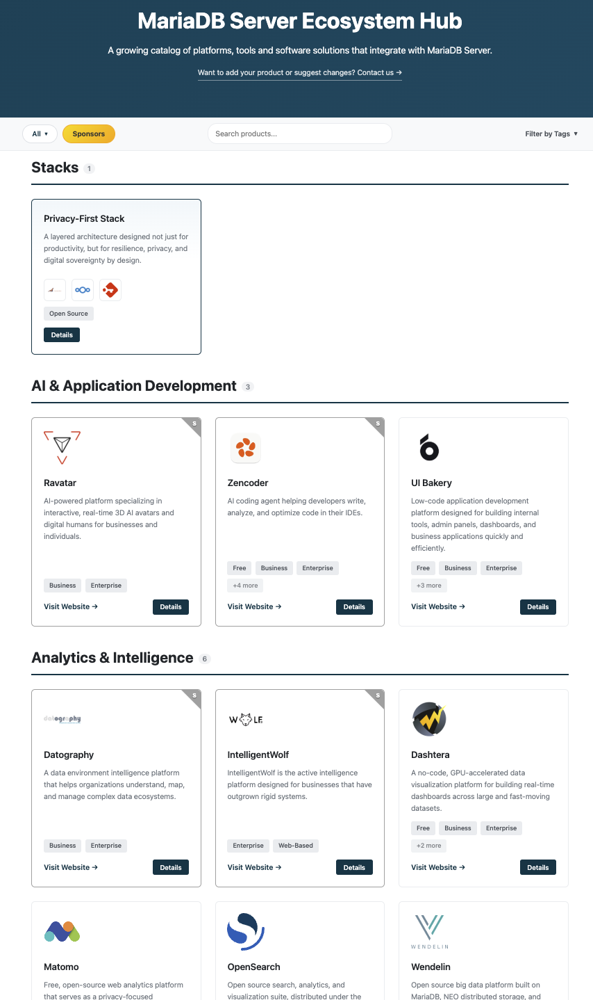

# MariaDB Server Ecosystem Hub

## MariaDB Server Ecosystem Hub and Solution Stacks

Technology buyers and builders increasingly make decisions at the solution and architecture level. They usually do not start by evaluating individual components in isolation. They start with a problem they need to solve, an architecture they need to build, or an operational requirement they need to meet. MariaDB Foundation wants MariaDB Server and its ecosystem partners to be clearly visible and chosen in these decision processes. The MariaDB Server Ecosystem Hub is a curated discovery platform for technologies, services, tools, applications, and providers that work with MariaDB Server. It helps users discover the partners, tools, and services that can support MariaDB-based solutions. MariaDB Server Solution Stacks are developed together with selected ecosystem partners. They show how MariaDB Server, partner technologies, and services can be combined to solve a concrete user problem. Solution Stacks create a use-case-driven path from user need to practical architecture, and from practical architecture to the partners who can help deliver it. For sponsors, the value is demand generation through relevant positioning. The MariaDB Server Ecosystem Hub and Solution Stacks help reach existing MariaDB users as well as new audiences who are looking for solutions to specific problems, not necessarily for MariaDB or any individual partner. By presenting MariaDB Server and partner technologies as part of a practical answer to those problems, these initiatives create a path from user need to architecture, and from architecture to the sponsors and partners who can help deliver it.

## MariaDB Server Ecosystem Hub



The MariaDB Server Ecosystem Hub is a curated discovery layer for the MariaDB Server ecosystem. Its purpose is to make the ecosystem visible, navigable, and useful for people looking for practical MariaDB-based solutions. The Hub helps users discover the partners, tools, services, applications, and platforms that can support MariaDB Server in real-world deployments. It connects MariaDB Server to the surrounding ecosystem needed to build and deliver complete solutions. For users, the Hub answers a practical question: who and what can help me succeed with MariaDB Server? For partners and sponsors, the Hub creates structured visibility inside the MariaDB Server ecosystem. It helps users identify which companies, tools, services, and platforms are relevant to MariaDB-based projects. The Hub also serves as an entry point for deeper collaboration, including Solution Stacks, joint content, events, technical initiatives, and co-marketing activities.



<figure><figcaption></figcaption></figure>



## MariaDB Server Solution Stacks

MariaDB Server Solution Stacks are partner-developed reference architectures built around concrete user problems. Each Solution Stack shows how MariaDB Server and selected partner technologies can be combined into a practical solution. The goal is to create a clear path from user need to architecture, and from architecture to the partners who can help deliver it. In practice, each Solution Stack is built around a dedicated landing page that acts as the anchor for ongoing joint activity. The page can collect the reference architecture, participating partners, use case description, technical guidance, blogs, webinars, event materials, social media content, and other related resources developed over time. This allows each stack to become more than a single announcement. It becomes a coordinated campaign that MariaDB Foundation and participating partners can continue to use throughout the year in outreach, events, newsletters, social media, technical content, and sponsor discussions. A Solution Stack may include a use case definition, participating partners, an architecture diagram, deployment or configuration guidance, and joint content. For partners and sponsors, this creates demand-oriented positioning. Instead of being presented as separate vendors, they become part of a concrete solution story that can reach both existing MariaDB users and new audiences searching for answers to specific problems.

In summary, MariaDB Server Ecosystem Hub and Solution Stacks give MariaDB Foundation a practical model for building demand together with ecosystem partners. The Hub makes the MariaDB Server ecosystem discoverable and gives users a structured way to find relevant partners, tools, services, applications, and platforms. Solution Stacks turn selected partner combinations into problem-led reference architectures and campaign anchors. Together, they help move users from a concrete need to a practical architecture, and from that architecture to the companies that can help implement, operate, or support the solution. For sponsors and partners the value is being positioned in front of relevant audiences through useful, problem-led content that can generate qualified awareness, traffic, and potential user/customer demand. For users, the value is clarity. They can see where MariaDB Server fits, which partners are involved, and how the solution can be used in practice.

## Where's the Hub?

Find the MariaDB Ecosystem Hub here: [https://ecohub.mariadb.org](https://ecohub.mariadb.org/)

## What You'll Find in the Hub

The Hub is organized into categories, each answering a practical question about building and running MariaDB-based solutions.

* [Solution Stacks](https://ecohub.mariadb.org/solution-stacks) — curated multi-product stacks combining MariaDB with complementary open-source tools.
* [AI & Application Development](https://ecohub.mariadb.org/ai-application-development) — frameworks, platforms, and tools for building AI-powered and data-driven applications with MariaDB. This is where to look if you're building RAG, semantic search, or agent-based applications on MariaDB Vector: LLM framework integrations (LangChain, LlamaIndex, Spring AI, LangChain4j, LangChain.js), the official MariaDB MCP Server for connecting AI agents to your data, ORM and framework vector support (Laravel, TypeORM), and runnable RAG examples.
* [Cloud & Hosting Platforms](https://ecohub.mariadb.org/cloud-hosting) — cloud providers and managed hosting platforms with MariaDB support, from hyperscalers to specialized and sovereignty-focused providers.
* [Connectivity](https://ecohub.mariadb.org/connectivity) — drivers, connectors, and middleware for connecting applications to MariaDB, across languages and environments.
* [Database Management & Visualization](https://ecohub.mariadb.org/database-management) — GUI tools and platforms for managing, querying, and visualizing MariaDB databases.
* [Monitoring & Performance](https://ecohub.mariadb.org/monitoring-perf) — monitoring, observability, and performance tuning tools for MariaDB deployments.
* [DevOps](https://ecohub.mariadb.org/devops) — infrastructure, orchestration, and automation tools with MariaDB integration.
* [Local Development Environment](https://ecohub.mariadb.org/local-dev-env) — tools for running MariaDB locally during development.
* [Benchmark & Testing](https://ecohub.mariadb.org/benchmark-testing) — tools for benchmarking, load testing, and evaluating MariaDB performance.
* [Plugins](https://ecohub.mariadb.org/plugins) — MariaDB Server plugins extending functionality with additional storage engines, authentication methods, encryption, and more.
* [Analytics & Intelligence](https://ecohub.mariadb.org/analytics-intelligence) — business intelligence, data visualization, and analytics platforms that connect to MariaDB.
* [Content Management Systems](https://ecohub.mariadb.org/cms) — CMS platforms that use or support MariaDB as a database backend.
* [E-Commerce](https://ecohub.mariadb.org/ecommerce) — e-commerce platforms and frameworks that support MariaDB as a database backend.
* [CRM & ERP](https://ecohub.mariadb.org/crm-erp) — customer relationship management and enterprise resource planning systems built on or compatible with MariaDB.
* [Storage & Collaboration](https://ecohub.mariadb.org/storage-collab) — file storage and team collaboration platforms that use MariaDB as a backend.
* [Specialized Applications](https://ecohub.mariadb.org/specialized-apps) — domain-specific and vertical software solutions that use MariaDB as their database backend.
* [Password & Secret Management](https://ecohub.mariadb.org/password-management) — tools for managing credentials and secrets in environments that include MariaDB.
* [Education & Practice](https://ecohub.mariadb.org/education-practice) — learning resources, sandboxes, and practice environments for MariaDB.
* [Support & Services](https://ecohub.mariadb.org/support-services) — professional services, consultancies, and support providers specializing in MariaDB.
