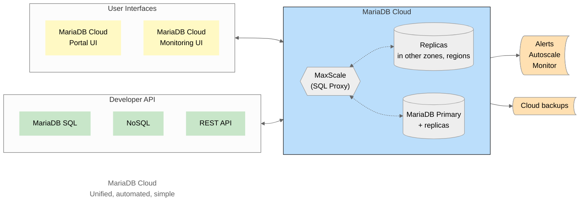

# MariaDB Cloud

## Overview

MariaDB Cloud (previously called SkySQL) is an AI-driven, fully managed Database-as-a-Service (DBaaS), designed to deploy MariaDB and MySQL-compatible workloads across diverse environments including multiple data centers, regions, and cloud providers. It now offers both traditional provisioned and serverless deployment options, catering to a wide range of use cases and workload patterns while preventing over-provisioning. With the addition of the no-code AI Agent builder, developers can easily provide natural language interfaces to their end users to ask questions of the data without SQL expertise.

Originally developed by [MariaDB](http://mariadb.com), MariaDB Cloud is aimed to be the most comprehensive cloud platform for MariaDB. Its robust feature set is the result of years of insights gathered from hundreds of customers running mission-critical workloads.&#x20;

MariaDB Cloud provides MariaDB and MySQL-compatible workloads with enterprise-grade and production-ready features:

* [Serverless deployment for instant autoscaling](broken-reference)
* [Integrated AI agents for database interaction](cloud-ai/copilot-guide.md)
* [Automated complex database configurations](cloud-management/config/)
* [Cloud-native capabilities with auto-scaling](cloud-management/autonomously-scale-compute-storage.md)
* [Global replication](<High Availability, DR/Setup Global Replication.md>)
* [Automated backups](cloud-data-handling/backup-and-restore/mariadb-backup.md)
* [Advanced security with end-to-end encryption and private connectivity](Security/)
* Compliance and governance features
* Numerous additional powerful capabilities

## MariaDB Cloud: Autonomous, Resilient, End-to-End Secure

It has:
* Sensible defaults
* Consistent configuration
* MariaDB Cloud DBA

So you can:
* Start small
* Grow to extreme read-scale
* HA with load balancing
* Security by design
* Purpose-built monitoring
* Adapt to any workload

## Key Features of MariaDB Cloud

### Advanced Scalability

* **Serverless Scaling:** Provides near instantaneous scaling from zero to defined upper limit and back down to zero, adapting dynamically to workloads without manual intervention.
* **Intelligent Load Balancing:** Maintains consistency via smart proxy-based load balancing and read-write splitting.
* **Flexible Consistency:** Offers both causal and strong global consistency models.
* **Custom Query Routing:** Allows fine-tuned performance optimization through customizable routing rules.

### Integrated AI Agents

* **Semi Autonomous Agent Builder:** Create domain specific AI agents to ask questions of your data with human in the loop validation via UI interface
* **App Integration:** Embed conversational interfaces into your apps with the associated agent REST API endpoints
* **Built-in Developer and DBA Copilot Agents:** Improves productivity with general MariaDB Cloud questions, query performance tuning, and troubleshooting guidance.

### Global Multi-Cloud Presence

* Available in 40+ regions across AWS, GCP, and Azure, offering unparalleled flexibility and reach.

### Robust High Availability (HA

* **Resilient Infrastructure:** Multi-layered protection across disks, compute, zones/regions, network, and load balancing.
* **Intelligent Proxy through MaxScale:** Ensures seamless failover and monitors replication lag, maintaining service continuity.
* **Rapid Failover:** Employs real-time health checks for swift, automated recovery.

### Disaster Recovery

* **Multi-Region Replication:** Spans across regions and cloud providers for maximum resilience.
* **Flexible External Replication:** Supports custom external replica setups for enhanced redundancy and disaster recovery.

### State-of-the-Art Data Protection

* **Comprehensive Backup Solutions:** Goes beyond nightly backups with incremental, snapshot, and binlog backup options to both MariaDB Cloud and customer-managed storage.
* **Near-Zero RPO:** Achieves minimal data loss with continuous binlog streaming.

### Dynamic Auto-scaling

* **Predictive Scaling:** Anticipates and adjusts storage needs based on usage patterns.
* **Cost-Efficient Scaling:** Proactively scales resources up and down to match demand and optimize costs.

### Fractional DBA Service

* **CloudDBA Service:** Provides access to skilled DBAs for proactive database optimization.
* **Continuous Performance Monitoring:** Ensures peak efficiency through ongoing monitoring and rapid issue resolution.

### Versatile Interoperability

* **Multi-Protocol Support:** Supports both JSON and SQL operations from a single data source.
* **Native MongoDB/MariaDB/MySQL Support:** Seamlessly integrates with existing applications via native MongoDB and MariaDB/MySQL protocol support.

For more detailed information, you can refer to this [blog post](https://skysql.com/2024/03/12/optimizing-database-resilience-and-cost-a-deep-dive-into-skysqls-unique-features/).
