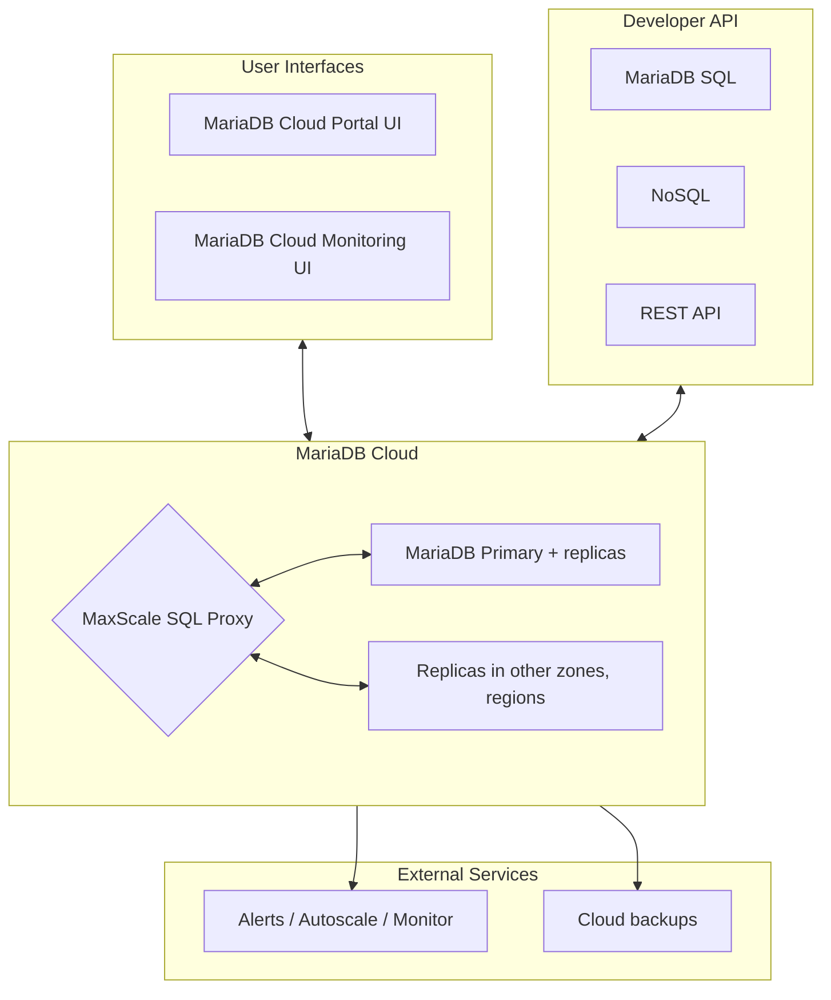

# MariaDB Cloud

## Overview

MariaDB Cloud (previously called SkySQL) is an AI-driven, fully managed Database-as-a-Service (DBaaS), designed to deploy MariaDB and MySQL-compatible workloads across diverse environments including multiple data centers, regions, and cloud providers. It now offers both traditional provisioned and serverless deployment options, catering to a wide range of use cases and workload patterns while preventing over-provisioning. With the addition of the no-code AI Agent builder, developers can easily provide natural language interfaces to their end users to ask questions of the data without SQL expertise.

Originally developed by [MariaDB](http://mariadb.com), MariaDB Cloud is aimed to be the most comprehensive cloud platform for MariaDB. Its robust feature set is the result of years of insights gathered from hundreds of customers running mission-critical workloads.

MariaDB Cloud provides MariaDB and MySQL-compatible workloads with enterprise-grade and production-ready features:

* [Serverless deployment for instant autoscaling](readme/serverless.md#intelligent-scaling)
* [Integrated AI agents for database interaction](cloud-ai/copilot-guide.md)
* [Automated complex database configurations](cloud-management/config/)
* [Cloud-native capabilities with auto-scaling](cloud-management/autonomously-scale-compute-storage.md)
* [Global replication](high-availability-dr/setup-global-replication.md)
* [Automated backups](cloud-data-handling/backup-and-restore/mariadb-backup.md)
* [Advanced security with end-to-end encryption and private connectivity](security/)
* Compliance and governance features
* Numerous additional powerful capabilities

## MariaDB Cloud: Autonomous, Resilient, End-to-End Secure

It has:

* Sensible defaults
* Consistent configuration
* MariaDB Remote DBA

So you can:

* Start small
* Grow to extreme read-scale
* HA with load balancing
* Security by design
* Purpose-built monitoring
* Adapt to any workload

```mermaid
graph TD
    subgraph UI [User Interfaces]
        Portal[MariaDB Cloud Portal UI]
        MonitorUI[MariaDB Cloud Monitoring UI]
    end

    subgraph API [Developer API]
        SQL[MariaDB SQL]
        NoSQL[NoSQL]
        REST[REST API]
    end

    subgraph Cloud [MariaDB Cloud]
        MaxScale{MaxScale SQL Proxy}
        Primary[MariaDB Primary + replicas]
        Replicas[Replicas in other zones, regions]
    end

    subgraph External [External Services]
        Alerts[Alerts / Autoscale / Monitor]
        Backups[Cloud backups]
    end

    %% Entry points at the top
    UI <--> Cloud
    API <--> Cloud
    
    %% Internal Cloud Logic
    MaxScale <--> Primary
    MaxScale <--> Replicas
    
    %% Force External Services to the bottom
    Cloud ~~~ External
    Cloud --> Alerts
    Cloud --> Backups
```

## See Also

* [MariaDB Cloud Datasheet](https://mariadb.com/resources/datasheets/mariadb-cloud/)
