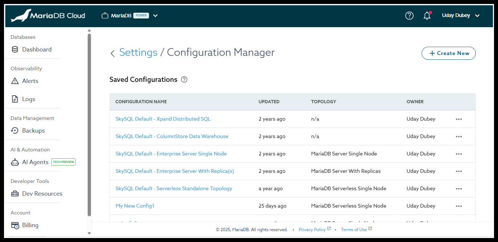

# Configuring Database Servers

Database server configuration, including system variables, is managed through the Configuration Manager.

<figure><figcaption></figcaption></figure>

_Configuration Manager_

## **Access to Configuration Manager**

To access the Configuration Manager interface:

1. Log in to the [Portal](https://app.skysql.com/dashboard).
2. Select <kbd>Settings</kbd> in the sidebar.
3. Select <kbd>Configuration Manager</kbd>.

After selecting Configuration Manager, you will be sent to the Saved Configuration page, where you can view, create, and manage configuration templates for various MariaDB cloud topologies.

## **What is Configurable?**

Available configuration parameters differ by cloud database topology.


[mariadb-serverless-single-node.md](mariadb-serverless-single-node.md)



[mariadb-server-single-node.md](mariadb-server-single-node.md)



[mariadb-server-with-replica-s.md](mariadb-server-with-replica-s.md)



[maxscale.md](maxscale.md)



[enterprise-cluster.md](../../quickstart/enterprise-cluster.md)

