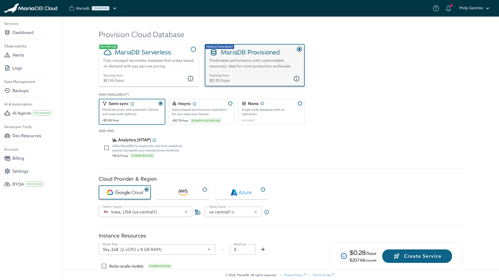
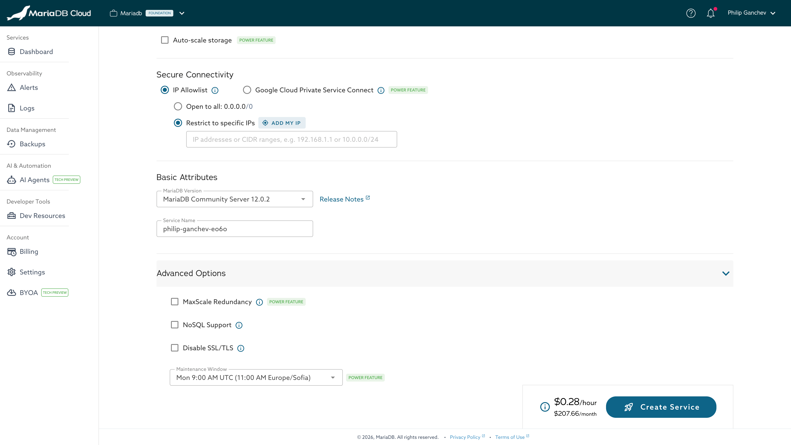

<!--
  DRAFT — NOT PUBLISHED. Staging rewrite of cloud-usage/launch-page.md for the
  new single-page "Provision Cloud Database" flow (DOCS-6340 / MCDEV-3304).
  Deliberately a separate file and omitted from SUMMARY.md so GitBook does not
  render it and the live Launch Page is untouched. For review only.

  Before publishing (when enable-portal-provisioning-v2 is ON in prod):
    1. Save the 4 UI screenshots from MCDEV-3304 into mariadb-cloud/.gitbook/assets/
       as provisioning-v2-01.png / -03.png / -04.png (typo-fixed from "provisoning").
    2. Replace the content of cloud-usage/launch-page.md with this, and delete
       this draft file (keep the same page URL).

  Source-verified against skysql-ui-client (ProvisionDatabase.vue,
  router/createService.js) + the MCDEV-3304 provisioning-v2 screenshots.
-->
---
description: >-
  The MariaDB Cloud Provision Cloud Database page creates a new database
  service from a single page: topology, high availability, add-ons, provider
  and region, instance resources, connectivity, and advanced options, with a
  live cost estimate.
---

# Launch Page

The **Provision Cloud Database** page creates a new MariaDB Cloud service from a
single page. As you build the configuration, a sticky footer shows a live
estimate of the hourly and monthly cost before you deploy. Open it with
**Create New Service** from the Portal Dashboard.

<figure><figcaption>
Provision Cloud Database page (Serverless)
</figcaption></figure>

## Topology

Choose the service topology:

* **MariaDB Serverless** (Pay-Per-Use) — a fully managed database that scales on
  demand. Best for variable traffic and cost optimization.
* **MariaDB Provisioned** (Production Ready) — predictable performance with
  customizable resources. Best for production workloads that need consistent
  performance.

## High Availability

For provisioned services, select a high-availability mode:

* **Semi-sync** — a MaxScale proxy with automatic failover and read/write
  splitting. Recommended for most production workloads.
* **Insync** — Galera synchronous replication across all nodes for
  zero-data-loss failover. Suited to compliance-critical workloads.
* **None** — a single node with no replication. Not recommended for production.

## Add-ons

* **Analytics (HTAP)** — adds the MariaDB Exa engine for real-time analytical
  queries alongside your transactional workload. Requires Semi-sync HA.

<figure><figcaption>
Topology, High Availability, and Add-ons (Provisioned)
</figcaption></figure>

## Cloud provider & region

Select the cloud provider (Google Cloud, AWS, or Azure), then the region and —
for provisioned services — an availability zone. Each region has a scheduled
maintenance window. Available regions vary by account.

## Instance resources

For **provisioned** services, choose the node size (for example,
`Sky-2x8` — 2 vCPU × 8 GB RAM), the number of replicas, and, if needed,
horizontal or vertical auto-scaling.

For **serverless** services, set the MCU thresholds. One MCU (MariaDB Compute
Unit) equals 0.5 vCPU + 2 GB memory. Setting **Min MCUs** to 0 lets the service
scale to zero when idle to reduce cost, with a brief startup delay on the next
connection.

Set the storage capacity and, if needed, enable storage auto-scaling.

## Secure connectivity

Choose how the service accepts connections:

* **IP Allowlist** — open to all, or restrict access to specific IP addresses or
  CIDR ranges (use **Add my IP** to add your current address).
* **Private Link** — connect privately from your own VPC using AWS Private Link,
  Google Cloud Private Service Connect, or Azure Private Link.

<figure><figcaption>
Secure connectivity and advanced options
</figcaption></figure>

## Basic attributes

Select the **MariaDB Version** (with a link to its release notes) and enter a
**Service Name**.

## Advanced options

Optionally configure storage type, provisioned IOPS and throughput, MaxScale
redundancy, NoSQL (MongoDB®-compatible) support, an SSL/TLS toggle, and the
maintenance window.


Some options — Insync high availability, the Analytics (HTAP) add-on,
auto-scaling, Private Link, MaxScale redundancy, and a custom maintenance
window — require the **Power** or **Power Plus** service tier.


## Create the service

Click **Create Service**. The new service appears on the Portal Dashboard, and a
[notification](notifications.md) is sent when launch begins and when it
completes.
