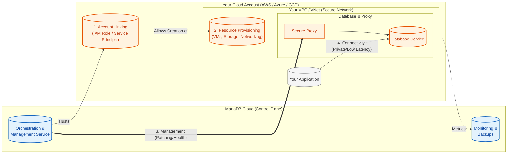

# Bring Your Own Account (BYOA)

Bring Your Own Account (BYOA) allows large enterprises to deploy fully managed MariaDB Cloud databases directly within their own public cloud infrastructure. This deployment model offers the operational simplicity of a managed service while satisfying strict requirements for data sovereignty, compliance, and cloud cost optimization.

With BYOA, the Control Plane (UI, API, Monitoring) remains in MariaDB Cloud, while the Data Plane (Compute, Storage, Backups) resides entirely in your cloud account.

## How it works

A BYOA environment is a secure, isolated set of resources within your own cloud provider account (Azure, AWS, or Google Cloud) that is managed by MariaDB Cloud.

1. Account Linking: You authorize MariaDB Cloud to access your specific cloud subscription via a secure IAM role or Service Principal with least-privilege permissions.
2. Resource Provisioning: When you create a service, MariaDB Cloud orchestrates the deployment of Virtual Machines, Storage, and Networking directly into your account.
3. Management: MariaDB Cloud monitors health, performs backups, and applies patches automatically, just like a standard managed service.
4. Connectivity: Your applications connect to the database locally within your cloud network (VPC/VNet), ensuring low latency and high security without exposing data to the public internet.

#### Architecture Diagram

The following diagram illustrates how the MariaDB Control Plane securely manages resources inside your cloud account without ever extracting your data.

```mermaid
flowchart LR
    %% Define color styles for visual separation
    classDef controlPlane fill:#e3f2fd,stroke:#1565c0,stroke-width:2px,color:#0d47a1;
    classDef dataPlane fill:#fff3e0,stroke:#e65100,stroke-width:2px,color:#bf360c;
    classDef networkBoundary fill:#ffffff,stroke:#ff9800,stroke-width:2px,stroke-dasharray: 5 5,color:#e65100;
    classDef user fill:#f5f5f5,stroke:#616161,stroke-width:1px;

    User["Customer User (DevOps/DBA)"]:::user
    App["Customer Application"]:::user

    %% MariaDB Cloud Control Plane
    subgraph MariaDB_CP ["MariaDB Cloud (Control Plane)"]
        direction TB
        Portal["Portal UI & API"]:::controlPlane
        Orchestrator["Orchestration Service"]:::controlPlane
        Monitoring["Monitoring & Alerts"]:::controlPlane
    end

    %% Customer Cloud Account Data Plane
    subgraph Customer_Account ["Customer Cloud Account (Data Plane)"]
        IAM["Cross-Account IAM Role / Service Principal"]:::dataPlane
        
        subgraph VPC ["Customer VPC / VNet (Network Boundary)"]
            direction TB
            Bastion["Secure Proxy / Bastion"]:::dataPlane
            DB["Database Nodes (VMs)"]:::dataPlane
            Storage[("Persistent Storage & Backups")]:::dataPlane
        end
    end

    %% Main Flows
    User -->|"Manages Service"| Portal
    App -->|"Connects Privately"| DB

    %% Control Plane Interactions
    Portal --> Orchestrator
    Orchestrator -->|"Provisions Resources via API"| IAM
    IAM -.->|"Grants specific permissions to"| VPC

    %% Secure Management Path - Fixed Syntax Here
    Orchestrator ==>|"Secure Management Tunnel (TLS)"| Bastion
    Bastion <-->|"Management tasks"| DB

    %% Observability Flow
    DB -.->|"Sends Metrics & Logs"| Monitoring

    %% Data Residency
    DB <-->|"Reads/Writes Data"| Storage

    %% Apply styles to subgraphs
    class MariaDB_CP controlPlane;
    class Customer_Account dataPlane;
    class VPC networkBoundary;
```

### Why use BYOA?

BYOA is designed for enterprise organizations with specific regulatory or infrastructure requirements:

* Compliance & Data Sovereignty: Since data never leaves your cloud account, you maintain absolute control over data residency. This simplifies meeting strict regulatory standards such as HIPAA, PCI-DSS, and GDPR.
* Cloud Cost Optimization: You pay your cloud provider directly for the underlying infrastructure. This allows you to burn down existing committed spend (e.g., Azure MACC, AWS EDP) and leverage your negotiated enterprise discounts.
* Network Security: Database nodes are deployed into a private VPC/VNet. You can enforce your own security group rules, routing policies, and network isolation without complex peering arrangements.
* Advanced Workloads (PowerPlus): Enables the PowerPlus tier, allowing for advanced topologies like Galera Clusters to run in your own environment.

#### Galera Cluster Topology (PowerPlus Exclusive)

Customers on the PowerPlus tier can deploy Galera Clusters for synchronous multi-primary replication and zero data loss failover.

### Who is eligible for BYOA?

BYOA is an enterprise-grade feature with specific commercial and technical prerequisites:

* Service Tier: Your organization must be on the Power or PowerPlus tier.
* Support Plan: You must have Standard Support with the Remote DBA add-on enabled.
* Contract: Available to customers with annual contracts or minimum spend commitments.


For the initial release (Jan 2026), BYOA is available as a Tech Preview on Microsoft Azure. AWS and Google Cloud support will follow in subsequent phases.


### BYOA Pricing and Billing

The BYOA setup splits your costs into two separate components. This model ensures transparency and allows you to apply your own cloud credits or reserved instance savings to the infrastructure portion of the cost.

1. MariaDB Cloud Invoice: You receive a bill from MariaDB for the management fee, software licensing, and support.
2. Cloud Provider Invoice: You receive a bill directly from your cloud provider (e.g., Microsoft Azure) for the consumed infrastructure resources (Compute, Storage, Network).

### Get Started

For the Tech Preview (Jan 2026), onboarding is a guided process.

1. Contact Sales: Submit a request via the MariaDB Cloud Portal or contact your account representative to validate eligibility.
2. Onboarding: Our support team will provide the necessary IAM/Service Principal templates and guide you through the account linking process.
3. Deploy: Once linked, "Bring Your Own Account" will appear as a deployment target in your Create Service wizard.

