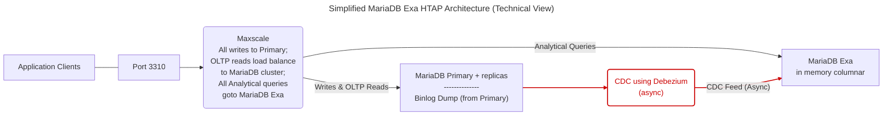
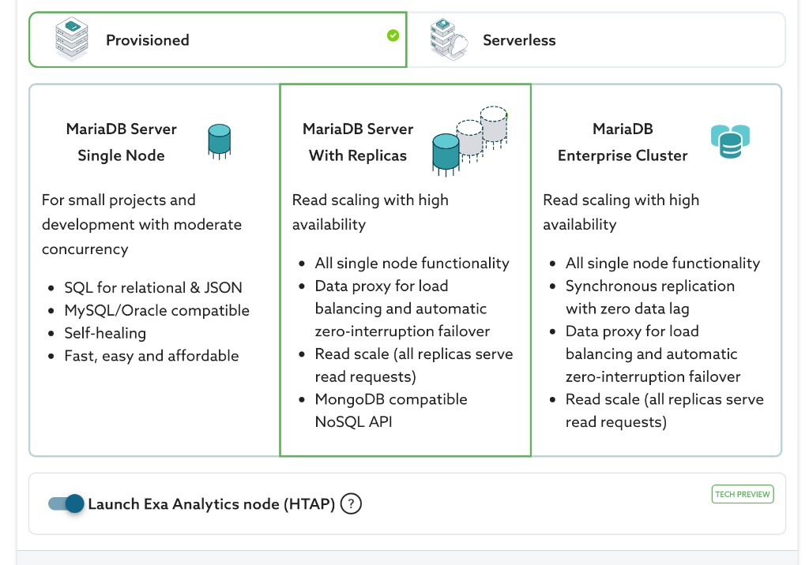

# HTAP using MariaDB Exa

MariaDB Exa adds **hybrid transactional/analytical processing (HTAP)** to MariaDB Cloud. You get MariaDB for **OLTP** and the in-memory **columnar** MariaDB Exa engine (powered by Exasol) behind one intelligent entry point—without standing up a separate analytics database, ETL pipelines, or custom CDC wiring.


**Technical preview**

HTAP using MariaDB Exa is not intended for production use. This feature is available on Power and PowerPlus tiers only.


## Architecture overview

The MariaDB Exa layout separates transactional and analytical workloads so heavy reporting does not contend with production OLTP traffic.

### Simplified technical view



### Core components

**MaxScale smart router**\
The entry point on **port 3310**. It acts as the routing layer: sends writes to the primary and splits reads between MariaDB Server (InnoDB) and the MariaDB Exa engine based on workload and performance characteristics.

**MariaDB Server**\
The **OLTP** (online transactional processing) engine. All write operations and point lookups run here.

**MariaDB Exa (analytical engine)**\
A high-performance, in-memory **columnar** database for **OLAP** (online analytical processing) workloads.

**Debezium CDC**\
An out-of-band, asynchronous pipeline that reads MariaDB binary logs and streams changes into the MariaDB Exa side of the topology.

### Data propagation and consistency

**Write path**\
All writes (`INSERT`, `UPDATE`, `DELETE`) go to the MariaDB **primary** on **port 3306**.

**Asynchronous replication**\
Data reaches Exa through the binary log and Debezium CDC. That path is **out of band** and **asynchronous** relative to the transactional database.

**Replication lag**\
Under heavy write load, the CDC pipeline can build a backlog. Lag is typically on the order of **seconds** but can reach **several minutes** during spikes.

**No causal reads across engines**\
The intelligent router is **not lag-aware** and does **not** guarantee read-your-own-writes between MariaDB and Exa. For immediate consistency on data you just wrote, use the **MariaDB transactional ports** (see [Connectivity and smart routing](htap-mariadb-exa.md#connectivity-and-smart-routing)).

## Launching a MariaDB Exa HTAP cluster

### Via MariaDB Cloud portal (UI)

1. [Log in to the MariaDB Cloud portal](https://cloud.mariadb.com/).
2. Click **+ Launch New Service**.
3. Ensure **Provisioned** (not Serverless) is selected.
4. In the topology step, choose **MariaDB Server With Replicas**.
5. Turn **on** **Launch Exa Analytics node (HTAP)**. The control is labeled **TECH PREVIEW** in the launch flow.



6. Under **Configuration**, select your cloud provider and region.
7. Under **Sizing**, pick an instance size. **The cluster is homogeneous:** the OLTP **primary**, **replicas**, and the **Exa** node all use the **same** instance size you select. With Exa enabled, only **high-memory** instance types are shown—size RAM for both transactional load and your analytical working set.
8. Review the **right-hand** cost summary: it reflects the Exa node. **CDC is included** in the service; there is **no** separate charge for CDC processing.
9. **Launch** and finish the wizard. Naming and remaining steps follow the standard flow. Provisioning usually takes about **5–10 minutes**.

### Via MariaDB Cloud REST API

For **API keys**, client IP **allow list**, checking service **`ready`** status, and fetching **credentials**, follow [Launch DB using the REST API](launch-db-using-the-rest-api.md). The [MariaDB Cloud REST API reference](../reference/rest-api-reference.md) and [API docs](https://apidocs.skysql.com/) cover the full request model.

**HTAP / Exa flag** — On `POST /provisioning/v1/services`, set **`"analytics": true`**. That provisions the Exa analytics node (same idea as **Launch Exa Analytics node (HTAP)** in the portal) on top of the replicated **es-replica** topology. The `architecture` field supports only `amd64` as value, any other input will result into your service failing to start. Other fields match your **Power** or **PowerPlus** tier, provider, region, and sizing; use **high-memory** sizes when Exa is enabled, consistent with the portal.

Example (adjust `tier`, `region`, `availability_zone`, `size`, `version` and add **`allow_list`** or other required keys per the launch guide):

```bash
curl --location 'https://api.skysql.com/provisioning/v1/services' \
  --header 'Content-Type: application/json' \
  --header "X-API-Key: ${API_KEY}" \
  --data '{
  "tier": "power",
  "service_type": "transactional",
  "topology": "es-replica",
  "provider": "aws",
  "region": "us-east-2",
  "availability_zone": "us-east-2b",
  "name": "htap-test",
  "nodes": 1,
  "size": "sky-4x32",
  "architecture": "amd64",
  "storage": 100,
  "version": "11.4.10-7.1-standard",
  "ssl_enabled": true,
  "analytics": true
}'
```

After the service is **ready**, use the service response (or the same steps as the quickstart) for hostnames and ports, and map them to [Connectivity and smart routing](htap-mariadb-exa.md#connectivity-and-smart-routing) (**3306** / **3307** / **3310** / **3311**).

## Connectivity and smart routing

MariaDB Cloud exposes dedicated ports so you can choose **how** each client connects: strict transactional access, read-only replicas, intelligent routing, or direct analytical access.

| Port     | Service type               | Target engine and use case                                                                                                                                            |
| -------- | -------------------------- | --------------------------------------------------------------------------------------------------------------------------------------------------------------------- |
| **3306** | Transactional (read-write) | Standard read/write to MariaDB. Use for OLTP and when you need **read-your-own-writes** on the transactional engine. Reads are load balanced across all OLTP servers. |
| **3307** | Transactional (read-only)  | Read-only traffic across MariaDB **replicas** (load balanced).                                                                                                        |
| **3310** | Intelligent router         | **Smart router** entry point. Sends work to the engine (MariaDB or Exa) the router selects for efficiency.                                                            |
| **3311** | Direct Exa                 | Connect directly to the **analytical engine**, bypassing router logic, using the MariaDB protocol.                                                                    |

## How smart routing (port 3310) works

On **port 3310**, MaxScale chooses an engine using **racing**: it learns which backend answers each _query pattern_ fastest and routes repeat traffic accordingly.

### Canonicalization

MaxScale **strips constants** from the query so it can recognize a **pattern**—for example, `WHERE id = 5` collapses to the same pattern as `WHERE id = ?` for routing purposes.

### Racing

The **first** time a pattern appears, MaxScale **executes** the query on **both** MariaDB Enterprise Server and MariaDB Exa **simultaneously**.

### First responder wins

Whichever engine **returns first** for that pattern is recorded; later queries with the **same** pattern are sent to that **cached** winner until routing state is refreshed or invalidated. The running query on the losing engine is immediately cancelled.

### Automatic translation

The router applies **syntax translation** and **type coercion** from the MariaDB dialect toward what the analytical engine expects, so clients can keep using familiar MariaDB SQL on port 3310.

## Developer guidelines

**Supported connectors**\
Use **standard MariaDB or MySQL-compatible** client libraries and connectors only.

**SQL dialect**\
Author application SQL in the **MariaDB dialect**. The intelligent router performs translation for the analytical path where needed.

**Handling lag**\
If the application must **immediately** see data just written (for example, right after a profile update), connect on **port 3306**. Use **port 3310** for dashboards, exploration, and **heavy analytics** where small CDC lag is acceptable.

## Known issues and limitations

**SQL dialect** The translation layer does not provide 100% support of the MariaDB SQL dialect. Some MariaDB data types, functions, and syntax structures are not supported on ports 3310 & 3311.

**DDL replication**\
`RENAME TABLE` and `DROP DATABASE` are **not** replicated through the CDC currently; you may need **manual** steps to keep MariaDB and Exa aligned after such DDL.

**Case sensitivity**\
MariaDB Exa may use **case-insensitive** identifier matching by default; **result column labels** can still appear in **uppercase** even when the query uses mixed or lowercase names.

**Deterministic aggregates**\
For functions such as `GROUP_CONCAT`, add an explicit **`ORDER BY`** inside the aggregate (where supported) so ordering is stable if different engines evaluate the plan differently.
