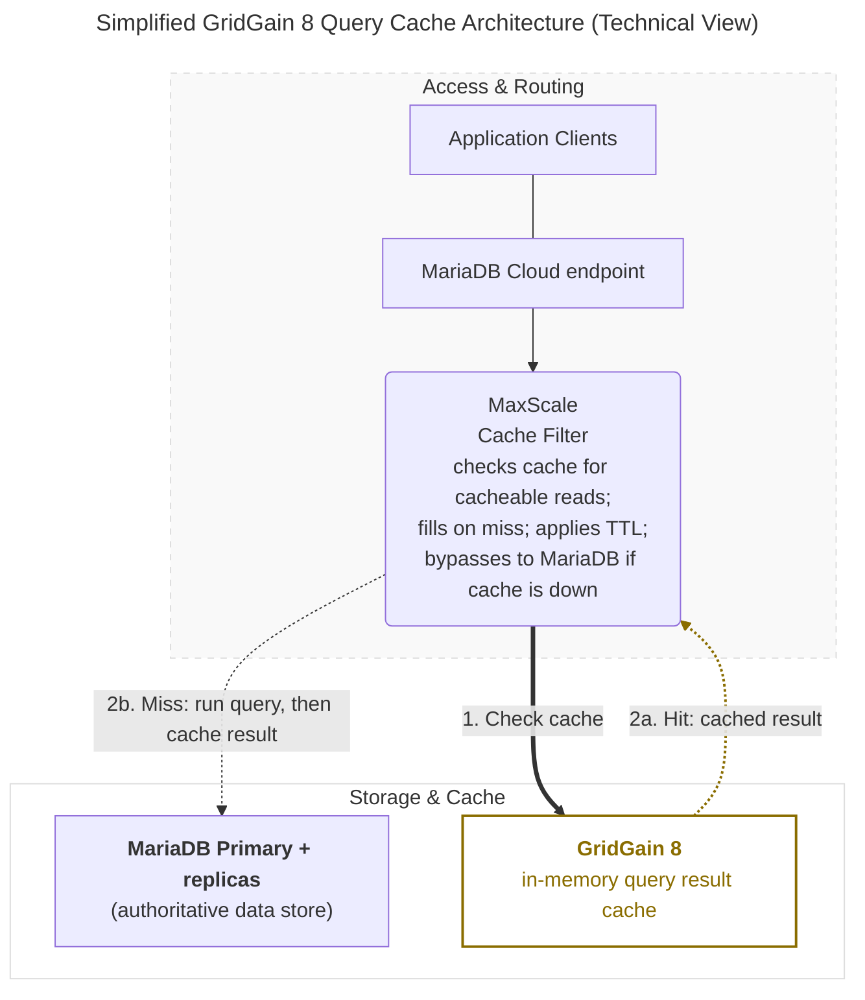
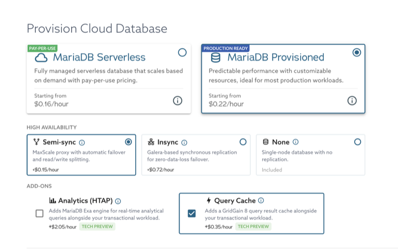
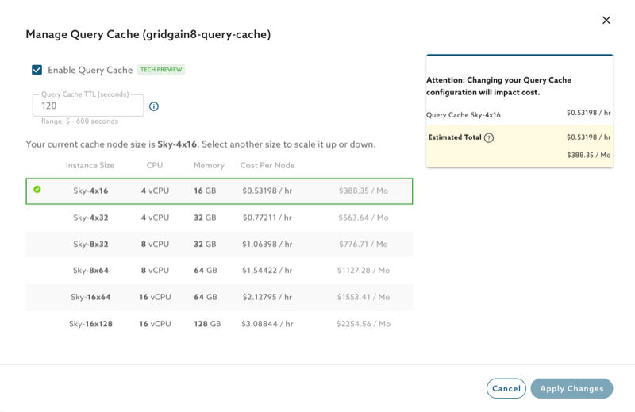
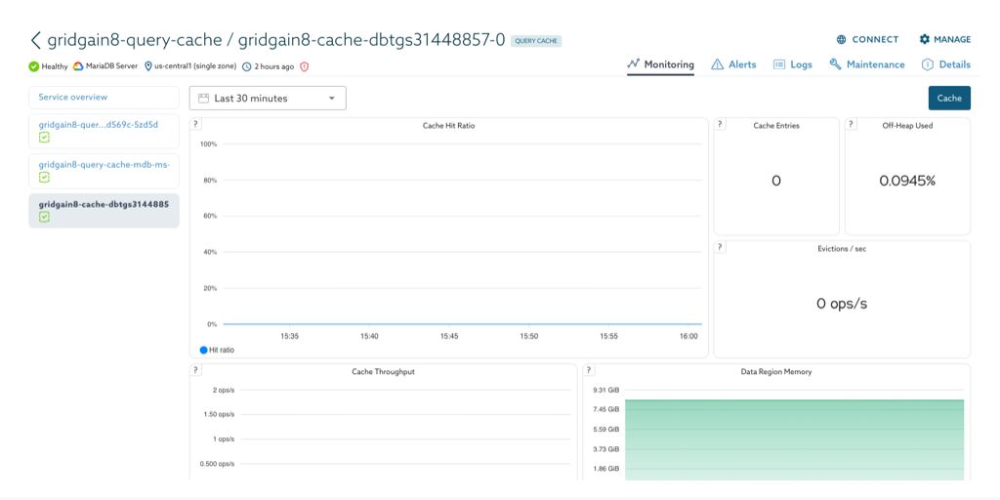

# Query Cache Using GridGain 8

Query Cache is a provisioning **add-on** for MariaDB Provisioned services that adds an in-memory cache for SQL query results, powered by **GridGain 8**. Repeated read queries are served from memory instead of the database, reducing read latency for workloads such as dashboards, catalog lookups, session reads, and reporting. It integrates with the Semi-Sync HA topology and uses the same MaxScale endpoint, so applications continue connecting to the existing MariaDB Cloud endpoint.


This feature requires **Semi-Sync HA**, is available on Power and PowerPlus tiers only, and cannot be enabled on trial accounts.


## Architecture Overview

The cache is positioned between MaxScale and MariaDB. MaxScale intercepts cacheable reads and checks GridGain before querying the database; MariaDB remains the authoritative data store for all writes and for any read that is not served from cache.

### Simplified Technical View



### Core Components

#### **MaxScale Cache Filter**

The endpoint and routing layer. It classifies cacheable reads, performs the GridGain lookup, applies the configured TTL when it fills the cache, and **fails through** to MariaDB on a miss or when the cache is unavailable.

#### **MariaDB Server**

The **OLTP** (online transactional processing) engine and the **authoritative data store**. All writes, and all reads that are not served from cache, run here. It is unchanged by adding the cache.

#### **GridGain 8 (Cache Engine)**

A single-node, in-memory query result store. It holds cached `SELECT` results only, has **no persistence**, and is reachable only from MaxScale inside the service.

### Freshness and Consistency

#### **TTL-Bounded Freshness**

Cached results are **time-bounded**, not invalidated on every write. Each cached result lives for at most the configured hard TTL (`gg8_mxs_hard_ttl`, see [Configuration Reference](#configuration-reference)), after which it is refreshed from the database on the next read.

#### **No Read-Your-Own-Writes From Cache**

The cache does not guarantee you will see a write you just made until the TTL expires and the result is refilled. Queries that must always reflect the latest write are **not** good caching candidates.

#### **Cache-Miss Fallthrough**

On a miss, MaxScale forwards the query to MariaDB, returns the result to the client application, and stores it for subsequent identical queries.

#### **Cache-Bypass Failover**

If the cache becomes unreachable, MaxScale routes reads directly to MariaDB. There are **no application errors**. You only lose the caching speed-up until the cache recovers. Because the cache is a single in-memory node with no persistence, losing it means a **cold cache, not data loss**; it re-warms as queries re-execute. A rolling restart behaves the same way: no errors, only a temporary drop in hit rate.

## Launching a Query Cache Service

Query Cache is enabled on a **MariaDB Provisioned** service that uses **Semi-Sync HA**. You can enable it at launch or add it to an existing service later.

### Via MariaDB Cloud Portal (UI)

1. In the [MariaDB Cloud portal](https://cloud.mariadb.com/), launch a new **Provisioned** service or open an existing one.
2. Under **High Availability**, choose **Semi-sync**, which Query Cache requires.
3. Under **Add-ons**, enable **Query Cache** and pick a cache node size (**Sky-4x16** to **Sky-16x128**, Intel/AMD only).

<figure><figcaption></figcaption></figure>

_Launch - Enable Query Cache_

### Via MariaDB Cloud REST API

For **API keys**, client IP **allow list**, checking service **`ready`** status, and fetching **credentials**, follow [Launch DB using the REST API](launch-db-using-the-rest-api.md). The [MariaDB Cloud REST API reference](../reference/rest-api-reference.md) and [API docs](https://apidocs.skysql.com/) cover the full request model.

**Query Cache fields** — On `POST /provisioning/v1/services`, set **`"cache_backend": "GridGain8QueryResultCache"`** to provision the cache on top of the replicated **es-replica** (Semi-Sync HA) topology. Use **`amd64`** for `architecture` and a supported cache size, consistent with the portal. Optionally set `gg8_size`, `gg8_replicas`, and `gg8_mxs_hard_ttl` (see [Configuration Reference](#configuration-reference)).

Example (adjust `tier`, `region`, `availability_zone`, `size`, `version`, and add **`allow_list`** or other required keys per the launch guide):

```bash
curl --location 'https://api.skysql.com/provisioning/v1/services' \
  --header 'Content-Type: application/json' \
  --header "X-API-Key: ${API_KEY}" \
  --data '{
  "tier": "power",
  "service_type": "transactional",
  "topology": "es-replica",
  "provider": "aws",
  "region": "us-east-2",
  "availability_zone": "us-east-2b",
  "name": "query-cache-test",
  "nodes": 1,
  "size": "sky-4x32",
  "architecture": "amd64",
  "storage": 100,
  "version": "11.4.10-7.1-standard",
  "ssl_enabled": true,
  "cache_backend": "GridGain8QueryResultCache",
  "gg8_size": "sky-4x32",
  "gg8_replicas": 1
}'
```

**Discover available cache sizes** — list the valid `gg8_size` values for a provider and topology:

```bash
curl --location \
  'https://api.skysql.com/provisioning/v1/sizes?type=gg8cache&provider=aws&topology=es-replica' \
  --header "X-API-Key: ${API_KEY}" | jq
```

**Add, modify, or remove the cache on an existing service** — use the `gg8_cache` sub-resource. Each call returns `202 Accepted`; the service moves to `pending_modifying`, then back to `ready`. The service must be `ready` before you call it.



```bash
# If gg8_size is omitted, it defaults from the server size.
curl --location --request PATCH \
  "https://api.skysql.com/provisioning/v1/services/${SERVICE_ID}/gg8_cache" \
  --header 'Content-Type: application/json' --header "X-API-Key: ${API_KEY}" \
  --data '{"gg8_size": "sky-4x32"}'
```



```bash
curl --location --request PATCH \
  "https://api.skysql.com/provisioning/v1/services/${SERVICE_ID}/gg8_cache" \
  --header 'Content-Type: application/json' --header "X-API-Key: ${API_KEY}" \
  --data '{"gg8_mxs_hard_ttl": 300}'
```



```bash
curl --location --request PATCH \
  "https://api.skysql.com/provisioning/v1/services/${SERVICE_ID}/gg8_cache" \
  --header 'Content-Type: application/json' --header "X-API-Key: ${API_KEY}" \
  --data '{"gg8_size": "sky-8x64"}'
```



```bash
# MariaDB and MaxScale keep running normally.
curl --location --request DELETE \
  "https://api.skysql.com/provisioning/v1/services/${SERVICE_ID}/gg8_cache" \
  --header "X-API-Key: ${API_KEY}"
```



## Managing the Cache

You can manage the cache from the service's **MANAGE** menu → **Manage Query Cache**:

* **Enable or disable** the cache with the **Enable Query Cache** checkbox.
* **Change the TTL** in **Query Cache TTL (seconds)**, from 5 to 600 (default 120).
* **Resize the cache node** by selecting a size from **Sky-4x16** up to **Sky-16x128** to scale up or down.

<figure><figcaption></figcaption></figure>

_Manage Query Cache_

The same operations are available through the REST API. See [Via MariaDB Cloud REST API](#via-mariadb-cloud-rest-api) above.

## Configuration Reference

| Field | Meaning | Values |
| --- | --- | --- |
| `cache_backend` | Enables the Query Cache | `GridGain8QueryResultCache` |
| `gg8_size` | Cache node size (its own catalog, `type=gg8cache`) | `sky-4x16`, `sky-4x32`, `sky-8x32`, `sky-8x64`, `sky-16x64`, `sky-16x128` |
| `gg8_replicas` | Number of cache nodes | Must be `1` (locked in Tech Preview) |
| `gg8_mxs_hard_ttl` | Cache freshness bound, in seconds | 5–600, default 120 |
| `gg8_instance_type` | Cloud instance type (read-only, derived from size) | — |


Cache sizes are **not** server sizes. For example, `sky-2x8` is a valid server size but not a valid `gg8_size`. When you add the cache without specifying `gg8_size`, it defaults from the server size.


### Common API Errors

| Case | Response |
| --- | --- |
| Modify or remove while the service is not `ready` | `409 Conflict` |
| Empty request body / no effective change | `400` "gg8 cache configuration is unchanged" |
| `gg8_replicas` other than `1` | `400` "gg8_replicas must be 1" |
| Invalid `gg8_size` (including server-size names) | `400` "invalid gg8_size" |
| TTL out of range | `400` "gg8_mxs_hard_ttl must be between 5 and 600" |
| Remove when the cache is not enabled | `409` "gridgain8 cache is not enabled on this service" |

## Observability

When the cache is enabled, the service's **Monitoring** view gains a **Cache** dashboard (select **Cache** in the top-right of the Monitoring tab). It shows the health of the GridGain 8 cache over the selected time interval:

<figure><figcaption></figcaption></figure>

_Monitoring - Cache_

| Panel | What it shows |
| --- | --- |
| Cache Hit Ratio | Ratio of cache hits to total lookups (gets); the main measure of cache effectiveness |
| Cache Throughput | Cache gets, hits, and misses per second |
| Cache Entries | Number of entries currently held in the cache |
| Off-Heap Used | Percentage of the cache node's off-heap memory in use |
| Data Region Memory | Memory allocated to the cache against its maximum size |
| Evictions / sec, Eviction Rate | Cache entries evicted per second (an indicator of memory pressure) |

For the full list of panels, see [Service Monitoring Panels](../cloud-usage/service-monitoring-panels.md). The same metrics are also available through the [Observability](../cloud-management/observability.md) API.


A low or zero hit rate usually means the TTL is too short for your workload, the result sets are too large to cache, or the queries are not cacheable. A rising eviction rate, or Data Region Memory sitting near its maximum, means the cache is undersized for your hot dataset. Consider a larger `gg8_size`.


## Known Issues and Limitations

The Tech Preview scopes Query Cache to the following:

* **Requires Semi-Sync HA.** The cache is not available on the Insync (Galera) or None HA options, or on Serverless.
* **Freshness is TTL-bounded.** Cached results may be stale for up to the configured hard TTL because there is no per-write invalidation.
* **Large results are not cached.** Result sets larger than the per-entry limit (1 MB) are retrieved directly from MariaDB instead of being cached.
* **Single cache node.** `gg8_replicas` is locked to 1. Cached data is not replicated. If the cache node becomes unavailable, requests are served from MariaDB until the cache is repopulated.
* **Single availability zone.** The cache runs in the same AZ as MaxScale; multi-AZ is planned for a later phase.
* **No persistence or backups** for the cache; it is in-memory only.
* **No autoscaling.** The initial release supports a single cache node only. The node can be vertically resized independently of the MariaDB Server.
* **Fixed memory layout.** The JVM heap and off-heap memory allocation are determined by the selected node size and cannot be customized.
* **No direct GridGain access.** GridGain is not exposed to customers. Direct access to GridGain features such as key-value operations, SQL, Compute, Transactions, or Data Streamer is not supported. The GridGain version is managed by the platform and is not user-configurable.
