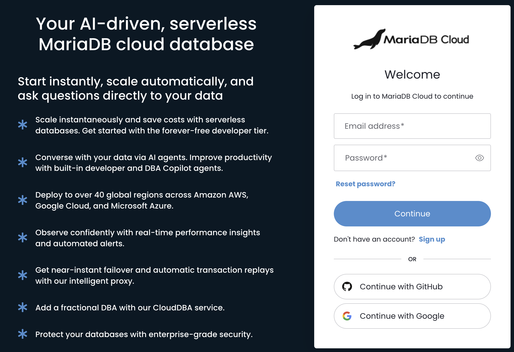

# Using the Portal

The MariaDB Cloud database deployment time varies: a Serverless instance is ready in seconds, while a Provisioned database may take a few minutes to complete. You can deploy on AWS, GCP, or Azure across nearly 50 global regions.

You can provision a database in four ways:

* MariaDB Cloud Portal: Use a web browser to launch services with a few clicks.
* DBaaS API: Use a REST client for programmatic control.
* Terraform Provider: Use infrastructure-as-code to manage your database.
* Python Scripts: Use Python code to connect to the DBaaS API for provisioning and managing services.

This quickstart guide will walk you through using the Portal.

## Step 1: Register for MariaDB Cloud

Go to [app.skysql.com](https://app.skysql.com) to sign up. You can sign up using your Google, GitHub, or LinkedIn credentials. Or just use your Email address to sign up.

<figure><figcaption>
MariaDB Cloud login form
</figcaption></figure>

## Step 2: Launch a Service

1. [Log in to the MariaDB Cloud Portal](https://app.skysql.com/) and, from the Dashboard, click the [+ Launch New Service](https://app.skysql.com/launch-service) button.
2. From the launch interface, select one of the following service types:
   * Provisioned:
     * MariaDB Server with Replicas
     * MariaDB Server Single Node
   * Serverless:&#x20;
     * MariaDB Serverless Single Node.
3.  Select your cloud provider and region:\
    Choose AWS, Google Cloud, or Azure, and then select one of the supported regions for the chosen provider.\
    Examples:

    * `AWS` with `Ohio, USA (us-east-2)`
    * `Google Cloud` with `Iowa, USA (us-central1)`
    * `Azure` with `Virginia, USA (eastus2)`

    \
    **Note:** Available regions vary by cloud provider and service type.
4. Service Name: Enter a name to identify your database service, such as `sales-demo` or keep the automatically suggested service name.
5. Click the `Launch Service` button.\
   For additional information on available selections, see "[Service Launch](../cloud-usage/launch-page.md)".

<figure><figcaption>
Service Name Identifier
</figcaption></figure>

6. After launching, you will then be redirected to the Dashboard. \
   **Note**: If you choose a Serverless deployment, your service will be in a 'Healthy' state and ready for use. For Provisioned deployment types, the service will initially be in a 'Creating' state. Please wait until it transitions to a 'Healthy' state before proceeding to the next step. Typically, launching a new Provisioned database takes about 5 minutes or less.

## Step 3: Observe, Scale

### Monitoring

You can monitor all the important database and OS metrics from the Dashboard. The monitoring UI also allows you to view, download any/all logs, including error, info, or Audit logs.

Basic status is shown on the Dashboard.

To see expanded status and metrics information:

1. From the Dashboard, click on the service name (for example, `sales-demo`).
2. From the Monitoring Dashboard, use the navigation tabs to view either the Service Overview or individual server details.
3. Specific metric views are available and can be accessed using the buttons in the upper-right corner of the service overview. These views include `Status`, `Lags`, `Queries`, `Database`, and `System`. 

<figure><figcaption></figcaption></figure>

_Monitoring Dashboard_

### Scaling

MariaDB Cloud features automatic rule-based scaling (Autonomous) and manual on-demand scaling.

**Note:** Scaling does not apply to Serverless deployments.

With automatic scaling, node count (horizontal) and node size (vertical) changes can be triggered based on load. Additionally, storage capacity expansion can be triggered based on usage. These Autonomous features are opt-in. For additional information, see "[Autonomous](../cloud-management/autonomously-scale-compute-storage.md)".

<figure><figcaption></figcaption></figure>

_Autonomous Settings for automatic scaling and storage management_

With manual scaling, you can perform horizontal scaling (In/Out), vertical scaling (Up/Down), and storage expansion on demand using Self-Service Operations. For additional information, see "[Self-Service Operations](../cloud-usage/manage-your-service.md)".

<figure><figcaption></figcaption></figure>

_Self-Service Scaling of Nodes and storage_

## Step 4: Tear-Down

When you are done with your testing session, you can stop the service. When a service is stopped, storage charges continue to accrue, but compute charges pause until the service is started again.

When you are done with testing, you can delete the service.

Stopping, starting, and deleting a service are examples of Self-Service Operations that you can perform through the Portal.

## See Also

[Self-Service Operations](../cloud-usage/manage-your-service.md)

[Launch DB using the REST API](launch-db-using-the-rest-api.md)

[Launch DB using the Terraform Provider](launch-db-using-the-terraform-provider.md)

[Launch DB using Python](launch-db-using-python.md)
