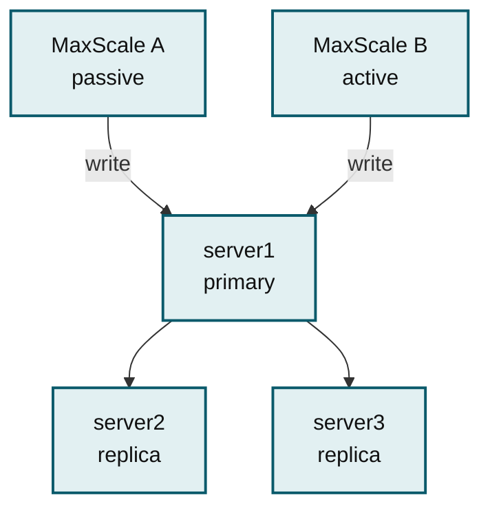
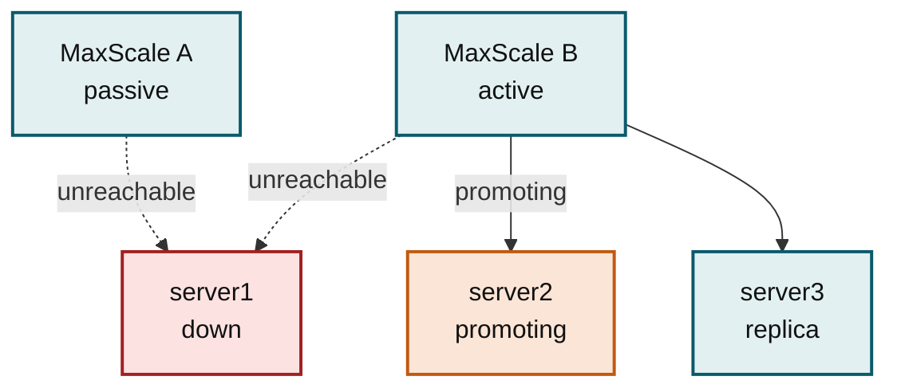
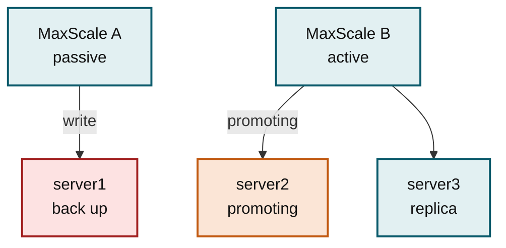
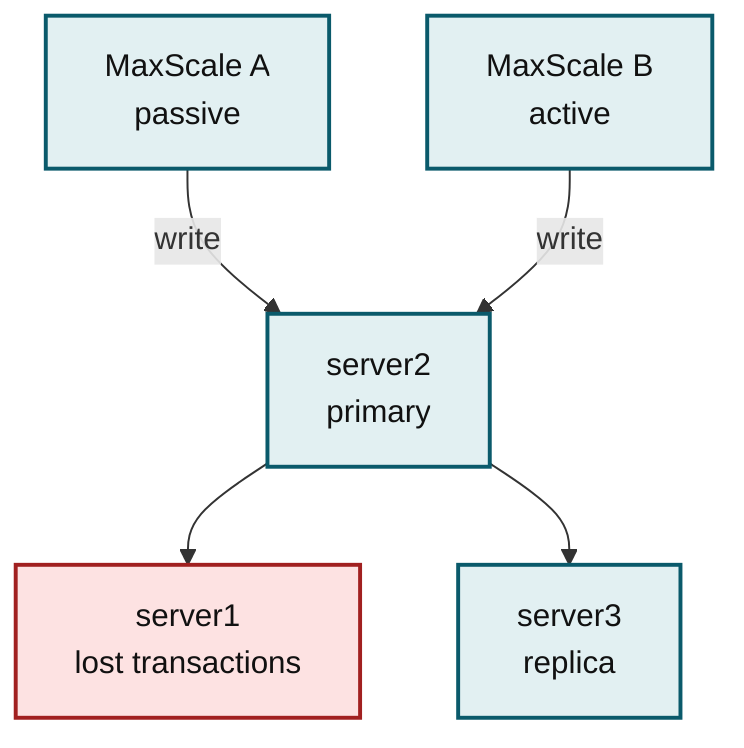
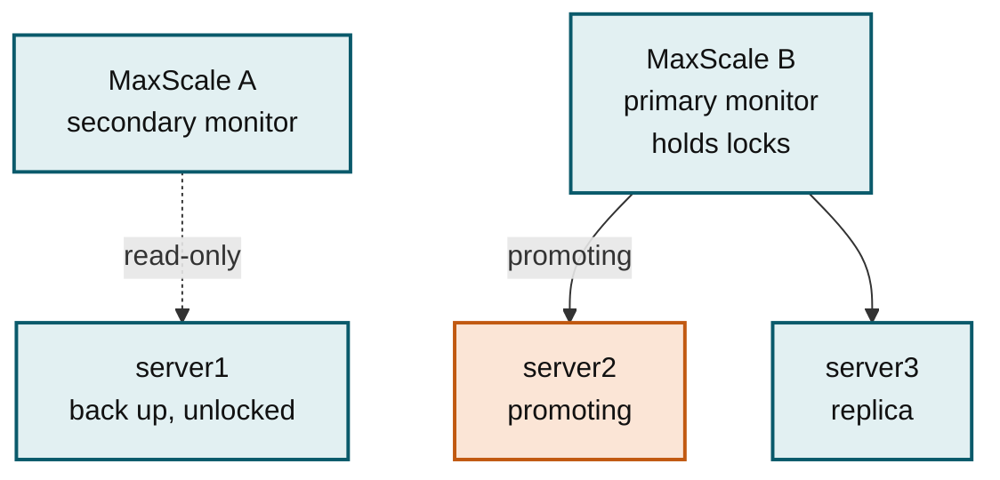
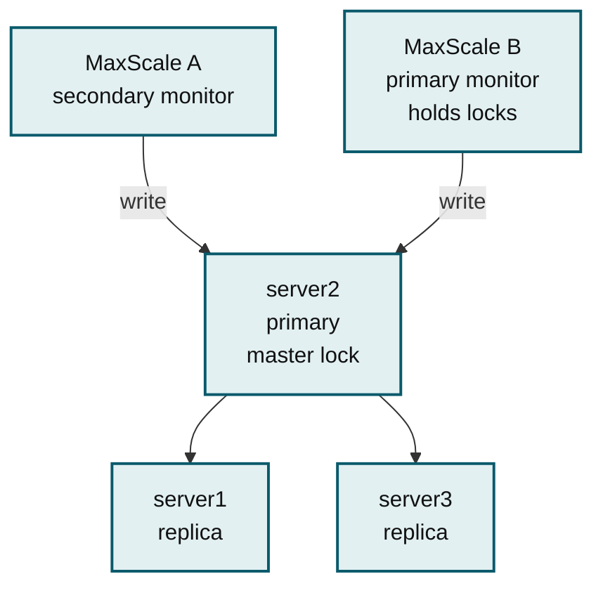
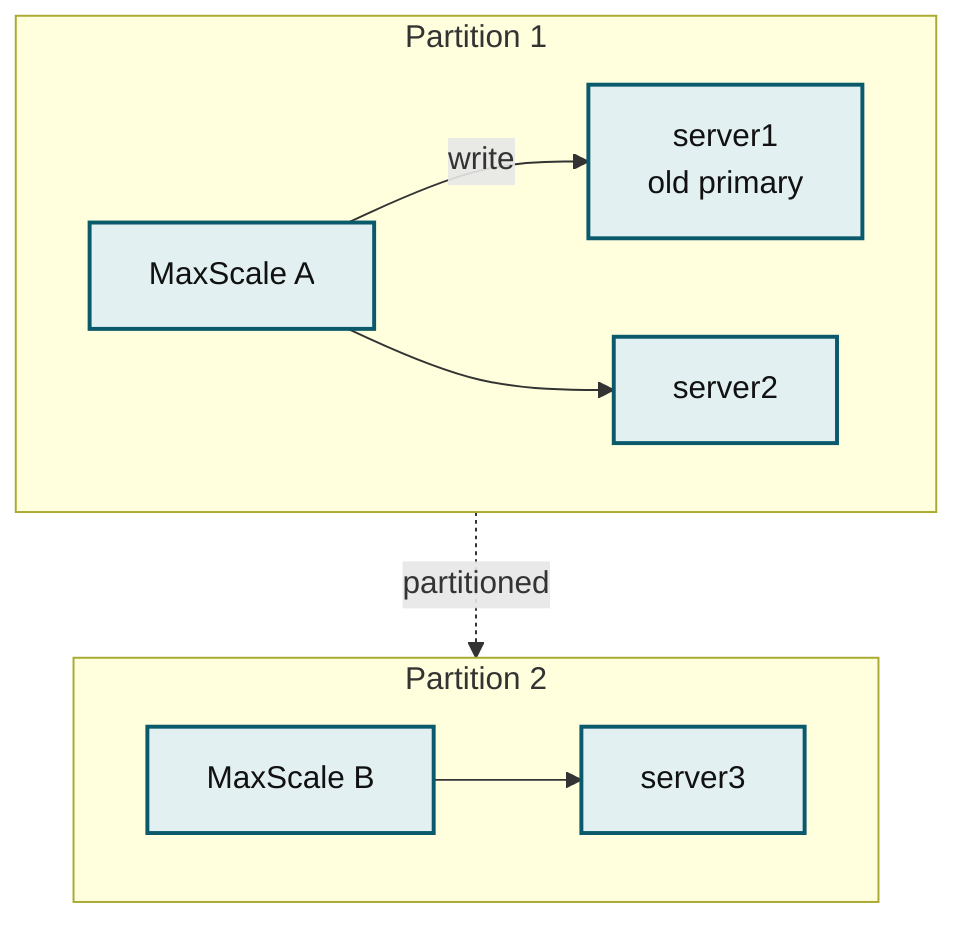
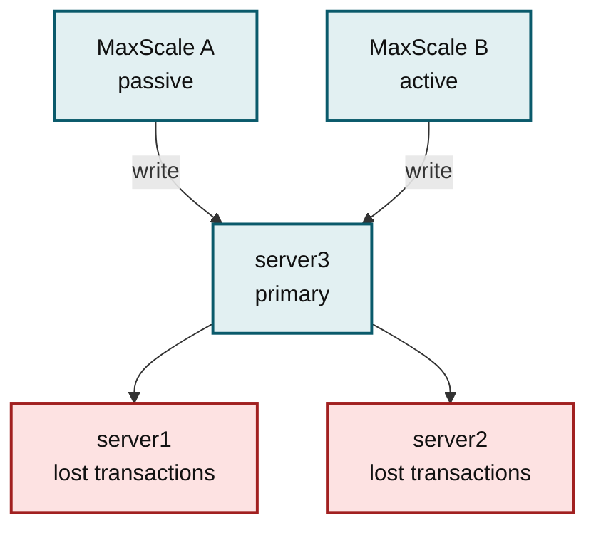
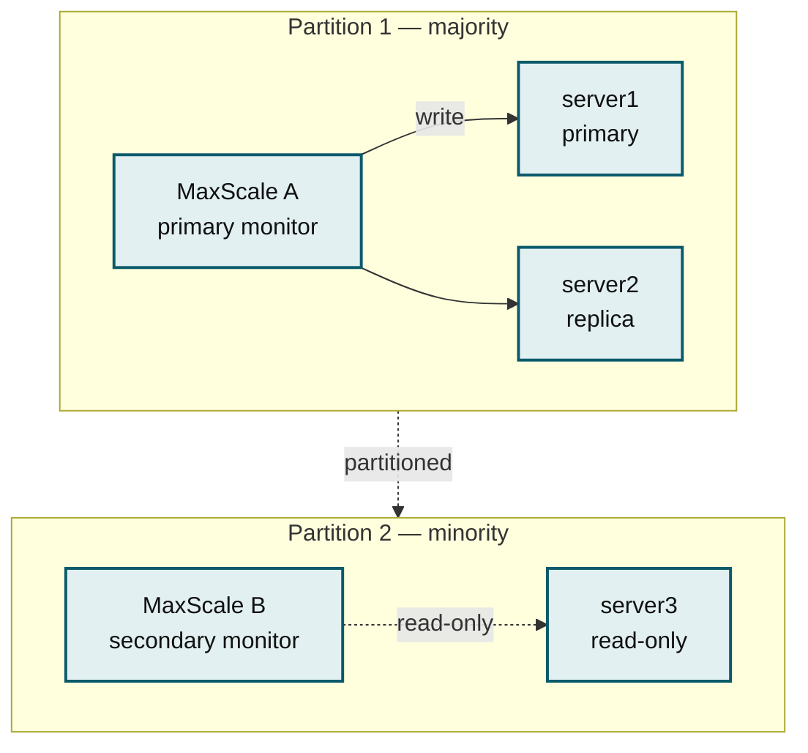
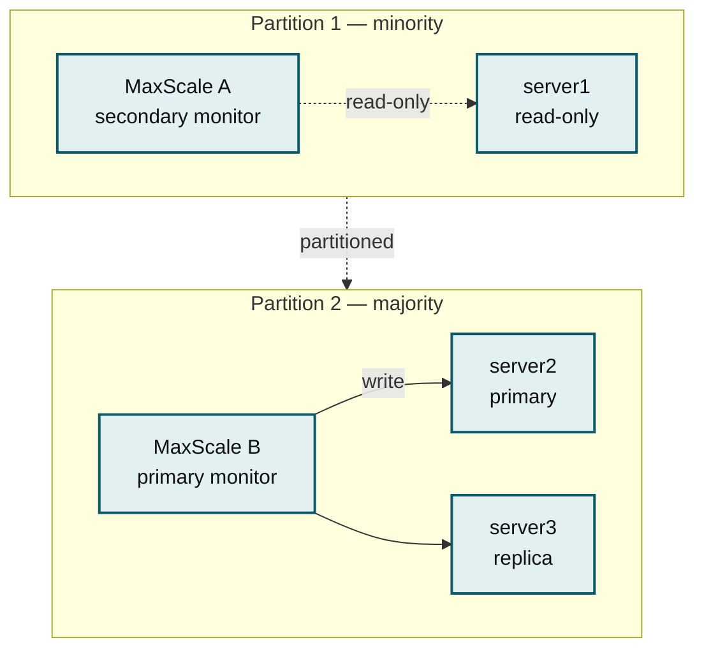

# Failover With Multiple MaxScales

When two or more MaxScale instances monitor the same replication cluster, they must agree on which server is the primary. If they disagree, each instance routes writes to a different server. Replication then either breaks or, worse, silently accepts both write streams, and the cluster contents diverge. Divergence is not something MaxScale can undo: recovery means rebuilding a server by hand, and the transactions written to the losing server are lost.

This page compares the three ways of coordinating failover across MaxScale instances, walks through the failure mode of each, and covers the tuning that cooperative locking needs to be safe.

The examples use three servers, _server1_ to _server3_, with _server1_ as the initial primary, and two MaxScale instances, _MaxScale A_ and _MaxScale B_. Both instances run [MariaDB Monitor](../reference/maxscale-monitors/mariadb-monitor.md) over the same three servers with `auto_failover` and `auto_rejoin` enabled.


This page assumes you are familiar with GTID-based replication, [automatic failover](automatic-failover-with-mariadb-monitor.md), and [MariaDB Monitor](../reference/maxscale-monitors/mariadb-monitor.md).


## Comparing the Coordination Modes

| Mode | How instances coordinate | Prevents divergence during a failover | Prevents divergence during a network partition | Servers needed |
| ---- | ------------------------ | ------------------------------------- | ---------------------------------------------- | -------------- |
| Active/passive (`passive`) | Not at all. You choose which instance is allowed to fail over. | No | No | Not applicable |
| `cooperative_monitoring_locks=majority_of_running` | Locks on a majority of the servers each instance can currently reach | Yes | No | 2 |
| `cooperative_monitoring_locks=majority_of_all` | Locks on a majority of all configured servers | Yes | Yes, with semisynchronous replication | 3 |

The short version: `majority_of_running` is a strict improvement on active/passive and any deployment using `auto_failover` and `auto_rejoin` with more than one MaxScale should prefer it. Choose `majority_of_all` when a network partition is a realistic risk, and pair it with semisynchronous replication. See [Choosing a Mode](failover-with-multiple-maxscales.md#choosing-a-mode).

## Active/Passive Configuration

In an active/passive deployment, the global [passive](../maxscale-management/deployment/installation-and-configuration/maxscale-configuration-guide.md#passive) setting is `false` on one instance and `true` on every other instance. A passive MaxScale still monitors the cluster and still routes queries; it only refrains from performing failover, switchover, and rejoin. The administrator decides which instance is the active one.




```ini
[maxscale]
passive=false
```





```ini
[maxscale]
passive=true
```




Nothing in this arrangement makes the two instances agree on which server is the primary. Each one reaches its own conclusion from what it can see, and a failover is exactly the moment when the two views come apart.

### How an Active/Passive Pair Diverges a Cluster

In the initial state both instances see _server1_ as the primary and route writes there.



_Initial state: both instances agree that server1 is the primary._

**Step 1 — _server1_ goes down.** Both instances lose their connections to it.

**Step 2 — the active MaxScale starts a failover.** MaxScale B waits until _server1_ has been down for [failcount](../reference/maxscale-monitors/mariadb-monitor.md#failcount) monitor intervals, then begins promoting _server2_. Promotion is not instant: the new primary has to process its relay log first.



_The active instance has started a failover, which takes some time to complete._

**Step 3 — _server1_ comes back up while the failover is still running.** When there are contending primary candidates, MariaDB Monitor keeps the server that was the primary before, so MaxScale A picks _server1_ again and resumes writing to it. MaxScale A has no way of knowing a failover is in progress, because nothing in an active/passive setup communicates that. MaxScale B does not notice _server1_ returning either, because it only reconnects to it once the failover finishes.



_The cluster has diverged: writes through MaxScale A land on the old primary, writes through MaxScale B on the new one._

**Step 4 — the failover completes.** MaxScale B redirects _server3_ to replicate from _server2_ and marks _server2_ as the primary. Writes through MaxScale B now go to _server2_ while writes through MaxScale A still go to _server1_.

**Step 5 — the old primary is demoted.** MaxScale B connects to _server1_ and rejoins it to the cluster. With `enforce_read_only_servers=true` it also sets `read_only` on it, which makes _server1_ an invalid primary candidate from MaxScale A's point of view. Only then does MaxScale A switch to _server2_.



_Aftermath: both instances agree again, but server1 holds transactions server2 never saw._

The end result is that _server1_ contains transactions that are not present in _server2_. Those transactions were acknowledged to the client and are now effectively lost, and recovery is a manual process.


The window in which this happens is the failover itself, so it is not rare: a primary that restarts, or a primary whose network drops out and returns, is enough to trigger it. Do not run more than one MaxScale over the same cluster with `auto_failover` unless the instances coordinate through cooperative locking.


## Cooperative Locking With majority_of_running

[Cooperative monitoring](../reference/maxscale-monitors/mariadb-monitor.md#cooperative-monitoring) makes the MaxScale instances agree on both questions — who performs cluster operations and which server is the primary — by coordinating through the database itself rather than directly with each other.

Set the same monitor configuration on every instance:


```ini
[TheMonitor]
type=monitor
module=mariadbmon
servers=server1,server2,server3
cooperative_monitoring_locks=majority_of_running
auto_failover=true
auto_rejoin=true
```


### How Cooperative Locking Works

Coordination uses [GET\_LOCK()](../../server/reference/sql-functions/secondary-functions/miscellaneous-functions/get_lock.md), a user-level advisory lock, to take exclusive ownership of a server:

* Each monitor tries to acquire a lock named `maxscale_mariadbmonitor` on every server it can reach. The instance that holds a majority of these locks is the **primary monitor**; any other instance is a **secondary monitor**. Only the primary monitor performs failover, switchover, or rejoin.
* The primary monitor also takes a second lock, `maxscale_mariadbmonitor_master`, on the server it has selected as the primary. This lock is how it publishes that decision.
* A secondary monitor only accepts a server as the primary if that server carries the `maxscale_mariadbmonitor_master` lock, held by the same connection that holds the server's `maxscale_mariadbmonitor` lock. If no server carries the lock, a secondary monitor marks no server as \[Master] and writes through it fail rather than landing on a stale primary. Replicas keep their \[Slave] status under the default `slave_conditions`, so reads continue to work.
* When a MaxScale loses lock majority it releases every lock it holds, including the master lock, so that another instance can take over.

With `majority_of_running`, majority is counted over the servers the instance can currently reach and lock. In a three-server cluster with all three running, that is two locks.


`cooperative_monitoring_locks` is independent of `passive`. If `passive=true`, cluster operations stay disabled even when the monitor holds the locks. Do not mix the two: set `passive=false` or leave it unset.


### The Same Failover, With Cooperative Locking

Take the sequence from the previous section again, with MaxScale B as the primary monitor holding the locks.

**Step 1 — _server1_ goes down.** Its locks disappear with it, including the master lock that marked it as the primary.

**Step 2 — MaxScale B starts the failover** after `failcount` monitor intervals and begins promoting _server2_.

**Step 3 — _server1_ comes back up while the failover is still running.** This time MaxScale A does not resume writing to it. The restart cleared the master lock, so from MaxScale A's point of view no server is the primary. Connections through MaxScale A can only read.



_No server carries the master lock, so the old primary takes no writes and nothing diverges._

**Step 4 — the failover completes.** MaxScale B redirects _server3_, marks _server2_ as the primary, and takes the master lock on it. Writes through MaxScale B resume.

**Step 5 — MaxScale A follows.** It sees the master lock on _server2_ and starts routing writes there. _server1_ is rejoined as a replica.



_Both instances end up on the new primary, and no acknowledged transaction was lost._

The cost of this protection is a short read-only window: between the moment the primary is lost and the moment the new primary is marked, no instance accepts writes. That is the trade for not diverging.

## Network Partitions and Split Brain

A network partition happens when the network splits into subnetworks, whether from an outage or a degraded link. To the MaxScale instances it looks like connection errors and timeouts, which is indistinguishable from servers going down.

Start from a healthy cluster where both instances route writes to _server1_, then partition it so that MaxScale A, _server1_, and _server2_ end up on one side and MaxScale B and _server3_ on the other.



_The partition: MaxScale A keeps the old primary, MaxScale B is left with a single replica._

What happens next depends entirely on the mode.

### Active/Passive During a Partition

If the active instance lands in the minority partition, it promotes what it can see. MaxScale B promotes _server3_ and writes there, while the passive MaxScale A keeps writing to the old primary _server1_. The cluster has diverged, exactly as in the failover case.

When connectivity returns, MaxScale B tries to rejoin _server1_ and _server2_ under _server3_. Either they refuse to join because their GTID positions are incompatible, or — the worse outcome — they join successfully and the divergence becomes silent. Transactions are lost either way.



_Active/passive after the partition heals: two write streams, one of which has to be discarded._

### majority_of_running During a Partition

`majority_of_running` does not help here, because each instance counts majority only over the servers it can see, and each side of a partition can reach a local majority.

MaxScale A acquires the locks on _server1_ and _server2_, sees two running servers out of two, and considers itself the primary monitor. It still sees the old primary, so it keeps writing to _server1_. MaxScale B does the same on its side: it locks _server3_, counts one running server out of one, declares itself the primary monitor too, promotes _server3_, and starts writing there. Both instances believe they own the cluster.

Once connectivity returns, one instance ends up with a genuine lock majority and picks either _server1_ or _server3_ as the primary. The other side's writes then have to be reconciled, and the rejoin fails or silently diverges exactly as in the active/passive case.


`majority_of_running` protects against divergence when servers fail, not when the network splits. Two instances can each claim a local majority and both act as the primary monitor.


### majority_of_all During a Partition

`majority_of_all` counts majority over all configured servers rather than only the reachable ones. In a three-server cluster that is always two locks, whether or not the third server is up. Only one side of a partition can reach that count, so only one side can act.

#### Old Primary in the Majority Partition

MaxScale A holds locks on two of three servers and therefore has majority. It keeps _server1_ as the primary and keeps writing there, safely. MaxScale B holds one lock out of the two it needs, so it releases its locks, marks no server as \[Master], and allows only reads on _server3_.



_Only the majority side is writable, so there is only ever one write stream._

When connectivity returns, MaxScale B sees the master lock on _server1_ and starts accepting writes again. Nothing diverged, because the writes that would have diverged were refused.

#### Old Primary in the Minority Partition

Now suppose the partition leaves _server1_ alone with MaxScale A while MaxScale B keeps _server2_ and _server3_.

MaxScale A briefly continues writing to _server1_ — it takes a monitor tick or two to establish that it can no longer reach a majority. Once it does, it releases its locks and stops marking any server as \[Master], so writes through MaxScale A start failing.

On the other side, MaxScale B holds two of three locks, so it is the primary monitor. After `failcount` monitor intervals it promotes _server2_ and begins accepting writes there.



_The minority side goes read-only; the majority side promotes a new primary._

When connectivity returns, MaxScale A sees the master lock on _server2_ and starts writing there.

That leaves one question. If writes were briefly allowed on _server1_, and _server2_ was promoted without those writes ever reaching it, how is consistency preserved?


It is preserved only if the cluster uses semisynchronous replication configured so that the primary never falls back to asynchronous replication — no transaction may commit without an acknowledgment from at least one other server. There is no infinite setting for `rpl_semi_sync_master_timeout`, so set it to its maximum value. At lower values (the default is 10 seconds), the primary reverts to asynchronous replication when the timeout expires, and transactions can then commit on the minority partition and are lost when the partition heals. Set up semisynchronous replication before relying on `majority_of_all` — see [Failure-tolerant replication and failover](failure-tolerant-replication-and-failover.md).


## Choosing a Mode

* **Do not use active/passive** with `auto_failover` and more than one MaxScale. Any of the alternatives is safer, and switching costs nothing but a configuration change.
* **Use `majority_of_running`** as the default choice. It avoids divergence whenever the trouble is servers failing rather than the network splitting, and it works with as few as two servers, since majority is counted over what is running.
* **Use `majority_of_all`** when a network partition is a realistic risk, such as MaxScale instances and servers spread across datacenters. It needs at least three servers to survive one server going down, and it needs semisynchronous replication to make its guarantee real. It also stops the cluster when too many servers are down at once: with three configured servers, two locks are always required, so the cluster goes read-only as soon as fewer than two servers are reachable, even though the surviving server could still serve traffic.

To check which instance is the primary monitor, run `maxctrl show monitors` and read the **primary** field. Per-server lock state is in the server-specific **lock\_held** field.

## Tuning failcount for Stale Locks

Cooperative locking works because the locks vanish when their holder does. That is immediate for a clean shutdown, where the monitor closes its connections and MariaDB Server releases the locks. It is not immediate when a MaxScale disappears into a network outage: its connections merely look idle, and the locks stay held until MariaDB Server closes them.

To bound that, the monitor sets the session `wait_timeout` on every connection where it holds a lock:

```
wait_timeout = monitor_interval + 2 * backend_timeout
```

The value is rounded up to whole seconds, clamped to the range `5` to `28800` seconds, and logged when MaxScale starts.

A stale lock is a problem if the surviving MaxScale reaches the point of starting a failover while a vanished instance's locks are still held. To rule that out, the failover delay has to outlast `wait_timeout`. Since the monitor waits `failcount * monitor_interval` before failing over, that means `failcount` must be at least `1 + (2 * backend_timeout) / monitor_interval`. Adding one monitor interval of margin for the tick that detects the situation gives the value to configure:

```
failcount = (2 * backend_timeout) / monitor_interval + 2
```

| `monitor_interval` | `backend_timeout` | Resulting `wait_timeout` | Smallest safe `failcount` | Failover starts after |
| ------------------ | ----------------- | ------------------------ | ------------------------- | --------------------- |
| 2s (default) | 3s (default) | 8s | 5 (the default) | 10s |
| 5s | 10s | 25s | 6 | 30s |

The default settings are already safe. Check the arithmetic again whenever you raise `backend_timeout` or lower `monitor_interval` or `failcount`.


Do not confuse this with the worst-case failover delay estimate, `(monitor_interval + backend_timeout) * failcount`, on the [failcount](../reference/maxscale-monitors/mariadb-monitor.md#failcount) reference. That formula answers "how long before a failover starts?" for a given `failcount`. The formula here answers "how small can `failcount` be and still be safe?" when cooperative locking is enabled.



`backend_connect_timeout` is deprecated and is now an alias of `backend_timeout`. Use `backend_timeout` in new configurations.


## See Also


[automatic-failover-with-mariadb-monitor.md](automatic-failover-with-mariadb-monitor.md)



[failure-tolerant-replication-and-failover.md](failure-tolerant-replication-and-failover.md)



[mariadb-monitor.md](../reference/maxscale-monitors/mariadb-monitor.md)

