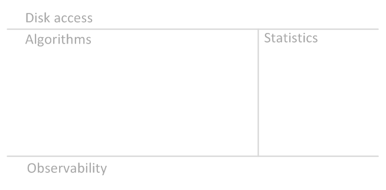
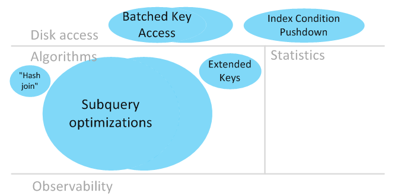
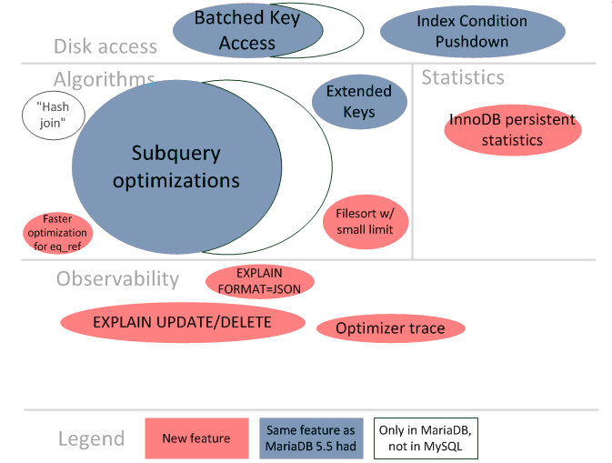
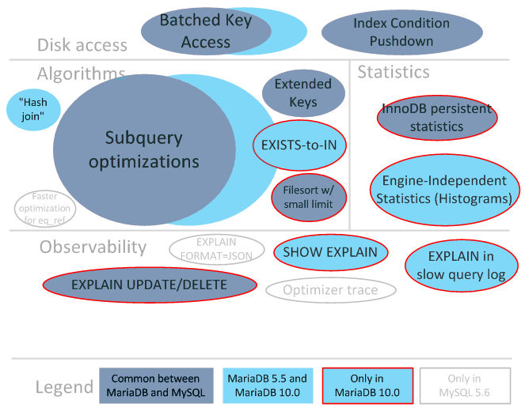

# Differences Between the MySQL and MariaDB Query Optimizer

This is an overview of query optimizer feature development in recent versions of MariaDB (5.5, 10.0) and MySQL (5.6).

To make things easier to understand, let's first partition the optimizer into areas:

Let's look at things in historical order. There is no known evidence of the use of SQL query optimization by ancient Egyptians. In April 2012, [MariaDB 5.3](../../old-releases/release-notes-mariadb-5-3-series/changes-improvements-in-mariadb-5-3.md) and [MariaDB 5.5](../../old-releases/release-notes-mariadb-5-5-series/changes-improvements-in-mariadb-5-5.md) became stable. (5.5 was a merge of 5.3 with MySQL 5.5). The 5.3/5.5 release included a number of major new query optimizer features:

The size of the bubble roughly corresponds to the impact of the feature (in the opinion of the author of this article). "Hash join" is in quotes, because [this feature](https://github.com/mariadb-corporation/docs-server/blob/test/release-notes/compatibility-and-differences/broken-reference/README.md) is not what is generally meant by hash join in the world of databases. Smaller features and bug fixes are not shown.

In February 2013, MySQL 5.6 had its first stable release. It had a number of new major optimizer features. Some of them had common ancestry with MariaDB's features, and some of them were new developments:

In April 2014, [MariaDB 10.0](../../old-releases/release-notes-mariadb-10-0-series/changes-improvements-in-mariadb-10-0.md) became stable. As compared to [MariaDB 5.5](../../old-releases/release-notes-mariadb-5-5-series/changes-improvements-in-mariadb-5-5.md) had some features that were backported from MySQL 5.6, and also some new features were implemented:

One can see that

* MariaDB has features that MySQL doesn't have
* However, some MySQL 5.6 features were not ported into [MariaDB 10.0](../../old-releases/release-notes-mariadb-10-0-series/changes-improvements-in-mariadb-10-0.md).

The MariaDB team is frequently asked if all features (or feature X) from MySQL 5.6 are available in MariaDB, so here's our position on the features that have not \[yet] been backported:

* EXPLAIN FORMAT=JSON - This is available in MariaDB Server 10.1. Please read the [documentation](https://app.gitbook.com/s/SsmexDFPv2xG2OTyO5yV/reference/sql-statements/administrative-sql-statements/analyze-and-explain-statements/explain-format-json) to know more.
* Optimizer trace - we have doubts whether the feature is usable in its current form. For simple queries, it's easier to analyze using other means; for complex queries, the size of the trace grows beyond any limit. We're looking for input re. how optimizer trace was (or could be) useful to somebody in a real-world setting.
* Faster optimization for eq\_ref - we believe that the optimization is useful, but its implementation in MySQL uses a wrong approach.

## See Also

* [Subquery Optimizations Map for MySQL and MariaDB](https://app.gitbook.com/s/SsmexDFPv2xG2OTyO5yV/ha-and-performance/optimization-and-tuning/query-optimizations/subquery-optimizations/subquery-optimizations-map)
* [Optimizer Feature Comparison Matrix for MySQL and MariaDB](optimizer-feature-comparison-matrix.md)
* EXPLAIN FORMAT=JSON in MySQL 5.6
  * [EXPLAIN FORMAT=JSON vs regular EXPLAIN](https://s.petrunia.net/blog/?p=83)
  * [Engineering behind EXPLAIN FORMAT=JSON (or lack thereof)](https://s.petrunia.net/blog/?p=93)
* SHOW EXPLAIN in [MariaDB 10.0](../../old-releases/release-notes-mariadb-10-0-series/changes-improvements-in-mariadb-10-0.md)
  * [SHOW EXPLAIN in MariaDB 10.0 vs EXPLAIN FOR CONNECTION in MySQL 5.7](https://s.petrunia.net/blog/?p=89)
* [The Optimizer Cost Model from MariaDB 11.0](https://github.com/mariadb-corporation/docs-server/blob/test/release-notes/compatibility-and-differences/broken-reference/README.md)




