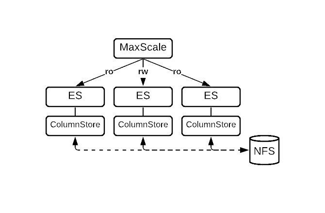

---
layout:
  title:
    visible: true
  description:
    visible: true
  tableOfContents:
    visible: true
  outline:
    visible: true
  pagination:
    visible: true
---

# ColumnStore Shared Local Storage

## Overview

| Software Version                                                                                       | Diagram                                                                | Features                                                                                                                                                                                                                                                                                                                                                             |
| ------------------------------------------------------------------------------------------------------ | ---------------------------------------------------------------------- | -------------------------------------------------------------------------------------------------------------------------------------------------------------------------------------------------------------------------------------------------------------------------------------------------------------------------------------------------------------------- |
| Software Version                                                                                       | Diagram                                                                | Features                                                                                                                                                                                                                                                                                                                                                             |
| <ul><li>Enterprise Server 10.5</li><li>Enterprise Server 10.6</li><li>Enterprise Server 11.4</li></ul> |  | <p>Columnar storage engine with S3-compatible object storage</p><ul><li>Highly available</li><li>Automatic failover via MaxScale and CMAPI</li><li>Scales reads via MaxScale </li><li>Bulk data import</li><li>Enterprise Server 10.5, Enterprise ColumnStore 5, MaxScale 2.5</li><li>Enterprise Server 10.6, Enterprise ColumnStore 23.02, MaxScale 22.08</li></ul> |

This procedure describes the deployment of the ColumnStore Shared Local Storage topology with MariaDB Enterprise Server 10.5, MariaDB Enterprise ColumnStore 5, and MariaDB MaxScale 2.5.

MariaDB Enterprise ColumnStore 5 is a columnar storage engine for MariaDB Enterprise Server 10.5. Enterprise ColumnStore is suitable for Online Analytical Processing (OLAP) workloads.

This procedure has 9 steps, which are executed in sequence.

This procedure represents basic product capability and deploys 3 Enterprise ColumnStore nodes and 1 MaxScale node.

This page provides an overview of the topology, requirements, and deployment procedures.

Please read and understand this procedure before executing.

## Procedure Steps

| Step                                                              | Description                                   |
| ----------------------------------------------------------------- | --------------------------------------------- |
| [Step 1](step-1-prepare-columnstore-nodes.md)                     | Prepare ColumnStore Nodes                     |
| [Step 2](step-2-configure-shared-local-storage.md)                | Configure Shared Local Storage                |
| [Step 3](step-3-install-mariadb-enterprise-server.md)             | Install MariaDB Enterprise Server             |
| [Step 4](step-4-start-and-configure-mariadb-enterprise-server.md) | Start and Configure MariaDB Enterprise Server |
| [Step 5](step-5-test-mariadb-enterprise-server.md)                | Test MariaDB Enterprise Server                |
| [Step 6](step-6-install-mariadb-maxscale.md)                      | Install MariaDB MaxScale                      |
| [Step 7](step-7-start-and-configure-mariadb-maxscale.md)          | Start and Configure MariaDB MaxScale          |
| [Step 8](step-8-test-mariadb-maxscale.md)                         | Test MariaDB MaxScale                         |
| [Step 9](step-9-import-data.md)                                   | Import Data                                   |

## Support

Customers can obtain support by submitting a support case.

## Components

The following components are deployed during this procedure:

| Component                                                                    | Function                                                                                                   |
| ---------------------------------------------------------------------------- | ---------------------------------------------------------------------------------------------------------- |
| Component                                                                    | Function                                                                                                   |
| [MariaDB Enterprise Server](https://app.gitbook.com/s/SsmexDFPv2xG2OTyO5yV/) | Modern SQL RDBMS with high availability, pluggable storage engines, hot online backups, and audit logging. |
| [MariaDB MaxScale](https://app.gitbook.com/s/0pSbu5DcMSW4KwAkUcmX/)          | Database proxy that extends the availability, scalability, and security of MariaDB Enterprise Servers      |

### MariaDB Enterprise Server Components

| Component                                                                         | Description                                                                                                                                                                                                               |
| --------------------------------------------------------------------------------- | ------------------------------------------------------------------------------------------------------------------------------------------------------------------------------------------------------------------------- |
| Component                                                                         | Description                                                                                                                                                                                                               |
| [MariaDB Enterprise ColumnStore](https://app.gitbook.com/s/rBEU9juWLfTDcdwF3Q14/) | • Columnar storage engine • Highly available • Optimized for Online Analytical Processing (OLAP) workloads • Scalable query execution • Cluster Management API (CMAPI) provides a REST API for multi-node administration. |

### MariaDB MaxScale Components

| Component               | Description                                                                                                                                                                                        |
| ----------------------- | -------------------------------------------------------------------------------------------------------------------------------------------------------------------------------------------------- |
| Component               | Description                                                                                                                                                                                        |
| Listener                | Listens for client connections to MaxScale then passes them to the router service                                                                                                                  |
| MariaDB Monitor         | Tracks changes in the state of MariaDB Enterprise Servers.                                                                                                                                         |
| Read Connection Router  | Routes connections from the listener to any available Enterprise ColumnStore node                                                                                                                  |
| Read/Write Split Router | Routes read operations from the listener to any available Enterprise ColumnStore node, and routes write operations from the listener to a specific server that MaxScale uses as the primary server |
| Server Module           | Connection configuration in MaxScale to an Enterprise ColumnStore node                                                                                                                             |

## Topology

The MariaDB Enterprise ColumnStore topology with Object Storage delivers production analytics with high availability, fault tolerance, and limitless data storage by leveraging S3-compatible storage.

The topology consists of:

* One or more MaxScale nodes
* An odd number of ColumnStore nodes (minimum of 3) running ES, Enterprise ColumnStore, and CMAPI

The MaxScale nodes:

* Monitor the health and availability of each ColumnStore node using the MariaDB Monitor (mariadbmon)
* Accept client and application connections
* Route queries to ColumnStore nodes using the Read/Write Split Router (readwritesplit)

The ColumnStore nodes:

* Receive queries from MaxScale
* Execute queries
  * Use [shared local storage](https://app.gitbook.com/s/rBEU9juWLfTDcdwF3Q14/architecture/columnstore-storage-architecture#shared-local-storage) for the [Storage Manager directory](https://app.gitbook.com/s/rBEU9juWLfTDcdwF3Q14/architecture/columnstore-storage-architecture#storage-manager-directory)

## Requirements

These requirements are for the ColumnStore Object Storage topology when deployed with MariaDB Enterprise Server 10.5, MariaDB Enterprise ColumnStore 5, and MariaDB MaxScale 2.5.

* Node Count
* Operating System
* Minimum Hardware Requirements
* Recommended Hardware Requirements
* Storage Requirements
* S3-Compatible Object Storage Requirements
* Preferred Object Storage Providers: Cloud
* Preferred Object Storage Providers: Hardware
* Shared Local Storage Directories
* Shared Local Storage Options
* Recommended Storage Options

### Node Count

* MaxScale nodes, 1 or more are required.
* Enterprise ColumnStore nodes, 3 or more are required for high availability. You should always have an odd number of nodes in a multi-node ColumnStore deployment to avoid split brain scenarios.

### Operating System

In alignment to the [enterprise lifecycle](https://app.gitbook.com/s/aEnK0ZXmUbJzqQrTjFyb/enterprise-server/enterprise-server-lifecycle), the ColumnStore Object Storage topology with MariaDB Enterprise Server 10.5, MariaDB Enterprise ColumnStore 5, and MariaDB MaxScale 2.5 is provided for:

* CentOS Linux 7 (x86\_64)
* Debian 10 (x86\_64)
* Red Hat Enterprise Linux 7 (x86\_64)
* Red Hat Enterprise Linux 8 (x86\_64)
* Ubuntu 18.04 LTS (x86\_64)
* Ubuntu 20.04 LTS (x86\_64)

### Minimum Hardware Requirements

MariaDB Enterprise ColumnStore's minimum hardware requirements are not intended for production environments, but the minimum hardware requirements can be appropriate for development and test environments. For production environments, see the recommended hardware requirements instead.

The minimum hardware requirements are:

| Component                   | CPU      | Memory |
| --------------------------- | -------- | ------ |
| Component                   | CPU      | Memory |
| MaxScale node               | 4+ cores | 4+ GB  |
| Enterprise ColumnStore node | 4+ cores | 4+ GB  |

MariaDB Enterprise ColumnStore will refuse to start if the system has less than 3 GB of memory.

If Enterprise ColumnStore is started on a system with less memory, the following error message will be written to the ColumnStore system log called crit.log:

```
Apr 30 21:54:35 a1ebc96a2519 PrimProc[1004]: 35.668435 |0|0|0| C 28 CAL0000: Error total memory available is less than 3GB.
```

And the following error message will be raised to the client:

```sql
ERROR 1815 (HY000): Internal error: System is not ready yet. Please try again.
```

### Recommended Hardware Requirements

MariaDB Enterprise ColumnStore's recommended hardware requirements are intended for production analytics.

The recommended hardware requirements are:

| Component                   | CPU       | Memory  |
| --------------------------- | --------- | ------- |
| Component                   | CPU       | Memory  |
| MaxScale node               | 8+ cores  | 16+ GB  |
| Enterprise ColumnStore node | 64+ cores | 128+ GB |

### Storage Requirements

The ColumnStore Object Storage topology requires the following storage types:

| Storage Type                                                                                                                              | Description                                                                                                                                                                                                                                      |
| ----------------------------------------------------------------------------------------------------------------------------------------- | ------------------------------------------------------------------------------------------------------------------------------------------------------------------------------------------------------------------------------------------------ |
| Storage Type                                                                                                                              | Description                                                                                                                                                                                                                                      |
| [Shared Local Storage](https://app.gitbook.com/s/rBEU9juWLfTDcdwF3Q14/architecture/columnstore-storage-architecture#shared-local-storage) | The ColumnStore Object Storage topology uses shared local storage for the [Storage Manager directory](https://app.gitbook.com/s/rBEU9juWLfTDcdwF3Q14/architecture/columnstore-storage-architecture#storage-manager-directory) to store metadata. |

### Shared Local Storage Directories

The ColumnStore Object Storage topology uses shared local storage for the Storage Manager directory to store metadata.

The Storage Manager directory is located at the following path by default:

* `/var/lib/columnstore/storagemanager`

### Shared Local Storage Options

The most common shared local storage options for the ColumnStore Object Storage topology are:

| Shared Local Storage                   | Common Usage | Description                                                                                                                                                                                                                                                                                                                                                                                     |
| -------------------------------------- | ------------ | ----------------------------------------------------------------------------------------------------------------------------------------------------------------------------------------------------------------------------------------------------------------------------------------------------------------------------------------------------------------------------------------------- |
| EBS (Elastic Block Store) Multi-Attach | AWS          | • EBS is a high-performance block-storage service for AWS (Amazon Web Services). • EBS Multi-Attach allows an EBS volume to be attached to multiple instances in AWS. Only clustered file systems, such as GFS2, are supported. • For deployments in AWS, EBS Multi-Attach is a recommended option for the Storage Manager directory, and Amazon S3 storage is the recommended option for data. |
| EFS (Elastic File System)              | AWS          | • EFS is a scalable, elastic, cloud-native NFS file system for AWS (Amazon Web Services). • For deployments in AWS, EFS is a recommended option for the Storage Manager directory, and Amazon S3 storage is the recommended option for data. EFS is a scalable, elastic, cloud-native NFS file system for AWS (Amazon Web Services).                                                            |
| Filestore                              | GCP          | • Filestore is high-performance, fully managed storage for GCP (Google Cloud Platform). • For deployments in GCP, Filestore is the recommended option for the Storage Manager directory, and Google Object Storage (S3-compatible) is the recommended option for data.                                                                                                                          |
| GlusterFS                              | On-premises  | • GlusterFS is a distributed file system. • GlusterFS supports replication and failover.                                                                                                                                                                                                                                                                                                        |
| NFS (Network File System)              | On-premises  | • NFS is a distributed file system. • If NFS is used, the storage should be mounted with the sync option to ensure that each node flushes its changes immediately. • For on-premises deployments, NFS is the recommended option for the Storage Manager directory, and any S3-compatible storage is the recommended option for data.                                                            |

## Enterprise ColumnStore Management with CMAPI

Enterprise ColumnStore's CMAPI (Cluster Management API) is a REST API that can be used to manage a multi-node Enterprise ColumnStore cluster.

Many tools are capable of interacting with REST APIs. For example, the curl utility could be used to make REST API calls from the command-line.

Many programming languages also have libraries for interacting with REST APIs.

The examples below show how to use the CMAPI with curl.

### URL Endpoint Format for REST API

```
https://{server}:{port}/cmapi/{version}/{route}/{command}
```

For example:

* [shutdown](https://mcs1:8640/cmapi/0.4.0/cluster/shutdown)
* [start](https://mcs1:8640/cmapi/0.4.0/cluster/start)
* [status](https://mcs1:8640/cmapi/0.4.0/cluster/status)

### Required Request Headers

* `'x-api-key'`: '93816fa66cc2d8c224e62275bd4f248234dd4947b68d4af2b29671dd7d5532dd'
* `'Content-Type'`: 'application/json'

x-api-key can be set to any value of your choice during the first call to the server. Subsequent connections will require this same key.

### Get Status

```bash
$ curl -k -s https://mcs1:8640/cmapi/0.4.0/cluster/status \
      --header 'Content-Type:application/json' \
      --header 'x-api-key:93816fa66cc2d8c224e62275bd4f248234dd4947b68d4af2b29671dd7d5532dd' \
      | jq .
```

### Start Cluster

```bash
$ curl -k -s -X PUT https://mcs1:8640/cmapi/0.4.0/cluster/start \
      --header 'Content-Type:application/json' \
      --header 'x-api-key:93816fa66cc2d8c224e62275bd4f248234dd4947b68d4af2b29671dd7d5532dd' \
      --data '{"timeout":20}' \
      | jq .
```

### Stop Cluster

```bash
$ curl -k -s -X PUT https://mcs1:8640/cmapi/0.4.0/cluster/shutdown \
      --header 'Content-Type:application/json' \
      --header 'x-api-key:93816fa66cc2d8c224e62275bd4f248234dd4947b68d4af2b29671dd7d5532dd' \
      --data '{"timeout":20}' \
      | jq .
```

### Add Node

```bash
$ curl -k -s -X PUT https://mcs1:8640/cmapi/0.4.0/cluster/node \
      --header 'Content-Type:application/json' \
      --header 'x-api-key:93816fa66cc2d8c224e62275bd4f248234dd4947b68d4af2b29671dd7d5532dd' \
      --data '{"timeout":20, "node": "192.0.2.2"}' \
      | jq .
```

### Remove Node

```bash
$ curl -k -s -X DELETE https://mcs1:8640/cmapi/0.4.0/cluster/node \
      --header 'Content-Type:application/json' \
      --header 'x-api-key:93816fa66cc2d8c224e62275bd4f248234dd4947b68d4af2b29671dd7d5532dd' \
      --data '{"timeout":20, "node": "192.0.2.2"}' \
      | jq .
```

## Quick Reference

### MariaDB Enterprise Server Configuration Management

| Method             | Description                                                                                                                                                           |
| ------------------ | --------------------------------------------------------------------------------------------------------------------------------------------------------------------- |
| Method             | Description                                                                                                                                                           |
| Configuration File | Configuration files (such as /etc/my.cnf) can be used to set system-variables and options. The server must be restarted to apply changes made to configuration files. |
| Command-line       | The server can be started with command-line options that set system-variables and options.                                                                            |
| SQL                | Users can set system-variables that support dynamic changes on-the-fly using the SET statement.                                                                       |

MariaDB Enterprise Server packages are configured to read configuration files from different paths, depending on the operating system. Making custom changes to Enterprise Server default configuration files is not recommended because custom changes may be overwritten by other default configuration files that are loaded later.

To ensure that your custom changes will be read last, create a custom configuration file with the z- prefix in one of the include directories.

<table><thead><tr><th valign="top">Distribution</th><th valign="top">Example Configuration File Path</th></tr></thead><tbody><tr><td valign="top"><ul><li>CentOS</li><li>Red Hat Enterprise Linux (RHEL)</li></ul></td><td valign="top">/etc/my.cnf.d/z-custom-mariadb.cnf</td></tr><tr><td valign="top"><ul><li>Debian</li><li>Ubuntu</li></ul></td><td valign="top">/etc/mysql/mariadb.conf.d/z-custom-mariadb.cnf</td></tr></tbody></table>

### MariaDB Enterprise Server Service Management

The systemctl command is used to start and stop the MariaDB Enterprise Server service.

| Operation              | Command                          |
| ---------------------- | -------------------------------- |
| Start                  | `sudo systemctl start mariadb`   |
| Stop                   | `sudo systemctl stop mariadb`    |
| Restart                | `sudo systemctl restart mariadb` |
| Enable during startup  | `sudo systemctl enable mariadb`  |
| Disable during startup | `sudo systemctl disable mariadb` |
| Status                 | `sudo systemctl status mariadb`  |

For additional information, see "[Starting and Stopping MariaDB](../../../server-management/starting-and-stopping-mariadb/)".

### MariaDB Enterprise Server Logs

MariaDB Enterprise Server produces log data that can be helpful in problem diagnosis.

Log filenames and locations may be overridden in the server configuration. The default location of logs is the data directory. The data directory is specified by the datadir system variable.

| Log                                                                                         | System Variable/Option                                                                                                                                    | Default Filename      |
| ------------------------------------------------------------------------------------------- | --------------------------------------------------------------------------------------------------------------------------------------------------------- | --------------------- |
| [MariaDB Error Log](../../../server-management/server-monitoring-logs/error-log.md)         | [log\_error](../../../ha-and-performance/optimization-and-tuning/system-variables/server-system-variables.md#list-of-server-system-variables)             | `<hostname>.err`      |
| [MariaDB Enterprise Audit Log](../../../reference/plugins/mariadb-enterprise-audit.md)      | [server\_audit\_file\_path](../../../reference/plugins/mariadb-audit-plugin/mariadb-audit-plugin-options-and-system-variables.md#server_audit_file_path)  | `server_audit.log`    |
| [Slow Query Log](../../../server-management/server-monitoring-logs/slow-query-log/)         | [slow\_query\_log\_file](../../../ha-and-performance/optimization-and-tuning/system-variables/server-system-variables.md#list-of-server-system-variables) | `<hostname>-slow.log` |
| [General Query Log](../../../server-management/server-monitoring-logs/general-query-log.md) | [general\_log\_file](../../../ha-and-performance/optimization-and-tuning/system-variables/server-system-variables.md#list-of-server-system-variables)     | `<hostname>.log`      |
| [Binary Log](../../../server-management/server-monitoring-logs/binary-log/)                 | [log\_bin](../../../ha-and-performance/standard-replication/replication-and-binary-log-system-variables.md#log_bin)                                       | `<hostname>-bin`      |

### Enterprise ColumnStore Service Management

The systemctl command is used to start and stop the ColumnStore service.

<table><thead><tr><th width="232.962890625">Operation</th><th>Command</th></tr></thead><tbody><tr><td>Start</td><td><code>sudo systemctl start mariadb-columnstore</code></td></tr><tr><td>Stop</td><td><code>sudo systemctl stop mariadb-columnstore</code></td></tr><tr><td>Restart</td><td><code>sudo systemctl restart mariadb-columnstore</code></td></tr><tr><td>Enable during startup</td><td><code>sudo systemctl enable mariadb-columnstore</code></td></tr><tr><td>Disable during startup</td><td><code>sudo systemctl disable mariadb-columnstore</code></td></tr><tr><td>Status</td><td><code>sudo systemctl status mariadb-columnstore</code></td></tr></tbody></table>

In the ColumnStore Object Storage topology, the mariadb-columnstore service should not be enabled. The CMAPI service restarts Enterprise ColumnStore as needed, so it does not need to start automatically upon reboot.

### Enterprise ColumnStore CMAPI Service Management

The systemctl command is used to start and stop the CMAPI service.

<table><thead><tr><th width="248.370361328125">Operation</th><th>Command</th></tr></thead><tbody><tr><td>Start</td><td><code>sudo systemctl start mariadb-columnstore-cmapi</code></td></tr><tr><td>Stop</td><td><code>sudo systemctl stop mariadb-columnstore-cmapi</code></td></tr><tr><td>Restart</td><td><code>sudo systemctl restart mariadb-columnstore-cmapi</code></td></tr><tr><td>Enable during startup</td><td><code>sudo systemctl enable mariadb-columnstore-cmapi</code></td></tr><tr><td>Disable during startup</td><td><code>sudo systemctl disable mariadb-columnstore-cmapi</code></td></tr><tr><td>Status</td><td><code>sudo systemctl status mariadb-columnstore-cmapi</code></td></tr></tbody></table>

For additional information on endpoints, see "CMAPI".

### MaxScale Configuration Management

MaxScale can be configured using several methods. These methods make use of MaxScale's [REST API](https://app.gitbook.com/s/0pSbu5DcMSW4KwAkUcmX/administrative-tools-for-mariadb-maxscale/administrative-tools-for-mariadb-maxscale-rest-api/).

<table><thead><tr><th width="200.962890625">Method</th><th>Benefits</th></tr></thead><tbody><tr><td><a href="https://app.gitbook.com/s/0pSbu5DcMSW4KwAkUcmX/administrative-tools-for-mariadb-maxscale/administrative-tools-for-mariadb-maxscale-maxctrl/">MaxCtrl</a></td><td>Command-line utility to perform administrative tasks through the REST API. See MaxCtrl Commands.</td></tr><tr><td><a href="https://app.gitbook.com/s/0pSbu5DcMSW4KwAkUcmX/administrative-tools-for-mariadb-maxscale/maxgui/">MaxGUI</a></td><td>MaxGUI is a graphical utility that can perform administrative tasks through the REST API.</td></tr><tr><td><a href="https://app.gitbook.com/s/0pSbu5DcMSW4KwAkUcmX/administrative-tools-for-mariadb-maxscale/administrative-tools-for-mariadb-maxscale-rest-api/">REST API</a></td><td>The REST API can be used directly. For example, the curl utility could be used to make REST API calls from the command-line. Many programming languages also have libraries to interact with REST APIs.</td></tr></tbody></table>

The procedure on these pages configures MaxScale using MaxCtrl.

### MaxScale Service Management

The systemctl command is used to start and stop the MaxScale service.>

<table><thead><tr><th width="274.4443359375">Operation</th><th>Command</th></tr></thead><tbody><tr><td>Start</td><td><code>sudo systemctl start maxscale</code></td></tr><tr><td>Stop</td><td><code>sudo systemctl stop maxscale</code></td></tr><tr><td>Restart</td><td><code>sudo systemctl restart maxscale</code></td></tr><tr><td>Enable during startup</td><td><code>sudo systemctl enable maxscale</code></td></tr><tr><td>Disable during startup</td><td><code>sudo systemctl disable maxscale</code></td></tr><tr><td>Status</td><td><code>sudo systemctl status maxscale</code></td></tr></tbody></table>

For additional information, see "Start and Stop Services".

## Next Step

Navigation in the procedure Shared Local Storage topology

Next: Step 1: Prepare ColumnStore Nodes.

<sub>_This page is: Copyright © 2025 MariaDB. All rights reserved._</sub>
