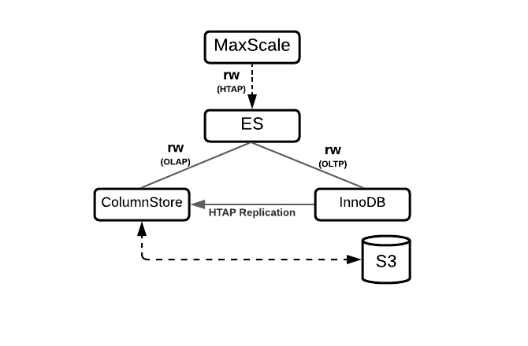

# HTAP

## Overview

<table><thead><tr><th valign="top">Software Version</th><th valign="top">Diagram</th><th valign="top">Features</th></tr></thead><tbody><tr><td valign="top"><ul><li>Enterprise Server 10.5</li><li>Enterprise Server 10.6</li><li>Enterprise Server 11.4</li></ul></td><td valign="top"></td><td valign="top"><p><strong>Single-stack hybrid transactional/analytical workloads</strong></p><ul><li>ColumnStore for analytics with scalable S3-compatible object storage</li><li>InnoDB for transactions</li><li>Cross-engine JOINs</li><li>Enterprise Server 10.5, Enterprise ColumnStore 5, MaxScale 2.5</li><li>Enterprise Server 10.6, Enterprise ColumnStore 23.02, MaxScale 22.08</li></ul></td></tr></tbody></table>

This procedure describes the deployment of the **HTAP topology** with MariaDB Enterprise Server and MariaDB Enterprise ColumnStore.

MariaDB Enterprise ColumnStore is a columnar storage engine for MariaDB Enterprise Server. This topology is best suited for Hybrid Transactional-Analytical Processing (HTAP) workloads.

This procedure has 4 steps, which are executed in sequence.

This procedure represents the basic product capability and uses 1 Enterprise ColumnStore node.

This page provides an overview of the topology, requirements, and deployment procedures.

Please read and understand this procedure before executing.

## Procedure Steps

| Step                                                              | Description                                   |
| ----------------------------------------------------------------- | --------------------------------------------- |
| [Step 1](step-1-prepare-columnstore-node.md)                      | Prepare ColumnStore Node                      |
| [Step 2](step-2-install-mariadb-enterprise-server.md)             | Install MariaDB Enterprise Server             |
| [Step 3](step-3-start-and-configure-mariadb-enterprise-server.md) | Start and Configure MariaDB Enterprise Server |
| [Step 4](step-4-test-mariadb-enterprise-server.md)                | Test MariaDB Enterprise Server                |

## Support

Customers can obtain support by [submitting a support case](broken-reference/).

## Components

The following components are deployed during this procedure:

<table><thead><tr><th valign="top">Component</th><th valign="top">Function</th></tr></thead><tbody><tr><td valign="top">MariaDB Enterprise Server</td><td valign="top">Modern SQL RDBMS with high availability, pluggable storage engines, hot online backups, and audit logging.</td></tr></tbody></table>

## MariaDB Enterprise Server Components

<table><thead><tr><th valign="top">Component</th><th valign="top">Description</th></tr></thead><tbody><tr><td valign="top"><a href="../../../server-usage/storage-engines/innodb/">InnoDB</a></td><td valign="top"><ul><li>General purpose storage engine</li><li>Support for Online Transactional Processing (OLTP) workloads</li><li>ACID-compliant</li><li>Performance</li></ul></td></tr><tr><td valign="top"><a href="https://app.gitbook.com/o/diTpXxF5WsbHqTReoBsS/s/rBEU9juWLfTDcdwF3Q14/">MariaDB Enterprise ColumnStore</a></td><td valign="top"><ul><li>Columnar storage engine</li><li>Optimized for Online Analytical</li><li>Processing (OLAP) workloads</li><li>Scalable query execution</li></ul></td></tr></tbody></table>

## Topology

<figure><figcaption></figcaption></figure>

The MariaDB Enterprise ColumnStore HTAP topology is designed for hybrid transactional-analytical processing (HTAP) workloads.

The topology consists of:

* One MaxScale node
* One ColumnStore node running ES and Enterprise ColumnStore

The MaxScale node:

* Monitors the health and availability of the ColumnStore node using the MariaDB Monitor (mariadbmon)
* Accepts client and application connections
* Routes queries to the ColumnStore node using the Read/Write Split Router (readwritesplit)

The ColumnStore node:

* Receives queries from MaxScale
* Executes queries
* Uses a row-based storage engine, such as [InnoDB](../../../server-usage/storage-engines/innodb/) to handle transactional queries
* Uses Enterprise ColumnStore as the columnar storage engine to handle analytical queries
* Uses cross-engine JOINs to join transactional and analytical tables
* Replicates data between engines using [MariaDB Replication](../../../ha-and-performance/standard-replication/)
* Optionally uses S3-compatible object storage for Enterprise ColumnStore data

## Requirements

These requirements are for the HTAP topology when deployed with MariaDB Enterprise Server 11.4 and MariaDB Enterprise ColumnStore.

* [Operating System](./#operating-system)
* [S3-Compatible Object Storage Option](./#s3-compatible-object-storage-option)
* [Preferred Object Storage Providers: Cloud](./#preferred-object-storage-providers-cloud)
* [Preferred Object Storage Providers: Hardware](./#preferred-object-storage-providers-hardware)

### Operating System

In alignment to the [enterprise lifecycle](https://app.gitbook.com/s/aEnK0ZXmUbJzqQrTjFyb/enterprise-server/enterprise-server-lifecycle), the HTAP topology with MariaDB Enterprise Server 11.4 and MariaDB Enterprise ColumnStore is provided for:

* Debian 11 (x86\_64, ARM64)
* Debian 12 (x86\_64, ARM64)
* Red Hat Enterprise Linux 8 (x86\_64, ARM64)
* Red Hat Enterprise Linux 9 (x86\_64, ARM64)
* Rocky Linux 8 (x86\_64, ARM64)
* Rocky Linux 9 (x86\_64, ARM64)
* Ubuntu 20.04 LTS (x86\_64, ARM64)
* Ubuntu 22.04 LTS (x86\_64, ARM64)
* Ubuntu 24.04 LTS (x86\_64, ARM64)

### S3-Compatible Object Storage Option

The HTAP topology can use S3-compatible object storage to store ColumnStore data, but it is not required.

Many S3-compatible object storage services exist. MariaDB Corporation cannot make guarantees about all S3-compatible object storage services, because different services provide different functionality.

For the preferred S3-compatible object storage providers that provide cloud and hardware solutions, see the following sections:

* [Cloud](./#preferred-object-storage-providers-cloud)
* [Hardware](./#preferred-object-storage-providers-hardware)

The use of non-cloud and non-hardware providers is at your own risk.

If you have any questions about using specific S3-compatible object storage with MariaDB Enterprise ColumnStore, [contact us](broken-reference/).

### Preferred Object Storage Providers: Cloud

* Amazon Web Services (AWS) S3
* Google Cloud Storage
* Azure Storage
* Alibaba Cloud Object Storage Service

### Preferred Object Storage Providers: Hardware

* Cloudian HyperStore
* Dell EMC
* Seagate Lyve Rack
* Quantum ActiveScale
* IBM Cloud Object Storage

## Limitations

### Cross-Database Queries

This implementation relies on replicate\_rewrite\_db, so it does not support cross-database queries with statement-based replication.

For example, if the replicated database is selected by the USE, then the query will replicate properly:

```sql
USE innodb_db;

INSERT INTO htap_test1
   VALUES (100);
```

```sql
SELECT * FROM columnstore_db.htap_test1;

+------+
| id   |
+------+
|  100 |
+------+
```

However, if the replicated database is not selected, and it is instead prefixed the table name in the query, then the query will _not_ replicate properly:

```sql
USE columnstore_db;

INSERT INTO innodb_db.htap_test1
   VALUES (200);
```

```sql
SELECT * FROM columnstore_db.htap_test1;

+------+
| id   |
+------+
|  100 |
+------+
```

### Semi-Synchronous Replication

This implementation has not been tested with semi-synchronous replication.

### Parallel Replication

This implementation has not been tested with parallel replication.

### Row-Based Replication

This implementation requires the [binlog\_format](../../../ha-and-performance/standard-replication/replication-and-binary-log-system-variables.md#binlog_format) system variable to be set to `STATEMENT`. Row-based replication is not currently supported.

## Quick Reference

### MariaDB Enterprise Server Configuration Management

<table><thead><tr><th width="165.4073486328125" valign="top">Method</th><th valign="top">Description</th></tr></thead><tbody><tr><td valign="top">Configuration File</td><td valign="top">Configuration files (such as /etc/my.cnf) can be used to set system-variables and options. The server must be restarted to apply changes made to configuration files.</td></tr><tr><td valign="top">Command-line</td><td valign="top">The server can be started with command-line options that set system-variables and options.</td></tr><tr><td valign="top">SQL</td><td valign="top">Users can set system-variables that support dynamic changes on-the-fly using the SET statement.</td></tr></tbody></table>

MariaDB Enterprise Server packages are configured to read configuration files from different paths, depending on the operating system. Making custom changes to Enterprise Server default configuration files is not recommended because custom changes may be overwritten by other default configuration files that are loaded later.

To ensure that your custom changes will be read last, create a custom configuration file with the z- prefix in one of the include directories.

<table><thead><tr><th valign="top">Distribution</th><th valign="top">Example Configuration File Path</th></tr></thead><tbody><tr><td valign="top"><ul><li>CentOS</li><li>Red Hat Enterprise Linux (RHEL)</li></ul></td><td valign="top">/etc/my.cnf.d/z-custom-mariadb.cnf</td></tr><tr><td valign="top"><ul><li>Debian</li><li>Ubuntu</li></ul></td><td valign="top">/etc/my.cnf.d/z-custom-mariadb.cnf</td></tr></tbody></table>

## MariaDB Enterprise Server Service Management

The systemctl command is used to start and stop the MariaDB Enterprise Server service.

<table><thead><tr><th width="244.814697265625">Operation</th><th>Command</th></tr></thead><tbody><tr><td>Start</td><td><code>sudo systemctl start mariadb</code></td></tr><tr><td>Stop</td><td><code>sudo systemctl stop mariadb</code></td></tr><tr><td>Restart</td><td><code>sudo systemctl restart mariadb</code></td></tr><tr><td>Enable during startup</td><td><code>sudo systemctl enable mariadb</code></td></tr><tr><td>Disable during startup</td><td><code>sudo systemctl disable mariadb</code></td></tr><tr><td>Status</td><td><code>sudo systemctl status mariadb</code></td></tr></tbody></table>

For additional information, see "[Starting and Stopping MariaDB](../../../server-management/starting-and-stopping-mariadb/)".

## MariaDB Enterprise Server Logs

MariaDB Enterprise Server produces log data that can be helpful in problem diagnosis.

Log filenames and locations may be overridden in the server configuration. The default location of logs is the data directory. The data directory is specified by the datadir system variable.

| Log                                                                                         | System Variable/Option                                                                                                                                    | Default Filename      |
| ------------------------------------------------------------------------------------------- | --------------------------------------------------------------------------------------------------------------------------------------------------------- | --------------------- |
| [MariaDB Error Log](../../../server-management/server-monitoring-logs/error-log.md)         | [log\_error](../../../ha-and-performance/optimization-and-tuning/system-variables/server-system-variables.md#list-of-server-system-variables)             | `<hostname>.err`      |
| [MariaDB Enterprise Audit Log](../../../reference/plugins/mariadb-enterprise-audit.md)      | [server\_audit\_file\_path](../../../reference/plugins/mariadb-audit-plugin/mariadb-audit-plugin-options-and-system-variables.md#server_audit_file_path)  | `server_audit.log`    |
| [Slow Query Log](../../../server-management/server-monitoring-logs/slow-query-log/)         | [slow\_query\_log\_file](../../../ha-and-performance/optimization-and-tuning/system-variables/server-system-variables.md#list-of-server-system-variables) | `<hostname>-slow.log` |
| [General Query Log](../../../server-management/server-monitoring-logs/general-query-log.md) | [general\_log\_file](../../../ha-and-performance/optimization-and-tuning/system-variables/server-system-variables.md#list-of-server-system-variables)     | `<hostname>.log`      |
| [Binary Log](../../../server-management/server-monitoring-logs/binary-log/)                 | [log\_bin](../../../ha-and-performance/standard-replication/replication-and-binary-log-system-variables.md#log_bin)                                       | `<hostname>-bin`      |

## Enterprise ColumnStore Service Management

The systemctl command is used to start and stop the ColumnStore service.

<table><thead><tr><th width="224.6666259765625">Operation</th><th>Command</th></tr></thead><tbody><tr><td>Start</td><td><code>sudo systemctl start mariadb-columnstore</code></td></tr><tr><td>Stop</td><td><code>sudo systemctl stop mariadb-columnstore</code></td></tr><tr><td>Restart</td><td><code>sudo systemctl restart mariadb-columnstore</code></td></tr><tr><td>Enable during startup</td><td><code>sudo systemctl enable mariadb-columnstore</code></td></tr><tr><td>Disable during startup</td><td><code>sudo systemctl disable mariadb-columnstore</code></td></tr><tr><td>Status</td><td><code>sudo systemctl status mariadb-columnstore</code></td></tr></tbody></table>

## Next Step

Navigation in the procedure "Deploy HTAP Topology".

Next: Step 1: Prepare ColumnStore Node.

<sub>_This page is: Copyright © 2025 MariaDB. All rights reserved._</sub>
