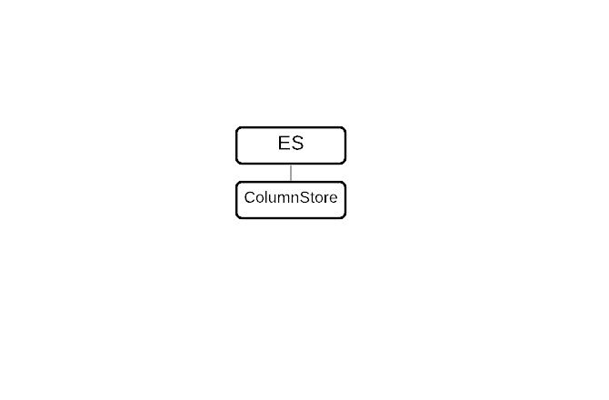

# Enterprise Server with ColumnStore (Local Storage)

This procedure describes the deployment of the **Single-Node Enterprise ColumnStore** topology with Local storage.

MariaDB Enterprise ColumnStore 23.10 is a columnar storage engine for MariaDB Enterprise Server 10.6. Enterprise ColumnStore is best suited for Online Analytical Processing (OLAP) workloads.

This procedure has 5 steps, which are executed in sequence.

This page provides an overview of the topology, requirements, and deployment procedures.

Please read and understand this procedure before executing.

## Procedure Steps

<table><thead><tr><th width="170.148193359375">Step</th><th>Description</th></tr></thead><tbody><tr><td>Step 1</td><td><a href="step-1-prepare-systems-for-enterprise-columnstore-nodes.md">Prepare System for Enterprise ColumnStore</a></td></tr><tr><td>Step 2</td><td><a href="step-2-install-enterprise-columnstore.md">Install Enterprise ColumnStore</a></td></tr><tr><td>Step 3</td><td><a href="step-3-start-and-configure-enterprise-columnstore.md">Start and Configure Enterprise ColumnStore 23.10</a></td></tr><tr><td>Step 4</td><td><a href="step-4-test-enterprise-columnstore.md">Test Enterprise ColumnStore</a></td></tr><tr><td>Step 5</td><td><a href="step-5-bulk-import-of-data.md">Bulk Import Data to Enterprise ColumnStore</a></td></tr></tbody></table>

## Support

Customers can obtain support by [submitting a support case](https://github.com/mariadb-corporation/docs-server/blob/test/server/architecture/topologies/single-node-topologies/enterprise-server-with-columnstore-local-storage/broken-reference/README.md).

## Components

The following components are deployed during this procedure:

<table><thead><tr><th width="266.1480712890625" valign="top">Component</th><th valign="top">Function</th></tr></thead><tbody><tr><td valign="top">MariaDB Enterprise Server</td><td valign="top">Modern SQL RDBMS with high availability, pluggable storage engines, hot online backups, and audit logging.</td></tr></tbody></table>

#### MariaDB Enterprise Server Components

<table><thead><tr><th valign="top">Component</th><th valign="top">Description</th></tr></thead><tbody><tr><td valign="top"><a href="https://app.gitbook.com/o/diTpXxF5WsbHqTReoBsS/s/rBEU9juWLfTDcdwF3Q14/">MariaDB Enterprise ColumnStore</a></td><td valign="top"><ul><li>Columnar Storage Engine</li><li>Optimized for Online Analytical Processing (OLAP) workloads</li></ul></td></tr></tbody></table>

## Topology

<figure><figcaption></figcaption></figure>

The Single-Node Enterprise ColumnStore topology provides support for Online Analytical Processing (OLAP) workloads to MariaDB Enterprise Server.

The Enterprise ColumnStore node:

* Receives queries from the application
* Executes queries
* Uses the local disk for storage.

### High Availability

Single-Node Enterprise ColumnStore does not provide high availability (HA) for Online Analytical Processing (OLAP). If you would like to deploy Enterprise ColumnStore with high availability, see [Enterprise ColumnStore with Shared Local storage](../../columnstore-shared-local-storage/).

## Requirements

These requirements are for the Single-Node Enterprise ColumnStore, when deployed with MariaDB Enterprise Server 10.6 and MariaDB Enterprise ColumnStore 23.10.

### Operating System

* Debian 11 (x86\_64, ARM64)
* Debian 12 (x86\_64, ARM64)
* Red Hat Enterprise Linux 8 (x86\_64, ARM64)
* Red Hat Enterprise Linux 9 (x86\_64, ARM64)
* Rocky Linux 8 (x86\_64, ARM64)
* Rocky Linux 9 (x86\_64, ARM64)
* Ubuntu 20.04 LTS (x86\_64, ARM64)
* Ubuntu 22.04 LTS (x86\_64, ARM64)
* Ubuntu 24.04 LTS (x86\_64, ARM64)

### Minimum Hardware Requirements

MariaDB Enterprise ColumnStore's minimum hardware requirements are not intended for production environments, but the minimum hardware requirements can be appropriate for development and test environments. For production environments, see the [recommended hardware requirements](./#recommended-hardware-requirements) instead.

The minimum hardware requirements are:

| Component                   | CPU      | Memory |
| --------------------------- | -------- | ------ |
| Enterprise ColumnStore node | 4+ cores | 16+ GB |

MariaDB Enterprise ColumnStore will refuse to start if the system has less than 3 GB of memory.

If Enterprise ColumnStore is started on a system with less memory, the following error message will be written to the ColumnStore system log called `crit.log`:

```
Apr 30 21:54:35 a1ebc96a2519 PrimProc[1004]: 35.668435 |0|0|0| C 28 CAL0000: Error total memory available is less than 3GB.
```

And the following error message will be raised to the client:

```
ERROR 1815 (HY000): Internal error: System is not ready yet. Please try again.
```

### Recommended Hardware Requirements

MariaDB Enterprise ColumnStore's recommended hardware requirements are intended for production analytics.

The recommended hardware requirements are:

| Component                   | CPU       | Memory  |
| --------------------------- | --------- | ------- |
| Enterprise ColumnStore node | 64+ cores | 128+ GB |

### Quick Reference

#### MariaDB Enterprise Server Configuration Management

| Method             | Description                                                                                                                                                                                                                                                                                                                              |
| ------------------ | ---------------------------------------------------------------------------------------------------------------------------------------------------------------------------------------------------------------------------------------------------------------------------------------------------------------------------------------- |
| Configuration File | Configuration files (such as `/etc/my.cnf`) can be used to set [system variables](../../../../ha-and-performance/optimization-and-tuning/system-variables/) and [options](../../../../reference/full-list-of-mariadb-options-system-and-status-variables.md). The server must be restarted to apply changes made to configuration files. |
| Command-line       | The server can be started with command-line options that set [system variables](../../../../ha-and-performance/optimization-and-tuning/system-variables/) and [options](../../../../reference/full-list-of-mariadb-options-system-and-status-variables.md).                                                                              |
| SQL                | Users can set [system variables](../../../../ha-and-performance/optimization-and-tuning/system-variables/) that support dynamic changes on-the-fly using the [SET](../../../../reference/sql-statements/administrative-sql-statements/set-commands/set.md) statement.                                                                    |

MariaDB Enterprise Server packages are configured to read configuration files from different paths, depending on the operating system. Making custom changes to Enterprise Server default configuration files is not recommended because custom changes may be overwritten by other default configuration files that are loaded later.

To ensure that your custom changes will be read last, create a custom configuration file with the `z-` prefix in one of the include directories.

<table><thead><tr><th valign="top">Distribution</th><th valign="top">Example Configuration File Path</th></tr></thead><tbody><tr><td valign="top"><ul><li>CentOS</li><li>Red Hat Enterprise Linux (RHEL)</li></ul></td><td valign="top"><code>/etc/my.cnf.d/z-custom-mariadb.cnf</code></td></tr><tr><td valign="top"><ul><li>Debian</li><li>Ubuntu</li></ul></td><td valign="top"><code>/etc/mysql/mariadb.conf.d/z-custom-mariadb.cnf</code></td></tr></tbody></table>

#### MariaDB Enterprise Server Service Management

The `systemctl` command is used to start and stop the MariaDB Enterprise Server service.

<table><thead><tr><th width="262.5926513671875">Operation</th><th>Command</th></tr></thead><tbody><tr><td>Start</td><td><code>sudo systemctl start mariadb</code></td></tr><tr><td>Stop</td><td><code>sudo systemctl stop mariadb</code></td></tr><tr><td>Restart</td><td><code>sudo systemctl restart mariadb</code></td></tr><tr><td>Enable during startup</td><td><code>sudo systemctl enable mariadb</code></td></tr><tr><td>Disable during startup</td><td><code>sudo systemctl disable mariadb</code></td></tr><tr><td>Status</td><td><code>sudo systemctl status mariadb</code></td></tr></tbody></table>

### Next Step

Navigation in the Single-Node Enterprise ColumnStore topology with Local storage deployment procedure:

* Next: Step 1: Install MariaDB Enterprise ColumnStore 23.10.
