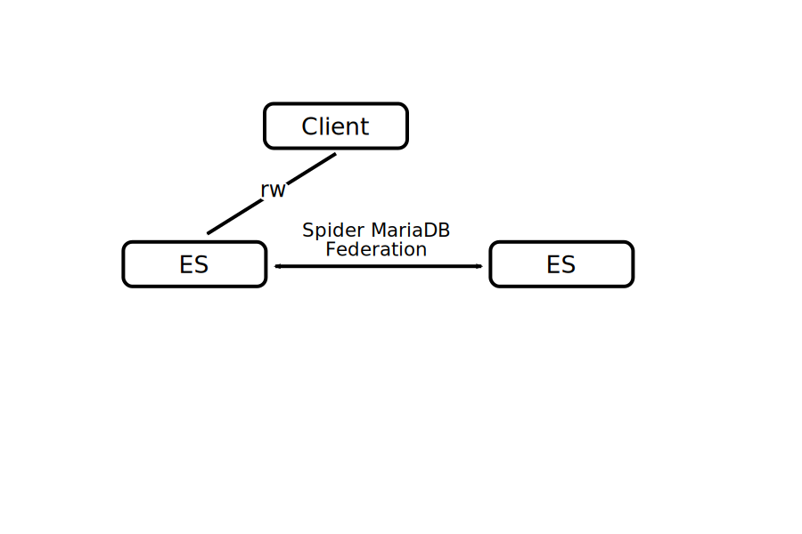

# Spider Storage Engine

### Spider Topologies

#### Spider Federated

MariaDB Enterprise Spider enables reading from and writing to tables on remote Enterprise Server nodes. It uses the Spider storage engine for "virtual" Federated Spider Tables, querying Data Tables on Data Nodes (which use non-Spider engines) via a MariaDB foreign data wrapper. This solution supports transactions and is available with Enterprise Server 10.3+.

|  | <ul><li><strong>Read from and write to tables on remote ES nodes</strong></li><li>Spider Node uses Spider storage engine for Federated Spider Tables</li><li>Federated Spider Table is a "virtual" table</li><li>Spider uses MariaDB foreign data wrapper to query Data Table on Data Node</li><li>Data Node uses non-Spider storage engine for Data Tables</li><li>Supports transactions</li><li>Enterprise Server 10.3+, Enterprise Spider</li></ul> |
| ------------------------------------------------------------------------ | ------------------------------------------------------------------------------------------------------------------------------------------------------------------------------------------------------------------------------------------------------------------------------------------------------------------------------------------------------------------------------------------------------------------------------------------------------ |

#### Spider Sharded

MariaDB Enterprise Spider facilitates horizontal scalability by sharding tables. It uses the Spider storage engine for partitioned "virtual" Sharded Spider Tables, querying Data Tables on Data Nodes (using non-Spider engines) for each partition via a MariaDB foreign data wrapper. This solution supports transactions and is available with Enterprise Server 10.3+.

| .svg>) | <ul><li><strong>Shard tables for horizontal scalability</strong></li><li>Spider Node uses Spider storage engine for Sharded Spider Tables</li><li>Sharded Spider Table is a partitioned "virtual" table</li><li>Spider uses MariaDB foreign data wrapper to query Data Tables on Data Nodes for each partition</li><li>Data Node uses non-Spider storage engine for Data Tables</li><li>Supports transactions</li><li>Enterprise Server 10.3+, Enterprise Spider</li></ul> |
| -------------------------------------------------------------------------- | -------------------------------------------------------------------------------------------------------------------------------------------------------------------------------------------------------------------------------------------------------------------------------------------------------------------------------------------------------------------------------------------------------------------------------------------------------------------------- |




