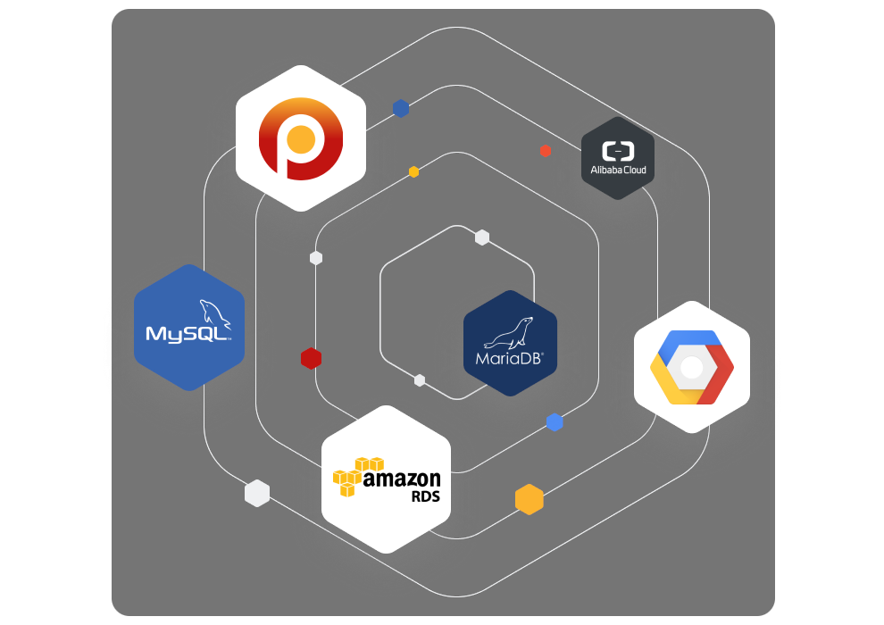

# dbForge Documenter for MariaDB and MySQL

 [**dbForge Documenter**](https://www.devart.com/dbforge/mysql/documenter/) is a useful tool for the MariaDB database that allows for the automatic generation of database documentation in such formats as HTML, PDF, and Markdown. Users can adjust the created documentation with a great variety of options.

## dbForge Documenter for MariaDB and MySQL Key Features:

### 1. Searchable MariaDB & MySQL documentation

Get the benefits of the search as you type principle

View the highlighted matching text after entering the name of a required object in the search field

### 2. Broad compatibility options

MariaDB server versions 5.5-11.4

Various cloud services: Amazon RDS, Amazon Aurora, Google Cloud, Oracle MySQL Cloud, Alibaba Cloud

Security connections: Secure Socket Layer (SSL), Secure Shell (SSH), HTTP Tunneling, PAM Percona

### 3. Broad picture of database structure

Get the detailed MariaDB database information, such as types, details, and properties of the objects, inter-object dependencies, and DDL codes

### 4. Rich customization of document management

Enjoy various style templates allowing for alteration of documentation layout

### 5. Several Document Formats supported:

* HTML and PDF (searchable formats)
* Markdown

### 6. Extended properties support

Edit an object description or add it if it is not specified

Download a free 30-day trial of dbForge Documenter for MariaDB and MySQL [here](https://www.devart.com/dbforge/mysql/documenter/download.html).

[Documentation](https://docs.devart.com/documenter-for-mysql/)

| Version                 | Introduced                                                                                                                                                                                                                                                                                                                        |
| ----------------------- | --------------------------------------------------------------------------------------------------------------------------------------------------------------------------------------------------------------------------------------------------------------------------------------------------------------------------------- |
| dbForge Documenter 10.1 | Support for the rds-ca-rsa2048-g1 SSL/TLS certificate for connecting to MariaDB servers on AWS and enhanced cloud compatibility features, new automation capabilities                                                                                                                                                             |
| dbForge Documenter 10.0 | Support for [MariaDB 11.4](https://app.gitbook.com/s/aEnK0ZXmUbJzqQrTjFyb/community-server/mariadb-11-4-series/what-is-mariadb-114), Added support for temporal tables in MariaDB                                                                                                                                                 |
| dbForge Documenter 2.2  | Support for [MariaDB 11.3](https://app.gitbook.com/s/aEnK0ZXmUbJzqQrTjFyb/community-server/old-releases/release-notes-mariadb-11-3-rolling-releases/what-is-mariadb-113)                                                                                                                                                          |
| dbForge Documenter 2.1  | Support for [MariaDB 10.9](https://app.gitbook.com/s/aEnK0ZXmUbJzqQrTjFyb/community-server/old-releases/release-notes-mariadb-10-9-series/what-is-mariadb-109), Support for [MariaDB 10.10](https://app.gitbook.com/s/aEnK0ZXmUbJzqQrTjFyb/community-server/old-releases/release-notes-mariadb-10-10-series/what-is-mariadb-1010) |
| dbForge Documenter 2.0  | Connectivity support for [MariaDB 10.5](https://app.gitbook.com/s/aEnK0ZXmUbJzqQrTjFyb/community-server/old-releases/mariadb-10-5-series/what-is-mariadb-105) is added                                                                                                                                                            |
| dbForge Documenter 1.2  | Support for [MariaDB 10.4](https://app.gitbook.com/s/aEnK0ZXmUbJzqQrTjFyb/community-server/old-releases/release-notes-mariadb-10-4-series/what-is-mariadb-104)                                                                                                                                                                    |
| dbForge Documenter 1.1  | Support for [MariaDB 10.3](https://app.gitbook.com/s/aEnK0ZXmUbJzqQrTjFyb/community-server/old-releases/release-notes-mariadb-10-3-series/what-is-mariadb-103)                                                                                                                                                                    |

_This page is licensed: CC BY-SA / Gnu FDL_


