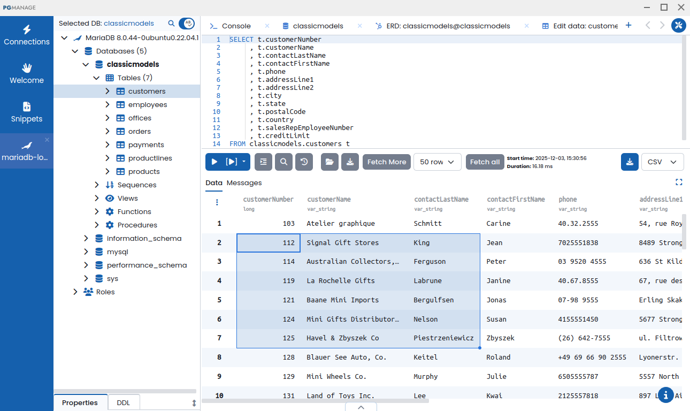

# PgManage

[PgManage](https://www.commandprompt.com/products/pgmanage/) is a modern SQL editor database management toolkit.

PgManage supports MariaDB along many other databases.

## Features:

**Desktop or Browser-based:** Runs as desktop application or can be installed as a webapp and used in a browser.
**Modern Interface:** The UI is optimized to be easy to use efficient to navigate.
**Multiple Workspaces:** Work with many database sessions at once and easily switch between them
**Secure:** Sensitive information like DB passwords, SSH keys etc. is stored in an encrypted form and protected by Master Password.
**Schema and Table Editors:** Create/alter tables and manage data using intuitive and clean UI.
**Smart SQL Editor:** Context-aware code completion, error annotations, powerful search and replace.
**Light or Dark:** Different themes to choose from.
**Tabbed Workspace:** Keep multiple editors and other tools open and easily switch between them.
**Quick Search:** Easily find an object in DB Explorer using a fuzzy search dialog.
**Tunneling:** Connect to your databases via SSH tunnel if it is not directly accessible.

## Links:

Product Page [www.commandprompt.com/products/pgmanage](https://www.commandprompt.com/products/pgmanage/).
Github Project [www.commandprompt.com/products/pgmanage](https://github.com/commandprompt/pgmanage).

_This page is licensed: CC BY-SA / Gnu FDL_


