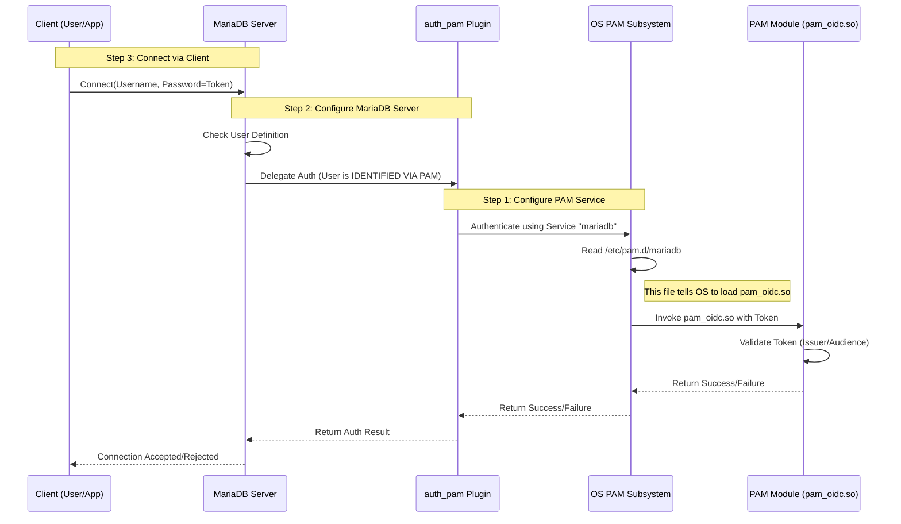

# Authentication with JWT, OIDC, and OAuth 2.0 via PAM


This draft, intended for technical review under DOCS-5715, requires validation for technical accuracy. It includes generated text and code blocks and needs evaluation by a subject matter expert (SME) in this format. Please refrain from relying on any information on the page.


MariaDB Server supports modern authentication standards—including JSON Web Tokens (JWT), OpenID Connect (OIDC), and OAuth 2.0—through its pluggable authentication architecture.

By leveraging the operating system's PAM (Pluggable Authentication Modules) subsystem, MariaDB can integrate with external Identity Providers (IdPs) like AWS Cognito, Google Cloud Identity, and Azure AD without requiring proprietary database plugins. The database delegates the validation of tokens to the underlying OS security layer.

## Prerequisites

Before proceeding, ensure the following components are available:

* MariaDB Server (Active and running).
* PAM Module: You must install a third-party PAM module corresponding to your desired authentication method (e.g., `pam_oidc.so`, `pam_oauth2.so`, or `pam_jwt.so`).
  * _Note: These are system-level libraries installed into `/lib/security` or `/lib64/security`. Ensure the module you choose is actively maintained and compatible with your OS._
* Identity Provider (IdP): You must have your `Issuer URL`, `Client ID`, and `Audience` values ready from your provider (e.g., Google, Okta, Azure).

## Configuration and Connection Workflow

_How to bridge the operating system's authentication layer with MariaDB user management._

### How Authentication Works

Before configuring the system, it is helpful to understand the handshake between the Client, the Database, and the Operating System.





### Configure the PAM Service

You must define a PAM service that loads your chosen module. This file tells the operating system how to validate the credentials passed by MariaDB.

File: `/etc/pam.d/mariadb`

_The specific flags below (like `issuer` or `aud`) are standard OIDC parameters. Consult your specific PAM module's documentation for exact flag syntax._

```bash
# /etc/pam.d/mariadb
# Generic OIDC Configuration Example

# 1. 'auth' checks the validity of the token
auth required pam_oidc.so issuer=https://accounts.google.com aud=YOUR_CLIENT_ID

# 2. 'account' checks if the user is allowed to login (often required by PAM)
account required pam_oidc.so
```


Ensure strict validation of the `aud` (Audience) parameter to confirm that tokens are issued exclusively for your database application, preventing the use of tokens intended for different applications.




### Configure MariaDB Server

Once the OS is configured, you must enable the PAM plugin in MariaDB and create a user that utilizes it.

1. Log in to MariaDB as root.
2.  Install the PAM Plugin:

    ```sql
    INSTALL SONAME 'auth_pam';
    ```
3.  Create the User: The `USING` clause specifies the service name (filename) in `/etc/pam.d/`.

    ```sql
    -- Create a user that maps to the 'sub' (Subject) claim in the token
    CREATE USER 'jdoe'@'%' IDENTIFIED VIA pam USING 'mariadb';
    ```



### Connect via Client

When connecting, the "Password" field is used to transmit the JWT or OIDC Token.

```bash
# 1. Obtain your token (e.g., via gcloud or your IdP's CLI)
export DB_TOKEN="eyJhbGciOiJSUzI1NiIsImtpZ..."

# 2. Connect to MariaDB, passing the token as the password
mariadb --user="jdoe" --password="$DB_TOKEN"
```



## Troubleshooting

*   Authentication Failure: Check the system authentication logs.

    ```bash
    sudo tail -f /var/log/auth.log
    ```

    _Look for errors regarding "invalid audience," "expired token," or "issuer mismatch."_
* SELinux/AppArmor: If the database cannot access the PAM configuration, ensure your security context allows `mysqld` to read from `/etc/pam.d/`.
* Username Mapping: By default, the MariaDB username must match the identity in the token (often the `sub` or `email`claim). Some PAM modules allow you to map these (e.g., mapping `user@example.com` to `user`); check your module's `user_template` or mapping documentation.
