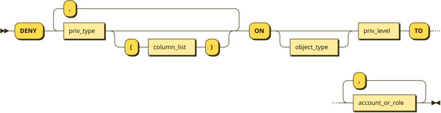
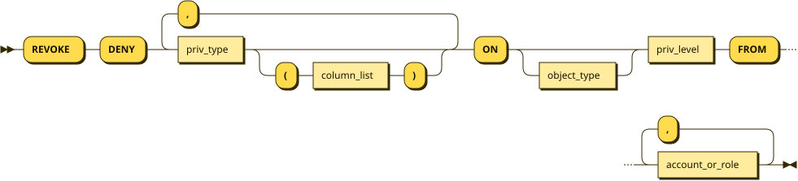

# DENY


`DENY` and `REVOKE DENY` were added in [MariaDB 13.1](https://jira.mariadb.org/browse/MDEV-14443).


## Syntax

```bnf
/* 1. Denying Privileges */
DENY
    priv_type [(column_list)]
      [, priv_type [(column_list)]] ...
    ON [object_type] priv_level
    TO account_or_role [, account_or_role] ...

/* 2. Removing a Deny */
REVOKE DENY
    priv_type [(column_list)]
      [, priv_type [(column_list)]] ...
    ON [object_type] priv_level
    FROM account_or_role [, account_or_role] ...
```





`account_or_role`, `priv_type`, `object_type`, and `priv_level` accept the same values as they do
for [GRANT](grant.md). Sub-rule diagrams are not repeated here — see [GRANT](grant.md#syntax) for
those productions.

## Description

`DENY` records a privilege that an account must never have. Where [GRANT](grant.md) adds a
privilege and [REVOKE](revoke.md) takes a granted privilege away, `DENY` stores a separate,
negative entry that is consulted on every privilege check. As long as the deny exists, the
privilege is refused, no matter how many `GRANT` statements say otherwise:

```sql
GRANT SELECT ON *.* TO alice;
DENY SELECT ON secrets.payroll TO alice;
```

`alice` can now read every table on the server except `secrets.payroll`.

The typical use is the "everything except" case that `GRANT` and `REVOKE` alone handle awkwardly:
grant broadly, then carve out the objects or columns that must stay out of reach.

Use `REVOKE DENY` to remove a deny. Nothing else restores the privilege — there is no privilege
that lets an account bypass a deny, and a later `GRANT` does not cancel one.

To issue `DENY` or `REVOKE DENY`, you need the `GRANT OPTION` privilege plus the privileges you
are denying, exactly as you would to `GRANT` them.

`DENY` applies to privileges only. It cannot be used to deny a role or proxy access, so there is
no `DENY role` or `DENY PROXY` form.

## Deny Levels

A deny is recorded at the level named by `priv_level`, matching the [privilege
levels](grant.md#privilege-levels) used by `GRANT`:

| Level | Syntax | Example |
| --- | --- | --- |
| Global | `*.*` | `DENY SELECT ON *.* TO alice;` |
| Database | `db_name.*` | `DENY INSERT ON hr.* TO alice;` |
| Table | `db_name.tbl_name` | `DENY DELETE ON hr.staff TO alice;` |
| Column | `priv_type (column)` on a table | `DENY SELECT (salary) ON hr.staff TO alice;` |
| Routine | `PROCEDURE`, `FUNCTION`, `PACKAGE`, or `PACKAGE BODY` | `DENY EXECUTE ON FUNCTION hr.bonus TO alice;` |

Global denies cover administrative privileges as well as data privileges. Denying `RELOAD`,
`SHUTDOWN`, `PROCESS`, `FILE`, or `CONNECTION ADMIN` on `*.*` blocks the matching operations even
for an account that holds `ALL PRIVILEGES`:

```sql
GRANT ALL PRIVILEGES ON *.* TO opsuser@localhost;
DENY SHUTDOWN ON *.* TO opsuser@localhost;
```

```sql
SHUTDOWN;
ERROR 42000: Access denied; you need (at least one of) the SHUTDOWN privilege(s) for this operation
```

As with `GRANT`, a routine deny must state the routine type. Leaving it out makes MariaDB read the
name as a table:

```sql
DENY EXECUTE ON hr.bonus TO alice;
ERROR 42000: Illegal GRANT/REVOKE command; please consult the manual to see which privileges can be used
```

## Precedence

Two rules cover every case:

* **A deny beats a grant.** If a privilege is denied anywhere in the hierarchy that applies to an
  object, the privilege is refused.
* **Order does not matter.** `GRANT` then `DENY` and `DENY` then `GRANT` give the same result.

A deny also propagates downwards: a global deny masks database, table, and column grants; a
database deny masks table and column grants; a table deny masks column grants.

```sql
DENY SELECT ON hr.* TO alice;
GRANT SELECT ON hr.staff TO alice;
```

```sql
SELECT * FROM hr.staff;
ERROR 42000: SELECT command denied to user 'alice'@'localhost' for table `hr`.`staff`
```

A deny only affects the privileges it names. Other privileges on the same object are unaffected:

```sql
GRANT SELECT, INSERT ON hr.staff TO alice;
DENY SELECT ON hr.staff TO alice;
```

`alice` can still insert into `hr.staff`; only reading it is refused.

Denies also reach statements that read a table implicitly. An `UPDATE ... WHERE` needs `SELECT` on
the columns in the `WHERE` clause, so a `SELECT` deny stops it, while the same `UPDATE` without a
`WHERE` clause succeeds.

A deny follows the account into definer context as well. A view defined with `SQL SECURITY DEFINER`
fails if the definer is denied the privileges the view needs, even when the invoker holds them.

## Roles and PUBLIC

Denies can be granted to a [role](../../../security/user-account-management/roles/), and they
travel through the role graph the same way privileges do. A deny on any role an account holds wins
over a grant on any other role, at any depth:

```sql
CREATE ROLE reader, blocked, combined;
GRANT SELECT ON hr.staff TO reader;
DENY SELECT ON hr.staff TO blocked;
GRANT reader TO combined;
GRANT blocked TO combined;
GRANT combined TO alice@localhost;
```

With `combined` active, `alice` cannot read `hr.staff`.

Denying to [PUBLIC](grant.md#to-public) blocks a privilege for every account on the server:

```sql
DENY SELECT ON hr.staff TO PUBLIC;
```

## Removing a Deny

`REVOKE DENY` removes the named privileges from an existing deny entry at that exact level. It
fails if there is no matching deny, even when a positive grant exists:

```sql
GRANT INSERT ON hr.* TO alice;
REVOKE DENY INSERT ON hr.* FROM alice;
ERROR 42000: There is no such grant defined for user 'alice' on host '%'
```

`REVOKE DENY` matches by level, so a table-level revoke does not touch column-level denies on the
same table. Remove those by naming the columns:

```sql
DENY DELETE ON hr.staff TO alice;
DENY SELECT (salary) ON hr.staff TO alice;
REVOKE DENY ALL PRIVILEGES ON hr.staff FROM alice;   -- clears the DELETE deny only
REVOKE DENY SELECT (salary) ON hr.staff FROM alice;  -- clears the column deny
```

[REVOKE ALL PRIVILEGES, GRANT OPTION](revoke.md) clears an account's denies along with its grants:

```sql
REVOKE ALL PRIVILEGES, GRANT OPTION FROM alice;
```

Dropping the object a deny points at also removes the deny. Dropping a stored procedure, for
example, deletes the deny entries recorded against it.

## Viewing Denies

[SHOW GRANTS](../administrative-sql-statements/show/show-grants.md) reports denies as separate
`DENY` lines beside the `GRANT` lines:

```sql
SHOW GRANTS FOR alice@localhost;
+---------------------------------------------------------------+
| Grants for alice@localhost                                    |
+---------------------------------------------------------------+
| GRANT USAGE ON *.* TO `alice`@`localhost`                     |
| DENY SELECT ON *.* TO `alice`@`localhost`                     |
| DENY INSERT ON `hr`.* TO `alice`@`localhost`                  |
| GRANT SELECT ON `hr`.`staff` TO `alice`@`localhost`           |
| DENY UPDATE (`salary`) ON `hr`.`staff` TO `alice`@`localhost` |
+---------------------------------------------------------------+
```

`DENY` lines are only visible to a connection that has the `SELECT` privilege on the `mysql`
database. Accounts without it see their own `GRANT` lines but none of their denies, so a deny is
not self-advertising. The same applies to `SHOW GRANTS FOR CURRENT_ROLE`, `SHOW GRANTS FOR role`,
and `SHOW GRANTS FOR PUBLIC`.


The visibility check is itself subject to denies. An account with `SELECT` on `mysql.*` but a deny
on `mysql.global_priv` sees no denies, and cannot run `SHOW GRANTS` for another account.


## Effect on Metadata

Because metadata visibility follows privileges, a deny also hides what the account may not read:

* A global `SELECT` deny hides databases from [SHOW DATABASES](../administrative-sql-statements/show/show-databases.md).
* A table-level `SELECT` deny hides the table from [SHOW TABLES](../administrative-sql-statements/show/show-tables.md), `SHOW TABLE STATUS`, `INFORMATION_SCHEMA.TABLES`, and `INFORMATION_SCHEMA.COLUMNS`, and makes `SHOW CREATE TABLE`, `SHOW COLUMNS`, and `SHOW INDEX` fail.
* A column-level `SELECT` deny hides the denied columns from `SHOW COLUMNS` and `INFORMATION_SCHEMA.COLUMNS`, and drops index rows that use them from `INFORMATION_SCHEMA.STATISTICS` and `INFORMATION_SCHEMA.KEY_COLUMN_USAGE`. The remaining columns stay visible, and `SHOW CREATE TABLE` still prints the full table definition.
* A routine-level `EXECUTE` deny hides that routine from `INFORMATION_SCHEMA.ROUTINES` while leaving the other routines in the database visible.

If every privilege an account holds in a database is denied, [USE](../administrative-sql-statements/use-database.md) is refused as well:

```sql
USE hr;
ERROR 42000: Access denied for user 'alice'@'localhost' to database 'hr'
```

## Storage and Persistence

Denies are stored in the `Priv` JSON document of the
[mysql.global\_priv](../../system-tables/the-mysql-database-tables/mysql-global_priv-table.md)
table, under a `denies` key, and not in `mysql.db`, `mysql.tables_priv`, or `mysql.columns_priv`.
Each array element carries the level in `type`, the object names, and the denied privilege bits:

```sql
SELECT User, Host, JSON_PRETTY(JSON_EXTRACT(Priv, '$.denies')) AS denies
  FROM mysql.global_priv WHERE User = 'alice';
+-------+------+---------------------------+
| User  | Host | denies                    |
+-------+------+---------------------------+
| alice | %    | [                         |
|       |      |     {                     |
|       |      |         "type": "column", |
|       |      |         "db": "hr",       |
|       |      |         "table": "staff", |
|       |      |         "column": "salary",|
|       |      |         "bits": 1         |
|       |      |     }                     |
|       |      | ]                         |
+-------+------+---------------------------+
```

`type` is one of `global`, `db`, `table`, `column`, `function`, `procedure`, `package`, or
`package body`. `bits` uses the same privilege bit values as the `access` field, listed in
[Mapping the access Field Values to Grants](../../system-tables/the-mysql-database-tables/mysql-global_priv-table.md#mapping-the-access-field-values-to-grants).

Denies survive [FLUSH PRIVILEGES](../administrative-sql-statements/flush-commands/flush.md) and a
server restart, and replicate to replicas like any other account management statement.

Column names and routine names in denies are matched case insensitively. Database and table names
follow [lower\_case\_table\_names](../../../ha-and-performance/optimization-and-tuning/system-variables/server-system-variables.md#lower_case_table_names):
with the default `0` on Linux, `DENY SELECT ON DbCase.T` and `DENY SELECT ON dbcase.t` are two
distinct denies.


Editing the `denies` array directly with `UPDATE` is not supported. A malformed entry is skipped at
startup and on `FLUSH PRIVILEGES`, with a `Malformed DENY entry in mysql.global_priv` warning in
the [error log](../../../server-management/server-monitoring-logs/error-log.md) — leaving the
privilege silently allowed. Always use `DENY` and `REVOKE DENY`.


## Comparison with REVOKE

`REVOKE` and `DENY` are not interchangeable:

| | `REVOKE` | `DENY` |
| --- | --- | --- |
| What it does | Removes a granted privilege | Records a permanent block |
| Can a later `GRANT` restore access? | Yes | No |
| Effect of a broader grant | A grant at a higher level still applies | Refused regardless of level |
| How to undo | `GRANT` | `REVOKE DENY` |

If an account holds `SELECT ON *.*` and you revoke `SELECT` on one table, the global grant still
covers that table. A deny is what actually excludes it.

## Examples

Grant broad access, then exclude one table:

```sql
CREATE USER analyst@'%' IDENTIFIED BY 'secret';
GRANT SELECT ON sales.* TO analyst@'%';
DENY SELECT ON sales.customer_pii TO analyst@'%';
```

Hide two columns while leaving the rest of the table readable:

```sql
GRANT SELECT ON hr.staff TO analyst@'%';
DENY SELECT (salary, ssn) ON hr.staff TO analyst@'%';
```

```sql
SELECT id, name FROM hr.staff;   -- succeeds
SELECT * FROM hr.staff;
ERROR 42000: SELECT command denied to user 'analyst'@'%' for column 'salary' in table 'staff'
```

Stop an account from writing to a column it can otherwise insert into:

```sql
GRANT SELECT, INSERT ON hr.audit_log TO app@localhost;
DENY INSERT (modified_by) ON hr.audit_log TO app@localhost;
```

Block a function while leaving a procedure callable:

```sql
GRANT EXECUTE ON PROCEDURE hr.refresh TO app@localhost;
GRANT EXECUTE ON FUNCTION hr.bonus TO app@localhost;
DENY EXECUTE ON FUNCTION hr.bonus TO app@localhost;
```

Lift the deny again:

```sql
REVOKE DENY EXECUTE ON FUNCTION hr.bonus FROM app@localhost;
```

## See Also

* [GRANT](grant.md)
* [REVOKE](revoke.md)
* [SHOW GRANTS](../administrative-sql-statements/show/show-grants.md)
* [Roles](../../../security/user-account-management/roles/)
* [mysql.global\_priv Table](../../system-tables/the-mysql-database-tables/mysql-global_priv-table.md)


