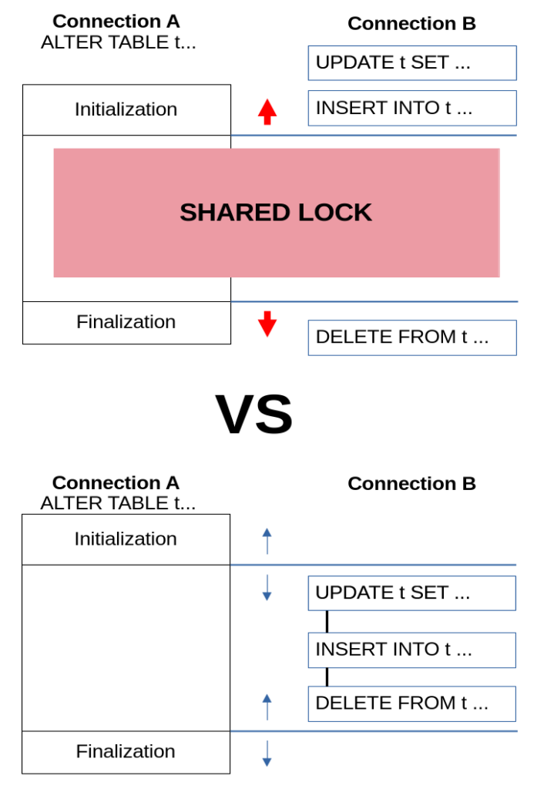

# Online Schema Change

Generally speaking, “online” refers to the ability to update the table schema without blocking concurrent DML for the duration of the copy.

&#x20;Suppose we have a table `item` featuring columns (`id SERIAL`, `name TEXT`).

Now, it can be `ALTERed` by adding a `TIMESTAMP` field in one connection, while having a concurrent connection inserting a new row.

#### Connection 1:

```sql
ALTER TABLE items 

            ADD ts TIMESTAMP DEFAULT CURRENT_TIMESTAMP; # Start ALTER TABLE
```

#### Connection 2:

```sql
INSERT INTO items(name) VALUES (“New item”);
```

<figure><figcaption></figcaption></figure>

If the `INSERT` statement begins its execution after [ALTER TABLE](./) is issued, it will not be blocked and will proceed normally, and thus it may finish before `ALTER TABLE`.

`ALTER TABLE` always allows concurrent [SELECT ](../../../data-manipulation/selecting-data/select.md)statements. If the `LOCK=NONE` locking strategy is chosen, it will allow concurrent modifications (INSERT/DELETE/UPDATE). Namely, `LOCK=NONE` was supported by InnoDB and the Partition engine when `ALGORITHM=NOCOPY` is chosen and is a default locking strategy when available.

With the new release, `LOCK=NONE` support is added for `ALGORITHM=COPY`, thus almost all `ALTER TABLE` operations (a few exceptions are given below) now allow concurrent DML.

## The Mechanism

`LOCK=NONE` adds one extra step to the copy algorithm. It introduces a new internal entity, the **online change buffer**.

<figure><figcaption></figcaption></figure>


* First, a new table is created using the old table content as it was at the beginning of the `ALTER TABLE` statement. For InnoDB and other transactional engines it means copying in `REPEATABLE READ` isolation mode.
  * In the meantime, every concurrent change is written in the old table and is duplicated to the **online change buffer**.
* Then, `ALTER TABLE` applies the changes accumulated in that **online change buffer**.

Note that while all copying and online changes application happens without blocking concurrent `DML`, in the end it acquires an `EXCLUSIVE` lock on the table for a short amount of time, to synchronize with all parallel operations that are not yet finished.

## Supported Engines

The requirement for an engine is to allow concurrent writes, while another connection can read and have a repeatable-read behavior.

### **MyISAM/Aria**

MyISAM is capable of concurrent [INSERTs ](../../../data-manipulation/inserting-loading-data/insert.md)and also supports concurrent inserts while reading: we can’t say it supports [REPEATABLE READ](../../../transactions/transactions-repeatable-read.md) transaction isolation layer, but the newly inserted data is not seen by the readers until the end of the statement, so it satisfies the criterion, however it is not transactional.

An attempt to invoke any statement that can update or delete a row will be blocked until the end of `ALTER TABLE` (or will evaluate before `ALTER TABLE` acquires a lock, if it started earlier).

### **InnoDB**

InnoDB supports `REPEATABLE READ` isolation layer and allows concurrent writes, so it is also supported by Online schema change, broadly enhancing its online ability represented by `INPLACE` and `INSTANT` algorithms. By default, an engine-native algorithm will be chosen whenever possible. If InnoDB will not be capable of holding the schema change natively, then, if possible, a `COPY` algorithm with Online schema change will be applied. A more detailed comparison follows below.

### **Other Engines**

MariaDB ColumnStore does not support `REPEATABLE READ` isolation layer, therefore it cannot support online schema change.

`LOCK=NONE` is naturally disabled for engines like [BLACKHOLE](../../../../../server-usage/storage-engines/blackhole.md), as well as for `SEQUENCE` engine, and sequences, and for read-only engines like S3.

`CONNECT` cannot read concurrently to writes, so it is also not capable of making `ALTER TABLE` online.

`SPIDER` storage engine does not really do a copy, but rather just reassigns a table with a new metadata.

## Comparison to InnoDB’s INPLACE capabilities

Everything that can be done by InnoDB’s `INPLACE`, can be done by online `COPY`, except that tables with foreign keys with cascade operations are not supported. See the limitations section.

* Changing the column’s data type is now possible.
* A column can be modified too `NOT NULL`.
* A column with non-constant `DEFAULT` value can be added.
* A `STORED` generated column can be added.
* A `CHECK` constraint can be added.
* `PRIMARY KEY` can be dropped.
* No key is required in the resulting table.
* A table can be changed to partitioned, or otherwise, partitioning can be removed.
* `SYSTEM VERSIONING` can be added.
* `AUTO_INCREMENT` can be added to the existing column but see limitations.

## Limitations

We have come across a number of limitations apart from the engine support, while we were testing. Some of them just lack a proper implementation, and some are also theoretically infeasible without relaxing the rules we have defined. If you feel that some of these limitations affect you, please leave a comment and tell us about it.

Now, a complete list of limitations we are aware of follows:

* Adding an [AUTO\_INCREMENT](../../../../data-types/auto_increment.md) column is forbidden. Same applies to `DEFAULT` (…NEXTVAL(…)). We found that we can end up with the undefined behavior in this case, depending on when the concurrent DML is evaluated. Changing an existing column to become `AUTO_INCREMENT` is allowed, though. The two following conditions should be met:
  * A column should be `NOT NULL` in the old schema
  * `NO_AUTO_VALUE_ON_ZERO` mode should be unset.
  * At least one `UNIQUE NOT NULL` key should be in the old schema, and it should remain unchanged.
* Support for `ALTER IGNORE TABLE` is not implemented. This operation can make the altered table have fewer rows than the original one (because duplicates are skipped), and the online copy algorithm doesn’t support operations that change the number of rows in the table.
* `ALTER TABLE DROP SYSTEM VERSIONING` is not supported either, for the similar reason.
* Tables with foreign keys with `CASCADE/SET NULL/SET DEFAULT` operations can’t go online under `ALGORITHM=COPY` — similar to disallowing `CHECK` constraints and stored generated columns, cascade operations are done internally by the storage engine, so they bypass the online changes buffer. However, most operations are allowed by InnoDB’s `INPLACE` algorithm. Again, for every DDL request the most optimal algorithm will be chosen automatically.
* Transaction-versioned tables can also be only changed “online” under `INPLACE/INSTANT ALTER TABLE` algorithms.
* All the constraints (`CHECK, UNIQUE, FOREIGN KEY`) are evaluated for each row change that is applied from the online change buffer. This means that all the changes that are made during `ALTER TABLE’s` main phase should not violate the final table schema at any point in time.  As always, the checks can be disabled by setting `check_constraint_checks` and `FOREIGN_KEY_CHECKS` to `OFF`.
* `ALTER TABLE … ORDER BY` cannot be supported, because changes from the buffer are applied at the end and they might break the strict ordering of rows.
* It is not available in embedded MariaDB Server due to replication libraries that are not present in the embedded version.

### Switching back

Starting with [MariaDB Community Server 11.2](https://app.gitbook.com/s/aEnK0ZXmUbJzqQrTjFyb/mariadb-community-server-release-notes/old-releases/release-notes-mariadb-11-2-series) the online copy is the default mode whenever `NOCOPY` does not apply. In case of any problem with it, it can be disabled by specifying `LOCK=SHARED` to force the usual `COPY` algorithm.

To better support existing workflows, a new old\_mode flag was also added: setting

```sql
set old_mode= LOCK_ALTER_TABLE_COPY;
```

disables online copy by default. It can still be forced to use the new feature under this mode by explicitly specifying `LOCK=NONE` in the `ALTER TABLE` statement.

Server-wide online schema change expands MariaDB Server’s capability for the `LOCK=NONE` approach broadly. The change is made in the core Server operation, which interferes with many components, so it took quite a while to get our approach right. This is still an early version of the feature so please note the limitations that we outlined above.

For more information, refer to, [Reduced operational downtime with new ALTER TABLE](https://mariadb.com/resources/blog/reduced-operational-downtime-with-new-alter-table-features/)

