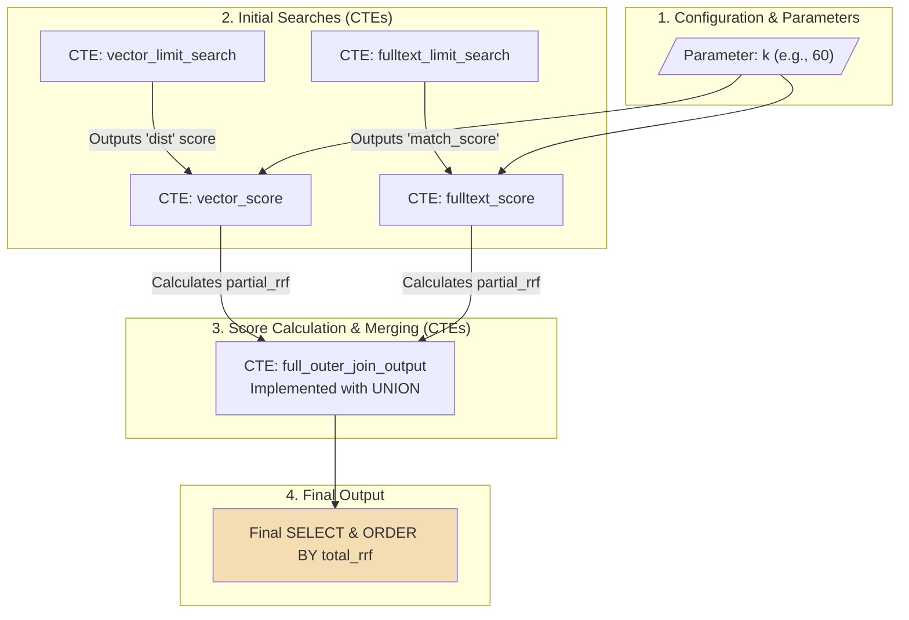

# Optimizing Hybrid Search Query with Reciprocal Rank Fusion (RRF)

Hybrid search combines the keyword precision of full-text search with the conceptual understanding of vector search to produce a single, superior set of results.

## **Full-Text Search**

Full-text search is the traditional keyword-based search, excelling at finding documents that contain the exact words from your query. Behind the scenes, it relies on a data structure called an inverted index—a dictionary that maps each word to a list of documents it appears in, allowing for very fast lookups. For instance, a search for 'apple pie recipe' will instantly find all documents indexed under those three words: ‘apple‘, ‘pie‘ & ‘reciple‘.

## **Vector Search**

Vector search is a modern search method based on meaning. It finds documents that are conceptually similar to your query, even if they don't share any keywords. It works by converting both the query and the documents into numerical representations called "vector embeddings." These vectors exist as points in a high-dimensional conceptual space. A search then finds the "nearest neighbors"—the document points that are closest to the query point. For instance, a vector search for "apple pie recipe" might also return a document titled "how to bake a Granny Smith tart," because the model understands that "tart" is similar to "pie" and "Granny Smith" is a type of "apple."

## The Power of Hybrid Search

Full-text search offers precise keyword matching, while vector search provides nuanced understanding of concepts. Together, they handle ambiguity and ensure critical queries aren't missed, resulting in a robust, intelligent search experience.

### Combining Full-Text and Vector Search

#### A Search for "Sustainable Coffee Pods"

When a user searches for "sustainable coffee pods," the two search systems return the following ranked lists.

**Full-Text Search Results**

| Rank | ID | Title                         |
| ---- | -- | ----------------------------- |
| 1    | 1  | 'Eco Coffee Pods - 100 Count' |
| 2    | 3  | 'Recyclable Coffee Capsules'  |
| 3    | 4  | 'Morning Roast Coffee Beans'  |

**Vector Search Results**

| Rank | ID | Title                           |
| ---- | -- | ------------------------------- |
| 1    | 2  | 'Compostable Espresso Pods'     |
| 2    | 3  | 'Recyclable Coffee Capsules'    |
| 3    | 6  | 'Bamboo Reusable Coffee Filter' |

When two search systems produce distinct lists of titles, a traditional merging approach would prioritize titles that appear in both lists, similar to an INNER JOIN operation.

#### Why a Simple INNER JOIN Is Insufficient

An INNER JOIN only returns results found by both search systems, discarding valuable items that appear in only one list.

If we were to INNER JOIN the two lists from our "sustainable coffee pods" search, the result would be:

| ID | Title                        |
| -- | ---------------------------- |
| 3  | 'Recyclable Coffee Capsules' |

This result is severely incomplete. It correctly finds the one common item but completely discards the #1 ranked result from both searches ('Eco Coffee Pods' and 'Compostable Espresso Pods') simply because they were specialists found by only one system.

## Reciprocal Rank Fusion (RRF)

To solve the problem of discarded results, we use Reciprocal Rank Fusion (RRF). The power of RRF lies in its simplicity: it operates on the rank of an item (1st, 2nd, 3rd) in a list, not its raw, non-comparable score. This makes it highly effective for merging lists from different systems without needing to normalize their scores.

A helpful way to think of this is to imagine your different search systems as a "panel of expert advisors"; RRF intelligently combines their opinions using the formula:

$$
RRF_{score} = \sum_{i} \frac{1}{k + \text{rank}_i}
$$

Where `rank` is the position of a document in a list, and `k` is a tuning constant that moderates the influence of that rank.


**RRF's k Parameter**

The k parameter is the primary tuning knob for the RRF algorithm, acting as a smoothing factor that controls how results are weighted. A low k gives immense power to a top-ranked result, while a high k is more skeptical of a single top pick and rewards items found by multiple systems (consensus). A value of k=60 is a robust and effective baseline for general use.


A key advantage of RRF is that it ignores the raw scores from the search systems and uses only the rank. The table below shows the partial RRF score for the top items in our "sustainable coffee pods" search, calculated with k=60.

## Building the Hybrid Query Optimization model with CTEs



To build the model, our query uses the following Common Table Expressions (CTEs).&#x20;

| CTE Name                  | Purpose                                                                                    |
| ------------------------- | ------------------------------------------------------------------------------------------ |
| vector\_limit\_search     | Runs the initial vector search to retrieve the top N conceptually similar items.           |
| fulltext\_limit\_search   | Runs the initial full-text search to retrieve the top N keyword matches.                   |
| vector\_score             | Calculates a partial\_rrf score for each item from the vector search based on its rank.    |
| fulltext\_score           | Calculates a partial\_rrf score for each item from the full-text search based on its rank. |
| full\_outer\_join\_output | Merges the two score lists and sums the partial scores into a total\_rrf.                  |

The annotated SQL query uses the CTEs to perform the hybrid search:

```sql
-- Set the parameters for our query.
SET @k = 60; -- The RRF smoothing constant.
SET @search_term = "sustainable coffee pods";
-- The vector for the search term would be set here.
-- SET @search_term_vector = VEC_FromText("...");


-- Use CTEs to break the logic into sequential steps.
WITH
-- STEP 1: Get top results from each search method.
vector_limit_search AS (
  SELECT id, title, VEC_DISTANCE_EUCLIDEAN(embedding, @search_term_vector) AS dist
  FROM products ORDER BY dist ASC LIMIT 10
),
fulltext_limit_search AS (
  SELECT id, title, MATCH(title) AGAINST (@search_term) AS match_score
  FROM products WHERE MATCH(title) AGAINST (@search_term)
  ORDER BY match_score DESC LIMIT 10
),
-- STEP 2: Calculate partial RRF scores for each list.
vector_score AS (
  SELECT id, title, 1 / (@k + RANK() OVER (ORDER BY dist ASC)) AS partial_rrf
  FROM vector_limit_search
),
fulltext_score AS (
  SELECT id, title, 1 / (@k + RANK() OVER (ORDER BY match_score DESC)) AS partial_rrf
  FROM fulltext_limit_search
),
-- STEP 3: Merge the two lists and sum the scores.
full_outer_join_output AS (
  SELECT v.id, v.title, (v.partial_rrf + IFNULL(f.partial_rrf, 0)) AS total_rrf
  FROM vector_score v LEFT JOIN fulltext_score f USING (id)
  UNION
  SELECT f.id, v.title, (IFNULL(v.partial_rrf, 0) + f.partial_rrf) AS total_rrf
  FROM fulltext_score f LEFT JOIN vector_score v USING (id)
)
-- STEP 4: Select the final, unified list.
SELECT id, title, total_rrf FROM full_outer_join_output
ORDER BY total_rrf DESC
LIMIT 10;
```

### **Final Calculation for "Sustainable Coffee Pods"**

With k=60, the final CTE merges and sums the partial scores. The consensus item, found in both lists, rises to the top.

| ID | Title                      | fulltext\_rrf | vector\_rrf | total\_rrf | Final Rank |
| -- | -------------------------- | ------------- | ----------- | ---------- | ---------- |
| 3  | Recyclable Coffee Capsules | 0.01613       | 0.01613     | 0.03226    | 1          |
| 1  | Eco Coffee Pods            | 0.01639       | 0           | 0.01639    | 2          |
| 2  | Compostable Espresso Pods  | 0             | 0.01639     | 0.01639    | 2          |

## Tuning the k Parameter

As introduced earlier, the k parameter can be fine-tuned for specific situations. Here are three common scenarios to consider.

1. **Combining Diverse, Specialist Systems**

For merging results from different methods like keyword and vector search, a higher k (such as 60) is ideal to balance their contributions. Our main "sustainable coffee pods" search is a perfect illustration of this, where the consensus item wins but the high-quality specialists are ranked immediately after.

| Final Rank | ID | Title                      | Total RRF | Note             |
| ---------- | -- | -------------------------- | --------- | ---------------- |
| 1          | 3  | Recyclable Coffee Capsules | 0.03226   | Consensus Winner |
| 2          | 1  | Eco Coffee Pods            | 0.01639   | Specialist       |
| 2          | 2  | Compostable Espresso Pods  | 0.01639   | Specialist       |

2. **Handling Mixed-Quality or "Noisy" Systems**

If you are fusing results from reliable systems and one experimental, less predictable system, a higher k (60 or more) is the safest choice to prevent an outlier from disproportionately influencing the final rank.

Consider our search with a third, "noisy" system that incorrectly ranks 'Eco-Friendly Car Wax' (ID 8) at #1. A high k value minimizes the impact of this error.

<table><thead><tr><th>Product</th><th>FT Rank</th><th width="129.44140625">Vector Rank</th><th width="122.640625">Noisy Rank</th><th>Total RRF (k=60)</th></tr></thead><tbody><tr><td>Recyclable Coffee Capsules</td><td>2</td><td>2</td><td>-</td><td>1/62 + 1/62 = 0.03226</td></tr><tr><td>Eco-Friendly Car Wax</td><td>-</td><td>-</td><td>1</td><td>1/61 = 0.01639</td></tr></tbody></table>

The high k value correctly ensures that the consensus result from the two reliable systems easily beats the single, erroneous result from the noisy system.

3. **Fusing High-Quality, Similar Systems**

If you are combining lists from two very similar, high-performing algorithms, you can experiment with a slightly lower k (30-50) to give more weight to a top-ranked document.

Consider a case where we fuse two similar vector models (Vector\_A, Vector\_B) that both rank 'Compostable Espresso Pods' as #1 and 'Recyclable Coffee Capsules' as #2. A lower k makes the winner more decisive.

| Compostable Pods    | 1, 1        | 1/31 + 1/31 = 0.0645 | 1/61 + 1/61 = 0.0328 |
| ------------------- | ----------- | -------------------- | -------------------- |
| Recyclable Capsules | 2, 2        | 1/32 + 1/32 = 0.0625 | 1/62 + 1/62 = 0.0322 |
| Score Difference    | <p><br></p> | 0.0020               | 0.0006               |

With k=30, the score separation between the #1 and #2 results is more than three times larger, showing higher confidence in the top result, which is desirable when you trust both systems.

### Determining the Best k (The Experimental Method)

A formal, 3-step process can be used to scientifically determine the best k value for your data through offline evaluation. To illustrate this process, which requires a pre-judged "ground truth" set with graded relevance, we will use a separate, self-contained case study.

1. **Gather Prerequisites**

You need: Multiple Ranked Lists, a "Ground Truth" Set, and an Evaluation Metric (like NDCG). With a query like "healthy breakfast", your ground truth might look like this:

| A | 'Oatmeal with Berries' | 3 (High)   |
| - | ---------------------- | ---------- |
| B | 'Green Smoothie'       | 3 (High)   |
| C | 'Avocado Toast'        | 2 (Medium) |
| D | 'Bacon and Eggs'       | 1 (Low)    |
| E | 'Cinnamon Roll'        | 0 (None)   |

And your raw ranked lists might be:

* Full-Text Results: \[D, A, E]
* Vector Results: \[B, C, A]

2. **Run the Experiment**

You iterate through k values, applying the RRF formula to the raw lists to generate a final ranking for each k.

* Final Ranked List (k=10):

| Rank | ID | Title                  |
| ---- | -- | ---------------------- |
| 1    | B  | 'Green Smoothie'       |
| 2    | D  | 'Bacon and Eggs'       |
| 3    | A  | 'Oatmeal with Berries' |
| 4    | C  | 'Avocado Toast'        |
| 5    | E  | 'Cinnamon Roll'        |

* Final Ranked List (k=60):

| Rank | ID | Title                  |
| ---- | -- | ---------------------- |
| 1    | A  | 'Oatmeal with Berries' |
| 2    | B  | 'Green Smoothie'       |
| 3    | C  | 'Avocado Toast'        |
| 4    | D  | 'Bacon and Eggs'       |
| 5    | E  | 'Cinnamon Roll'        |

3. **Analyze and Select**

You use your metric to "grade" each list against the Ground Truth and choose the k with the highest score. The k=60 list is clearly better as it placed the two "Highly Relevant" documents (A and B) at the top.

| k Value | Performance Score (NDCG) |
| ------- | ------------------------ |
| 10      | 0.85                     |
| 60      | 0.92                     |

In this experiment, k=60 is the winner. A key advantage of RRF is that its performance is "not critically sensitive to the choice of k, making it a robust and reliable method" for improving search relevance.

#### Further Reading

* Reciprocal Rank Fusion for IR (SIGIR '09): The original research paper that proposed the RRF method.

\
\
