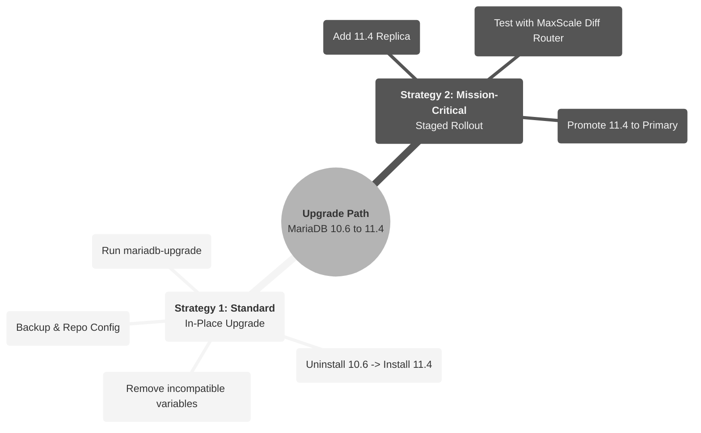

# Upgrade MariaDB Enterprise Server from 10.6 to 11.4

The upgrade guide details the standard upgrade path from MariaDB Enterprise Server 10.6 to MariaDB Enterprise Server 11.4. The upgrade process involves significant changes, particularly to the query optimizer, which was rewritten in version 11.0. While performance is generally improved, query execution plans may change.

This guide provides two strategies:

1. Standard In-Place Upgrade: The direct procedure for upgrading an existing node.
2. Staged Rollout (Recommended for Mission-Critical Systems): A low-risk approach using replication and validation.



Prerequisite: [Review What's New in MariaDB Enterprise Server 11.4](https://app.gitbook.com/s/aEnK0ZXmUbJzqQrTjFyb/enterprise-server/about/mariadb-enterprise-server-differences/differences-in-mariadb-enterprise-server-11.4).

## Part 1: Standard In-Place Upgrade Process

This section details the standard procedure for performing an in-place upgrade. This involves replacing the server binaries while keeping the data directory intact.

### 1. Backup Database

Before performing any upgrade, it is critical to perform a full backup of your database. MariaDB Backup (`mariadb-backup`) is recommended for this purpose.

```bash
# Example backup command
sudo mariadb-backup --backup \
      --user=mariadb-backup_user \
      --password=mariadb-backup_passwd \
      --target-dir=/data/backup/preupgrade_backup
```

### 2. Modify Repository Configuration

Update your system's package manager repository to point to MariaDB Enterprise Server 11.4. You will need to regenerate your repository configuration command using the [MariaDB Customer Download Token](https://www.google.com/search?q=https://dlm.mariadb.com/).




```bash
sudo ./mariadb_es_repo_setup --token="CUSTOMER_DOWNLOAD_TOKEN" --apply --mariadb-server-version="11.4"
```





```bash
sudo ./mariadb_es_repo_setup --token="CUSTOMER_DOWNLOAD_TOKEN" --apply --mariadb-server-version="11.4"
```





```bash
sudo ./mariadb_es_repo_setup --token="CUSTOMER_DOWNLOAD_TOKEN" --apply --mariadb-server-version="11.4"
```




### 3. Stop MariaDB Service

Stop the running `mariadbd` process to release locks on the data files.

```bash
sudo systemctl stop mariadb
```


Ensure `innodb_fast_shutdown` is set to `1` and check for open XA transactions before stopping.


### 4. Uninstall Old Version

Remove the existing MariaDB 10.6 packages. This removes the binaries but preserves the configuration and data directory.



```bash
sudo apt-get remove "mariadb-*" galera-enterprise-4
```



```bash
sudo yum remove "MariaDB-*" galera-enterprise-4
```



### 5. Install New Version

Install the new MariaDB 11.4 packages.



```bash
sudo apt-get install mariadb-server mariadb-backup galera-enterprise-4
```



```bash
sudo yum install MariaDB-server MariaDB-backup
```



### 6. Update Configuration (Critical)

Before starting the server, you must update your option files (e.g., `my.cnf`) to remove unsupported parameters.

* Remove `innodb_defragment`: This variable and its associated options (e.g., `innodb_defragment_fill_factor`) have been removed.
* Remove `optimizer_adjust_secondary_key_costs`: This variable has no effect in 11.4 and must be removed.
* Check `innodb_flush_method`: This variable is deprecated in 11.4.

### 7. Start MariaDB Service

Start the new `mariadbd` process.

```bash
sudo systemctl start mariadb
```

### 8. Run mariadb-upgrade

Execute `mariadb-upgrade` to check and update system tables to be compatible with the new version.

```bash
sudo mariadb-upgrade
```

## Part 2: Alternative Strategy: Staged Rollout for Mission-Critical Systems

For environments sensitive to performance changes or requiring zero downtime, the following staged rollout strategy is recommended.



### Introduce Replica

Provision a new server with MariaDB Enterprise Server 11.4 and configure it as a Replica of your existing 10.6 Primary server.

1. **Perform Backup on Primary (10.6)**: Use `mariadb-backup` to create a consistent, non-blocking physical backup.

```bash
# On the 10.6 Primary
sudo mariadb-backup --backup \
    --user=backup_user \
    --password=backup_password \
    --target-dir=/data/backup/preupgrade_backup
```

2. **Prepare the Backup**: Prepare the backup to ensure consistency (this can be done on the Primary or the Replica).

```bash
sudo mariadb-backup --prepare \
    --target-dir=/data/backup/preupgrade_backup
```

3. **Restore on Replica (11.4)**: Transfer the backup to the new 11.4 server, stop the service, and restore.

```bash
# On the 11.4 Replica
sudo systemctl stop mariadb

# Ensure datadir is empty
sudo rm -rf /var/lib/mysql/*

# Restore backup
sudo mariadb-backup --copy-back \
    --target-dir=/data/backup/preupgrade_backup

# Fix permissions
sudo chown -R mysql:mysql /var/lib/mysql
```

4. **Start and Configure Replication:** Start the 11.4 server and configure it to replicate from the 10.6 Primary.

```bash
sudo systemctl start mariadb
```

Log in to the 11.4 Replica and enable replication. (Note: Ensure `server_id` is unique in `my.cnf`).

```sql
-- On the 11.4 Replica
-- Set the GTID position (found in the xtrabackup_binlog_info file from the backup)
SET GLOBAL gtid_slave_pos = '0-1-12345'; -- Replace with your actual GTID

CHANGE MASTER TO
    MASTER_HOST='10.6._primary_ip',
    MASTER_USER='replication_user',
    MASTER_PASSWORD='replication_password',
    MASTER_USE_GTID=slave_pos;

START SLAVE;
```



#### Validate and Compare (Recommended)

To proactively catch performance regressions caused by the optimizer rewrite, use MaxScale with the Diff Router(Enterprise feature).

1. Configure MaxScale Ensure your MaxScale `maxscale.cnf` defines both the existing service (routing to 10.6) and the new 11.4 server definition.
2. Create the Diff Service Use `maxctrl` to create a "Diff" service that compares the output of your existing production server against the new 11.4 replica.


```bash
# Syntax: maxctrl call command diff create <NewDiffServiceName> <ExistingService> <ReferenceServer> <TargetServer>

maxctrl call command diff create DiffService ReadWriteService Primary10.6 Replica11.4
```


3\. Analyze Results MaxScale will generate JSON reports in its log directory (e.g., `/var/lib/maxscale/diff/`). Analyze these files to identify queries that return different results or have significantly higher latency on the 11.4 server.



#### Shift Read Traffic

Gradually migrate read-only traffic to the 11.4 replica.

Update MaxScale Routing If using MaxScale, you can adjust the server weights or maintenance modes to direct read traffic.

```bash
# Put the 10.6 replicas into maintenance mode or lower their weight
maxctrl set server Primary10.6 maintenance
```


Alternatively, update your application connection strings to point to the 11.4 Replica's IP for reporting modules.




#### Promote to Primary

Once the 11.4 replica has been validated under load, promote it to be the Primary node.

1. Stop Replication on 11.4 Replica

```sql
-- On the 11.4 Replica
STOP SLAVE;
RESET SLAVE ALL;
```

2. Enable Writes on 11.4 New Primary

```sql
SET GLOBAL read_only=0;
```

3. Direct Traffic Update MaxScale or your application configuration to point to the new 11.4 Primary.



#### Shift Application Traffic

Direct your application traffic to the new 11.4 Primary. Ensure you perform a `mariadb-upgrade` on the new Primary if it hasn't been run yet (though `mariadb-backup` restore usually preserves the old system tables, running upgrade is a safety step to ensure system tables are fully compatible with 11.4).

```bash
sudo mariadb-upgrade
```



## Part 3: Critical Upgrade Information

### 1. Optimizer Changes and Application Testing

The Query Optimizer was rewritten in version 11.0. While performance is generally better, query plans can change. It is vital to perform validation (as described in the Staged Rollout section) to catch regressions before production deployment. You should also run `ANALYZE TABLE` on major tables after upgrading to update statistics.

### 2. Required Configuration Changes

The following variables must be addressed in your configuration files (`my.cnf`) to prevent startup failures or warnings:

* `optimizer_adjust_secondary_key_costs`: MUST REMOVE. This variable has no effect in 11.4 as features are integrated into the new cost model.
* `innodb_defragment`: MUST REMOVE. This variable has been removed.
* `des_encrypt` / `des_decrypt`: Functions have been removed.

### 3. Backward Replication Compatibility

You can replicate from a MariaDB 11.4 Primary to a MariaDB 10.6 Replica (Backward Replication) under specific conditions:

* No new features specific to 11.4 (e.g., new JSON functions, `UUID` data type) are used in DML or DDL.
* The variable `binlog_alter_two_phase` must be set to `0` (default) on the 11.4 Primary.

### 4. System-Versioned Tables Conversion

If using System-Versioned Tables, the `row_end` column format must be updated to support the extended `TIMESTAMP` range (up to year 2106).



Use the new `--update-history` option with `mariadb-dump` to convert `row_end` values during export.



Use `ALTER TABLE` to convert the tables after upgrade.

```sql
ALTER TABLE my_table FORCE;
```


