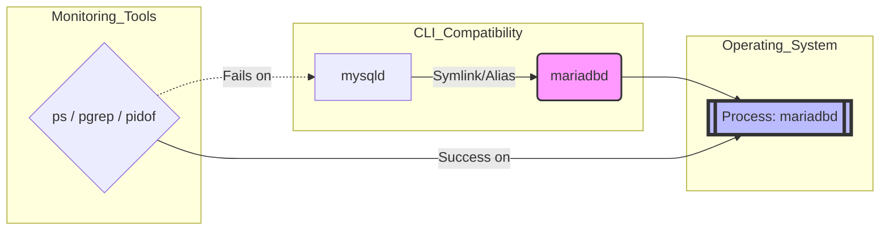
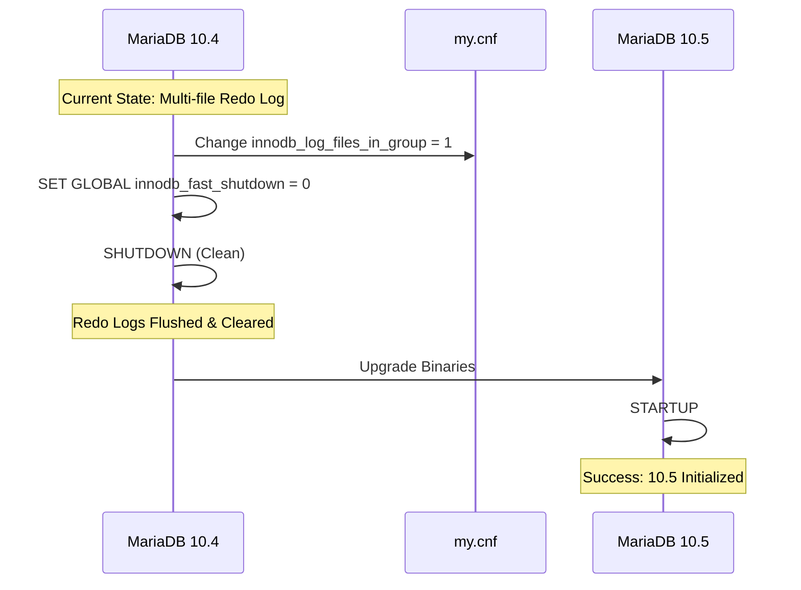

# Compatibility and Breaking Changes for MariaDB Enterprise Server 10.5


## Guide Overview

This page acts as a technical reference, highlighting the logical impacts, architectural changes, and potential breaking points when upgrading to MariaDB Enterprise Server 10.5. It focuses on technical issues identified through customer support and engineering audits. This guide aims to supplement the comprehensive feature summaries available in the [_What's New_ in MariaDB Enterprise Server 10.5](https://app.gitbook.com/s/aEnK0ZXmUbJzqQrTjFyb/enterprise-server/old-releases/10.5/whats-new-in-mariadb-enterprise-server-10-5) page for MariaDB Enterprise Server 10.5.

For a full rundown of new features and overall improvements, users should consult the _What's New_ guide. Note that for better clarity and accessibility, the technical specifics here may be integrated into the _What's New_ guide in future documentation updates.


### Architectural Changes

#### Binary and Process Renaming

MariaDB Enterprise Server 10.5 completes the transition to MariaDB-prefixed names for all executables.

* Process Identification: While symbolic links (e.g., `mysqld`) are provided for backward compatibility, the primary server binary is now `mariadbd`.
* Monitoring Alert: When started via `systemd` or `mariadbd-safe`, the process will identify as `mariadbd` in the system process list.
* Impact: Custom monitoring scripts using `ps`, `pidof`, or `pgrep` to look for `mysqld` will fail and must be updated to look for `mariadbd`.

### Security and Privileges

#### Granularity (The "SUPER" Split)

In 10.5, the `SUPER` privilege has been deconstructed into several smaller, granular privileges to improve security.

| **Command / Operation** | **Legacy Privilege (10.4)** | **New Required Privilege (10.5)** |
| ----------------------- | --------------------------- | --------------------------------- |
| `SHOW REPLICA STATUS`   | `REPLICATION CLIENT`        | `REPLICA MONITOR`                 |
| `SHOW BINLOG EVENTS`    | `REPLICATION SLAVE`         | `BINLOG MONITOR`                  |
| `SHOW SLAVE HOSTS`      | `REPLICATION CLIENT`        | `REPLICATION MASTER ADMIN`        |
| `PURGE BINARY LOGS`     | `SUPER`                     | `BINLOG ADMIN`                    |

### Configuration and Include Paths

#### Debian and Ubuntu Path Logic

Beginning with 10.5, the configuration loading logic on Debian and Ubuntu has shifted:

* Directory Priority: The directory `/etc/mysql/mariadb.conf.d/` now uses numeric prefixes to dictate loading order.
* Enterprise Overrides: The `mariadb-enterprise.cnf` file is typically loaded last, potentially overriding user-defined settings in `50-server.cnf`.

### Pre-Upgrade Requirements

#### Mandatory Clean Shutdown

Upgrading from 10.4 to 10.5 after a crash is not supported if the redo log was created in 10.4.

* Requirement: You must perform a clean shutdown (setting `SET GLOBAL innodb_fast_shutdown = 0` is recommended) before initiating the upgrade.
* Redo Log Adjustment: If `innodb-log-files-in-group` is set to `2`, it must be changed to `1` on the 10.4 instance, followed by a restart and a final clean shutdown before moving to 10.5.

### Critical Parameter Shifts

| **Parameter**                  | **10.4 Default** | **10.5 Default** | **Impact**                                                      |
| ------------------------------ | ---------------- | ---------------- | --------------------------------------------------------------- |
| `innodb_adaptive_hash_index`   | `ON`             | `OFF`            | Disabled to prevent potential performance issues.               |
| `innodb_change_buffering`      | `all`            | `none`           | "all" was found to cause performance loss in certain workloads. |
| `innodb_log_files_in_group`    | `2`              | `1`              | Redo logs are no longer split; additional files are ignored.    |
| `innodb_buffer_pool_instances` | `8`              | `1`              | Multiple instances no longer reduce contention and are ignored. |
| `slave_parallel_mode`          | `conservative`   | `optimistic`     | Speeds up replication by default.                               |
