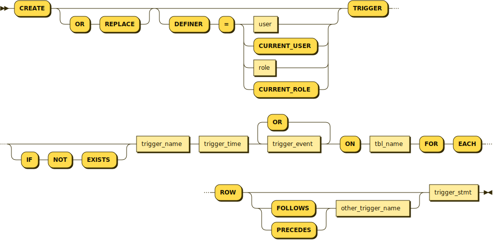
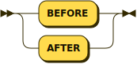
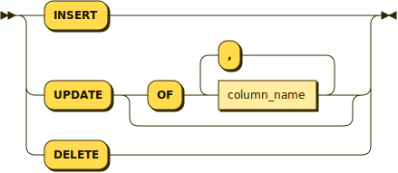

# CREATE TRIGGER

## Syntax

```bnf
CREATE [OR REPLACE]
    [DEFINER = { user | CURRENT_USER | role | CURRENT_ROLE }]
    TRIGGER [IF NOT EXISTS]
            trigger_name trigger_time {trigger_event [OR trigger_event] ...}
    ON tbl_name FOR EACH ROW
    [{ FOLLOWS | PRECEDES } other_trigger_name]
    trigger_stmt

trigger_time:
    BEFORE
  | AFTER

trigger_event:
    INSERT
  | UPDATE [OF column_name [, column_name] ...]
  | DELETE
```







## Description

This statement creates a new [trigger](./). A trigger is a named database object that is associated with a table, and that activates when a particular event occurs for the table. The trigger becomes associated with the table named `tbl_name`, which must refer to a permanent table. You cannot associate a trigger with a `TEMPORARY` table or a view.

`CREATE TRIGGER` requires the [TRIGGER](../../../reference/sql-statements/account-management-sql-statements/grant.md#table-privileges) privilege for the table associated with the trigger.

You can have multiple triggers for the same _`trigger_time`_ and _`trigger_event`_.

For valid identifiers to use as trigger names, see [Identifier Names](../../../reference/sql-structure/sql-language-structure/identifier-names.md).

`trigger_stmt` is the statement executed when the trigger activates. Here, you can refer to columns in the table associated with the trigger using the aliases `OLD` and `NEW`. `OLD.`_`col_name`_ refers to a column of an existing row before it is updated or deleted. `NEW.`_`col_name`_ refers to the column of a new row to be inserted or an existing row after it is updated.

`OLD` and `NEW` are MariaDB (and MySQL) extensions to triggers. They are not case-sensitive.

Triggers cannot use `NEW.`_`col_name`_ or use `OLD.`_`col_name`_ to refer to generated columns. For information about generated columns, see [Generated Columns](../../../reference/sql-statements/data-definition/create/generated-columns.md).

In an `INSERT` trigger, only `NEW.`_`col_name`_ can be used, because there is no old row. In a `DELETE` trigger, only `OLD.`_`col_name`_ can be used, because there is no new row. In an `UPDATE` trigger, use `OLD.`_`col_name`_ to refer to the columns of a row before it is updated, and `NEW.`_`col_name`_ to refer to the columns of the row after it is updated.

A column referenced with `OLD` is read-only. If you have the `SELECT` privilege, this means you can refer to it, but not modify it. You can refer to a column named with `NEW` if you have the `SELECT` privilege. In a `BEFORE` trigger, you can also change its value with `SET NEW.`_`col_name`_` ``=`` `_`value`_ if you have the `UPDATE` privilege. This means you can use a trigger to modify the values to be inserted as a new row or to update a row. In an `AFTER` trigger, a `SET` statement has no effect, because the row change has already occurred.

### OR REPLACE

If used and the trigger already exists, instead of an error being returned, the existing trigger is dropped and replaced by the newly defined trigger.

### DEFINER

The `DEFINER` clause determines the security context to be used when checking access privileges at trigger activation time. Usage requires the [SET USER](../../../reference/sql-statements/account-management-sql-statements/grant.md#set-user) privilege.

### IF NOT EXISTS

If the `IF NOT EXISTS` clause is used, the trigger is created only if a trigger of the same name does not exist. If the trigger already exists, by default a warning is returned.

### trigger\_time

_`trigger_time`_ is the trigger action time. It can be `BEFORE` or `AFTER` to indicate that the trigger activates before or after each row to be modified.

### trigger\_event



Multiple _`trigger_event`_ events can be specified.



Only one _`trigger_event`_ can be specified.



`trigger_event` indicates the kind of statement that activates the trigger. A `trigger_event` can be one of the following:

* `INSERT`: The trigger is activated whenever a new row is inserted into the table; for example, through [INSERT](../../../reference/sql-statements/data-manipulation/inserting-loading-data/), [LOAD DATA](../../../reference/sql-statements/data-manipulation/inserting-loading-data/load-data-into-tables-or-index/load-data-infile.md), and [REPLACE](../../../reference/sql-statements/data-manipulation/changing-deleting-data/replace.md) statements.
* `UPDATE`: The trigger is activated whenever a row is modified; for example, through [UPDATE](../../../reference/sql-statements/data-manipulation/changing-deleting-data/update.md) statements.
* `DELETE`: The trigger is activated whenever a row is deleted from the table; for example, through [DELETE](../../../reference/sql-statements/data-manipulation/changing-deleting-data/delete.md) and [REPLACE](../../../reference/sql-statements/data-manipulation/changing-deleting-data/replace.md) statements. However, `DROP TABLE` and `TRUNCATE` statements on the table do not activate this trigger, because they do not use `DELETE`. Dropping a partition does not activate `DELETE` triggers, either.

#### FOLLOWS/PRECEDES _other\_trigger\_name_

The ` FOLLOWS`` `` `_`other_trigger_name`_ and ` PRECEDES`` `` `_`other_trigger_name`_ options support multiple triggers per action time.

`FOLLOWS` adds the new trigger after another trigger, while `PRECEDES` adds the new trigger before another trigger. If neither option is used, the new trigger is added last for the given action and time.

`FOLLOWS` and `PRECEDES` are not stored in the trigger definition. However, the trigger order is guaranteed to not change over time. [mariadb-dump](../../../clients-and-utilities/backup-restore-and-import-clients/mariadb-dump.md) and other backup methods do not change trigger order.\
You can verify the trigger order from the `ACTION_ORDER` column in [INFORMATION\_SCHEMA.TRIGGERS](../../../reference/system-tables/information-schema/information-schema-tables/information-schema-triggers-table.md) table.

```sql
SELECT trigger_name, action_order FROM information_schema.triggers 
  WHERE event_object_table='t1';
```

### Atomic DDL



MariaDB supports [Atomic DDL](../../../reference/sql-statements/data-definition/atomic-ddl.md), and `CREATE TRIGGER` is atomic.



MariaDB does **not** support [Atomic DDL](../../../reference/sql-statements/data-definition/atomic-ddl.md).



## Examples

### Creating a Trigger

```sql
CREATE DEFINER=`root`@`localhost` TRIGGER increment_animal
  AFTER INSERT ON animals FOR EACH ROW 
   UPDATE animal_count SET animal_count.animals = animal_count.animals+1;
```

### `OR REPLACE` and `IF NOT EXISTS`

```sql
CREATE DEFINER=`root`@`localhost` TRIGGER increment_animal
  AFTER INSERT ON animals FOR EACH ROW
    UPDATE animal_count SET animal_count.animals = animal_count.animals+1;
ERROR 1359 (HY000): Trigger already exists

CREATE OR REPLACE DEFINER=`root`@`localhost` TRIGGER increment_animal
  AFTER INSERT ON animals  FOR EACH ROW
    UPDATE animal_count SET animal_count.animals = animal_count.animals+1;
Query OK, 0 rows affected (0.12 sec)

CREATE DEFINER=`root`@`localhost` TRIGGER IF NOT EXISTS increment_animal
  AFTER INSERT ON animals FOR EACH ROW
    UPDATE animal_count SET animal_count.animals = animal_count.animals+1;
Query OK, 0 rows affected, 1 warning (0.00 sec)

SHOW WARNINGS;
+-------+------+------------------------+
| Level | Code | Message                |
+-------+------+------------------------+
| Note  | 1359 | Trigger already exists |
+-------+------+------------------------+
1 row in set (0.00 sec)
```

### Referencing NEW Column Values

```sql
DELIMITER //

CREATE TRIGGER trg_limit_population BEFORE UPDATE ON country_stats
FOR EACH ROW
BEGIN
    -- Ensure population is at least 1
    IF NEW.population < 1 THEN
        SET NEW.population = 1;
    -- Cap population at 2 billion for data integrity
    ELSEIF NEW.population > 2000000000 THEN
        SET NEW.population = 2000000000;
    END IF;
END;
//

DELIMITER ;
```

## See Also

* [Identifier Names](../../../reference/sql-structure/sql-language-structure/identifier-names.md)
* [Trigger Overview](trigger-overview.md)
* [DROP TRIGGER](../../../reference/sql-statements/data-definition/drop/drop-trigger.md)
* [Information Schema TRIGGERS Table](../../../reference/system-tables/information-schema/information-schema-tables/information-schema-triggers-table.md)
* [SHOW TRIGGERS](../../../reference/sql-statements/administrative-sql-statements/show/show-triggers.md)
* [SHOW CREATE TRIGGER](../../../reference/sql-statements/administrative-sql-statements/show/show-create-trigger.md)
* [Trigger Limitations](trigger-limitations.md)

<sub>_This page is licensed: GPLv2, originally from_</sub> [<sub>_fill\_help\_tables.sql_</sub>](https://github.com/MariaDB/server/blob/main/scripts/fill_help_tables.sql)


