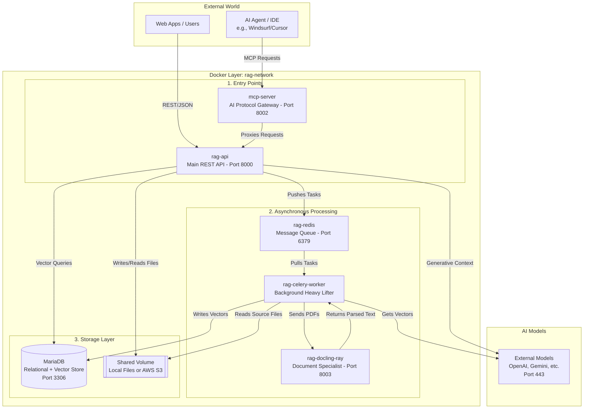

# Architecture

MariaDB AI RAG 1.1 follows a modular, client-server architecture deployed as a multi-container Docker application. This containerized approach allows specialized components to handle different stages of the RAG pipeline—from secure document gateway entry to distributed background processing and high-performance vector storage.

## High-Level System Architecture

The system is organized into a primary Docker layer that orchestrates communication between external world entry points, internal processing services, and external AI models.

### External World & Entry Points

* Web Apps / Users: Standard users interact with the system via standard REST Requests and JSON responses.
* AI Agent / IDE: Integration for external AI agents (e.g., Windsurf, Cursor, or Claude Desktop) is handled via dedicated Model Context Protocol (MCP) requests and SSE streams.
* mcp-server (The AI Gateway): Acts as the "VIP AI Entrance," implementing the protocol gateway to allow agents to interact with the RAG system and database tools securely.
* rag-api (The Main Brain): A FastAPI-based server that serves as the central command center, handling authentication, searching the database, and orchestrating responses from AI models.

### Asynchronous Processing Layer

This layer ensures the API remains responsive by offloading resource-intensive tasks to a background pipeline.

* rag-redis (The Waiting Room): Functions as a message broker and "To-Do List," where the API drops tasks such as large document processing ready for worker pick-up.
* rag-celery-worker (The Heavy Lifter): Constantly monitors the Redis queue to pick up tasks for reading documents, chunking text, and generating vectors.
* rag-docling-ray (The Document Specialist): A specialist service running IBM Docling designed to extract text from complex layouts like tables and multi-column PDFs without losing structure.

### Storage Layer

* MariaDB (The Database): Natively supports both traditional relational data and high-speed vector storage. MariaDB 11.8+ is required for production deployments to ensure full vector search functionality.
* Shared Volume: Stores physical files (Local Filesystem or AWS S3) used during the ingestion and extraction process.

## Core Operational Workflows

### Flow A: Document Ingestion

1. Upload: A document is uploaded via the RAG API and saved to the storage layer.
2. Queuing: The API creates a ticket in the Redis message broker.
3. Extraction: The Celery worker retrieves the file and sends it to the Docling Ray service for layout-aware parsing.
4. Vectorization: The worker slices text into chunks and sends them to external embedding models (e.g., Google Gemini).
5. Storage: Vectors and metadata are locked into MariaDB for search.

### Flow B: Retrieval & Generation

1. Retrieval: The RAG API converts a user question into a vector and performs a similarity search in MariaDB.
2. Reranking: A cross-encoder model (e.g., FlashRank or Cohere) re-scores retrieved chunks to ensure the absolute best context is provided.
3. Generation: The original query and refined context are sent to an LLM to formulate a response.
4. Citations: The system automatically inserts raw citation markers into the response, converted by a citation processor into footnotes or superscripts for user verification.
