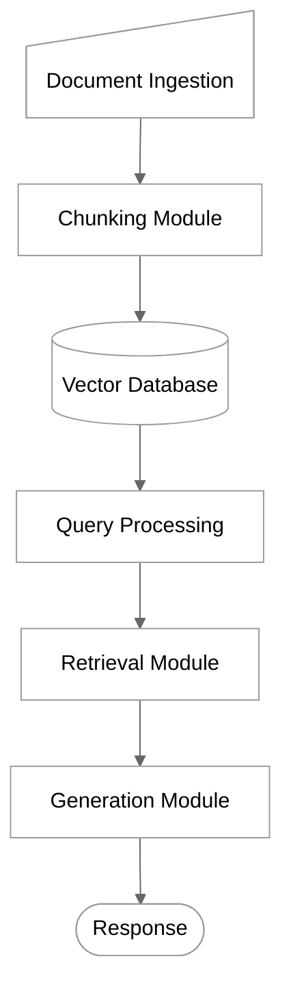

# Overview

## Introduction to MariaDB AI RAG

MariaDB AI RAG is an enterprise-grade Retrieval-Augmented Generation (RAG) solution that integrates with MariaDB to provide AI-powered document processing, semantic search, and natural language generation capabilities.

The system enables organizations to leverage their document repositories and databases for AI-powered search and generation. By combining the reliability of MariaDB with modern AI capabilities, AI RAG provides accurate, context-aware responses based on your organization's proprietary data.

## System Architecture

MariaDB AI RAG follows a modular architecture with the following key components:

### Core Components

1. **Document Ingestion Module**
   * Handles document uploads and text extraction
   * Supports multiple file formats (PDF, DOCX, TXT, etc.)
   * Processes metadata extraction
   * Manages document storage and versioning
2. **Chunking Module**
   * Divides documents into semantically meaningful segments
   * Supports multiple chunking strategies (fixed size, recursive, semantic)
   * Optimizes chunk size and overlap for retrieval quality
   * Preserves document structure and metadata
3. **Vector Database Integration**
   * Creates and stores vector embeddings for document chunks
   * Integrates with MariaDB's vector search capabilities
   * Enables efficient similarity search
   * Manages vector indexes and optimizations
4. **Retrieval Module**
   * Converts queries into vector embeddings
   * Performs semantic similarity search
   * Ranks and filters results based on relevance
   * Supports metadata-based filtering
5. **Generation Module**
   * Integrates with multiple LLM providers (OpenAI, Google, Anthropic)
   * Constructs prompts with retrieved context
   * Generates natural language responses
   * Supports streaming output for real-time display
6. **Orchestration Module**
   * Coordinates the end-to-end RAG pipeline
   * Manages asynchronous processing
   * Handles error recovery and retries
   * Provides status monitoring and reporting
7. **API Interface**
   * Exposes RESTful endpoints for all functionality
   * Implements JWT-based authentication
   * Manages user permissions and access control
   * Provides comprehensive error handling and logging

### Architecture Diagram

## Data Flow

1. **Document Processing Flow**
   * Documents are uploaded via the API
   * Text is extracted based on document format
   * Documents are divided into chunks
   * Chunks are converted to vector embeddings
   * Embeddings are stored in the vector database
2. **Query Processing Flow**
   * User submits a query via the API
   * Query is converted to a vector embedding
   * Similar document chunks are retrieved
   * Retrieved chunks are ranked by relevance
   * Top chunks are used as context for generation
   * LLM generates a response based on the context
3. **Database Integration Flow**
   * Database table/view is selected for ingestion
   * Rows are processed as individual documents
   * Column mapping defines content and metadata
   * Text is chunked and embedded
   * Embeddings are stored with source metadata

## System Requirements

* **Database**: MariaDB 10.6+ or MySQL 8.0+
* **Operating System**: Linux (Debian/Ubuntu, RHEL/CentOS), Windows Server
* **Hardware**: Minimum 4 CPU cores, 8GB RAM, 100GB storage
* **Network**: Internet connectivity for external AI services
* **Dependencies**: Python 3.9+, FastAPI, SQLAlchemy, PyTorch (optional for local embeddings)

For detailed installation instructions, see the [Installation Guide](installation.md).




