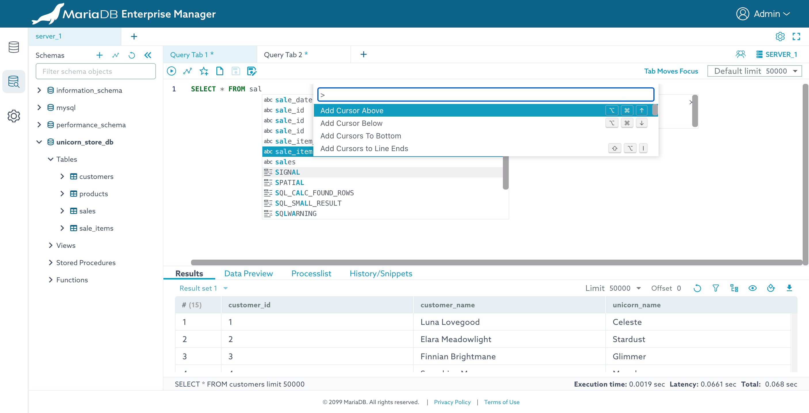

# ERD Designer


In MariaDB Enterprise Manager, ERD worksheet is accessed from MaxScale's MaxGUI. The worksheet is well documented in the [MaxScale tutorial](https://app.gitbook.com/s/0pSbu5DcMSW4KwAkUcmX/mariadb-maxscale-tutorials/using-maxgui).


Enterprise manager provides a visual interface for creating entity relationship diagrams (ERD) and for observing existing database schemas, so you can quickly understand table relationships, identify dependencies, and visually assess the impact of schema changes before implementation.

This procedure outlines the steps required to access and utilize the Query Editor within the Workspace section of Enterprise Manager UI.&#x20;

1.  From the main Workspace screen, click the "Run Queries" card.\

    <figure><figcaption></figcaption></figure>
2.  In the "Connect to..." dialog, select your target server, enter your credentials, and click Connect.\

    <figure><figcaption></figcaption></figure>
3.  Upon successful connection, the main [ERD worksheet](https://app.gitbook.com/s/0pSbu5DcMSW4KwAkUcmX/mariadb-maxscale-tutorials/using-maxgui#create-an-erd) will appear.\

    <figure><figcaption></figcaption></figure>
