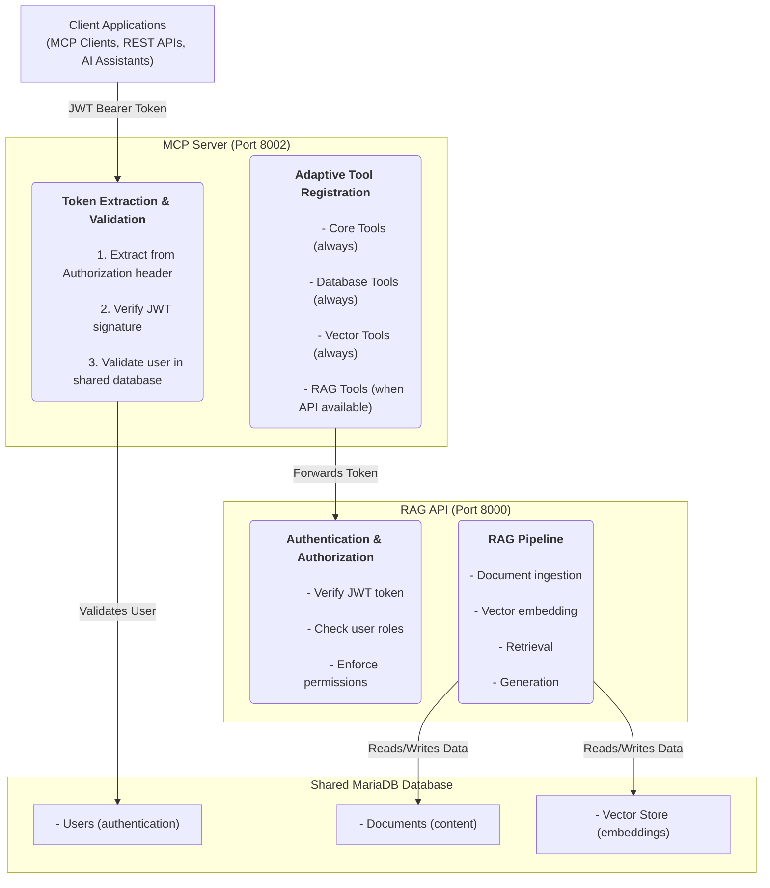

# Architecture

The MariaDB MCP (Model Context Protocol) Server is a modular, multi-layered system designed to provide secure, scalable, and extensible AI-powered tools and services. Its architecture is centered around a primary gateway (**MCP Server**), an optional specialized microservice for Retrieval-Augmented Generation (**RAG API**), and a **Shared MariaDB Database** that serves as the single source of truth for all components.

This design prioritizes security through multi-layered token validation and promotes flexibility with an adaptive tool registration system, allowing services to be enabled or disabled dynamically.

## Architectural Diagram

The following diagram illustrates the flow of a request from a client application through the various components of the MCP ecosystem.

## Component Breakdown

### Client Applications

These are the consumers of the MCP Server's services. They are responsible for acquiring a JWT Bearer Token and including it in the `Authorization` header of every request.

* **Examples**: AI assistants, custom applications using the REST API, and dedicated MCP clients.

### MCP Server (Port 8002)

The MCP Server acts as the primary gateway and orchestrator. All client requests must pass through it. It performs two critical functions:

#### Token Extraction & Validation

This is the first layer of security. The MCP Server validates the identity and legitimacy of every incoming request through a three-step process:

1. **Extract Token**: It retrieves the JWT from the `Authorization` header.
2. **Verify Signature**: It cryptographically verifies the token's signature to ensure it hasn't been tampered with.
3. **Validate User**: It queries the `Users` table in the shared database to confirm the user exists and is active.

#### Adaptive Tool Registration

A key feature of the MCP Server is its ability to dynamically adjust the tools it offers based on the availability of dependent services.

* **Core, Database, & Vector Tools**: These are foundational toolsets and are always registered and available.
* **RAG Tools**: These tools, which rely on the RAG API, are only registered if the MCP Server can successfully connect to the RAG API. This makes the RAG component an optional, plug-in extension.

### RAG API (Port 8000)

This is a specialized microservice designed for complex, knowledge-based tasks using the Retrieval-Augmented Generation pattern. It operates as a distinct service that the MCP Server communicates with.

#### Authentication & Authorization

The RAG API implements a second, more granular layer of security. After receiving a forwarded request from the MCP Server, it re-verifies the JWT and performs deeper authorization checks:

* **Verify JWT Token**: Ensures the token is still valid.
* **Check User Roles**: Examines the user's roles and permissions to determine if they are authorized to perform the requested RAG operation.
* **Enforce Permissions**: Applies access control rules, for example, restricting document access based on ownership or group membership.

#### RAG Pipeline

This is the core logic of the RAG API. It transforms a user's query into a knowledge-rich response.

1. **Document Ingestion**: The process of adding new documents to the knowledge base.
2. **Vector Embedding**: Documents are converted into numerical representations (vectors) and stored in the `Vector Store` within the MariaDB database.
3. **Retrieval**: When a query is received, the API searches the `Vector Store` to find the most semantically relevant document chunks.
4. **Generation**: The retrieved chunks are combined with the original query and fed to a language model to generate a comprehensive, context-aware answer.

### Shared MariaDB Database

The database is the foundation of the entire architecture, providing a single, consistent source of data for all services.

* **Users**: Stores user credentials, roles, and metadata required for authentication and authorization across both the MCP Server and RAG API.
* **Documents**: Contains the raw content (e.g., text, metadata) that the RAG pipeline uses for retrieval.
* **Vector Store**: A dedicated table or set of tables within MariaDB that stores the vector embeddings of the documents, enabling efficient similarity searches.

## Request and Data Flow

1. **Request Initiation**: A client application sends a request to the MCP Server (`:8002`) with a JWT in the `Authorization` header.
2. **MCP Server Authentication**: The MCP Server validates the JWT against the shared database. If invalid, the request is rejected with a `401 Unauthorized` error.
3. **Tool Dispatching**: The server identifies that the request requires a RAG tool. It's checks if the RAG API is available.
4. **Request Forwarding**: The MCP Server forwards the original request, including the JWT, to the RAG API (`:8000`).
5. **RAG API Authorization**: The RAG API performs its own validation of the JWT and checks the user's permissions for the requested action. If unauthorized, it returns an error.
6. **RAG Pipeline Execution**: The RAG API executes its pipeline, querying the `Documents` and `Vector Store` tables in the MariaDB database to retrieve relevant context.
7. **Response Generation**: The RAG API generates a final response.
8. **Response Relay**: The response is sent back to the MCP Server, which in turn relays it to the client application.

This architecture ensures a clear separation of concerns, enhances security with multiple checkpoints, and provides a highly extensible platform for building advanced AI tools.




