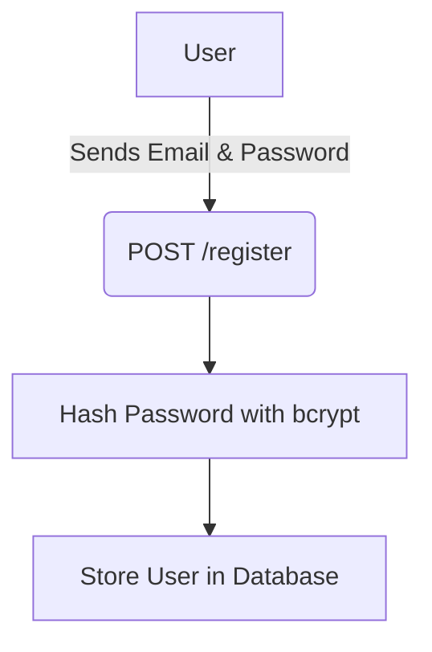
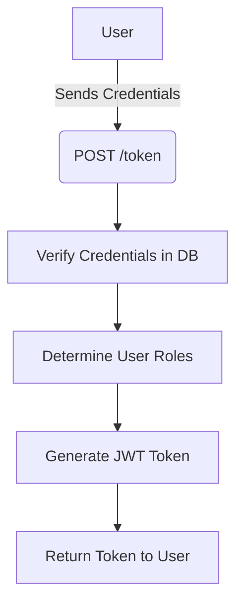
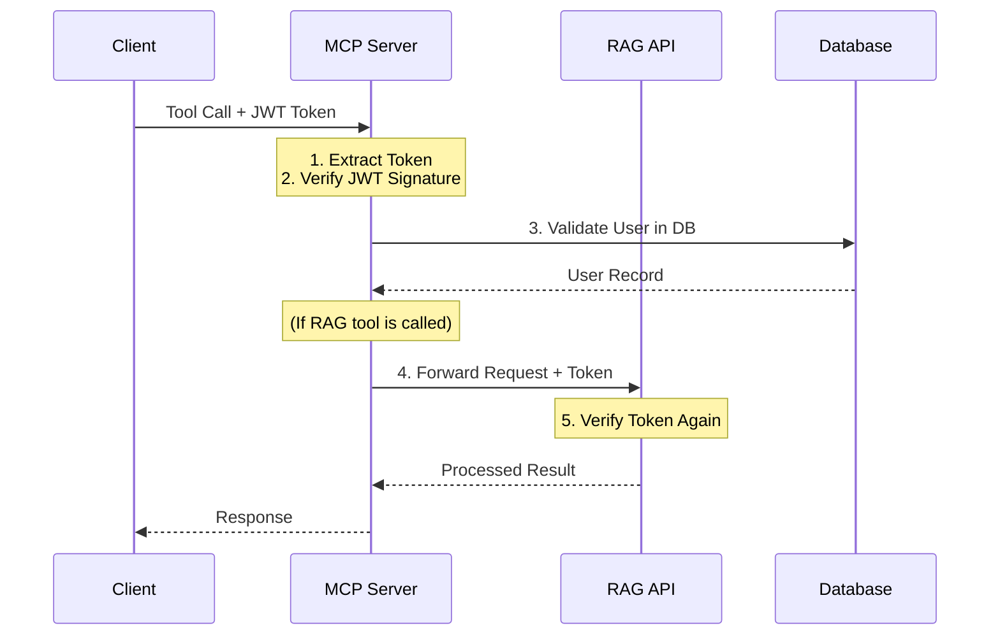

# Token Management

Token management is a critical part of the system's security, handled primarily by the RAG API.

## **Token Generation**

The process involves two main steps:

### **Step 1: User Registration**

### **Step 2: User Login & Token Generation**

## **Token Usage**

Once a client has a JWT, it includes it in the `Authorization` header of every request to the MCP Server. The server then validates the token before processing the request.

## **Key Security Measures**

* **Signature Verification**: Prevents token tampering.
* **Expiration Check**: Tokens have a limited lifetime (e.g., 30 minutes).
* **Database Validation**: Ensures the user associated with the token still exists and is active.
* **Issuer/Audience Validation**: Prevents a token from one system from being used on another.
* **Not-Before Check**: Prevents a token from being used before it is valid




