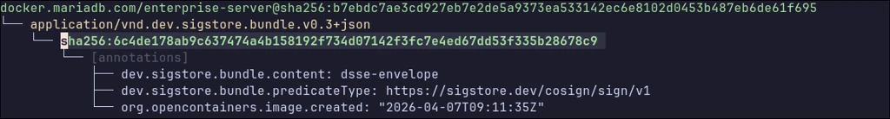

# Docker Images



## Certified images

All the Docker images used by this operator are based on [Red Hat UBI](https://catalog.redhat.com/software/base-images) and have been [certified by Red Hat](https://connect.redhat.com/en/partner-with-us/red-hat-openshift-certification). The advantages of using UBI based images are:

* Immutability: UBI images are built to be secure and stable, reducing the risk of unintended changes or vulnerabilities due to mutable base layers.
* Small size: The UBI [minimal](https://catalog.redhat.com/software/containers/ubi8/ubi-minimal/5c359a62bed8bd75a2c3fba8) and [micro](https://catalog.redhat.com/software/containers/ubi8-micro/601a84aadd19c7786c47c8ea) variants used by this operator are designed to be lightweight, containing only the essential packages. This can lead to smaller container image sizes, resulting in faster build times, reduced storage requirements, and quicker image pulls.
* Security and compliance: Regular CVE scanning and vulnerability patching help maintain compliance with industry standards and security best practices.
* Enterprise-grade support: UBI images are maintained and supported by Red Hat, ensuring timely security updates and long-term stability.

## List of compatible images

MariaDB Enterprise Kubernetes Operator is compatible with the following Docker images:

| Component | Image | Supported Tags | CPU Architecture |
|-----------|-------|----------------|------------------|
| MariaDB Enterprise Kubernetes Operator | docker.mariadb.com/mariadb-enterprise-operator |  26.3.2 <br>  26.3.1 <br>  26.3.0 <br>  25.10.4 <br>  25.10.3 <br>  25.10.2 <br>  25.10.1 <br>  25.10.0 <br>  25.8.0 <br>  |  amd64 <br>  arm64 <br>  ppc64le <br>  |
| MariaDB Enterprise Server | docker.mariadb.com/enterprise-server |  11.8.6-3 <br>  11.8.5-2 <br>  11.8.3-1 <br>  11.4.10-7 <br>  11.4.9-6 <br>  11.4.8-5 <br>  11.4.7-4.3 <br>  11.4.7-4.2 <br>  11.4.7-4.1 <br>  10.6.25-21 <br>  10.6.24-20 <br>  10.6.23-19 <br>  10.6.22-18.1 <br>  |  amd64 <br>  arm64 <br>  ppc64le <br>  |
| MariaDB Enterprise Server (tiered) | docker.mariadb.com/enterprise-server |  11.8.6-3.1 <br>  11.8.6-3.1-minimal <br>  11.8.6-3.1-standard <br>  11.8-minimal <br>  11.8-standard <br>  11.8 <br>  11.4.10-7.1-minimal <br>  11.4.10-7.1-standard <br>  11.4.10-7.1 <br>  11.4-minimal <br>  11.4-standard <br>  11.4 <br>  10.6.25-21.1-minimal <br>  10.6.25-21.1-standard <br>  10.6.25-21.1 <br>  10.6-minimal <br>  10.6-standard <br>  10.6 <br>  |  amd64 <br>  arm64 <br>  ppc64le <br>  |
| MaxScale Enterprise | docker.mariadb.com/maxscale |  25.10.1 <br>  25.10.0 <br>  25.01.4 <br>  25.01.3-1 <br>  25.01 <br>  |  amd64 <br>  arm64 <br>  ppc64le <br>  |
| MaxScale | mariadb/maxscale |  23.08.9-ubi <br>  23.08-ubi <br>  24.02.5-ubi <br>  24.02-ubi <br>  |  amd64 <br>  arm64 <br>  |
| MariaDB Prometheus Exporter | mariadb/mariadb-prometheus-exporter-ubi |  1.1.0 <br>  |  amd64 <br>  arm64 <br>  ppc64le <br>  |
| MaxScale Prometheus Exporter | mariadb/maxscale-prometheus-exporter-ubi |  1.1.0 <br>  |  amd64 <br>  arm64 <br>  ppc64le <br>  |
| MariaDB Enterprise nslcd sidecar | docker.mariadb.com/nslcd |  0.9.10-13 <br>  |  amd64 <br>  arm64 <br>  ppc64le <br>  |

Refer to the registry documentation to [access docker.mariadb.com with your customer credentials](customer-access-to-docker-mariadb-com.md).

### MariaDB Enterprise Server Tiered Images.

To accommodate diverse operational requirements, the MariaDB Server container images utilize a multi-tiered strategy offering three distinct flavors: `minimal` and `standard`. The `minimal` tier serves as the highly secure default, providing a heavily reduced footprint tailored for automated, operator-driven environments. For broader enterprise workloads requiring additional storage engines, plugins, and in-container debugging utilities, the `standard` tier balances comprehensive capabilities with strict security hardening.

| Tier | Description | Target |
| --- | --- | --- |
| `minimal` | The `minimal` tier of the MariaDB Enterprise Docker image offers an image where whole parts of the filesystem have been removed. This includes many MariaDB utility binaries, CLI binaries, utilities and irrelevant packages. | Ideal for highly secure environments and strict compliance use cases requiring a heavily reduced attack surface and minimal storage footprint. |
| `standard` | The `standard` tier of the MariaDB Enterprise Docker image comes with additional storage engines and plugins, while not sacrificing on security and size. | Designed for general enterprise workloads that require a balance of comprehensive database capabilities and an optimized, secure footprint. |


The tiered images are based on [ubi-micro](https://www.redhat.com/en/blog/introduction-ubi-micro).


### `Hardened` images

Enterprise images are specifically "hardened" to optimize security and resource efficiency. Because containers are fundamentally designed to run a single application and its required dependencies, the hardening process strips away any operating system components that are unnecessary for MariaDB to function. As a result, these hardened images contain significantly fewer binaries and files, and are strictly configured to execute as a non-root user to minimize potential attack surfaces.

The following section provides a high-level overview detailing the specific components that are retained and removed across both image tiers.

| Component | `minimal` | `standard` |
| --- | --- | --- |
| MariaDB Enterprise Server | ✅ | ✅ |
| coreutils | ✅ | ✅ |
| `mariadb-backup` | ✅ | ✅ |
| `mariadb-dump` | ✅ | ✅ |
| `mariadb-binlog` | ✅ | ✅ |
| `mariadb-tzinfo-to-sql` | ✅ | ✅ |
| `boost-program-options` | ✅ | ✅ |
| `jemalloc` | ✅ | ✅ |
| MariaDB utilities | ❌ | ✅ |
| System Perl | ❌ | ✅ |
| S3 Engine | ❌ | ✅ |
| Cracklib Password Plugin | ❌ | ✅ |
| Hashicorp Key Plugin | ❌ | ✅ |
| LDAP/PAM Plugin Dependencies | ❌ | ✅ |
| Spider Engine | ❌ | ❌ |
| RocksDB Engine | ❌ | ❌ |
| Package Manager | ❌ | ❌ |
| Docs & Formatting | ❌ | ❌ |
| Unnecessary Binaries | ❌ | ❌ |
| `gosu` | ❌ | ❌ |

## SBOMs

The following section provides information how to fetch the SBOMs for the MariaDB Enterprise Operator as well as all it's operands.

### How to retrieve SBOMs using oras

- **Prerequisites: Install and configure the oras CLI**
  - For installation instructions, see: https://oras.land/docs/installation  

- **Make sure to login to `docker.mariadb.com`**
  ```bash
  docker login docker.mariadb.com --username $USERNAME --password $CUSTOMER_DOWNLOAD_TOKEN
  ```

### Step 1: Discover Attestations

Attestations are signed metadata published alongside the image (e.g., SBOMs, provenance), typically wrapped in a DSSE envelope. In this step we use `oras discover` to list available attestations and note the bundle digest for Step 2.

**Command:**

```bash
oras discover docker.mariadb.com/enterprise-server:10.6
```

**Example output (important sha highlighted):**



```text
❯ oras discover docker.mariadb.com/enterprise-server:10.6
docker.mariadb.com/enterprise-server@sha256:b7ebdc7ae3cd927eb7e2de5a9373ea533142ec6e8102d0453b487eb6de61f695
└── application/vnd.dev.sigstore.bundle.v0.3+json
    └── sha256:6c4de178ab9c637474a4b158192f734d07142f3fc7e4ed67dd53f335b28678c9
        └── [annotations]
            ├── dev.sigstore.bundle.content: dsse-envelope
            ├── dev.sigstore.bundle.predicateType: https://sigstore.dev/cosign/sign/v1
            └── org.opencontainers.image.created: "2026-04-07T09:11:35Z"
```

The correct digest is the one under `application/vnd.dev.sigstore.bundle.v0.3+json`:

- **Bundle digest (use in Step 2):**  
  `sha256:6c4de178ab9c637474a4b158192f734d07142f3fc7e4ed67dd53f335b28678c9`

### Step 2: Pull the Bundle

In this step we need to pull the bundle so we can find the correct digest of the attestation blob.

**Command:**

```bash
oras pull docker.mariadb.com/enterprise-server@sha256:6c4de178ab9c637474a4b158192f734d07142f3fc7e4ed67dd53f335b28678c9
```

**Example output (important sha highlighted):**


```text
❯ oras pull docker.mariadb.com/enterprise-server@sha256:6c4de178ab9c637474a4b158192f734d07142f3fc7e4ed67dd53f335b28678c9
✓ Skipped     application/vnd.dev.sigstore.bundle.v0.3+json                                                                                                          1.59/1.59 MB 100.00%     0s
  └─ sha256:95292bc0c504d2311aa81d7b60cb367382c0bd77ef7a72e546db5c0b2a0c6a38
✓ Pulled      application/vnd.oci.image.manifest.v1+json                                                                                                               879/879  B 100.00%  120µs
  └─ sha256:6c4de178ab9c637474a4b158192f734d07142f3fc7e4ed67dd53f335b28678c9
Skipped pulling layers without file name in "org.opencontainers.image.title"
Use 'oras copy docker.mariadb.com/enterprise-server@sha256:6c4de178ab9c637474a4b158192f734d07142f3fc7e4ed67dd53f335b28678c9 --to-oci-layout <layout-dir>' to pull all layers.
```

Then the key digest is again the one under `application/vnd.dev.sigstore.bundle.v0.3+json`:

- **SBOM blob digest (use in Step 3):**  
  `sha256:95292bc0c504d2311aa81d7b60cb367382c0bd77ef7a72e546db5c0b2a0c6a38`

### Step 3: Fetch the attestations blob

In this step, we are going to fetch the attestation blob, which contains a DSSE envelope (a standard JSON wrapper with a base64-encoded payload plus signatures/metadata used for signing and verification).

**Command:**

```bash
oras blob fetch docker.mariadb.com/enterprise-server@sha256:95292bc0c504d2311aa81d7b60cb367382c0bd77ef7a72e546db5c0b2a0c6a38 --output attestations.json
```

**Example output:**

```text
❯ oras blob fetch docker.mariadb.com/enterprise-server@sha256:95292bc0c504d2311aa81d7b60cb367382c0bd77ef7a72e546db5c0b2a0c6a38 --output attestations.json
✓ Downloaded  application/octet-stream                                                                                                                               1.59/1.59 MB 100.00%  791ms
  └─ sha256:95292bc0c504d2311aa81d7b60cb367382c0bd77ef7a72e546db5c0b2a0c6a38
```

### Step 4: Extract the SBOM from the DSSE Envelope

In this step we extract the SBOM by reading the DSSE envelope, base64-decoding `dsseEnvelope.payload`, and viewing the resulting SBOM JSON with `jq` (and `less`).

**Command:**

```bash
cat attestations.json | jq -r '.dsseEnvelope.payload' | base64 -d | jq . | less
```

## Working With Air-Gapped Environments

This section outlines several methods for pulling official MariaDB container images from `docker.mariadb.com` and making them available in your private container registry. This is often necessary for air-gapped, offline, or secure environments.

### Option 1: Direct Pull, Tag, and Push

This method is ideal for a "bastion" or "jump" host that has network access to **both** the public internet (specifically `docker.mariadb.com`) and your internal private registry.

1.  **Log in to both registries.** You will need a MariaDB token for the public registry and your credentials for the private one. Refer to the [official documentation](https://mariadb.com/docs/tools/mariadb-enterprise-operator/customer-access-to-docker-mariadb-com#customer-credentials).

    ```bash
    # Log in to the official MariaDB registry
    docker login docker.mariadb.com

    # Log in to your private registry
    docker login <private-registry-url>
    ```
2.  **Pull the required image.** Pull the official MariaDB Enterprise Kubernetes Operator image from its public registry.

    ```bash
    docker pull docker.mariadb.com/mariadb-enterprise-operator:25.8.0
    ```
3.  **Tag the image for your private registry.** Create a new tag for the image that points to your private registry's URL and desired repository path.

    ```bash
    docker tag docker.mariadb.com/mariadb-enterprise-operator:25.8.0 <private-registry-url>/mariadb/mariadb-enterprise-operator:25.8.0
    ```
4.  **Push the re-tagged image.** Push the newly tagged image to your private registry.

    ```bash
    docker push <private-registry-url>/mariadb/mariadb-enterprise-operator:25.8.0
    ```

### Option 2: Using a Proxy or Caching Registry

Many modern container registries can be configured to function as a pull-through cache or proxy for public registries. When an internal client requests an image, your registry pulls it from the public source, stores a local copy, and then serves it. This automates the process after initial setup.

You can use [Harbor](https://goharbor.io/docs/2.10.0/administration/configuring-replication/create-replication-rules/) as a pull-through cache (Harbor calls this Replication Rules).

### Option 3: Offline Transfer using `docker save` and `docker push`

This method is designed for fully air-gapped environments where no single machine has simultaneous access to the internet and the private registry.

#### On the Internet-Connected Machine

1.  **Log in and pull the image.**

    ```bash
    docker login docker.mariadb.com
    docker pull docker.mariadb.com/mariadb-enterprise-operator:25.8.0
    ```
2.  **Save the image to a tar archive.** This command packages the image into a single, portable file.

    ```bash
    docker save [docker.mariadb.com/mariadb-enterprise-operator:25.8.0 -o mariadb-enterprise-operator_25.8.0.tar
    ```

    Use a tool like `scp` or `sftp` or a USB drive to copy the generated `.tar` archives from the internet-connected machine to your isolated systems.

#### On the Machine with Private Registry Access

1.  **Load the image from the archive.**

    ```bash
    docker load -i mariadb-enterprise-operator_25.8.0.tar
    ```
2.  **Log in to your private registry.**

    ```bash
    docker login <private-registry-url>
    ```
3.  **Tag the loaded image.** The image loaded from the tar file will retain its original tag. You must re-tag it for your private registry.

    ```bash
    docker tag docker.mariadb.com/mariadb-enterprise-operator:25.8.0 <private-registry-url>/mariadb/mariadb-enterprise-operator:25.8.0
    ```
4.  **Push the image to your private registry.**

    ```bash
    docker push <private-registry-url>/mariadb/mariadb-enterprise-operator:25.8.0
    ```

### Option 4: For OpenShift, you can use OpenShift Disconnected Installation Mirroring

Refer to the [official Red Hat documentation](https://docs.redhat.com/en/documentation/openshift_container_platform/4.15/html/disconnected_installation_mirroring/installing-mirroring-disconnected)

### Option 5: Offline Transfer for `containerd` Environments

This method is for air-gapped environments that use **`containerd`** as the container runtime (common in Kubernetes) and do not have the Docker daemon. It uses the `ctr` command-line tool to import, tag, and push images. ⚙️

#### 1. On the Bastion Host (with Internet)

First, on a machine with internet access, you'll pull the images and export them to portable archive files.

1.  **Pull the Container Image** Use the `ctr image pull` command to download the required image from its public registry.

    ```bash
    ctr image pull docker.mariadb.com/mariadb-enterprise-operator:25.8.0
    ```

    > **Note**: If your bastion host uses Docker, you can use `docker pull` instead as we did in Option 3.
2.  **Export the Image to an Archive** Next, export the pulled image to a `.tar` file using `ctr image export`. The format is `ctr image export <output-filename> <image-name>`.

    ```bash
    ctr image export mariadb-enterprise-operator-25.8.0.tar docker.mariadb.com/mariadb-enterprise-operator:25.8.0
    ```

    > **Note**: To find the exact image name as `containerd` sees it, run `ctr image ls`. The Docker equivalent for this step is `docker save <image-name> -o <output-filename>`.

Repeat this process for all the container images you need to transfer.

#### 2. Transfer the Archives

Use a tool like `scp` or `sftp` or a USB drive to copy the generated `.tar` archives from the bastion host to your isolated systems.

#### 3. On the Isolated Host

Finally, on the isolated system, you will import the archives into `containerd`. [Official Docs](https://github.com/containerd/containerd/blob/main/docs/cri/crictl.md?plain=1)

1.  **Importing for Kubernetes (Important!)** ⚙️ If the images need to be available to **Kubernetes**, you **must** import them into the `k8s.io` namespace by adding the `-n=k8s.io` flag.

    ```bash
    ctr -n=k8s.io image import mariadb-enterprise-operator-25.8.0.tar
    ```
2.  **Verify the Image** Check that `containerd` recognizes the newly imported image.

    ```bash
    ctr image ls
    ```

    You can also verify that the Container Runtime Interface (CRI) sees it by running:

    ```bash
    crictl images
    ```

#### **Important Note**

The examples above use the `mariadb-enterprise-operator:25.8.0` image. You must **repeat the chosen process** for all required container images. A complete list is available [here](docker-images.md#list-of-compatible-images)

## Additional Resources



