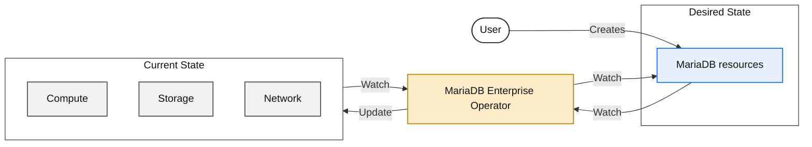

# Introduction

MariaDB Enterprise Kubernetes Operator provides a seamless way to run and operate containerized versions of MariaDB Enterprise Server and MaxScale on Kubernetes, allowing you to leverage Kubernetes orchestration and automation capabilities. This document outlines the features and advantages of using Kubernetes and the MariaDB Enterprise Kubernetes Operator to streamline the deployment and management of MariaDB and MaxScale instances.

## What is Kubernetes?

Kubernetes is more than just a container orchestrator; it is a comprehensive platform that provides APIs for managing both applications and the underlying infrastructure. It automates key aspects of container management, including deployment, scaling, and monitoring, while also handling essential infrastructure needs such as networking and storage. By unifying the management of applications and infrastructure, Kubernetes simplifies operations and improves efficiency in cloud-native environments.

## Why Kubernetes?

Kubernetes brings several key benefits to the table when managing applications in a containerized environment:

* Standardization: Kubernetes relies on standard APIs for managing applications and infrastructure, making it easier to ensure uniformity across various environments. It acts as a common denominator across cloud providers and on-premises.
* Automation: Kubernetes APIs encapsulate operational best practises, minimizing the need for manual intervention and improving the efficiency of operations.
* Cost Effectiveness: Having an standardized way to manage infrastructure across cloud providers and automation to streamline operations, Kubernetes helps reducing the infrastructure and operational costs.

## What is a Kubernetes Operator?

Kubernetes has been designed with flexibility in mind, allowing developers to extend its capabilities through custom resources and operators.

_The Operator watches the desired state (`MariaDB`/`MaxScale` resources) and the current state (compute, storage, network), then updates resources to reconcile the two._

In particular, MariaDB Enterprise Kubernetes Operator, watches the desired state defined by users via `MariaDB` and `MaxScale` resources, and takes actions to ensure that the actual state of the system matches the desired state. This includes managing compute, storage and network resources, as well as the full lifecycle of the MariaDB and MaxScale instances. Whenever the desired state changes or the underlying infrastructure is modified, the Operator takes the necessary actions to reconcile the actual state with the desired state.

Operational expertise is baked into the `MariaDB` and `MaxScale` APIs and seamlessly managed by the Operator. This includes automated backups, restores, upgrades, monitoring, and other critical lifecycle tasks, ensuring reliability in Day 2 operations.

## MariaDB Enterprise Kubernetes Operator Features

* Provision and Configure MariaDB and MaxScale Declaratively: Define MariaDB Enterprise Server and MaxScale clusters in YAML manifests and deploy them with ease in Kubernetes.
* Multiple [Highly Available](topologies/high-availability.md) Topologies supported:
  * [Asynchronous Replication](topologies/replication.md)
  * [Synchronous Multi-Master with Galera](topologies/galera.md)
  * [MaxScale](topologies/maxscale.md) as a Database proxy to load balance requests and perform failover/switchover operations.
* Cluster-Aware Rolling Updates: Perform rolling updates on MariaDB and MaxScale clusters, ensuring zero-downtime upgrades with no disruptions to your applications.
* Flexible Storage Configuration and Volume Expansion: Easily configure storage for MariaDB instances, including the ability to expand volumes as needed.
* Physical Backups based on [mariadb-backup]({server}/server-usage/backup-and-restore/mariadb-backup/full-backup-and-restore-with-mariadb-backup) and [Kubernetes VolumeSnapshots](https://kubernetes.io/docs/concepts/storage/volume-snapshots/). By leveraging the [BACKUP STAGE]({server}/reference/sql-statements/administrative-sql-statements/backup-commands/backup-stage) feature, backups are taken without long read locks or service interruptions.
* Logical Backups based on [mariadb-dump]({server}/clients-and-utilities/backup-restore-and-import-clients/mariadb-dump).
* Backup Management: Take, restore, and schedule backups with multiple storage types supported: S3, Azure Blob Storage, PVCs, Kubernetes volumes and VolumeSnapshots..
* Policy-Driven Backup Retention: Implement backup retention policies with bzip2 and gzip compression.
* Bootstrap New Instances: Initialize new MariaDB instances from backups, S3, Azure Blob Storage, PVCs or VolumeSnapshots to quickly spin up new clusters.
* Point-In-Time-Recovery: Archive binary logs to enable point-in-time restoration and significantly reduce RPO.
* TLS Certificate Management: Issue, configure, and rotate TLS certificates and Certificate Authorities (CAs) for secure connections.
* Advanced TLS Support: customize certificate lifetime, private key algorithm and TLS version.
* Native Integration with cert-manager: Leverage [cert-manager](https://cert-manager.io/docs/), the de-facto standard for managing certificates in Kubernetes, to enable issuance with private CAs, public CAs and HashiCorp Vault.
* Prometheus Metrics: Expose metrics using the MariaDB and MaxScale Prometheus exporters.
* Native Integration with prometheus-operator: Leverage [prometheus-operator](https://github.com/prometheus-operator/prometheus-operator) to scrape metrics from MariaDB and MaxScale instances.
* Declarative User and Database Management: Manage users, grants, and logical databases in a declarative manner using Kubernetes resources.
* Secure, immutable and lightweight images based on Red Hat UBI, available for multiple architectires (amd64, arm64 and ppc64le).
* [Operator certified ](https://catalog.redhat.com/en/software/container-stacks/detail/65789bcbe17f1b31944acb1d#overview)by Red Hat.

_This page is: Copyright © 2026 MariaDB. All rights reserved._


